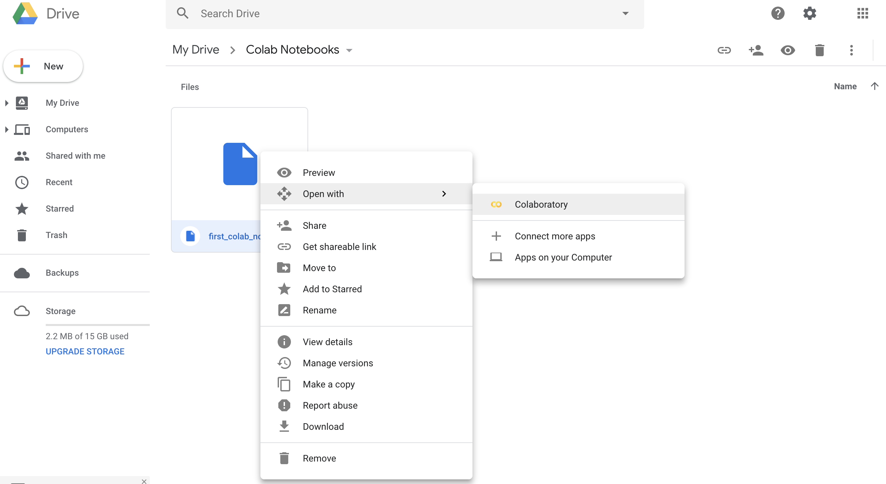

In this checkpoint, you'll create your first model with Spark. You'll walk through building a random forest classifier (RFC), using the *UCI HAR* dataset. This dataset contains human activity recognition (HAR) data captured by smartphones as test subjects perform different activities, like walking, sitting, and lying down.

## Setup

All the code for this curriculum module is available in the [big-data-student-resources](https://github.com/Thinkful-Ed/big-data-student-resources) GitHub repo, which contains the Jupyter Notebooks and datasets that you'll need for this assignment and future walkthroughs. Clone this repo to your local machine. For each walkthrough, begin by reading through the material in the curriculum, and then move on to run the appropriate Notebook in Colab.

To get started, you'll need to upload the relevant files to your Google Drive. To this end, upload the files inside `datasets/UCI_HAR` to the *Colab Datasets* folder and upload the `rfc_spark_batch_02_26_19.ipynb` Notebook to the *Colab Notebooks* folder in your drive. After reading the background information below, work through the guided example in this Notebook.

## Working with Spark in batch mode

You'll begin this exercise by using Spark in *batch mode*. This mode is most similar to the approach you've taken so far in this program: load a dataset, clean it, and then run models and evaluate their performance.

Spark's other mode—*streaming mode*—differs from batch mode in that under streaming mode, you do not have access to all of the data. Instead, you ingest data into Spark over a period of time. As each data element arrives, you perform data science tasks (clean, classify, and so forth) on the new data, then archive the result. Don't worry about the details of this now—you'll learn about it soon enough. For now, you only need to be aware that there are two modes that you can work from in Spark.

Spark works a little differently than the data science stack that you've been working with. So far, you have been writing Python code that executes immediately on your local device.

Spark, on the other hand, lives outside of the Python environment. You pass instructions to the Spark server, and Spark performs the requested calculations and reports back to your Notebook. This server paradigm allows you to create and test models locally. Then, once you're ready to deploy to production, you point your Python code to a remote server that is configured to handle larger datasets.

Spark uses the concept of a *pipeline* in which you configure a number of steps that are executed only when you tell the server to run. This pipeline approach allows you to configure models and run them through multiple steps more efficiently on big data.

It's always a good idea to review the documentation for the modules, methods, and functions that you'll use. Everything that you use here can be found in the Apache Spark documentation. You don't need to read the documentation in depth now, but you should refer to it when you come across a piece of code you're not familiar with, or when you're unsure how to proceed in a challenge.

In particular, you should familiarize yourself with the following:

* [Spark overview](https://spark.apache.org/docs/2.4.0/index.html)
* [Python API (*PySpark*) documentation](https://spark.apache.org/docs/2.4.0/api/python/index.html)

For your work in this checkpoint, it's also recommended to read this article about [random forests in Spark](https://spark.apache.org/docs/2.4.0/ml-classification-regression.html#random-forests).

## Background: The *UCI HAR* dataset

The dataset for this checkpoint contains data from experiments on 30 subjects who each wore a smartphone attached to their waist. The subjects performed six activities:

* Walking
* Walking up stairs
* Walking down stairs
* Sitting
* Standing
* Lying down

The activities were recorded with video, which enabled time-stamped correlation with motion values collected from the smartphones. In particular, three-axial linear acceleration and three-axial angular velocity were captured from the devices' accelerometers and gyroscopes. This resulted in a 561-value feature vector, plus its corresponding activity label.

As you'll see in a moment when you go through the *rfc_spark_batch_02_26_19* Notebook, your data for this exercise is in a file called `allData.csv`. This file contains the same data as the original *UCI HAR* dataset (available on the internet), but it's been cleaned up so that it's ready to use in Spark.

The original dataset comprises four files. There is training data, which contains one file for features and one for labels. And there is test data, which also contains one file for features and one for labels.

Here's what was done to clean up the original data:

1. The original source files are space delimited. But unfortunately, the spacing is inconsistent. Most of the time, a single space is used to delimit—but in some places, there are double spaces. If you were to import the original data with these inconsistencies, breaking on spaces, these double spaces would lead to extraneous columns and create problems for your classifier. Therefore, all double delimiters have been removed, and spaces have been replaced with commas. This second step was not absolutely necessary, but the more common CSV format can be useful.
2. The test and training feature data have been merged into a single final dataset. The labels are the same for both training and test data, so a single label file (`activity_labels.csv`) was created.

As you'll see in a moment, the final dataset has 10,299 rows and 562 columns. All values are numeric. The labels are integers, and the features are doubles. Because the source data is already numeric, it's simpler to build and demonstrate your classifier in Spark.

## Try it out

With that context, you're ready to work through this exercise. Open the [rfc_spark_batch_02_26_19.ipynb](https://github.com/Thinkful-Ed/big-data-student-resources/blob/master/rfc_spark_batch_02_26_19.ipynb) Notebook with Colab, and closely read through it, executing each cell. 

As you learned in the previous checkpoint, you can open a Notebook in Colab from Google Drive by right-clicking the filename and choosing **Open From > Colaboratory**.

At the end of the walkthrough, you'll find some suggestions for further exploration that you can do on your own.
