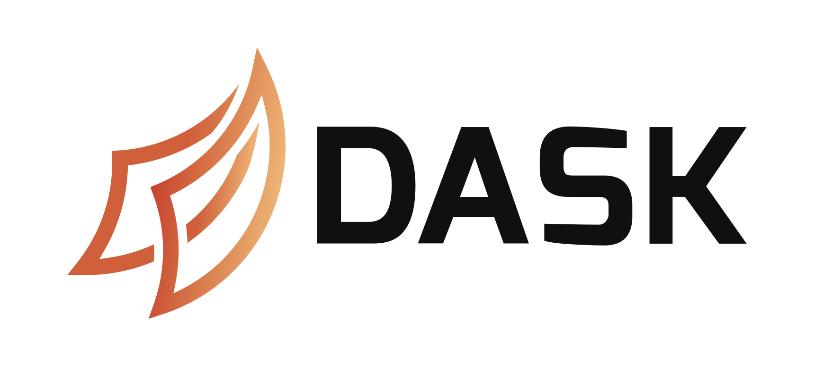
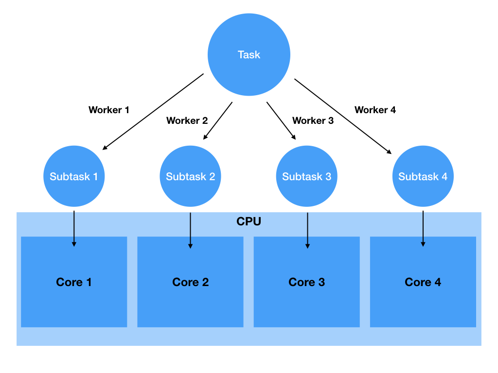
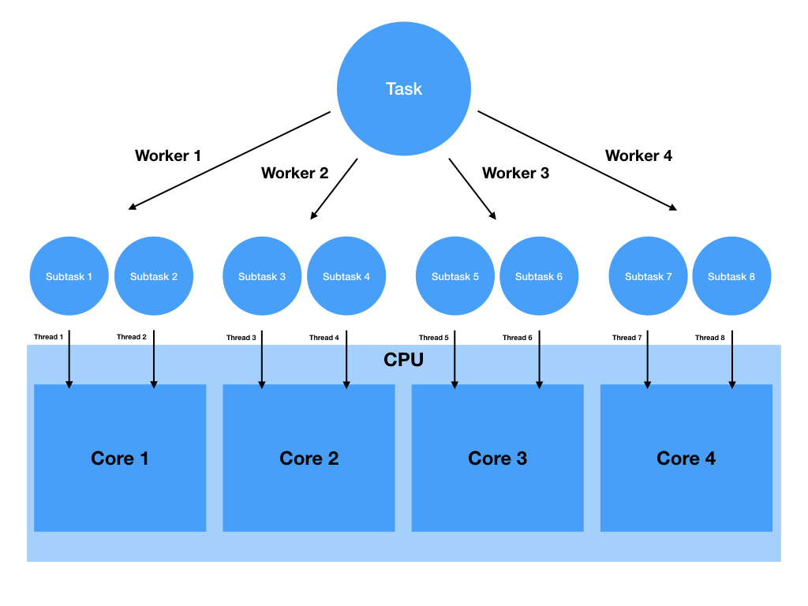
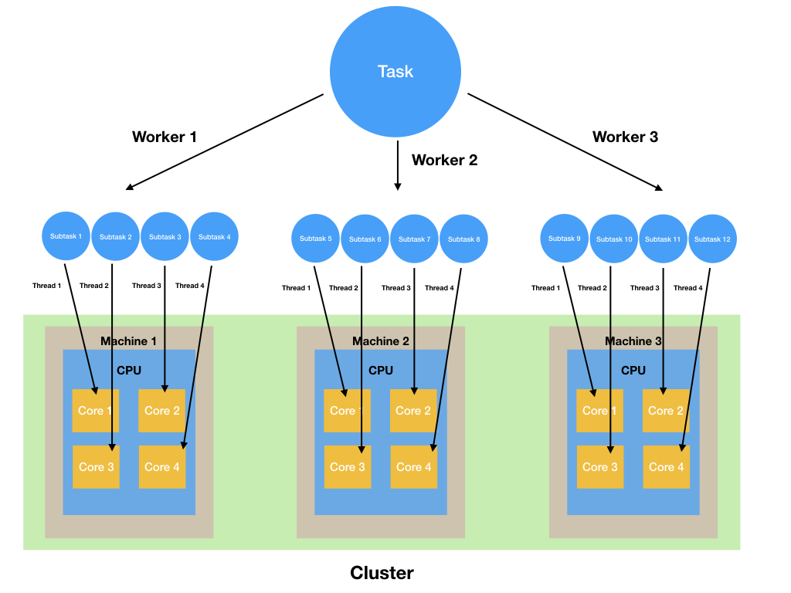

Widespread adoption of the internet, from the 1980s until today, has enormously impacted every society and individual, as well as the technology world itself. What interests data scientists the most is the ever-increasing generation of data in every passing second. You're living in an era of big data. In this module, you will learn about what big data is. You'll also be introduced to a useful big data tool, Dask, which will be beneficial to have in your technology stack. 

The term *big data* is probably one of the most commonly used terms in technology circles today. Although its definition is somewhat blurry because the name includes the very subjective word *big*, one can succinctly define it as follows:

> The amount of data that is big enough that an average personal computer is unable to process it. 

Here, *big* refers to terabytes, petabytes, or even exabytes of data. Now, consider another definition, from the [Gartner IT Glossary](https://www.gartner.com/it-glossary/big-data/):

> "Big data is high-volume, high-velocity and/or high-variety information assets that demand cost-effective, innovative forms of information processing that enable enhanced insight, decision making, and process automation."

Gartner's definition mentions the *three Vs*: volume, velocity, and variety. But you may see more Vs in the definitions of other sources. As a data scientist, why would you concern yourself with the amount of data? The answer lies in the following two statements:

* Big data enables you to get more complete answers to your questions, because it includes a lot of information.
* You rely on these answers with more confidence, because as the amount of data increases, your confidence level usually goes up.

The availability of sheer amounts of data created a need to handle this much data; this forced the technology world to develop new sets of tools. Now, you'll briefly learn about some of the big data technologies.

## Welcome to the jungle: Big data technologies

By this point in the program, you may have searched the internet to make yourself familiar with the existing big data technologies. If so, you probably have realized already that the big data world is a zoo full of animals of different sizes. Selecting the right technology for the right task requires a certain level of expertise. The focus of this module will be to address a specific need. It's one of any data scientist's most important needs: analyzing huge amounts of data and training machine-learning models on it. Before jumping into this, you'll get a high-level overview of the big data world.

At the conceptual level, you can think about two groups of big data technologies that address different needs.

* The first group is those technologies that focus on storing huge amounts of data in an efficient manner. There are ever-increasing volumes of data coming from all over the internet, and that requires storing them in a distributed manner. But having computers that have huge memory and storage isn't economical and feasible for many companies. Instead, big data technologies focus on distributing the data over multiple machines that have moderate sizes of memory and storage. These technologies enable data engineers to have reasonable numbers of computers in their data centers (or cloud). At the same time, they can efficiently scale when new resources are needed.

* The second group is those technologies that focus on analyzing huge amounts of data. This is what you'll touch upon in this module. If you have ever worked on datasets that exceed the capacity of your computer's memory (RAM), then you might feel desperate from time to time. Data science tools like NumPy, pandas, and scikit-learn are great. They do what they are supposed to do. But when it comes to working with large amounts of data, you inevitably enter the realm of *distributed computing*, and you need to make yourself familiar with the tools that serve your needs.

Probably the most famous technologies that belong to the first group are within the Hadoop ecosystem. But as technology has evolved, the Hadoop ecosystem has also developed solutions that address analysis concerns. The well-known technologies in the second group include Apache Spark and Apache Flink. However, setting up these systems and learning their jargon and syntax isn't that easy. Their learning curves are steep!

## The focus of this module

As stated before, this module will focus on solving the computation issues that arise when working with large amounts of data. Becoming comfortable with Apache Spark can be time consuming because its learning curve is steep. So instead, you'll be introduced to another open-source technology: *Dask*. This technology mimics the syntax and jargon of NumPy, pandas, and scikit-learn. So if you're familiar with the syntax and jargon of those three packages, Dask's learning curve is considerably flatter than those of Apache Spark or Apache Flink. 

That being said, there's nothing wrong with NumPy, pandas, and scikit-learn. These libraries are designed to be comprehensive. Being comprehensive in terms of methods and algorithms produces a tradeoff with parallelization. Dask is designed to scale the scientific Python ecosystem (especially NumPy, pandas, and scikit-learn) by augmenting them with parallelization and distributed computing capabilities. With Dask, you can do the following:

* Analyze datasets that are larger than the memory of your computer.
* Train machine-learning models using data that's larger than your computer's memory.
* Parallelize data analysis tasks as well as several machine-learning processes across the cores of your computer's CPU, and hence reduce the computation time.
* Distribute the data analysis and machine-learning model trainings over many computers in a cluster.

So, if you suffer from dying Jupyter Notebook kernels due to large datasets or never-ending trainings of your models, then Dask is for you.

But, how can Dask achieve the points above where pandas and NumPy can't? The magic behind frameworks like Dask and Apache Spark is that they are designed for large-scale parallelization. So next, you'll learn about parallelization and distributed computing.

## What is multicore parallelization?

What Dask (and similar technologies, like Apache Spark) achieves is that it can speed up some computations by dividing them into smaller parts, calculate each computation part on a different *CPU core*, and then combine all the results. A CPU core is the basic processing unit in a CPU. In the good old days, CPUs had only a single core. But in almost all modern computers—including the laptops and mobile phones that you use—CPUs have multiple cores. Hence, when people talk about CPUs today, they mean processing devices with several cores in them. 

*Multicore parallelization* is the execution of a task in several cores of a CPU at the same time, where each core handles a part of the execution. Consider an example here. If you recall, when you tune hyperparameters of a machine-learning model, you usually train the same model with alternative hyperparameters on the same training set and then evaluate it on a validation set. If you have available cores at your disposal, you can parallelize this operation. If you have four hyperparameters to try and four available cores in the computer, then each core can train the model with a different hyperparameter and evaluate the result. So, instead of waiting for a single core to execute all of these one by one, you can achieve the same thing using the four cores at the same time. Thus, you can reduce the overall computation time to one-fourth of the single-core execution time.

The figure below depicts a multicore parallelization of a task on a CPU with four cores. Note that in Dask's jargon, subtasks are handled by *workers*.

Modern computer CPUs can also support another type of virtual parallelization. Cores in a CPU can run multiple threads in parallel—actually, seemingly in parallel. This is called *multithreading*. In this case, each worker can manage more than one thread that runs in the same core. The figure below illustrates this.

By providing these parallelization capabilities, Dask allows you to work on large datasets and reduce the training times of long-running machine-learning models.

If you want to read more about parallelization in a single computer, check out this article: [CPU Basics: Multiple CPUs, Cores, and Hyper-Threading Explained](https://www.howtogeek.com/194756/cpu-basics-multiple-cpus-cores-and-hyper-threading-explained/).

## What is distributed computing?

So far, you've only looked at parallelization on a single computer. However, Dask-like libraries really shine when they run on multiple machines in a *cluster*. A cluster is a set of tightly connected computers on a network; software coordinates the computers' operations so that they can work together as if they were a single system.

Besides parallelization on a single computer, Dask can also parallelize a workload over multiple machines in a cluster. This is known as *distributed computing*.

The figure below depicts distributed computing on a cluster with three computers:

Note that parallelization and distributed computing may sound like terms that refer to similar things, and indeed they are. However, parallelization differs slightly from distributed computing. By definition, distributed computing requires different machines connected together. When a task is distributed across the machines in the cluster, the machines run in *parallel*. So, this is a kind of parallelization. However, parallelization can also be achieved in a single machine. 

Forming a cluster is mostly related to system administration and data engineering. Hence, this program won't explore this any further. But in the following checkpoints, you'll start working with Dask to parallelize your data analysis tasks. Note that in this module, you'll use your personal computer, and you'll do parallelization on your machine. However, once Dask is configured to run on a cluster, all the codes that you write will remain valid and will run over multiple machines in a cluster.

Continue on to start playing with Dask.
