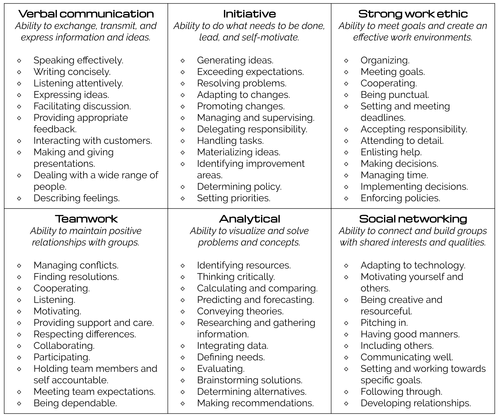

## Learning objective

By the end of this checkpoint, you should be able to communicate your professional narrative.

## Overview

All varieties of networking include meeting and introducing yourself to new people. Sometimes this happens in a group setting, while other times it's one on one. Sometimes you have two minutes to pitch yourself, and other times you have an hour. No matter what, you want to make a good impression and clearly articulate your selling points and goals in case the conversation can move you one step closer to your next job. 

To ensure that every introduction is a success, spend some time thinking about how you want to introduce yourself _before_ you start networking. 

This checkpoint covers how to identify and convey your professional narrative. You'll learn how to confidently pitch yourself to employers, understand your value as a candidate, [combat imposter syndrome](https://www.monster.com/career-advice/article/how-to-overcome-imposter-syndrome-0717), and optimize your networking efforts. 

## Brainstorming your professional narrative

When you're making an introduction, the first thing to do is determine what and how much you should say about yourself. 

Unlike casual introductions, your professional narrative (sometimes referred to as an *elevator pitch*) should be a minute-long summary of your professional experience and career goals. It should answer the following questions: 

* Who are you? 
* What do you do?
* Why are you at Thinkful? 
* What relevant skills do you have?
* What are your career goals?

You may be wondering how you can fit that much information into a short introduction. Below are some tips for brainstorming and refining your talking points. 

### Making a list

First, open a blank document on your computer and set a timer for 10 minutes. Start listing everything that you can think of about your past work and education—jobs that you've had, courses that you've taken, organizations that you've volunteered with, and awards and honors that you've received. Remember to include your Thinkful program! 

### Identifying transferable skills

Using the list that you just brainstormed, write down every transferable skill that you gained in those roles and experiences. Transferable skills are skills and abilities that can be used in a variety of jobs. For example, someone who has worked as a barista could include teamwork and customer service as transferable skills, because most jobs require those skills. But making latte art would not be a transferable skill, because it's only relevant to other barista jobs. 

To help with this exercise, here's a list of common transferable skills:

 
 
 
 

### Identifying relevant skills

After you list all of your transferable skills, spend some time identifying the skills that are especially relevant to the jobs that you're interested in. Also, consider the skills that aren't necessarily required for the jobs that you want, but could set you apart from other candidates. Some examples are management experience or particularly strong design or writing skills. 

### Identifying what you're most excited about

Hard skills are important, but keep in mind that the most compelling job candidates are those who are genuinely excited about the industry that they're in. Spend some time thinking about what you like best about the work that you're doing in your Thinkful program. Reflect on why you decided to make this life-changing commitment, what you're most excited about doing when you get a job, and what parts of the job you could do for hours for pure enjoyment. Write them down. 

### Identifying what makes you unique

Look at everything that you've written down so far. What makes you positively unique as a candidate? Is it a past experience or a rare combination of skills? These are your selling points; these are what make you special and particularly compelling to employers. 

### Identifying your career goals

Finally, take a moment to clearly articulate where you want to take your career. What do you want your next job to be? Why? What sorts of companies and teams appeal to you? What kind of work do you find rewarding? Including your immediate career goals in your professional narrative helps employers learn what you're interested in. It also helps people understand how to connect you with others. 

## Writing your professional narrative

Once you're done brainstorming the parts of your professional narrative, it's time to write it out from start to finish. You can do this by writing out a complete paragraph or by making a list of bullet points. Although you eventually want to memorize your professional narrative, it's handy to also have a written copy available to refer to.

Remember, your professional narrative should include each of these elements: 

* Who you are
* What you do
* Why you're at Thinkful
* Your relevant skills
* Your career goals

Your professional narrative might look something like this: 

>Hi, I'm Ari. I used to work as a graphic designer, but I'm currently studying software engineering at Thinkful. Specifically, I'm working with HTML, CSS, and JavaScript. I've always really loved design and have enjoyed being a graphic designer, but I wanted to move to a medium that gave me more creative freedom. My hope is to transition into a frontend development role when I graduate in three months.

Or, as a bulleted list, that paragraph might look like this: 

>* Ari
>* Graphic designer
>* Studying software engineering
>* HTML, CSS, JavaScript
>* Wanted more creative freedom
>* Interested in frontend development

However you end up conveying these points, aim to communicate in a way that seems natural and not robotic. You want the listener to feel like they're having a fun conversation, and not like they're on the receiving end of a pre-scripted speech (even if they are). 

## Telling your professional narrative

So that you can tell your professional narrative naturally and confidently, practice saying it aloud—a lot. Rehearse it to yourself, to friends, to a pet. This also helps you memorize your talking points. Below are a few best practices. 

### Being concise

Remember, you should be able to tell your professional narrative in about a minute. This ensures that you give the listener a clear idea of who you are, without monopolizing the conversation. 

Time yourself when you practice telling your professional narrative. If you finish in less than 30 seconds, you probably have room to add more details. If you're over 90 seconds, think about what you can remove. And don't worry—you can always share more details later in the conversation.

### Being flexible

Every interaction is different, so it's good to be flexible in how you tell your story. You don't need to share every detail in the same order, using the same words every time. Just become familiar with your main talking points and see where the conversation takes you.  

### Being critical

Ask your family and friends to give you constructive feedback on your professional narrative. Record yourself and pay attention to your tone and cadence. Do you sound confident and friendly, or aggressive and salesy? Do you share too much or not enough? Keep practicing and refining your professional narrative until it's just right. 

### Engaging the listener

Ideally, your professional narrative is the start of a two-way conversation. Unless the person you're talking to needs to leave, you should end your introduction by asking them a question to keep the conversation going. Here are some examples: 

* What about you? What field do you work in? 
* How did you get started in this role? 
* Let me know if you have any tips or know of any companies that I should talk to. 

All this might seem like a lot of effort, but a thoughtful introduction can open a lot of doors for you. And one of those doors might lead you to your next job. 

## Supplementary resources

* [Transferable skills worksheet](https://drive.google.com/file/d/1jDSuuO9HVQk35W305V0DJnRLdpDPhBdt/view?ts=5e5d3b34)

## Assignment

With the insight gained in this checkpoint, write your own professional narrative. It should be 60-90 seconds long and address these topics:

* What you are
* What you do
* Why you're at Thinkful
* Your relevant skills
* Your professional goals

Share it with your classmates, friends, or mentor, and refine it based on their feedback. Finally, memorize it and practice saying it aloud as casually as possible. 

If you'd like help, you can ask questions in the Thinkful #careers Slack channel or look at [these examples](https://docs.google.com/document/d/1q8C776zRQZQQjSwN9MGLvLZOOo8ihXVZR5ZcpgKLy6s/edit#heading=h.c7fgdtul59l4) for inspiration. 
