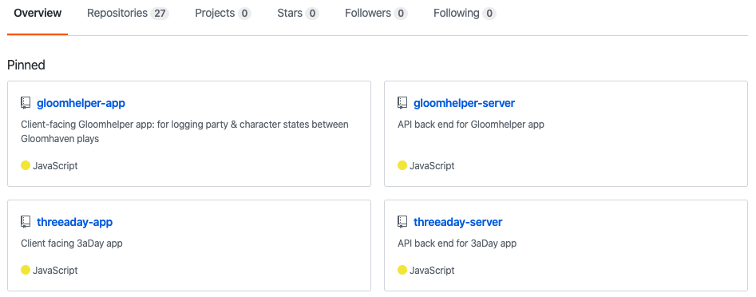
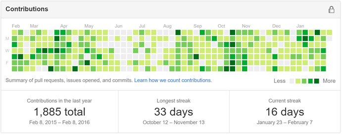

## Learning objective

By the end of this checkpoint, you should be able to create an effective GitHub profile.

## Overview

As you may already know, GitHub is a platform that hosts code for version control and collaboration. There are many ways to use GitHub for software development specifically, but it's also a versatile platform that a variety of tech professionals use. And it's a powerful tool for your job search as well; remember, [most employers search candidates' online profiles](https://wtop.com/business-finance/2020/03/most-employers-regularly-check-job-candidates-social-media-profiles/) before making a hiring decision.

GitHub can boost your desirability as a candidate, particularly when you create a robust profile, use it regularly, and push contributions often—both during the program and in your job search. In fact, an active, robust, and well-organized GitHub can often get you an interview over a candidate with a slightly less impressive GitHub profile. 

Like any other marketing material, it's important to make sure that your profile represents the best version of you and what you have to offer. This checkpoint covers the GitHub features that you should pay attention to during your job search. 

## GitHub profile components

At first glance, what do employers see when they look at your GitHub profile? They see your photo, your bio, your popular and pinned repositories, and your activity. Here's how to make each stand out positively. 

### Photo

Your profile photo is one of the first things that people (ahem, employers) see when visiting your GitHub profile. For this reason, your photo should be employer-friendly and recognizably you. It's helpful to use the same photo that you use on your LinkedIn profile; this isn't required, but it does help establish a consistent brand and make it easier for employers to remember you. 

### Bio

Under your photo, you can—and should—add a bio. This can be up to 160 characters long and should focus strictly on who you are as a technical professional. Generally, a trimmed-down version of the summary on your LinkedIn profile or resume is best. Here are a few examples: 

> JavaScript developer using jQuery/React/Node.js/PostgreSQL. Experienced educator with an emphasis in informal education centers and nonprofits.

> UX designer who enjoys photography and 3D visualization. Currently pursuing UX design and frontend development projects.

> Data scientist with a background in physics and research. Passionate about using data to improve the way that businesses communicate with customers.

> Technical Project Manager

### Popular repositories 

Your profile also displays a selection of your popular GitHub repositories. It's best to pin a separate repository for each project that you complete. And for web development projects, it's helpful to pin a repository for both the client side and the server side of a project, like in the example below. 

 

 
 

Remember to hide projects that you don't want employers to see. Although there's value in showing how you've progressed in a short period of time, you want to ensure that an employer sees your best work first. 

### Contribution graph

Below your popular repositories is a contribution graph, which shows your recent activity on GitHub. Specifically, this graph shows when you've committed to a repository's default branch or *gh-pages* branch, opened an issue, proposed a pull request, or submitted a pull request review. Each tile represents a day. Gray tiles represent no activity, and green tiles represent activity; tiles become darker green with more activity. 

This graph is perhaps the most important part of your GitHub profile, especially as you begin your job search. Most employers value candidates who are excited about their work. And an easy way to show employers that you care about your work is by staying active on GitHub—beyond your program requirements and particularly after you graduate from your Thinkful program. So, after you graduate, continue to refine parts of your projects and push them to GitHub. Aim for a green tile every day, from now until you get your next job.  

 

 
 

## GitHub READMEs

All of your GitHub projects should have an accompanying README file that serves as a summary of your work. READMEs are intended to provide context for visitors looking at your project; it should convey what your project does and why it's useful, how users can interact with it, who maintains and can contribute to it, and any other relevant background information. 

Employers aren't just looking for organized and active GitHub profiles; they also want to see robust READMEs for each of your projects. This gives them context about the project that they're looking at. And it shows them that you're able to explain the concepts that you're working with, which is something that employers value. 

For each of your project READMEs, include the following information, as applicable: 

* Context on the problem or assignment (what it is and why you're doing it)
* Information on your research or user case
* How the project is intended to be used or could be used
* Various features or aspects of the project
* The technologies and tools that you used to make your project and why
* Any discoveries that you made while making the project
* Your future goals for the project
* Relevant screenshots or supplemental images

<!-- CHECK YOUR UNDERSTANDING
What are the four main components of your GitHub profile?
True or false? You should keep making contributions to your GitHub after you finish your program.
True or false? It isn't necessary to include a README for your project repositories.
What should each of your project READMEs include?  -->

## Supplementary resources

* [Pinning items to your profile](https://help.github.com/en/github/setting-up-and-managing-your-github-profile/pinning-items-to-your-profile)
* [How to add screenshots to READMEs](https://stackoverflow.com/questions/10189356/how-to-add-screenshot-to-readmes-in-github-repository)
* [Data science README example](https://github.com/innawendell/Final_Capstone)
* [Web development README example](https://github.com/carmarsden/gloomhelper-app)

## Assignment

With the insight gained in this checkpoint, create or update your GitHub profile. It should include the following: 

* A profile photo
* A bio
* Pinned repositories for each project
* A robust README for each project

Once you complete the above items, submit a link to your GitHub profile for review. 
