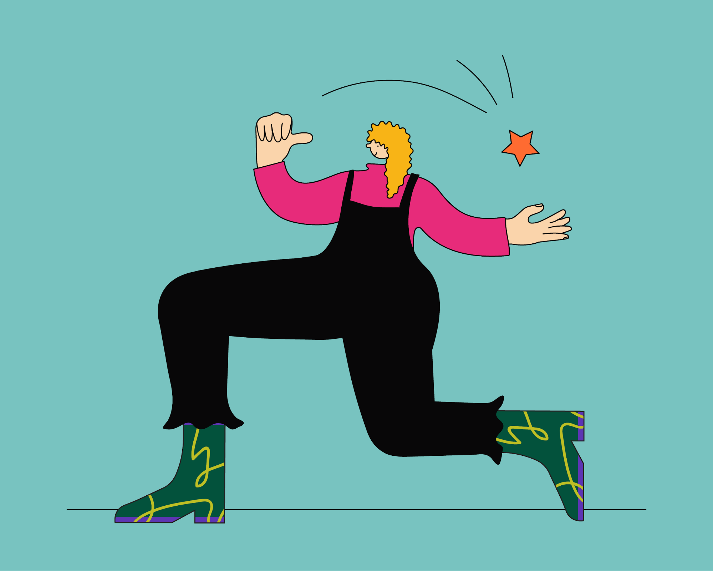

 

 
 

## Learning objective

By the end of this checkpoint, you should be able to explain the purpose of personal branding.

## Overview

Jeff Bezos defines a person's brand as "what other people say about you when you're not in the room." Think about that for a moment. How would people describe you? Would this description differ if it came from close friends versus from a stranger who can access only your social media platforms?

Often, employers fit into this latter category. Because they don't know you, they rapidly make assumptions about you based on the few resources at their disposal: your resume and public-facing online profiles. 

This module covers how to present yourself as positively as possible on paper and online, so that even if an employer spends only a few seconds looking at your resume or an online profile, they'll have a good impression. 

Although this module only requires you to polish your professional branding assets, remember that the [majority of employers](https://www.inc.com/melanie-curtin/54-percent-of-employers-have-eliminated-a-candidate-based-on-social-media-time-to-clean-up-your-feed-and-tags.html) also review your social media profiles during the hiring process. So it's important to ensure that _all_ of your public-facing profiles are employer friendly.

---

You might be wondering why you are learning about personal branding right now.

It's because it's important to start networking as soon as you can. And as soon as you start networking, employers are going to ask for your resume and look at your LinkedIn profile, so you want them both to be as polished as possible. 

Although you'll continue to develop your resume and LinkedIn profile throughout this program and your career as you complete projects, you can still start outlining and refining them now. That way, they'll be ready the moment that you need to use them. And in the meantime, you'll look good online. 

