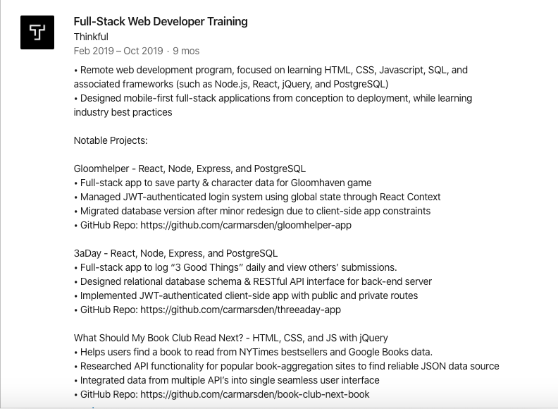

## Learning objective

By the end of this checkpoint, you should be able to create an effective LinkedIn profile.

## Overview

LinkedIn is the world's largest professional networking platform. You can use it to do the following:

* Find and apply to job listings 
* Grow your professional network
* Find someone to conduct an informational interview with
* Share and find work-related news and tips
* Share your professional history and projects with employers
* Get recruited

In fact, [95% of employers](https://workmonger.com/6-linkedin-strategies-that-help-recruiters-find-you/) use LinkedIn as their go-to platform to source talent, which means that it's essential for job seekers to have a complete LinkedIn profile. 

Your LinkedIn profile is, effectively, an online version of your resume—but better! It's interactive, follows a standardized format, isn't limited to a couple of pages, and allows you to attach work samples. Additionally, having a complete profile makes you [40 times more likely](https://university.linkedin.com/content/dam/university/global/en_US/site/pdf/TipSheet_NetworkingonLinkedIn.pdf) to receive job opportunities. This checkpoint covers how to create a robust LinkedIn profile for your job search. 

## LinkedIn profile components

Happily, because LinkedIn profiles are similar to resumes, you can copy and paste a lot of the information that's on your resume. This makes creating a profile easy. But there are some additional components and considerations, which you can review later in this checkpoint. 

**Tip:** Before you start making lots of updates to your profile, it's smart to [turn off your activity broadcast](https://www.linkedin.com/psettings/activity-broadcast) so that LinkedIn doesn't notify your contacts each time that you make a change to your profile. 

### Custom URL

When polishing your LinkedIn profile, the first thing to do is create a customized URL for your profile. Customized URLs look cleaner on your resume and make it easier for employers to find your profile. 

Ideally, your customized URL should follow the naming convention "FirstName-LastName" or something similar. If that's unavailable, choose a variation of your name that's still recognizable, simple, and professional. 

To customize your LinkedIn URL, [follow the steps in this link](https://www.linkedin.com/help/linkedin/answer/87/customizing-your-public-profile-url?lang=en). 

### Profile photo

One of the first steps in completing your LinkedIn profile is to add a profile photo. When you have a LinkedIn profile photo, you can get up to [21 times more profile views](https://www.linkedin.com/help/linkedin/answer/112133/how-do-i-create-a-good-linkedin-profile-?lang=en) than users without a photo. 

You want your profile photo to showcase the best, most professional version of yourself. The photo should reflect what you might look like when you go in for an interview and should be representative of what you look like currently. Here are some guidelines that your LinkedIn profile photo should adhere to: 

* **Smile:** Like everyone else, employers prefer working with people who are friendly and fun to be around. A smile is the best way to signal this. 
* **Be professional:** No sunglasses, hats, or potentially offensive logos. 
* **Be in focus:** Either use a neutral, nondescript background or a camera lens that blurs your background so that you're the main focus of the photo and nothing distracts from you. For the same reason, you should be the only person in the photo.
* **Opt for high quality:** Your photo doesn't need to be taken by a professional photographer, but it should be high quality, have sharp (not fuzzy) focus, and be well lit. (No selfies!) 

 

 
 

### Background photo

The next thing to consider is customizing your background photo, which is the wide photo that's displayed at the top of your LinkedIn profile. Although it's okay to keep the generic image, uploading a background image can add visual interest to your profile and make it more memorable to viewers. 

If you do choose to customize your background photo, try to choose one that's the same color scheme as your portfolio or resume; this will help you keep a consistent brand. Or, pick an image that reflects your location or the industry that you're transitioning into. Just keep it professional, high quality, and simple; you want it to enhance your LinkedIn profile, not be a distraction.

You can use your own image or something that you find online, like from the free photo-sharing site [Unsplash](https://unsplash.com/). Below are a few ideas.

A skyline of the city where you live:

 

 
 

A solid color that matches your portfolio or resume's color scheme:

 

 
 

A graphic that reflects your industry: 

 

 
 

### Headline

Next is your headline. This is the copy that you see below your name. LinkedIn automatically makes your headline the title of your current job, but you can update it to reflect the job that you want. For example, you could write, "Frontend Developer," "Technical Project Manager," or "Digital Marketer." 

To avoid [hiring bias](https://www.forbes.com/sites/roberthellmann/2017/01/09/looking-for-a-job-dont-tell-linkedin/#26d700711e75), don't use phrases like "open to new opportunities" in your headline. 

### About

Like the summary section of your resume, the LinkedIn About section is an opportunity to control your story. Be strategic about what you write in this section, knowing that _how_ you describe yourself influences the way that viewers think about you. 

Are you a former technical support person, or are you a software engineer with expertise in hardware and networking? Are you a marketer turned designer, or are you a UX designer who is well versed in what customers want? 

Generally, you can use the summary section of your resume as a starting point. But because you're not limited to space, it's okay to expand. For example, it's helpful to say what motivates you, share a relevant personal anecdote, identify your top skills, demonstrate that you work well on a team, mention impressive projects, or provide links to your portfolio. 

Finally, write in first person. Viewers know that you're filling out your own LinkedIn profile, so it's natural to use language that reflects that. 

Here's an example of an interesting LinkedIn About section: 

>Hi! I'm Amy, and I tend to flex my right-brain muscles more often than not. In the fifth grade, I took a bunch of my mom's magazines, clipped them up, and created a student newsletter because our class didn't have one. It was poorly constructed, stapled together on wide-ruled, loose-leaf notebook paper, but it became really popular—so much so that other students in my class started creating their own zines to compete with mine. My fifth-grade teacher was impressed by the engagement and told me that I was an "innovative" 10-year-old who should hold on tight to her creative skills. She also let me skip gym class so that I could start producing the class newsletter with Microsoft Word. (Shout out to ClipArt!)
>
>
>I am a digital media entrepreneur, marketer, and full-stack web developer who lives at the intersection of technology, art, and content creation. I currently work in marketing for one of the world's largest technology companies and spend my time outside the office empowering women through my digital platform, mentoring, and service work.
>
>
>My specialties are digital marketing, growth hacking, SEO, content creation, blogging, web design, full-stack web development, HTML, CSS, JavaScript, JQuery, Bootstrap, AngularJS, ReactJS, Drupal, UX/UI Design, Adobe Creative Suite (Photoshop, Illustrator, InDesign), design principles, color theory, wireframing, and digital media.

### Experience

Your LinkedIn Experience section should mirror the experience section on your resume.

While you need to manually write in your job title, company name, and location, and select your start and end dates, it's best to copy and paste the bulleted accomplishments on your resume for that job. LinkedIn doesn't have formatting options, so you can use hyphens (`-`) or dots (`•`) for bullets. When you finish adding entries, cross-reference them with the entries on your resume to ensure that they match. 

It's true that you have more space on your LinkedIn profile than on your resume, but that doesn't mean that an employer's attention is infinite. Resist the temptation to overload your profile with unnecessary details or jobs that you had more than a decade ago. If you do choose to add more detail to your LinkedIn profile, it should be by adding accomplishments that are _relevant_ to the job that you want but didn't have room for on your one-page resume. 

### Education 

Like your Experience section, your LinkedIn Education section should match the education entries on your resume. 

### Including Thinkful in your LinkedIn profile

You should list your Thinkful experience in either the Experience or Education section of your profile—not both. Below are best practices for listing it in either section.

#### Including Thinkful in the Experience section of your LinkedIn profile

On LinkedIn, you're unable to reorder your sections and projects are not prominently displayed. For this reason, it can be helpful to list your Thinkful experience in the Experience section of your LinkedIn profile. 

For your title, write the title of the program that you're in or that you're still in training; for example, "Digital Marketing Program" or "Data Scientist in Training." Leave the employment type blank (or "-"). And write "Thinkful" as the company name. 

Then, in the description of your Thinkful Experience entry, add the details of your projects, making sure that you list all of the skills and tools that you used. When it makes sense, you should also utilize the media function that allows you to upload an image of or add a link to your Experience entry. 

Here's an example of a past student's entry: 

 

 
 

#### Including Thinkful in the Education section of your LinkedIn profile

If you include Thinkful in the Education section of your LinkedIn profile, type "Thinkful" for the school, "Certificate" for the degree, and the title of your program for the Field of Study. For example, "UX/UI Design" or "Product Management." Include the same information that you would include in the Experience section—your projects, skills, and so on. When appropriate, use the media function. Don’t include the word “bootcamp” in your description, as some employers have a bias against bootcamp grads. 

### Skills and Endorsements

In the Skills and Endorsements section, list the individual skills, tools, and abilities that you have. You can include up to 50, but you should focus on the ones that are relevant to the job that you want (likely the ones that are on your resume). Order them from most to least relevant. Then ask your Thinkful peers and LinkedIn connections to endorse you for these skills. It helps if you endorse their skills, too. 

There's some debate about whether or not this section is useful, but at a glance, these endorsements make you seem more credible. These skills also make your profile more searchable in general, and LinkedIn uses these skills endorsements to boost your search ranking in LinkedIn searches. 

### Recommendations

Since you're probably new to your chosen field, having someone vouch for you can be incredibly valuable. 

Your mentor is a good person to ask for a recommendation, because they will verify that you've mastered the skills of your program before you graduate. A peer who you've collaborated with on a project or someone who can speak to your professional skills might also be good to ask. 

### Miscellaneous LinkedIn sections

You might notice that there are a few more sections available to you on your LinkedIn profile, like Volunteer Experience. It's not necessary to include all of these sections, but inspect them all so that you know what's available to you. Add any that add relevant value to your profile.

## LinkedIn connections

Something to think about is how many people you're connected to on LinkedIn. The more connections that you have, the easier it is for you to get introductions to a company, and the easier it is for employers to find your profile. So, be intentional. 

Search for and connect with past and current coworkers, past and current classmates, your Thinkful community, your family and friends, and people you meet at networking events. LinkedIn also helps you find people to connect; just click the **My Network** button in the top navigation. Then, when the new page loads, you'll see a variety of people who you may know. 

LinkedIn is far less personal than other social media platforms, and it is intended for networking. So it's okay to extend and accept invitations to connect from other LinkedIn users, even if they're strangers.

That's it for completing your LinkedIn profile. To learn about additional LinkedIn features and settings, check out this video:

## Supplementary resources

* [Exemplary LinkedIn profiles to inspire you](https://docs.google.com/document/d/12XyQbqYs7S4dhhCVhjXnb3IR3Ob0_qP0hpCN2o5BhKI/edit#heading=h.ozr9iy9smtg3)
* [How to Make Your LinkedIn Profile Stand Out](https://medium.com/@tom.mccormack/how-to-make-your-linkedin-photo-stand-out-7a51d739deec)
* [How to Guard Your Profile Against LinkedIn Resume Assistant](https://www.avidcareerist.com/2018/01/18/linkedin-resume-assistant/)
* [5 Templates That'll Make Writing the Perfect LinkedIn Summary a Total Breeze](https://www.themuse.com/advice/5-templates-thatll-make-writing-the-perfect-linkedin-summary-a-breeze)
* [Contacting a Hiring Manager on LinkedIn](https://www.thebalancecareers.com/should-you-contact-a-hiring-manager-on-linkedin-4021244)

## Assignment

With the insight gained in this checkpoint:

1. Create or update your LinkedIn profile.
2. Review [this grading rubric](https://chegg-my.sharepoint.com/:w:/p/gina_hinton/Ec-3qPFwkXlDhZqgVS-ZTGIBNw9c5liaCPwlBPNNqfsjSw?e=EwORrk) to ensure that you're meeting all of the necessary requirements for this assignment.
3. Submit a link to your LinkedIn profile.

At this point, the Careers Team will review your LinkedIn profile and work alongside you to make any necessary revisions. 
