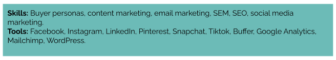

## Learning objective

By the end of this checkpoint, you should be able to create a resume that's tailored to your desired job.

## Overview

In most cases, your resume is an employer's first introduction to you. Employers use it to determine whether or not they want to interview you for a specific job opening at their company. And they often make this decision [in just a few seconds](https://www.hrdive.com/news/eye-tracking-study-shows-recruiters-look-at-resumes-for-7-seconds/541582/).

The good news is that there's a lot that you can do to ensure that your resume highlights the qualifications that employers are looking for and showcases you in the best way possible. 

This checkpoint covers how employers review resumes, what you should include in your resume, how to tailor your resume to every job listing, and how to make your resume attractive and easy to read. 

## Applicant tracking systems

Before you start to write your resume, it's helpful to understand what *applicant tracking systems* (ATS) are and how they work. 

ATS are software applications that electronically scan your resume for certain keywords and phrases to see if you're a match for a specific job listing. Employers often use ATS at the first stage of the hiring process to filter out resumes (and, therefore, candidates) who don't seem like they're qualified for the job that they're applying to. 

The keywords and phrases that the ATS are scanning for are usually based on the qualifications listed in the job description. This means that it's ineffective to use the same resume for every job that you apply to. Rather, it's essential to tailor your resume to each job, based on its listing. Otherwise, you may be automatically rejected, even if you're qualified. 

In the next section of this checkpoint, you'll learn how to effectively tailor each section of your resume to a specific job listing—ensuring that everything that you include in your resume is intentional, relevant, and transferable. In other words, you'll make sure that there is no fluff or filler. The skills and experience that you include should be either directly related to the job that you're applying to or useful in the job that you're applying to. 

## Resume components

Although every resume is different, all resumes should include most or all of the sections described below. 

### Contact information

Always list your contact information at the top of your resume. Include the following: 

* Your first and last name
* Your city and state of residence (but not your full address)
* Your phone number
* Your email address
* The URL to your LinkedIn, personal website or portfolio, or GitHub profile. Note that you should always use the shortened version of the URL; for example, use `myurl.com` instead of `http://myurl.com`.

### Summary

Immediately following your contact information, include a one-to-three-line summary that tells employers who you are and what skills you offer. For example, "Frontend developer who's proficient in HTML, CSS, and JavaScript. I also have five years of experience in physics, which helps me logically and methodically solve problems, and an interest in design, which ensures that my websites are both beautiful and user-friendly." 

Your summary should: 
* Introduce yourself using the title of the job that you're applying to. 
* List your relevant qualifications and skills.
* Highlight something interesting or transferable about your background. 

This focuses your resume and immediately communicates to employers that it's worthwhile for them to continue considering you.  

### Skills

Next, include 9 to 15 of your top relevant skills. Organize them as categorized lists, like this:  

  
 
  
  

Or as a bulleted list, like this:  

  
 
  
  

If you're applying to a specific job listing, include skills that you have that the job listing cites in its required skills section or equivalent.
 
If there isn't a specific job listing to refer to, look at a dozen job listings for the same kind of job and identify the common skills that these listings cite. Include those as the skills in your skills section (as long as you actually have those skills).

To see a curated list of possible skills that you can include, click [here](https://docs.google.com/document/d/1egvr3fDSLmfz7Vpebx73JGxskrG1F6WYCC1U2FCiJRs/edit#) and then select the appropriate program. 

### Projects

Include 2-4 personal or Thinkful projects that showcase your best work. Your projects often showcase your most relevant experience so it's important to highlight them prominently on your resume. Projects help employers see your relevant skills in action and increase your chances of getting past Applicant Tracking Systems. (Note: it’s okay if you’re still in the process of developing your projects. For now, include what you do have, then update your resume and you refine and complete more projects.)  

For each project, include: 

* The project's name.
* A URL to the project, if it can be viewed online.
* A one-line description of the project.
* The skills that you used to build the project.
* One or two bullets that describe how you used your skills to contribute to the project.

Here's an example: 

>Friend Finder | github.com/username/friend-finder
>
>* Developed a mobile app that helps users meet people in their area with similar interests.
>
>* Built using JavaScript, React, HTML, and CSS.
>
>* Managed JWT-authenticated login system using global state through React Context.
>
>* Migrated database version after minor redesign due to client-side app constraints. 

Start each bullet with an action verb, like *developed*, *created*, *led*, or *managed*. Visit [this list of action verbs](https://docs.google.com/document/d/1QQvJvEoXnw3ODL0NMtcqZu1zwdjnWP5zk19Nz4kiJME/edit) if you want to see more examples. 

### Experience

The purpose of your experience section is twofold. You want to show employers the following: 

* You have relevant and transferable experience.
* You don't just do your job—you get results.

This means that you should be strategic about what you include. You don't need to include every past task or responsibility. Rather, you should focus on your relevant and transferable accomplishments within your previous jobs.

 
For each past job, include the following: 

* Your job title
* The company's name
* The city and state that you worked in 
* The dates that you worked that job
* A bulleted list of your accomplishments

The bulleted list of your accomplishments should focus on what you *achieved*, not what you were assigned. For example, "Drove the high-quality and on-time completion of 14 software development projects, using both predictive and adaptive development strategies," is a lot more impressive than "Responsible for project management." 

Because you want to tailor your resume to a job listing, it can be helpful to think of the skills that you want to highlight for each of your past jobs, and then write your accomplishments with those skills in mind. 

Similar to your projects, each accomplishment should start with an action verb. For example, "Led the quarterly review process" sounds better than, "Participated in the quarterly review process." Aim to use an active voice instead of a passive voice.

Finally, make sure to use present tense for current jobs and past tense for past jobs. 

### Education

For your education section, include the details of your Thinkful program, your university studies, and any relevant secondary education. For each entry, include the following: 

* The type of degree that you earned or the major topic of your study.
* The school's name.
* The years that you studied at that school, or just the year that you graduated.
* Your GPA, if it's 3.5 or above.
* Any relevant awards, honors, fellowships, or classes.

Because your Thinkful program is probably more relevant to potential employers than your other education, it's okay to add some additional details in your Thinkful entry. Here's an example:

>Certificate, Data Analytics | Thinkful | 2022
>
>* Data analytics extraction and presentation of actionable insights that deliver business value from common data sources like Excel, CSV files, and SQL databases 
>
>* Practical mastery of Excel, PowerPoint, PostgreSQL, Tableau, and Python for data analysis

### Miscellaneous resume sections

Chances are, the above information is more than enough to fill up your resume. But, if you have room, there's value in including another section on your resume that sells your strengths. Below are a few options. 

#### Certifications

If you've received certification in any skills or technologies that are relevant to your desired job, include a section for them. Alternatively, as appropriate, you can merge these with your education section.

#### Volunteer work

Volunteer sections are a good way to show that you go above and beyond, particularly when it's for a relevant cause, such as Women in Tech or Marketing for Good.

All the more reason to volunteer at a meetup in your area! 

#### Publications

Have you had any relevant articles, essays, or research papers published in reputable publications? That's great! Include them on your resume. 

## Resume style guidelines

After you finalize all of the necessary content for your resume, the next thing that you should do is style it in a professional, easy-to-read format. Although there is lots of room for creativity and personal preference, below are some guidelines that you should always follow. 

### Length

Many employers spend [less than a minute](https://exechunter.com/2019/09/25/what-hr-managers-are-looking-for-on-your-resume/) looking at your resume, so you should keep it short. One page is ideal. (And no stretching the margins!) If you truly need the space, you can go up to two pages—but only if everything on the two pages is relevant.

Because employers scan resumes rather than reading them in full, you want whatever their eyes land on to be something that makes them interested in you. And keeping your resume one or two pages long forces you to cut the fluff. For example, you don't need to include any work experience from more than a decade ago. 

### Order

The majority of people read from top to bottom, so it's important to showcase your most attractive information first. Generally, you should list your resume components in this order: 

1. Contact information
2. Summary
3. Skills
4. Projects (if any)
5. Experience or Education (whichever is going to be most attractive to employers)
6. Experience or Education (whichever you didn't list first)
7. Optional: Miscellaneous

### Font

There are a couple of things to consider when it comes to font, from the typeface that you choose to its size and emphasis. 

#### Typeface

It's best practice to use just one typeface throughout your resume. Two complementary typefaces are okay if you want to use a different one for headings. 

Pick typefaces that are professional and readable. For example, Arial, Helvetica, and Raleway are good sans serif typefaces, and Baskerville and Cormorant Garamond are good serif typefaces.  

#### Size

The main text of your resume should be between size 10 and size 12. Size 11 font is ideal. 

Optionally, you can select a font size that's two points larger than your main text for headings; this could make your resume easy for employers to navigate. You can also select an even bigger font size for your name so that it stands out on your resume. 

#### Emphasis

Instead of changing the size of section headings, you can choose to emphasize them using CAPS or **bolding**. 

CAPS, **bolding**, *italics*, and <ins>underline</ins> styling can also be helpful for headings on project, experience, and education entries. For example, you can bold all project names, job titles, and education degrees, and italicize the rest of the entry heading.

### Spelling and grammar

Before submitting your resume to employers, double-, triple-, and quadruple-check it for spelling and grammar errors. It helps to read it aloud, have friends and family proofread it, and use free tools like [Grammarly](https://app.grammarly.com/) to guarantee that your resume is error-free. 

### Consistency

Whatever you choose to do, be consistent. One of the most common resume pitfalls is a lack of consistency; unfortunately, a messy resume is an easy way to lose a job before ever being considered. Review your typefaces, font sizes, heading styling and formatting, margin alignments, dates, and bullets. Ensure that all of the styling that you choose to apply is consistent throughout your resume.

---

Remember, the goal of your resume is to get the employer interested enough to start a conversation with you. Once the conversation starts, your resume becomes less important; then, it's your job to speak intelligently about your experience. 

<!-- CHECK YOUR UNDERSTANDING
What is the difference between transferable and related skills?
What are the six resume components that should be on every resume? 
True or false? Thinkful should be in both your education and experience section.
What are active verbs, and why are they important on your resume?  -->

## Supplementary resources

* [Action verbs](https://docs.google.com/document/d/1QQvJvEoXnw3ODL0NMtcqZu1zwdjnWP5zk19Nz4kiJME/edit)
* [Resume checklist](https://docs.google.com/document/d/119JX13fD4Qg_QiAoUqZHoGLYyDKxJ4i2o0-lcFJODy0/edit)
* [Jobscan](https://www.jobscan.co/) and [SkillSyncer](https://skillsyncer.com/)—free resources that help you measure how successful your resume might be against ATS
* [Grammarly](https://app.grammarly.com/)
* [Technical skills per program](https://docs.google.com/document/d/1egvr3fDSLmfz7Vpebx73JGxskrG1F6WYCC1U2FCiJRs/edit#)

## Assignment

With the insight gained in this checkpoint:

1. Create or update your resume in a Google Doc.
2. Review [this grading rubric](https://chegg-my.sharepoint.com/:w:/p/gina_hinton/EaNyqKZ5__ZChH3v6DoFVrcB-DBTcCvHvlOn_PmnmNTSMw?e=fcn99o) to ensure that you're meeting all of the necessary requirements for this assignment.
3. Update your resume's sharing permissions so that other people with the link to your Doc can edit your resume. (This allows the Careers Team to make notes and help fix typos.)
4. Submit a link to your resume.

At this point, the Careers Team will review your resume and work alongside you to make any necessary revisions. 
