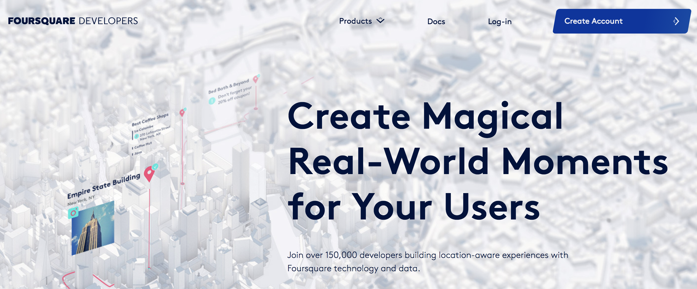
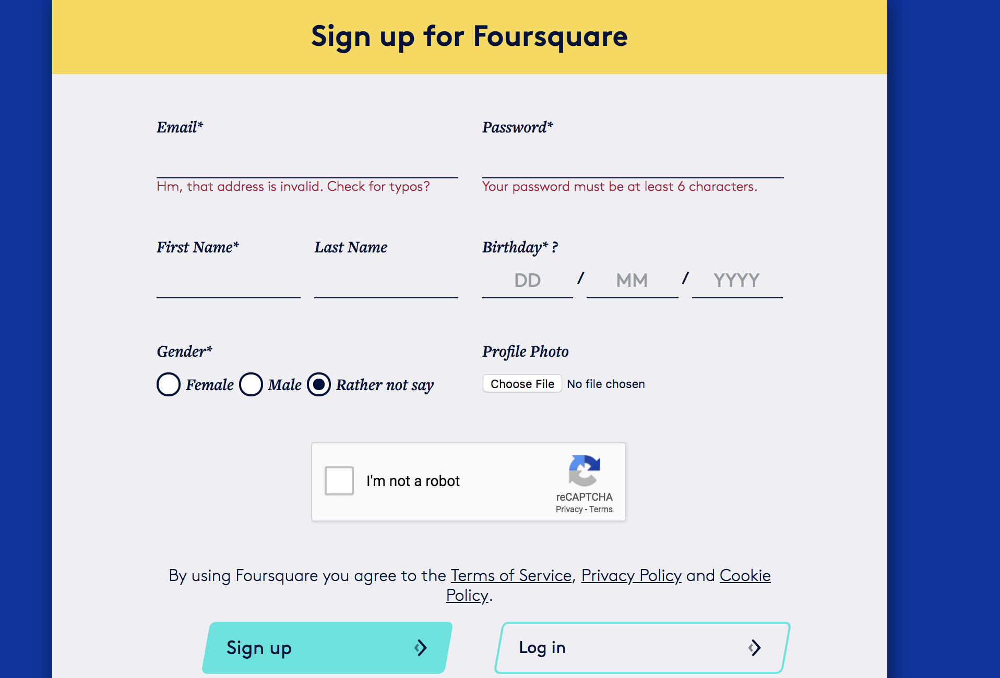
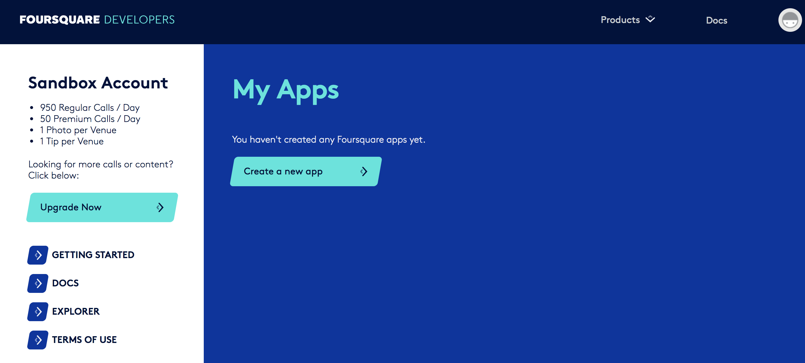
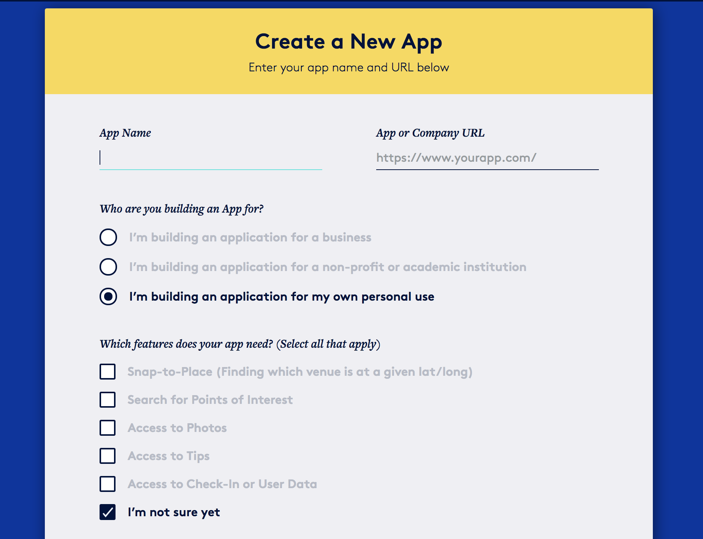
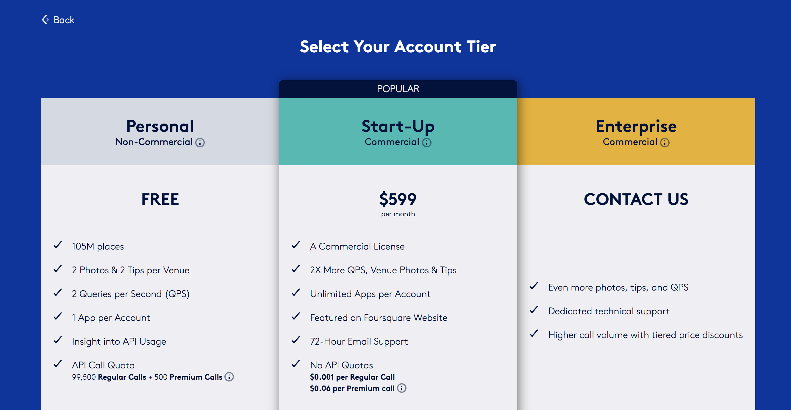
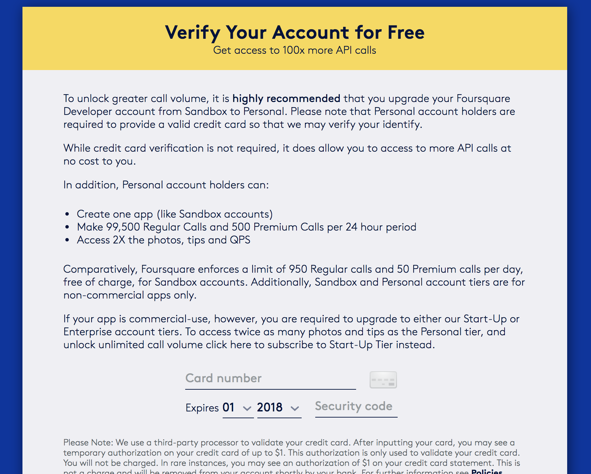
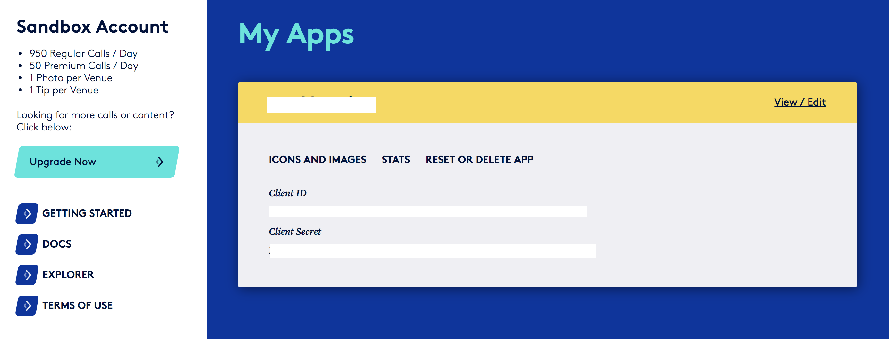

In the previous checkpoint, you simulated streaming data by splitting a static dataset into segments and streaming each segment one at a time through Spark locally. Now, you'll be working with livestreaming data via Foursquare's API. In this exercise, you'll set up a Foursquare app, use Spark to handle the data from the Foursquare API, and complete a data analysis based on a research question of your choosing.

Streaming data is extremely fragile, which is why most production-level Spark environments use software like [Apache Kafka](https://kafka.apache.org/intro) to create a persistence layer between Spark and the data feed. But for simplicity, you'll save the data that you read from the Foursquare API as text files in your Google Drive. Then you'll run Spark Streaming on Colab by reading the files as they arrive.

For this purpose, create a new folder called *foursquare_logs* inside the *Colab Datasets* folder in your drive. You'll populate this new folder with the files that will be generated from the Foursquare API.

## How do you access the Foursquare API?

1. Go to the [Foursquare Developer page](https://developer.foursquare.com/) and click **Create Account**.

	

2. Sign up for Foursquare Developers.

	

3. Create a new app.

	

4. Fill in the information regarding your app. You can give a random name to your application and fill in a random URL. Then you can check in the boxes as follows:

	

5. Select the **Personal** account tier.

	

6. **Optional:** You can verify your account by entering your credit card information. This is just for verification, and Foursquare doesn't charge you anything for this. But if you verify your account, your request limits for Foursquare APIs increase dramatically. So, it's recommended to verify your account if possible.

	

7. Get your credentials.

	

And that's all! Your `Client ID` and `Client Secret` are there. Make a note of these; you'll use them when accessing the Foursquare APIs.

## How to run the sample code

As usual, there are two prepared Jupyter Notebooks that you can use as a starting point in this challenge. In the Github student repository, you'll find two Notebooks: [Foursquare_client](https://github.com/Thinkful-Ed/data-201-resources/blob/6c3459c22bac2178f8e82e35e84bb6ef92f835e1/big_data_spark_module/Foursquare_client.ipynb) and [Foursquare_streaming_challenge](https://github.com/Thinkful-Ed/data-201-resources/blob/6c3459c22bac2178f8e82e35e84bb6ef92f835e1/big_data_spark_module/Foursquare_streaming_challenge.ipynb). 

The *Foursquare_client* Notebook makes requests to the Foursquare API and writes the results to the *foursquare_logs* folder inside the *Colab Datasets* folder in your drive. In this Notebook, you can make calls to Foursquare's trending venues API. For more than 300 US cities, you can retrieve the trending venues at the time of the requests and the number of people at each of those venues.

The *Foursquare_streaming_challenge* Notebook reads from the *foursquare_logs* folder using Spark Streaming. This Notebook includes sample code that sums up the number of people in the trending venues according to the category types of the venues.

**Note:** When you want to play with these Notebooks, note that you should first run the *Foursquare_streaming_challenge* Notebook. After you make sure that the streaming has begun, then you can run the *Foursquare_client* Notebook. This is because Spark file streaming will only process the files that are created after the streaming starts. 

## Research question

In this challenge, you're required to find your own research question. Reading [Foursquare API endpoints documentation](https://developer.foursquare.com/docs/api/endpoints) may help with this; the documentation has an overview of what kind of information you can get from Foursquare.

Good luck!
