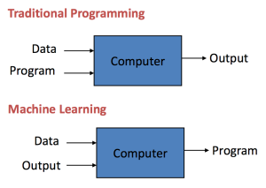
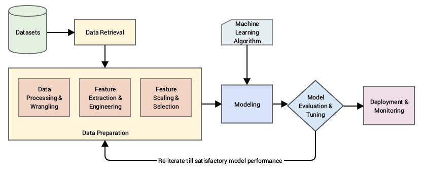
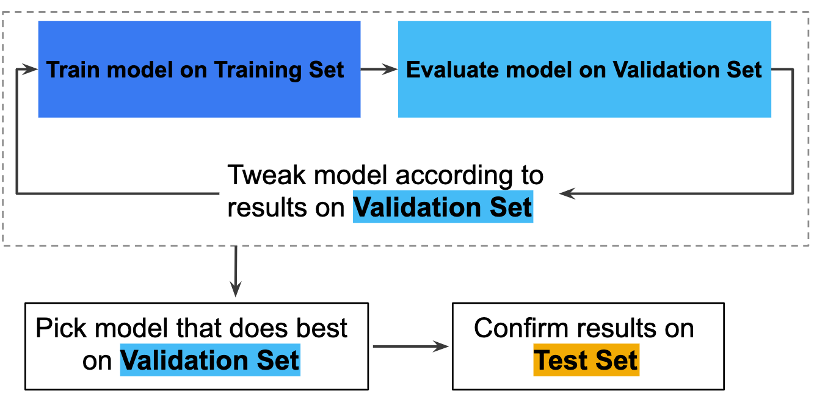

You can recognize a flower. Even if you see a new type of flower, you would probably immediately identify it as a flower. But can you describe the concept of a flower well enough that someone who has never seen a flower before will be able to recognize one? If you think about this for a moment, you'll realize that it is almost impossible. You can try to describe some of the properties of a flower. But what size would you say? Or shape, or color? 

Now, imagine a different scenario: You and four other friends had a meal at a restaurant, and you each want to pay for your own meal. The total meal cost $87.26, so you decide to split the tip evenly between the five of you to round the total off to $100. You had a burger for $5.47 and a drink for $2.90. There was a 10% tax added to the cost of the meal. How much should you contribute? There's no need to work out this contrived example—but if you are like most people, the answer is not immediately obvious. You would probably need a paper and pen or a calculator to work it all out.

Why is recognizing a flower so easy for people, but some basic calculations are so hard? It has to do with the way that your brain works. You can recognize objects, identify faces, understand voices, and read handwritten text. Just by looking at a person, you can tell what action they are doing, whether it's sitting, sleeping, or running. Computers, on the other hand, are better at the other type of tasks: those that are highly repetitive or computationally intensive. Given the right program, a computer would work out your part of the restaurant bill in microseconds. 

Computers are *deterministic* machines, which means that given the same conditions, they give the same results every time. Humans, on the other hand, are *nondeterministic*. Humans barely understand the reasons why they make decisions. And, given the same set of conditions, they may arrive at completely different conclusions each time. This difference is what makes humans good at certain tasks and computers good at others.

*Artificial intelligence* is the study of systems that perform tasks that require human intelligence, such as understanding natural language or recognizing objects or driving a car. Even though computer scientists have been studying this field for over 60 years, the problem is only partially solved. Considering that computers are good at following a predetermined set of rules, what would it take to program a computer to recognize a flower? A three-year-old can do this task, but the number of rules that you would need to define is prohibitively large—making a traditional computing approach to the problem impossible.

But what if you could make the computer learn how to recognize the flower, similar to the way that you teach a young child about flowers? To teach a child, you point at a flower and say, "This is a flower." Then you point to other flowers and identify them the same way. After many repetitions, the child learns to identify flowers that they have never seen. This is called *supervised learning*. You are supervising what the child learns. You already know what a flower looks like, so you have *labels* for all the objects in the world. But given that you learn from repeated exposure to the objects in the world, what exactly is your brain doing?

Have you ever seen someone that you think you recognize, only to realize that you made an awkward mistake? When you see an object, your brain considers the various features of the object, such as size, color, shape, and feel. Then it determines an identity for the object. But you don't make an absolute determination; rather, you decide what the object most closely resembles. Your brain probably goes, "I am 97% certain that this person is Jim." Or "I am 75% sure that this object is an orange." You have simply learned to trust your brain.

Can you get computers to do something similar? Instead of trying to provide all the rules for recognizing an object, you can provide many examples of that object and have the computer develop its own rules. Then, when you produce an object that it hasn't ever seen before, the computer works out a probability of what that object might be. A good example of this in action is the [Quick, Draw!](https://quickdraw.withgoogle.com/#) game on Google. In this game, Google uses a *neural network* (one of the machine-learning techniques that you will look at later) to recognize various shapes from hand-drawn doodles. Take a minute to play a round of the game. As you draw, the system will try to guess. And as your object takes shape, it will get closer to the answer—similar to the way that a human might guess.

This is what the field of machine learning is all about: creating computer systems that can *learn* how to perform a task, rather than relying on more traditional rule-based programming. Developing these machine-learning systems can be quite complex, and there are many ways to achieve success. This module will explore some of these approaches and get you starting to think like a machine-learning engineer.

## The field of machine learning

Now, take a moment to consider what machine learning is about as a discipline.

Machine learning is the systematic study of algorithms and systems that improve their knowledge, their performance, or both, with experience. It is a subset of artificial intelligence that uses statistical techniques to enable computer systems to learn from experience without being explicitly programmed. 

But what does that even mean?

  
*Image source: [Machine Learning Mastery](https://machinelearningmastery.com/basic-concepts-in-machine-learning/)*


In most of computer science, programs are written so that they tell the computer what to do when given an input; in other words, you give the computer an algorithm and an input, and it gives you the corresponding output. For example, that's the format that the code below uses to add two numbers.

```
    def add(number1,number2):
      return number1 + number2
```

Computing is getting to a point where computer scientists are pushing the boundaries of what problems they can use computers to solve. And some of these problems don't have straightforward algorithms as solutions.

## Machine learning's fundamental question

This gives rise to the fundamental question that machine learning aims to solve: what if computer scientists could teach a computer to figure out the algorithm required, and then the computer could fine-tune its performance based on their feedback?

To discover insights from your data and train machines to do this, you need a way of thinking that allows you to understand the systems that your data represents. And as computer scientists worked toward creating artificial intelligence, two major paths of thinking emerged. One path focuses on trying to apply models in biology, simulating natural neural intelligence. The other path focuses on applying models in statistics, simulating patterns in real-life phenomena.

Although evolutionary algorithms have been interesting, it seems that statistical learning has evolved to become the most practical. Most of machine learning is based on the application of statistical techniques to datasets; you can use it to discover patterns in your data, to perform tasks that would take humans a while to accomplish on their own. As an applied field, most of computer science work involves using computers to do things or thinking about how computers work. It doesn't spend as much time studying how to understand natural phenomena.

###### Note that in the effort to create *artificial general intelligence* (AGIs), different approaches are being integrated. So it's not all about just statistical learning. Even tools like *artificial neural networks* (ANNs) use statistics to decide the *training weights* or how to optimize the algorithm, and the "neural" section comes from the structure of the model.

For example, imagine if you were working in the health-care industry, and your main goal were to optimize your time so that you could help more people suffering from diseases. You would want to reduce the amount of time that you spend on tedious administrative work, like classifying image data such as scans or X-rays, right? These administrative tasks might be important, but what if they take up significant amounts of time in your week? And what if a computer could pick up any outliers in the images more consistently than you could? This is where machine learning comes in to help!

A more formal definition is provided by Tom M. Mitchell in his book [Machine Learning](http://www.cs.cmu.edu/~tom/mlbook.html):

> A computer program is said to learn from experience E with respect to some class of tasks T and performance measure P if its performance at tasks in T, as measured by P, improves with experience E.


## How do you start doing machine learning?


  
*Image source: Practical Machine Learning with Python*


Before you carry out any type of actual learning, you usually need to turn your raw data into the right form. You need your data in a form that you can pass into a model or algorithm that attempts to create a systematic understanding of the task at hand. This process is called *feature engineering*. It transforms all available data in your *instance space* (the vector space of all instances of your data) into *feature sets* (processed data that is ready to be used in your models).

In cases where you know what the desired outcome of each instance should be, and it is present in (or can be derived from) your data, these desired outcomes will be called *labels* or *targets*. (These two terms are interchangeable depending on what literature you're reading.) The process of feature engineering depends on what kind of task you're hoping to train your *learning agent* (basically the program on your computer) to accomplish.

You'll explore this in more detail in the different forms of machine learning that you'll learn about throughout the rest of this program.


## Types of tasks in machine learning


  
*Image source: [Different types of Machine learning and their types](https://medium.com/deep-math-machine-learning-ai/different-types-of-machine-learning-and-their-types-34760b9128a2)*

In machine learning, there are a few major types of tasks that you can aim to carry out based on what's present in your datasets.

- **Supervised learning** is when your computer is presented with a set of *features* and their corresponding *targets* and is asked to learn what the pattern in the dataset is. Supervised learning can be used to accomplish two main types of tasks. You'll explore both of these in this program, because they are very important in the industry. The tasks are as follows:

    - **Classification tasks:** Training a machine to classify data into different groups
    - **Regression tasks:** Training a machine to output a numerical label given a set of features for an instance

- **Unsupervised learning** is when your learning algorithm is given features without labels, meaning that it needs to discover the pattern in the data. Unsupervised learning is commonly used to engineer features for supervised learning tasks. Unsupervised learning can be used to accomplish several types of tasks:

    - **Clustering:** Discovering natural groups that emerge from the data
    - **Association:** Learning rules that describe large portions of your data
    - **Neural networks:** Based on the way that synapses work—where connections between "neurons" are strengthened and the machine learns connections that are reinforced
    - **Anomaly detection:** Discovering anomalies from the data

- **Semisupervised learning** occurs when your computer is given a partially complete feature-target set, where many targets are missing for the features in many instances. In other words, the signals that the computer is given to train on are incomplete.

    - This type of learning is more advanced; it relies on a solid understanding of supervised and unsupervised learning.

- **Reinforcement learning** occurs when feedback is given to the learning agent (or algorithm) in a dynamic environment in the form of rewards and punishments. This means that the learning agent needs to continue to adapt as new labels are provided to it in the environment in which it is learning. An example of this is in game-playing, where machine-learning agents are trained by an opponent.


  

## How are these tasks implemented?

As briefly discussed above, statistical techniques are most commonly used in machine learning to teach computers to understand real-world phenomena. This means that your approach to solving machine-learning tasks usually requires math and statistics on a sample set: your data. So your algorithms need to take the form of a *model*. In the language of mathematics, a model is simply a description of a system in a way that you can do math on it. It's a mathematical or statistical description of a system or phenomenon.

Models can be categorized broadly into a few overlapping types:

- **Geometric models** are constructed in Cartesian instance spaces using geometric concepts, such as graphical planes and distances. One type of geometric model that you'll learn about later in this program is the basic linear classifier.
- **Probabilistic models** view learning as a process of reducing the uncertainty of a value using data.
- **Logical models** are decision oriented. One type of logical model that you'll learn about in this program is the decision tree.
- **Grouping models** think of the instance space as different segments or groups.
- **Grading models** think of the location of each instance in terms relative to its instance space.

Although it's important for data scientists to understand how each of these models works on a high level, it's not essential to be able to regurgitate them by memory. Most of this program will be an overview of how to apply and use machine learning to solve real-world problems. You'll be relying on tried-and-tested implementations of these models in famous Python libraries, such as *scikit-learn*.

In computer science terms, you use algorithms to learn these mappings from input to output. So these models are implemented as one of the following types of algorithms:

- **Parametric (or linear) algorithms** can simplify a mapping to a known functional form with a set of fixed parameters (such as coefficients for an equation).

   - Examples: Linear algorithms, such as logistic regression and linear discriminant analysis
   - They're usually simpler to understand, faster in learning speed, and can work with smaller datasets.
   - However, they are sometimes at risk of poorly fitting the data or imposing a constraint on data. They are not suitable for problems of high complexity.
   
- **Nonparametric (or nonlinear) algorithms** can learn any mapping from input to output without any specific mapping function.

   - Examples: Naive Bayes, support vector machines, and decision trees
   - They're flexible, don't make assumptions about underlying functions, and are more highly performant.
   - However, they require a lot more training data for their estimations and are slower in learning speed. They are sometimes at risk of fitting too well to the training data (overfitting).
    
Some algorithms, like Naive Bayes, can be used either way, so it depends on the circumstances.

For more information about the difference between parametric and nonparametric algorithms, check out this article: [Parametric and Nonparametric Machine Learning Algorithms](https://machinelearningmastery.com/parametric-and-nonparametric-machine-learning-algorithms/).


## How do you know if a learning agent is performing well?

If the goal of machine learning is to teach a machine to strengthen its performance with experience, you need the agent to be able to *generalize* upon receiving new data. This means that you need to avoid *overfitting* (becoming too used to) or *underfitting* (performing as if it is just making random guesses). Different tasks will be evaluated differently using their corresponding statistical metrics, and you'll explore these in more detail with each checkpoint.

*Generalization* is about how well a learning agent can apply the concepts that it's learned to new instances that it didn't see during training time. The best models can generalize well to any data within the domain of the problem that they have trained in, which is why this is key to performance in machine learning. A more technical way of describing this is to think about *statistical fit*—how well a target function is approximated. Computer scientists tend to use a lot of statistical techniques to estimate how good an approximation of a target function is.

*Underfitting* is pretty straightforward—it's when the model can't fit to any data (whether it's training, test, or unseen data). This is usually easy to detect using a performance metric suited to the model. It means that the model that you're trying to fit to the data is unsuitable. The solution is simply to try something else that would be better suited.

*Overfitting* is, in contrast, more complex—it's when the model is fit too well to the training data, learning so much of the detail and noise in it that it cannot perform well on new data. This is because noise or undesired fluctuations in training data has been learned by the model. It's more likely to occur with nonparametric and nonlinear models, which have more flexibility in their functions. As such, you have to tweak model parameters to constrain the learning of the model, or use resampling methods to increase the accuracy of the model.

Here is a visual idea of how these concepts look:

  

The ideal is to build a model that can perform at the intersection between underfitting and overfitting—the *sweet spot*. In practice, this is pretty hard to achieve without applying specific techniques to achieve it. To understand what this sweet spot is, you can think about how your model performs when you divide the data that you have into two sections—a training set and an unseen test set. On both sets, model performance will look like a logarithmic graph. That is, each will tend towards an asymptote over time; errors in prediction on both training and test sets will go down over time.

  
*Image source: [Over fitting and Transformation Based Learning](https://www.slideshare.net/ssrdigvijay88/overfitting-andtbl)*

However, if you leave the agent to learn from the training dataset for too long, it will fit almost exactly, minimizing all errors even if they are irrelevant. The errors made by the agent on the test set will then start to increase; the agent cannot generalize as well anymore. Therefore, the goal is to find the point right before this, where the agent performs well on both sets. Sometimes, data scientists will even hold out validation sets and use resampling techniques such as cross-validation (more on this below).

Therefore, when you're structuring the way that you train your model, it's generally a good idea to split your data into a training set, a test set, and a validation set or sets. This means that your agent will be able to adapt to new data, without you having to go out and gather even more test data. You will walk this through in more detail with each different task, but here's how the training process generally looks:

  
*Image source: [Google's Machine Learning Crash Course](https://developers.google.com/machine-learning/crash-course/validation/another-partition)*

Although both overfitting and underfitting can lead to poor model performance, the most common problem in applied machine learning is overfitting. Therefore, structuring your test data so that you have training, test, and validation sets is important for several reasons. Not only do you train your model to learn the rules in one set, but you also teach it how to react to new data, all as subsets from the data that you currently have. This means that you don't have to go out of your way to create new instances to test your models on.

Another resampling method, mentioned above, is *cross-validation*. The most popular one is *k-fold cross-validation*; this is also provided by the library that you will use (scikit-learn). In this method, you train and test your model *k* times on *k* different subsets of your dataset. Then you create an estimate of how well it will perform on unseen data. A deep dive into this particular method can be found on Jason Brownlee's popular [Machine Learning Mastery blog](https://machinelearningmastery.com/k-fold-cross-validation/).

Cross-validation is a best practice in machine learning, and you can learn more about it in the [scikit-learn documentation](https://scikit-learn.org/stable/modules/cross_validation.html). A more visual, video-based introduction to this concept can be found on the [StatQuest YouTube channel](https://www.youtube.com/watch?v=fSytzGwwBVw). (Don't worry if some jargon is still new to you; you'll be exploring these terms and ideas in more detail through detailed demonstrations in future checkpoints.)


## Different strokes for different folks

Machine-learning algorithms are often referred to as *estimators* because they are an estimate of a process or pattern that might be evident in data. It is very highly unlikely that you'll come across a model that is 100% accurate in its predictive power and can generalize across all datasets. For example, [AlphaGo Zero](https://deepmind.com/blog/alphago-zero-learning-scratch/) was documented with a mean squared error (MSE) tending towards 0.175, even with increased training time.

Different types of problems are trying to solve different tasks. And therefore, different models have different metrics to evaluate how well they're performing on those tasks. For example, in supervised learning, there is the Classification Accuracy Score, which is a *confusion matrix* representing how "confused" the model got during its test phase for classification tasks. And for regression tasks, there are more error-oriented measures. 

Unsupervised learning is more complicated because how well a particular unsupervised model performs is intrinsically tied to the context of the end goal. Clustering, which is a common and well-understood unsupervised task, does have some [approach to metrics in scikit-learn](https://scikit-learn.org/stable/modules/clustering.html#clustering-performance-evaluation) though. So it does depend on the type of task at hand.

You'll explore these different metrics in more detail during upcoming checkpoints.

Finally, in supervised learning, you also need to consider the bias-variance tradeoff and its effect on model performance. Because machine learning estimators are truly statistical estimates, there is also a quantitative way of capturing the errors in their estimations (or predictions). Two very important and obvious error types are *bias errors* and *variance errors*.

- Model [bias](https://en.wikipedia.org/wiki/Bias_of_an_estimator) comes from prediction errors that evolve out of implicit assumptions that the learning algorithm might depend on.

   - This is more common in parametric algorithms, because they are quicker to adopt a specific mapping or functional form. 
   - High bias can cause underfitting; an algorithm may miss the relevant relations between features and target outputs.
   
- Model [variance](https://en.wikipedia.org/wiki/Variance) is an error from the sensitivity of the target function to small changes to data in the training set.

   - This is more common in nonparametric algorithms, because their increased flexibility means that they will respond with higher variance to new and different data.
   - High variance can cause overfitting; an algorithm may model the random [noise](https://en.wikipedia.org/wiki/Noise_(signal_processing)) in the training data, rather than the intended outputs.

Different types of supervised learning algorithms will be better at one than the other, which gives rise to this concept of a tradeoff. 

Ideally, the optimal version of the model should do its best to achieve low bias and low variance. This means that the estimator will be more likely to generalize with new data, without being compromised by fluctuations in it.

A more visual, video-based introduction to these concepts can be found on the [StatQuest YouTube channel](https://www.youtube.com/watch?v=EuBBz3bI-aA&&t=0s&index=3&list=PLblh5JKOoLUICTaGLRoHQDuF_7q2GfuJF). More information on this phenomenon is described by Scott Fortmann-Roe in his essay [Understanding the Bias-Variance Tradeoff](http://scott.fortmann-roe.com/docs/BiasVariance.html).


## How is machine learning implemented in real life?

Each different type of machine-learning task will require its own metrics to measure performance. But in general, these are the libraries and tools that you can use to create and train learning agents. You will explore specific examples in detail in their corresponding checkpoints later on.

| **Step or milestone**                                                                                                                                                                                                                                     | **Tools**                                                                                                               |
| :-------------------------------------------------------------------------------------------------------------------------------------------------------------------------------------------------------------------------------------------------------- | :----------------------------------------------------------------------------------------------------------------------- |
| Retrieve and clean your data.                                                                                                                                                                                                                              | SQL, Spark, pandas                                                                                                      |
| Understand your data by visualizing it and using summary statistics.                                                                                                                                                                                                      | Pandas, Matplotlib, seaborn, NumPy, SciPy                                                                               |
| Find the best features from your data (feature engineering).                                                                                                                                                                                        | Scikit-learn, pandas, or more specific libraries for more complex tasks (such as word2vec for natural language processing) |
| Identify the type of learning problem you are trying to solve, and spot-check some algorithms of that type on the dataset.<br>Pick the one that seems to perform better, and tune the model. Evaluate its performance using corresponding key metrics. | Scikit-learn, or more specific libraries for more complex tasks (such as TensorFlow and Keras for deep learning)           |

A more detailed explanation of the machine-learning process can be found on the popular [Towards Data Science blog](https://towardsdatascience.com/the-7-steps-of-machine-learning-2877d7e5548e).

Check out the below video for a recap of the topics covered here.

<iframe id="kaltura_player_1604700789" src="https://cdnapisec.kaltura.com/p/2315191/sp/231519100/embedIframeJs/uiconf_id/45331192/partner_id/2315191?iframeembed=true&playerId=kaltura_player_1604700789&entry_id=1_cf2qraq9" width="100%" height="500" allowfullscreen webkitallowfullscreen mozAllowFullScreen allow="autoplay *; fullscreen *; encrypted-media *" frameborder="0"></iframe>
