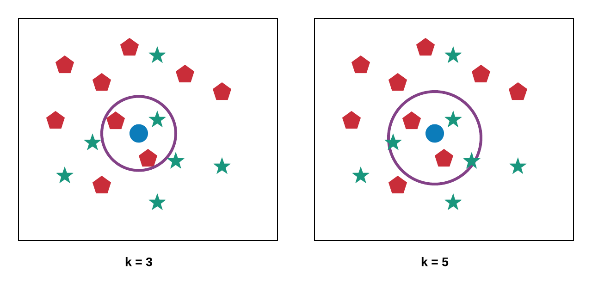
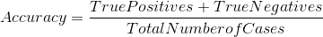
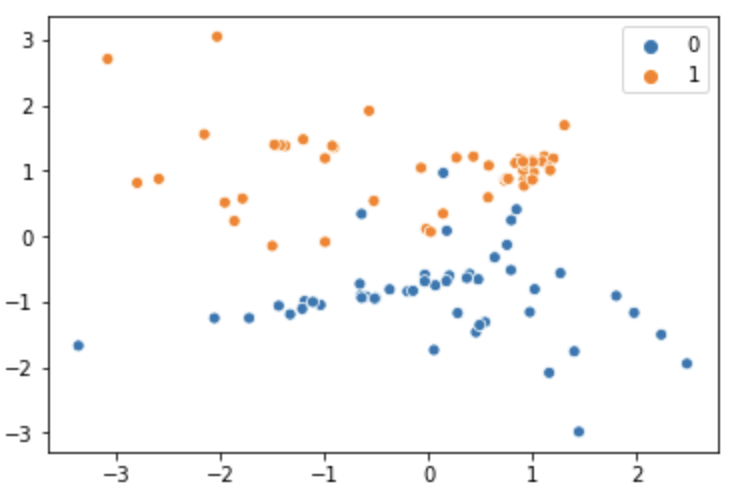
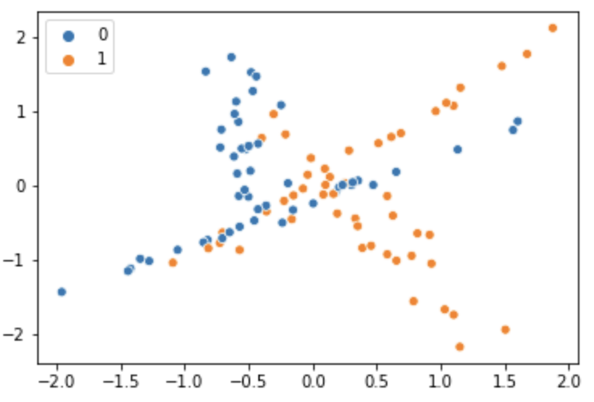

A bank receives thousands of applications for loans. Each application contains information regarding several attributes of the customer, including salary, existing loans, age, job title, and so on. With the given data, would it be possible to automatically classify each request into either `Good Credit`, `Bad Credit`, or `Maybe`? This is an example of a classification task, and there are many machine-learning algorithms dedicated to these types of tasks. There are numerous possible uses of classification in the real world. Here are a few examples:

- Classify emails received as either spam or not spam.
- In an emergency room at a hospital, 17 variables are measured for newly admitted patients. From this data, can you automatically decide if the patient should go to the ICU or not?
- Astronomers have collected millions of images of objects in the universe. These objects may be stars, galaxies, nebulas, and so on. Given the data collected, can you predict which category the object falls into?
- The NASA TESS satellite is taking pictures of all visible stars in the sky. They are trying to discover which of these stars may contain planets, based on small variations of the amount of light they receive from the stars.
- Can you tell if a tumor is cancerous or benign from a picture?
- Identifying an object as a pedestrian or not a pedestrian in a self-driving car.

There are many possible applications for classification, but these few examples should give you an idea of how widely the problems of classification can vary. Each of the scenarios listed above has unique characteristics that make one approach or another better. So that you can apply appropriate algorithms to any given problem that you may face in the future, it's important to study several approaches to classification.

*Classification* is the process of determining categories for objects and then predicting which category previously unseen objects belong to. For example, emails may fall into one of two categories: `spam` or `not spam`. If you create a model that can tell them apart, then you can predict if a new email is spam or not. The categories into which the objects may fall are called the *target variable* or *dependent variable*. The data that you use to perform the prediction are called *features* or *independent variables*.

To perform such predictions adequately, you need many examples of the object that you want to learn about. You typically start with a large group of data, say a large number of emails, or a large number of pictures of stars. Then you select a sample of the data as a training set. This is important because you need to test your model against data that it has never seen before. From the training set, you try to determine which characteristics of the objects are important. Then you use those characteristics to build a model. In this case, the model is a prediction function. Once the model is built, you need to evaluate it to ensure that it works well enough.

In machine learning, you tell a machine to carry out a classification task if your labeled data is *categorical*, meaning that your outcomes take a specific and discrete set of values which represent possible groups or categories. 

The most straightforward example of this is a binary model, which, given a set of inputs, tells you whether the instance is a "yes" or a "no." In the example of a coin toss, your outcome categories would be `head`, `tails` (or `head`, `no head`).

Categorical data can come in a few subcategories: binary, ordinal, interval, and ratio.

- **Binary:** A special case of categorical data with two categorical values (such as `0` and `1`, or `True` and `False`).
- **Ordinal:** Categorical data that has an explicit order (such as rankings or leaderboards).
- **Interval:** Categorical data that has an explicit order and meaningful lengths of differences between values (such as years, where each year is equally spaced by 12 months, but the year `0` does not imply that time did not exist).
- **Ratio:** Categorical data with an explicit order, meaningful lengths of differences between values, and a meaningful absolute-zero value; in other words, when a value on that scale is `0`, there is none of that value (such as weight, which has a `0` value).

Classification models, therefore, are tasked with determining the most likely category for the instance that you give it. There are two ways to achieve this goal:

1. Assign a category directly
2. Give the probability that your instance is in a particular category

Your model will infer all possible categories from the labels in your dataset. And depending on which type of model you use, you may or may not have to encode your labels into a numerical form for your classifier to understand. Classification models come in all forms, from decision trees to probability distributions. And the model that you end up going with typically depends on how well it fits with your dataset and how it performs on your metrics. For a given dataset, you will usually build a couple of different models and evaluate their performance before finally picking one.

## Components of prediction

Creating a prediction model involves the following steps:

1. Question formulation
2. Data gathering
3. Feature engineering
4. Algorithm selection
5. Parameter tuning
6. Model evaluation

### Question formulation

Start with a general question: Can I automatically detect spam emails? Can I automatically determine if a person makes more than $50 thousand per year?

Then, try to make your question as concrete as possible: Are there quantitative characteristics of an email that I can use to classify them as spam? Are there quantitative characteristics of a person that I can use to predict if they make more than $50 thousand per year?

### Data gathering

It's critical to get every step in the process right, but the data-gathering step is particularly difficult. You can have the best machine-learning algorithm, but you will nevertheless end up with a bad model if you use bad data. For example, in 2016, Microsoft released a machine-learning chatbot named [Tay](https://en.wikipedia.org/wiki/Tay_(bot)) that was designed to learn from interacting with humans on Twitter. Within hours, Tay started posting inflammatory and offensive tweets, and Microsoft was forced to abruptly shut it down. This is an example of a wildly successful artificial intelligence system that performed precisely as designed, but the developers hadn't accounted for the depravity of tweets on the internet.

Often, the data won't be directly available, or may not be formatted correctly, or may contain errors. Data scientists spend a significant amount of time working on data gathering and cleaning. For classification tasks, you need *labeled data*, which is data that is already associated with a target value. For example, to train a model to detect spam emails, you will need a large number of emails that have already been classified as `spam` or `not spam`.

If you are extremely lucky, you will have historical data that is already labeled. But that is rare. More often, you can conduct experiments to try to label the data, or you can use a crowdsourcing effort to label large quantities of data. For example, the [Zooniverse project](https://www.zooniverse.org/) enables everyone to take part in science; visitors can use the site to label images from various scientific enterprises so that researchers may then conduct experiments with the labeled data.

A good source of datasets for learning that are in relatively good condition is the [UCI Machine Learning Repository](http://archive.ics.uci.edu/ml/datasets.php). This repository contains several hundred datasets on a wide variety of fields, and it's suitable for many different machine-learning tasks.

### Feature engineering

Once data has been collected, you need to determine which measured characteristics of the data to use to predict the outcomes that you want. *Features* are information in your input data that you use in your prediction algorithm. Sometimes the features are direct attributes of the data, and sometimes they are *derived*, or calculated, from the data. Many machine-learning algorithms require features represented as real numbers. The raw data may not be provided as real numbers, so you may have to convert the raw data into real numbers to create a feature.

For example, a dataset may contain a field with two values: `>50K` and `<=50K`. These two values are character strings. Since you require numbers, you could simply convert this by representing `>50K` with a `1` and `<=50K` with a `0`. The exact context and the algorithm in question will play a role in how you choose to encode the data.

### Algorithm selection

As you saw previously, there are many algorithms that may be used for classification purposes. You need to select the one that performs best for your problem. In this module, you will be looking at several of these algorithms in depth and examining the characteristics of each. Typically, to make a choice, you need to look at several factors. You'll need to consider factors like the type of data that you have (continuous or categorical), the amount of data in terms of the number of samples and the number of features, and the sparsity of the data.

Even so, sometimes it may be necessary to try several algorithms and compare their results before making a choice. 

### Parameter tuning

Once you have a working model, you're ready to tune it. Most algorithms come with some parameters that you can tweak depending on the specifics of the data that you are processing. For example, in k-nearest neighbors (KNN), the value of *k* (the number of neighbors) is variable. You get to choose how many. So how do you choose? In the image below, there are two classes: the red pentagons and the green stars. The objective is to predict to which of these the blue dot in the middle belongs. If you set `k = 3`, as shown on the left side, the algorithm looks at the three closest neighbors and takes the majority. In this case, it will be classified as a red pentagon. The right shows what would happen if you set `k = 5`. This time, the five closest neighbors includes three green stars, so the blue dot will be classified as a green star.

If you choose a value that's too low or too high, the algorithm will not give you good results. One way to decide what value to choose is to run the algorithm several times with different values of *k* and select the value with the best result.

### Model evaluation

Finally, you need to evaluate the effectiveness of the model by measuring how often it makes a wrong classification. There are many ways that this could be measured, and you will explore this in greater detail later. Consider one quick example here as an illustration of what this may look like. To evaluate a model, you need a set of labeled data that wasn't used to train the model. This is usually done by splitting the labeled data into a training set and a test set. Use the training set to train the model, then use the test set for the evaluation.

You use the test data on the model to get predictions that your model has been trained to make. Because you have the actual labels for this data, you can compare the predictions to the actual. There are four possible outcomes:

- **True positives:** The algorithm predicts positive when the data point is positive.
- **False positives:** The algorithm predicts positive when the data point is negative.
- **True negatives:** The algorithm predicts negative when the data point is negative.
- **False negatives:** The algorithm predicts negative when the data point is positive.

It is common to represent this information in a 2x2 matrix called a *confusion matrix*. Imagine, for example, that you want to use quantitative attributes of a patient to predict if they have heart disease. You have one hundred test data points, where 20% of the cases have heart disease. After running this test data through your model, you get the following results:

|                           | Heart disease (predicted) | No heart disease (predicted) |
| ------------------------- | ----------------------- | -------------------------- |
| Heart disease (actual)    | True positives = 12     | False negatives = 8        |
| No heart disease (actual) | False positives = 5     | True negatives = 75        |

From this matrix, you can see that your model correctly classified 12 positive cases and 75 negative cases. You can calculate an accuracy score with the following formula:

This gives you the following accuracy score:

An accuracy score of 87% correct might seem like a great result—but is it? Think about the impact of this outcome. The 5% of cases that are false positives are not a major problem. If you pay special attention to those patients because you expect them to have heart disease, it causes no harm. But what about the eight false negatives? Out of every 20 people that do have heart disease, 40% of them go undiagnosed. That is a major problem.

Accuracy can give you a good feel for how well your model performs at prediction tasks, but it is not the whole picture. Several factors affect its effectiveness as a measure. You will be exploring this in greater detail and will look at some other ways to measure the effectiveness of the model.

## Types of classifiers

There are many classification algorithms available today, and there are many ways to classify the algorithms themselves. To start with, you could focus on these general categories of algorithms:

- Linear classifiers

    - Logistic regression
    - Support-vector machines
    - Naive Bayes
    
- Nonlinear classifiers

    - Decision trees
    - Random forest
    - K-nearest neighbors

Linear classifiers are useful when the data is *linearly separable*. That is, if you plot the data on a scatter plot, then you can draw a straight line that separates the classes.

In the plot above, you can see that a line from `(-4, -1)` to `(2, 1)` would mostly separate these two classes. Not all data is like that, however.

In the plot above, there is no single straight line that you could draw to properly separate the two classes. In this case, one of the nonlinear classifiers would be a better choice.

<jupyter notebook-name="What_Is_Classification_NB" course-code="DSBC"></jupyter>

Check out the below video for a recap of the concepts covered here.

<iframe id="kaltura_player_1604700859" src="https://cdnapisec.kaltura.com/p/2315191/sp/231519100/embedIframeJs/uiconf_id/45331192/partner_id/2315191?iframeembed=true&playerId=kaltura_player_1604700859&entry_id=1_zwb4kgqe" width="100%" height="500" allowfullscreen webkitallowfullscreen mozAllowFullScreen allow="autoplay *; fullscreen *; encrypted-media *" frameborder="0"></iframe>

Check out the below video for a screencast demo of the techniques covered here.

<iframe id="kaltura_player_1604709936" src="https://cdnapisec.kaltura.com/p/2315191/sp/231519100/embedIframeJs/uiconf_id/45331192/partner_id/2315191?iframeembed=true&playerId=kaltura_player_1604709936&entry_id=1_y9mgpvde" width="100%" height="500" allowfullscreen webkitallowfullscreen mozAllowFullScreen allow="autoplay *; fullscreen *; encrypted-media *" frameborder="0"></iframe>
