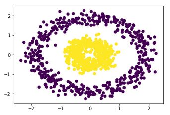

In this checkpoint, you'll learn about another popular clustering method: *density-based spatial clustering of applications with noise* (DBSCAN). K-means and hierarchical clustering are good at finding circular (or convex) clusters, which makes them great tools for identifying well-separated clusters. But, unfortunately, they're not good at identifying clusters that are not well separated or that have nonconvex shapes such as rings inside rings. 



In this checkpoint, you'll explore the DBSCAN algorithm, which can find clusters of any arbitrary shape. Here's how DBSCAN compares to k-means and hierarchical clustering:

* DBSCAN does not require you to specify the number of clusters.
* DBSCAN can find clusters of any shape.
* DBSCAN is highly efficient and scales better than k-means and hierarchical clustering.
* DBSCAN can also identify outliers in the data, which means that it isn't sensitive to outliers.


<jupyter notebook-name="5.dbscan" course-code="DSBC"></jupyter>

For a screencast demo of the techniques covered here, check out the below video.

<iframe id="kaltura_player_1604765977" src="https://cdnapisec.kaltura.com/p/2315191/sp/231519100/embedIframeJs/uiconf_id/45331192/partner_id/2315191?iframeembed=true&playerId=kaltura_player_1604765977&entry_id=1_x1zqaol0" width="100%" height="500" allowfullscreen webkitallowfullscreen mozAllowFullScreen allow="autoplay *; fullscreen *; encrypted-media *" frameborder="0"></iframe>

## Assignment

In this assignment, you'll continue working with the [*heart disease* dataset](http://archive.ics.uci.edu/ml/datasets/Heart+Disease) from the UC Irvine Machine Learning Repository.

Load the dataset from Thinkful's database. To connect to the database, use these credentials:

```
postgres_user = 'dsbc_student'
postgres_pw = '7*.8G9QH21'
postgres_host = '142.93.121.174'
postgres_port = '5432'
postgres_db = 'heartdisease'
```

The dataset needs some preprocessing. So, before working with the dataset, apply the following code:

```python
# Define the features and the outcome
X = heartdisease_df.iloc[:, :13]
y = heartdisease_df.iloc[:, 13]

# Replace missing values (marked by `?`) with a `0`
X = X.replace(to_replace='?', value=0)

# Binarize y so that `1` means heart disease diagnosis and `0` means no diagnosis
y = np.where(y > 0,1, 0)
```
Here, `X` will represent your features and `y` will hold the labels. If `y` is equal to `1`, that indicates that the corresponding patient has heart disease. And if `y` is equal to `0`, then the patient doesn't have heart disease.

To complete this assignment, submit a link to a Jupyter Notebook containing your solutions to the following tasks below. You can also take a look at these [example solutions](https://github.com/Thinkful-Ed/data-201-resources/blob/master/clustering_module_solutions/5.solution_dbscan.ipynb).

1. Apply DBSCAN to the *heart disease* dataset by trying different values for the `eps` and `min_samples` parameters. You'll realize that it's really hard—if not impossible—to get a two-cluster solution using DBSCAN.
2. Apply DBSCAN by setting parameters `eps=1, min_samples=1, metric="euclidean"`. Then increase the value of `min_samples`. When you increase the value of `min_samples`, how does that affect the number of clusters that DBSCAN identifies?
3. Apply DBSCAN by setting parameters `eps=1, min_samples=1, metric="euclidean"`. Then increase the value of `eps`. When you increase the value of `eps`, how does that affect the number of clusters that DBSCAN identifies?
