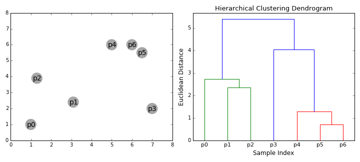

In this checkpoint, you'll explore another approach to clustering. Remember that with the k-means algorithm, you need to specify the number of clusters before you run the algorithm. However, specifying the number of clusters isn't a trivial task; more often than not, you need to experiment with alternatives.

In contrast, in *hierarchical clustering*, you don't specify the cluster number a priori. Instead, hierarchical clustering algorithms work by combining the clusters in a hierarchical manner. So, these algorithms produce different clustering levels in a hierarchy of increasing k-values, and you choose the best one according to your needs.

The visualization below demonstrates how hierarchical clustering combines data points to produce clusters. The algorithm uses a bottom-up approach; it first combines single observations one by one, and then combines the smaller clusters into bigger ones.



Next, you'll learn how hierarchical clustering is defined. Then you'll explore two methods for building cluster hierarchies.

<jupyter notebook-name="4.hierarchical_clustering" course-code="DSBC"></jupyter>

For a screencast demo of the techniques covered here, check out the below video.


<iframe id="kaltura_player_1604765923" src="https://cdnapisec.kaltura.com/p/2315191/sp/231519100/embedIframeJs/uiconf_id/45331192/partner_id/2315191?iframeembed=true&playerId=kaltura_player_1604765923&entry_id=1_lr42zq38" width="100%" height="500" allowfullscreen webkitallowfullscreen mozAllowFullScreen allow="autoplay *; fullscreen *; encrypted-media *" frameborder="0"></iframe>

## Assignment

In this assignment, you'll continue working with the [*heart disease* dataset](http://archive.ics.uci.edu/ml/datasets/Heart+Disease) from the UC Irvine Machine Learning Repository.

Load the dataset from Thinkful's database. To connect to the database, use these credentials:

```
postgres_user = 'dsbc_student'
postgres_pw = '7*.8G9QH21'
postgres_host = '142.93.121.174'
postgres_port = '5432'
postgres_db = 'heartdisease'
```

The dataset needs some preprocessing. So, before working with the dataset, apply the following code:

```python
# Define the features and the outcome
X = heartdisease_df.iloc[:, :13]
y = heartdisease_df.iloc[:, 13]

# Replace missing values (marked by `?`) with a `0`
X = X.replace(to_replace='?', value=0)

# Binarize y so that `1` means heart disease diagnosis and `0` means no diagnosis
y = np.where(y > 0, 1, 0)
```
Here, `X` will represent your features and `y` will hold the labels. If `y` is equal to `1`, that indicates that the corresponding patient has heart disease. And if `y` is equal to `0`, then the patient doesn't have heart disease.

To complete this assignment, submit a link to a Jupyter Notebook containing your solutions to the following tasks below. You can also take a look at these [example solutions](https://github.com/Thinkful-Ed/data-201-resources/blob/master/clustering_module_solutions/4.solution_hierarchical_clustering.ipynb).

1. Produce dendrograms for the *heart disease* dataset. Use three different linkage methods: `complete`, `average`, and `ward`. Which linkage method do you think produces the most reasonable result?
2. Apply agglomerative clustering to the *heart disease* data by setting `n_clusters=2`. Try the three linkage methods above, and get ARI and silhouette scores for each of your solutions. Compare the results with each other. Then compare the results with the results from the k-means solution that you implemented in the previous checkpoint's assignment. Which algorithm and setting perform better?
