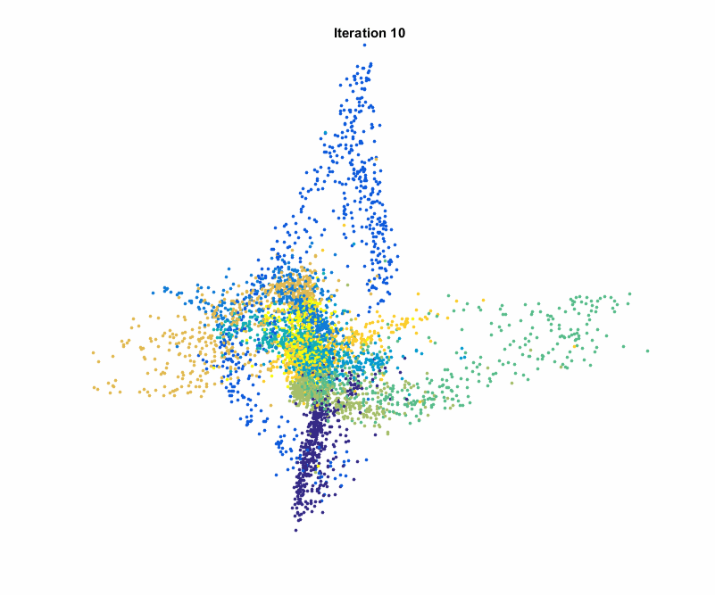

In the previous checkpoint, you saw that PCA is an easy-to-use and useful dimensionality reduction algorithm that preserves dissimilarities in the data. However, PCA is relatively weak in retaining the local similarities in the low-dimensional representation. In this checkpoint, you'll learn about another algorithm: *t-distributed stochastic neighbor embedding* (t-SNE). This algorithm is very effective, especially in preserving the local similarities in the data.

PCA is a relatively old method that was discovered in 1933. In contrast, t-SNE is a very recent algorithm; it was proposed by Laurens van der Maaten and Geoffrey Hinton (one of the pioneers of artificial intelligence and deep learning) in 2008. As you'll see in this checkpoint, t-SNE is an iterative algorithm; after a sufficient number of iterations, it produces lower-dimensional representations. This is visualized in the animation below:

<jupyter notebook-name="8.t_sne" course-code="DSBC"></jupyter>

For a screencast demo of the techniques covered here, check out the below video.

<iframe id="kaltura_player_1604766159" src="https://cdnapisec.kaltura.com/p/2315191/sp/231519100/embedIframeJs/uiconf_id/45331192/partner_id/2315191?iframeembed=true&playerId=kaltura_player_1604766159&entry_id=1_gr4b54ju" width="100%" height="500" allowfullscreen webkitallowfullscreen mozAllowFullScreen allow="autoplay *; fullscreen *; encrypted-media *" frameborder="0"></iframe>

## Assignment

In this assignment, you'll continue working with the [*fashion MNIST* dataset](https://github.com/zalandoresearch/fashion-mnist). For the sake of comparability, use the same 10,0000-observation sample that you used in the previous checkpoint. To complete this assignment, submit a link to a Jupyter Notebook containing your solutions to the tasks outlined below. You can also take a look at [these example solutions](https://github.com/Thinkful-Ed/data-201-resources/blob/master/clustering_module_solutions/8.solution_t_sne.ipynb).

1. Load the dataset and conduct any necessary preprocessing, such as normalizing the data.
2. Apply t-SNE to the data by setting `n_components=2`.
3. Using the two-dimensional t-SNE representation, draw a graph of the data by coloring and labeling the data points as you did in the checkpoint.
4. Do you think that the t-SNE solution is satisfactory? Can you easily distinguish between the different classes? Which algorithm produced better results, t-SNE or the PCA that you applied in the previous checkpoint's assignment?
5. Now, play with the different `perplexity` values and apply t-SNE for each of them. Which perplexity value is best in terms of the two-dimensional representation clarity?
