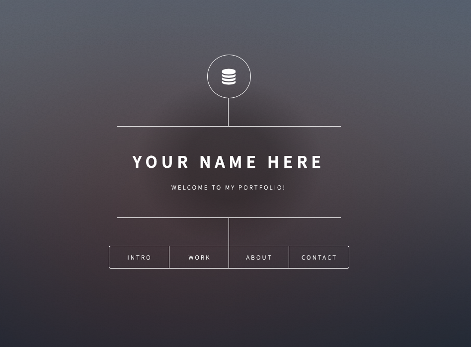

Now that you've created some amazing projects, it's time to show them off! Creating an online portfolio will give you the opportunity to highlight and showcase your talents, projects, and skills to recruiters and hiring managers. The earlier that you attract the attention of potential employers, the better!

## Using GitHub pages to host your portfolio

GitHub is a popular platform that developers use to share and collaborate on coding projects. We'll be using the GitHub Pages service, which allows users to host static websites. In this checkpoint, we'll show you how to create and publish your professional portfolio site on GitHub Pages.

### Download a website template

We've provided a high-quality and easy-to-use template [here](https://tf-assets-prod.s3.amazonaws.com/tf-curric/data-science/html5up-dimension.7.10.19.zip) to make creating your portfolio as frictionless as possible. 

Once you download the file, make sure to unzip it.

### Create a new repository in GitHub

Visit [this link to create a new repo on GitHub](https://github.com/new). For the repository name, put yourusername.github.io. For instance, if your GitHub username were Foo, the new repo name would be foo.github.io. Be sure to add a short description, such as "My portfolio website." Make sure to check the "Public" option, and double-check that the "Initialize this repository with a README" option is _not_ checked. Then, click the "Create repository" button.

After creating the repo, you'll be taken to the next page. Here, you'll see an option to "upload an existing file" as a blue link. Click on this link. Then, drag and drop all the files from the template folder in the place where it says "Drag files here to add them to your repository." Do not simply drag the entire folder itself. You'll need to grab the individual assets folder, images folder, index, license, and readme files from within the umbrella folder.

Once you've done that, scroll to the bottom of the page and click the green "Commit changes" button. The screen will then show that GitHub is processing your files, which might take a few minutes to complete.

## Using the GitHub web interface to alter the template

Once the upload is complete, you'll need to tailor the template to reflect your specific information. You'll need to make the changes in the GitHub interface.

## Edit the template

Double-click on the index.html file. Then, click on the pen icon to edit the text. You can search the index.html file for specific wording, and then replace it with your own information.

### Replace me please

Now, you'll customize it! Follow the instructions below, which correspond with the screencast above.

1. Search for "PUT YOUR NAME HERE." in the title tag. Replace that phrase with your name.
2. Search for "YOUR NAME HERE." Replace that phrase with your name.
3. Search for "INTRO ABOUT WHAT YOU HAVE DONE IN DATA SCIENCE." Replace that phrase with a few sentences in your own words about what you've learned in the Data Science program.
4. Search for "DESCRIBE PROJECT." Replace that phrase with 1 or 2 brief sentences about your project.   
  
    *But which projects?* It's still early in the program, and you've already got some great wares to show. Make sure to include these assets:   
    - First capstone
    - SQL Colab work
    - Experimental design work
  
    Later on in the course, other assets you will want to include are:  
    
    - Supervised learning capstone
    - Unsupervised learning capstone
    - Final capstone
  
5. Next to "DESCRIBE PROJECT," you'll find a place to put in the URL of your project. (If you don't see it, you can search for it by looking for the "putlinkhere" phrase.) You can use a [Google Drive link](https://support.google.com/drive/answer/2494822?hl=en&ref_topic=7000947) that you've created for your project. Make the Google Drive file publicly accessible and able to be viewed by anyone with the link. 
6. Next to the URL, you'll find a place to title your project: "PROJECT NAME 1." Make sure to change this to the title of your project.
7. You'll find 3 of these for 3 projects. Make sure you change all of them! You can also copy and paste another line, `
DESCRIBE PROJECT <a href="putlinkhere">PROJECT NAME 4</a>
`, as you create more projects. Just make sure you update the information!
8. Search for "PUT INFO ABOUT YOU HERE." Replace this phrase with information about yourself that you want to share.
9. Finally, search for "LINKEDIN URL HERE," and "GITHUB URL HERE." Replace them with your LinkedIn, and GitHub profile URL links.
10. To save, go to the bottom of the webpage and click on the green Commit Changes button. Leave the "Commit directly to the master branch" selected. 

## Check it out!

Now, you can click on the settings button within GitHub and scroll down to where it says GitHub Pages. You should see a green bar that says where your site is published. Click on the link to visit it. Note that it may take up to 15 minutes before you can see the actual site.

## Using a custom domain with GitHub Pages

If you want to look extra professional, you can purchase your own [domain name](https://www.namesilo.com/) at any number of websites. Then, you can use that [custom domain with your GitHub pages site](https://help.github.com/en/articles/using-a-custom-domain-with-github-pages).

## Assignment

This is not a graded assignment. Submit a link to your newly created portfolio in the box below below, making sure that:

1. Your portfolio is viewable, and displays correctly.
2. You have filled out all of the sections in "Replace me please".
3. There are no typos.
4. What you have written about yourself and your experience in the program would draw positive attention from potential employers.
