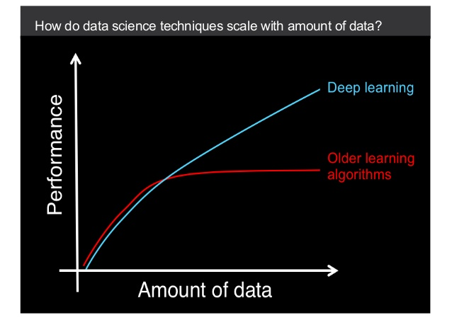

In the previous modules of this program, you learned various machine-learning algorithms. Machine learning resides at the heart of data science, and advances in machine learning foster the discipline's development. Some methods, like linear and logistic regressions, have been around for many decades. And others, like random forest, support vector machines, and various boosting approaches, have been known since the 1980s.

However, the last decade witnessed a revolution in machine learning. That revolution is commonly called the *deep-learning revolution*. Deep learning as a subfield of machine learning has achieved enormous success in tasks such as computer vision, object detection, image classification, machine translation, speech recognition, and more. Based on building very large models that have millions (even billions) of parameters by stacking layers over layers, deep-learning models have even surpassed human-level performances in some areas. That being said, the ideas and the methodologies that paved the way for this revolution have their roots in the 1980s and the 1990s.

What is it that makes deep-learning models achieve astonishing successes? The key reasons are as follows:

1. **The sheer amount of data** that's available. To perform well, deep-learning models require a lot of data to train on. The worldwide spread of internet and exponential increases in data generation are among the main reasons behind the successes of deep-learning models. Researchers discovered that if deep-learning models are trained on sufficient amounts of data, then they can achieve astounding results in some tasks. However, without enough computational resources, training these models would take very long. 
2. **The increased computational capacity** of today's computers helped researchers to overcome the long durations of training deep-learning models. Hence, many experimental studies culminated in the idea that deep-learning models can achieve great performance if they are trained on enough data.

In this module, you'll be introduced to the fundamentals of deep learning. You'll focus on the following:

* What artificial neural networks are and their basic structures
* What the TensorFlow library is, along with its high-level API, Keras. These libraries are essential when working with deep-learning models.
* What activation functions and loss functions are
* How to train deep artificial neural networks

Before moving on further, consider the difference between *deep models* and *shallow models*.

## What does *deep* mean?

Artificial networks are the essence of deep-learning models, and the terms *artificial neural networks*, *deep-learning models*, and *deep neural networks* can be used interchangeably. But to understand deep learning, it's important to know where the term *deep* comes from. The term also implies the existence of some *shallow* models.

You can think of a deep-learning model as a machine-learning model that is composed of more than one layer. You'll learn about the layers in the next checkpoint—but for now, you can think of a layer as a mathematical block that takes some features as inputs, and then outputs another set of features by mathematically transforming the inputs. Probably the layer that is the easiest to understand is the linear regression. Linear regression takes inputs and then outputs a single value. A more complex layer can be constructed by putting *N* number of linear regressions near each other, so that when they are given *M* number of features, they output *N* new features by transforming their inputs.

As mentioned above, a deep-learning model is a model that consists of more than one layer. However, the layers should be organized such that the output of a previous layer would be the input of the next layer. In this respect, a deep-learning model is different from just ensembling several models together. The serial processing of the input, layer by layer, is a novel feature of deep-learning models. In contrast, *shallow models*—like linear regression, SVM, or random forest—are those that have only a single layer. The figure below sketches what a deep-learning model looks like:

## What makes deep-learning models so successful?

Now, briefly consider what makes deep-learning models special in some tasks. The key insight is that the layered structure of deep-learning models enables them to discover complex patterns, layer by layer. That's to say, in the first layer, the primitive patterns are discovered. In the second layer, more complex patterns that are the combinations of the previously discovered primitive patterns are discovered. Similarly, a subsequent layer discovers the useful combinations of the previous layer's discoveries, and so on.

This insight leads you to a slightly different type of feature engineering. Remember that the feature-engineering step is one of the most crucial phases of a data science pipeline; in all the models that you built throughout this program, you made a careful analysis of feature engineering. However, some very complex data types, like images, audio, or text, are so complex that manually artifacting all the useful features is almost impossible. One of the crucial discoveries of the last decade is the fact that deep-learning models are very successful at discovering useful features from complex data, such as image, video, and text. Hence, the magic of these models is their feature-engineering capabilities. And to some extent, these capabilities free researchers from the difficult task of devising useful features from very complex data. This is known as *representation learning*.

## When should you use deep-learning models?

To benefit most from the capabilities of deep-learning models, you'll need to have a good idea of when to use deep-learning models and when to use classical machine-learning models. When you're deciding if you should use a deep-learning model, keep the following points in mind:

1. Deep-learning models are data hungry, and they perform well if they are trained on large amounts of data. The following figure gives an idea of how classical machine-learning models and deep-learning models scale with the amount of data.

2. The magic of deep-learning models is in their ability to discover complex patterns in the data. If your data lends itself well to manual feature engineering, then you should go with classical machine-learning models. However, if you work on very complex types of data, like image, video, speech, or text, then you should give deep-learning models a try.

3. Large deep-learning models that have many parameters to estimate require a lot of computational power and time. That's why people usually train them on graphical processing units (GPUs) instead of CPUs. If using GPUs is not possible for you, then you should go with classical machine-learning models.

For a visual overview of how deep learning works, check out the below video.

<iframe id="kaltura_player_1604701688" src="https://cdnapisec.kaltura.com/p/2315191/sp/231519100/embedIframeJs/uiconf_id/45331192/partner_id/2315191?iframeembed=true&playerId=kaltura_player_1604701688&entry_id=1_xjhz6g2d" width="100%" height="500" allowfullscreen webkitallowfullscreen mozAllowFullScreen allow="autoplay *; fullscreen *; encrypted-media *" frameborder="0"></iframe>

# The remainder of this module

In this checkpoint, you got a high-level introduction to what deep learning is and why it's useful. Next, you'll start learning about the fundamental architecture of deep-learning models, starting with the multilayer perceptron. Then, you'll learn about a very popular library for implementing neural networks: TensorFlow. After this, you'll continue to explore the foundational blocks of neural networks, like activation and loss functions, gradient descent algorithm, and backpropagation. Then you'll end the module with a challenge where you'll build your own deep-learning model.

Continue on to get started!
