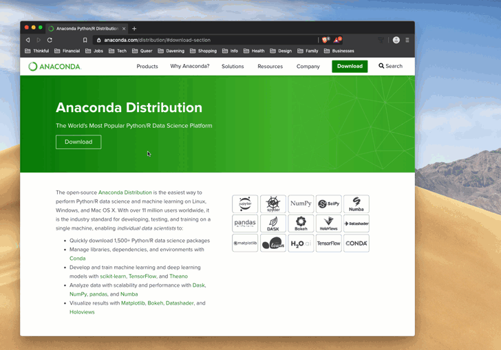

So far you've been working with Google Colab, a web-hosted Jupyter notebook where the Python code you write is sent to another machine, executed remotely, and the results are sent back to your web browser.

In this checkpoint, we'll set up your local development environment with an up-to-date installation of Anaconda. Below are instructions for installing on Mac, Linux/Unix, and Windows systems. 

### Installing Anaconda

Anaconda is a platform to perform Python data science and machine learning on Mac OS X, Windows and Linux systems. It helps to quickly download specific data science python libraries that we will be working with, such as Jupyter, NumPy, pandas, matplotlib, and many more. All of the libraries that we will be using come pre-installed in Anaconda.

[Install](https://www.anaconda.com/distribution/) Anaconda by clicking on the download button. You will see options for Windows, Linux, and Mac OS X platforms. Download the "Python 3.7+ version." 

We can start up Anaconda by searching for it in your computer as "Anaconda Navigator."

Once it launches click on Jupyter Notebook. Create a folder in the Navigator by clicking New folder in the top right-hand corner. Rename it something like "Thinkful Data Science Projects." This is the folder where you will be storing all of your Jupyter Notebooks for the time being. After creating the folder, create a new Python 3 Jupyter Notebook file as a test. 

If for any reason you are having difficulty with installations seek out [group sessions](https://www.thinkful.com/open-sessions/qa-sessions/), [Slack](https://thinkful.slack.com/messages/data-science/), and technical coaches for help.

Congratulations on getting this all set up. Let's start using this stuff!
