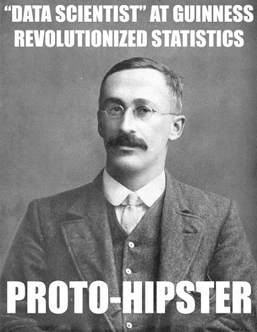
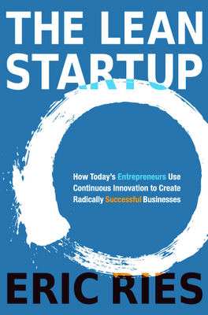

In the previous checkpoint, you walked through the process of analyzing two samples of data using a t-test. Often, as a researcher, you don't just analyze the data—you design, collect, and interpret the entire scientific process. 

This checkpoint serves as an overview of how science is used in business—and, after all, you'll be a data *scientist*! The following checkpoint provides concrete steps for business research design. 

## The scientific method in business

Did you know that 90% of organizations claim to be data driven?

Did you also know that 73.6% of statistics are made up on the spot?

Contrived or not, that first statistic *sounds* right. What organization doesn't want to be data driven? The problem, of course, is that not all data is worth, well, being driven by. A dataset might not be entirely made up, but it can be riddled with faults and inaccuracies. 

That's why a better term for data-driven might be *research*-driven. So how can you become research driven and deliver crisp, uncontaminated insights based on data? 

The same way that Isaac Newton and Marie Curie did—through the scientific method. 

## The history of science in business

It's easy to get carried away about the revolutionary practice of applying the scientific method to business. But actually, one of the fundamental concepts that you've explored in this program was developed over 100 years ago, by someone who might today be considered a data scientist at a brewery—a real hipster, right?

This data scientist, William Sealy Gosset, was a statistician at Guinness. For proprietary reasons, Guinness asked him to publish under a pseudonym. Under the pseudonym *Student*, Gosset developed the *Student's t-test*—which you know by the shorter name *t-test*.

Another statistics luminary of the twentieth century, Ronald Fisher, was a biologist who began experimenting on the effect of certain fertilizers on crop yields. 

So, applying rigorous scientific and statistical thinking to business isn't a new concept, after all. What *has* changed is the scope of the domain under which it operates.

## The lean startup and modern scientific management

The first uses of science in business were mostly in domains like agriculture or manufacturing, where it is easier to control the settings of an experiment. After a while, the process was expanded to running clinical trials in medicine. (For example, what happens if researchers give a drug to Group A and not to Group B?)

Advertisers were somewhat successful with similar techniques, using direct-mail campaigns to examine the conversion rates of different postcards or letters. However, consumer behavior was too complex for experimentation, leading to such hand-wringing expressions as this quote from retailer John Wanamaker:

> "Half the money I spend on advertising is wasted; the trouble is I don't know which half." —John Wanamaker

So, data-driven techniques like Lean Six Sigma were respected business practices, but it was mostly limited to operations like minimizing product defects or keeping inventory at optimal levels. These techniques were certainly no way to start and run an entire business—right?

Partly prompted by changes in technology, a *lean startup methodology* took root; this approach aimed to introduce research-driven techniques into the core of a company's business model. The topic became widely popular from the 2011 [book of the same name](https://en.wikipedia.org/wiki/The_Lean_Startup). 

So what changed? Although businesses had been using data effectively for well over a century, it used to be much harder to get reliable data about consumer behavior. But post-internet, this was a much more realistic prospect. Lean startup methodologies accounted for the reality that businesses could now experiment on a far wider-ranging scope of topics.

## Build-measure-learn feedback cycles

At the core of the lean startup methodology is the build-measure-learn feedback cycle. In this cycle, organizations quickly bring ideas to market so that they can measure their effect, learn from the experiment, and reintegrate that into their products. This iterative process is visualized below in this graphic from KissMetrics:

Does this process remind you of something? It seems a *lot* like the scientific method, where researchers build hypotheses, measure tests, and learn from their findings. 

A precise way of running experiments is *A/B testing*, [described by Wikipedia](https://en.wikipedia.org/wiki/A/B_testing) as "a way to compare two versions of a single variable, typically by testing a subject's response to variant A against variant B, and determining which of the two variants is more effective."

That definition is kind of jargony, so here are some fascinating [real-life examples of A/B tests](https://www.designforfounders.com/ab-testing-examples/). This technique is used in all sorts of industries, for all sorts of objectives. As in the above examples, you will focus on e-commerce applications in this checkpoint. 

## The ABCs of A/B testing

[There are lots of different possible experimental designs](https://cirt.gcu.edu/research/developmentresources/research_ready/experimental/design_types), but *A/B testing* is probably the most common in business and the one that you are most likely to encounter. A/B testing is a technique used to identify whether one version of an object of interest (such as a product, marketing campaign, or email text) is better at producing the desired outcome than another version.

The components of an A/B test are as follows:

- **Two versions** of something whose effects will be compared. Typically one version is a *control* version; this version is often already in use and represents what would happen given no intervention. The other version, the *test* version, has some changes from the control; those changes are often called the *treatment*. If you're starting from scratch, however, you may have two different test versions to compare to each other.

- **A sample** divided into two groups. Each sample should be selected so that it is similar to the population you want to understand. The groups should be similar to one another so that any differences between them can be attributed to seeing version A or version B and not something else. You also want the split between A and B to be as random as possible.

- **A hypothesis** that articulates what you expect to happen. For example, your hypothesis might be, "I expect that the HTML email will achieve a higher open and conversion rate than the plain-text email."

- **An outcome (or outcomes) of interest** and specific descriptions of what you expect will change as a result of using version A or version B, and how you will measure that change. This means that you have to decide on a *key metric*, which should capture the effect of your change and reflect the motivations for the test in the first place.

- **Other measured variables** including information about the two groups that can be used to ensure that they are similar, as well as secondary outcomes that are less important than the primary outcomes of interest but which might *also* change in response to using version A or version B.

## Getting a good sample

As mentioned above, one of the key elements of an A/B test is the sample. Particularly important when it comes to actually designing your own experiment is making sure that the two groups, group A and group B, are as comparable as possible. The only difference should be the treatment that they receive.

If you have a constantly occurring test, where the thing that you're interested in measuring is happening all the time in easily separable occurrences, this is pretty straightforward. Marketing emails, for example, are usually like this. Thousands of emails are being sent out all the time, and you can easily randomize between A and B.

However, plenty of things can make this more complex. The most common challenge is a test that either has to be "all on" or "all off". This could be something like testing whether playing music in a shop makes people stay longer. You can't really create conditions where some people in a shop hear the music and others don't.

In that case, getting to randomization becomes an art form. You want to think about things like seasonality—making sure that there is no difference in your two groups because of the day of the week or the time of the year. Perhaps behavior is just different on weekends, at nights, or in the summer.

## Keys to key metrics

The other major sticking point is picking what you want to measure: your outcome. You can and should monitor many metrics during most tests—but you typically want to have one *key* metric that will be your determining factor for whether a test is successful or not.

There are several things that make a good key metric. First, you want it to be as closely related to your business goal as possible. For example, measuring clicks is good, but only if you'd rather measure the difference between actual sales versus just looking. Just because people engage doesn't mean that they'll follow through. This helps prevent getting a result that just affects an intermediate step without improving the actual goal. 

You also want your key metric to be reliably measurable. It seems obvious, but many experiments are ruined by measurement error. Ideally, this means something that is passively recorded, rather than requiring additional engagement from subjects or users. You also generally want to avoid self-reported data, because that invites its own host of potential biases.

As much as possible, you also want to capture the complete effect of your change. Sometimes, this may mean that time becomes important. Maybe an email campaign doesn't lead to an immediate increase in sign-ups, but customers convert later. Trying to include a window of impact that's both reasonable and consistent across all observations is a valuable characteristic for your metric.

## This is a test

Now, go through an example. If you were trying to improve the clickthrough rate of an email campaign, you might test two newsletters, one with *black italic text* and one with **bold green text** and an exclamation point ("*Sale Today*" versus "**Sale Today!**").

You would then randomly send one of the two versions of the email to a subset of subscribers to your newsletter. In this case, all subscribers who get an email represent your sample, and all subscribers who get the same version of an email represent one of your two experimental groups. Then, you would track the number of clicks that each version generated; this is your outcome of interest.

You expect that the bold green text will result in more clicks; this is your hypothesis. To make sure that the groups are similar, you may also want to look at the gender and age of your sample, if you have that information. You can also look at whether the two different newsletters affect how quickly people open the email after receiving it—a secondary outcome—as well as the click rate.

If the two groups appeared similar in age, gender, and anything else that you measured, but click rates were higher for the green bold text version of the newsletter, you would conclude that changing the text to be bold and green caused more clickthroughs. As a result, you would advocate for including green bold text in all future newsletters.

## Recap: A/B testing

For a recap of the concepts covered here, check out the below video.

<iframe id="kaltura_player_1604699019" src="https://cdnapisec.kaltura.com/p/2315191/sp/231519100/embedIframeJs/uiconf_id/45331192/partner_id/2315191?iframeembed=true&playerId=kaltura_player_1604699019&entry_id=1_t43j7ixe" width="100%" height="500" allowfullscreen webkitallowfullscreen mozAllowFullScreen allow="autoplay *; fullscreen *; encrypted-media *" frameborder="0"></iframe>
