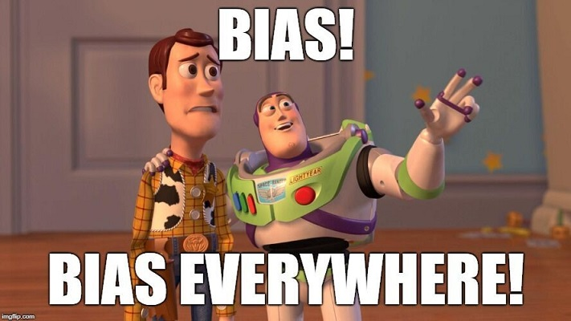
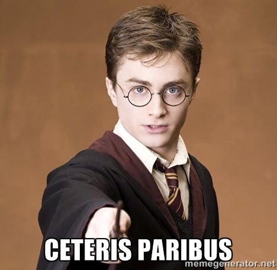

The previous checkpoint covered some big-picture concepts behind A/B testing. And the checkpoint before that equipped you with concepts needed to infer differences about two population means, given their samples.

This checkpoint is all about considering how these elegant ideas play out in the day-to-day grind as a data scientist. Clean data does not grow on trees! A successful A/B test requires careful planning in data gathering and preparation.

This checkpoint provides an overview of that process, starting from the all-important *ceteris paribus* assumption. You'll learn about assigning subjects to control and treatment groups, and you'll explore concepts related to sample size and duration. Once that is all accounted for, you will move on to the actual analysis of the data in the next checkpoint. 

## Eliminating bias

Perhaps the single greatest obstacle in conducting data analysis is the elimination of bias. In statistics, something is [biased](https://en.wikipedia.org/wiki/Bias_(statistics)) "if it is calculated in such a way that it is systematically different from the population parameter being estimated." 

Uh-oh! Isn't the whole point of inferential statistics to be able to infer some parameter from a population, given its sample? It turns out that there are many factors that can lead to a biased sample. The most notorious sources of bias come from who to sample, how many to sample, and for how long.

## Data scientists are control freaks!

The heart of A/B testing lies in the assumption of *ceteris paribus* (Latin for "all other things being held equal"), which is basically the incantation of the social sciences.

The fundamental trait of variables is that they vary. But what if you *control*, or hold equal, every variable but one, to see what effect that variable has on something?

That's what you are doing in A/B testing. For example, you might isolate everything about a web page except for a single element: the color of a button, or the font of a banner. Then you ask, "All other things being held equal, which color (or font) led to a better clickthrough conversion, or lower bounce rate, or [insert your metric here]?"

That first variable that you are manipulating is called the *independent variable*. And that second variable, which you want to find the effect on, is the *dependent variable*. 

## Two samples that are equal in almost every way

Remember that to eliminate bias, you need to ensure that each sample is reflective of the population. So if sample A is reflective of the population, and sample B is reflective of the population, then sample A and sample B should be pretty similar to each other (again, with the exception of the independent variable).

Imagine that your email sign-up button is currently blue, and you think that changing it to black will result in a higher conversion rate. To compare the effect of this change on the conversion rate, you will measure from two samples. 

As you learned in the previous checkpoint, the first group is called the *control* group. This is the group operating under the status quo, which in this case is the blue button. Your second group is called the *treatment* group. This is the group assigned to the treatment that you are testing the effect of—that is, the black button and whether it will lead to a higher conversion rate.

Both samples should be reflective of the overall population that you are trying to study. So, what population *are* you interested in? Perhaps you are only interested in getting those users who have already made a purchase or upgrade to sign up for a rewards club. In this case, your population would be users who have made a purchase—*not* all users who are visiting the site.

Regardless of your population, you must control for other variables that could bias the difference in the samples. Imagine, for example, that in this proposed A/B test, you will leave the button black until 12 PM. Then you will change it to blue from 12 PM to 4 PM, and you'll revert it to black after that. What is the problem with this? It's likely that conversion rates vary during different times of the day—so if that is the case, then your sampling will be biased between groups. For example, if conversion rates decrease during the day, then any effect that you find might be attributable to that rather than to the button size. 

This is why it's important to sample the two groups at random. You need to make sure that any difference that you find between the samples can't be attributed to anything other than the variable under investigation. There are many potential sources of bias; you'll learn about some of the most common below.

These variables that you must control from contaminating this relationship are called *control variables*. These could be anything from the time of the day, to the gender of the user, to the browser that is used. Again, your domain expertise is your guide to identifying and addressing these control variables. You must make sure that neither group is skewed toward one of these variables in a way that will influence the results of the A/B test. 

## A/B tests: What could possibly go wrong?

A/B testing is chock-full of potential fallacies and conundrums. Below are two common pitfalls to be aware of.

### Bias

In experiments, *bias* refers to anything that causes a sample to systematically differ from the population. Bias can come from the sampling procedure, the assignment to conditions procedure, the context of the study, or the people running the study.

*Sampling bias* (or *selection bias*) is when a sample differs from the population in some way; for example, perhaps the sample has more women, skews either younger or richer, or has more outgoing people. As a result, conclusions based on that sample may not apply to the population. Selection bias can be avoided by choosing the sample randomly from the population.

*Bias in assignment to conditions* is similar to selection bias because it also represents a failure of randomness. In this case, the sample is supposed to be separated into groups that are similar to one another. The groups then each experience one of the study conditions. If the groups are the same before they go into the study, then any differences between the groups during the study must be due to the differences that you introduce as part of the experiment. This ensures that you can conclude that people in the population will react similarly to your experimental stimuli.

For example, imagine that you are comparing the effect of sprinkles on liking ice cream. One group is given ice cream with sprinkles, and one is given plain ice cream. Both groups rate how much they like the ice cream, and it turns out that the ice cream with sprinkles was liked more. If the groups are similar, then you can conclude that sprinkles *cause* people to like ice cream more. If the groups are different—for example, if the sprinkles group had an average age of 13, and the plain group had an average age of 30—then it isn't clear whether sprinkles cause liking, or whether younger people just like ice cream more. Conclusions about the effect of sprinkles on ice cream are biased by the difference in ages of the groups.

Bias can also come from the study *context*, or setting. Imagine that you have a great sample that is very similar to the population, and you divide them into two groups, called group 1 and group 2, who are very similar to one another. Then you separate the groups into two rooms and ask them to read and rate some ads for sodas. You are interested in how small differences between the ads seen by the two groups will affect members' reactions when they leave the rooms and then are offered a soda. To your surprise, members of group 1 overwhelmingly thank you for the soda and drink up immediately, while only half of group 2 accepts the soda. You conclude that the ads for group 1 must be better. Unfortunately, what you don't know is that the heater was broken in group 1's room, and the temperature was 90 degrees. This contextual factor biased your results. Not all sources of *contextual bias* are this obvious, but it underscores the importance of matching the setting for all experimental groups.

Finally, bias can come from the people running the study. This is a broad category, running the gamut from subtle signs to blatant interference. For example, during an interview, perhaps an interviewer smiles when the participants give answers that she likes, and frowns otherwise. Or perhaps an interviewer doesn't record answers that clash with the desired conclusion. *Observer bias* is tough to eliminate. The best way to avoid it is to make sure that the people who interact with study participants don't expect a particular result.

#### Checking for bias with A/A testing

Of these sources of bias, all but selection bias may be detectable using A/A testing.

*A/A testing* provides context for the results of A/B testing. As the name suggests, A/A testing means comparing the outcome of choice between two identical versions of something. This might seem rather silly—after all, if you divide all newsletter subscribers into two groups but send both groups the same email, you would expect that clickthrough rates for both groups would be identical. In practice, however, that doesn't always happen.

Why is this useful? A/A testing can identify problems with the following:

- **The testing method:** Perhaps all version 1 emails were accidentally set to go out in the morning when people are at work, while all version 2 emails go out in the evening when people have more leisure time to shop.  
- **The random split method:** Maybe the mailing list is arranged chronologically by date subscribed, and version 2 was sent to the first half of the list: the long-term customers who are more likely to click.  
- **The size of the sample:** The rarer the outcome, the bigger the sample is needed to get an accurate estimate of the response rate.  
- **Any other outside factors** that can affect the outcome of a test. 

In addition, if there are no bugs or problems, the size of the difference between groups in an A/A test can be used to define a threshold for subsequent A/B testing. That is, between-group differences that are smaller than the difference observed in the A/A test can be assumed to be due to chance.

### Simpson's paradox

How can you find one trend in mutually exclusive segments of the data, but *another* trend—even a *conflicting* trend—when you look at the combined dataset? This is a classic head-scratcher in statistical reasoning, and it's particularly relevant to A/B testing.

Imagine that you're analyzing gender differences in a university's admissions rate for graduate programs. You compute the proportion of successful female applicants and compare it to the proportion of successful male applicants, and you get the following numbers:

|       | **Applicants** | **Admitted** |
| ----- | -------------- | ------------ |
| Men   | 8,442          | 44%          |
| Women | 4,321          | 35%          |

Overall, women are less likely to be admitted to graduate programs at that university than men. Intrigued, you dig deeper and compute the proportion of successful applicants of each gender for each graduate program separately. Then you get the following numbers. (The higher percentage for each department is bolded.)

| **Department** | **Male applicants** | **Male admitted** | **Female applicants** | **Female admitted** |
| -------------- | ------------------- | ----------------- | --------------------- | ------------------- |
| A              | 825                 | 62%               | 108                   | **82%**             |
| B              | 560                 | 63%               | 25                    | **68%**             |
| C              | 325                 | **37%**           | 593                   | 34%                 |
| D              | 417                 | 33%               | 375                   | **35%**             |
| E              | 191                 | **28%**           | 393                   | 24%                 |
| F              | 373                 | 6%                | 341                   | **7%**              |

When broken down by department, women appear to have the same or a slightly better chance of being admitted than men—exactly the opposite of what you observed above. At this point, you may start checking your code for errors, but there's no need. This data, drawn from evidence presented in a [1975 article about gender bias in Berkeley graduate admissions](http://homepage.stat.uiowa.edu/~mbognar/1030/Bickel-Berkeley.pdf), is a classic example of Simpson's paradox.

*Simpson's paradox* is the phenomenon when an average over several groups shows one trend, but an average for each individual group shows the opposite trend or no trend. Another name for Simpson's paradox is the *lurking variable problem*, where an unaccounted-for third variable changes the relationship between two other variables.

In the case of Berkeley, the third variable is the total number of men and women who applied to each program. Looking at the numbers above, many more men than women applied to programs A and B, which had high admittance rates. Women were more likely to apply to the programs with low admittance rates. This means that overall, a man had a greater chance of being admitted not because he was a man, but because he was more likely to apply to a program that admitted a high percentage of its applicants.

Another example involves [changes in the median wage](https://economix.blogs.nytimes.com/2013/05/01/can-every-group-be-worse-than-average-yes/?_r=0). From 2000 to 2013, the median wage rose slightly. Yet during the same period, the median wage for every educational group (high school dropouts, high school graduates, college graduates, and so on) went down. The lurking variable here is demographic changes in the United States over that period—a greater proportion of Americans had college degrees in 2013 than in 2000. Since people with college degrees get paid, on average, more than people with only a high school diploma, the overall median wage could rise for the population even as it dropped for each group.

The lesson of Simpson's paradox is this: pay attention to how groups differ from one another before averaging across them. Averaging a small group with a large one, or averaging multiple groups with very different demographics, can produce unexpected or illogical results.

When you're doing A/B testing, hopefully, all your participants will have an equal chance of being assigned to see version A or version B, and both your groups will be equal in size. By using randomization to equalize lurking variables like demographics, you can avoid Simpson's paradox. Because randomization is random, however, there is always the chance that your groups will end up with some lurking difference.

Before interpreting your results, always do what you can to confirm that the groups are similar. Make it a habit to look at subgroups within your A/B test to make sure that the overall trend is reflected in the subgroups. If the subgroups differ from the overall trend, your question should guide whether you report conclusions based on the overall sample, the subgroups, or both. You don't want to advocate for condition A, even if it performs better overall, if condition B actually works better within every subgroup!

For a deep dive into the data underlying Simpson's paradox, check out [this Technical Report from UCLA](http://ftp.cs.ucla.edu/pub/stat_ser/r414.pdf).

## Recap: Statistical bias

For a visual overview of the concept of statistical bias, check out the below video.

<iframe id="kaltura_player_1604699191" src="https://cdnapisec.kaltura.com/p/2315191/sp/231519100/embedIframeJs/uiconf_id/45331192/partner_id/2315191?iframeembed=true&playerId=kaltura_player_1604699191&entry_id=1_ykuyqidv" width="100%" height="500" allowfullscreen webkitallowfullscreen mozAllowFullScreen allow="autoplay *; fullscreen *; encrypted-media *" frameborder="0"></iframe>
