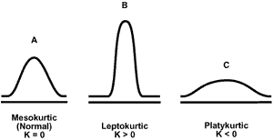
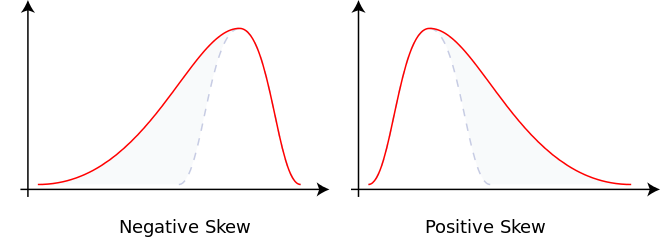
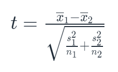
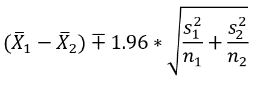
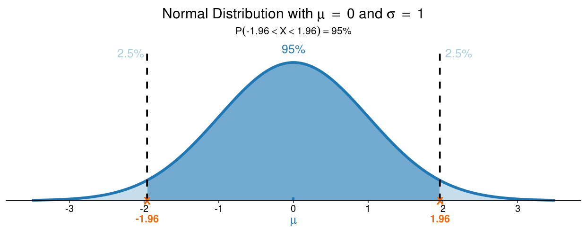
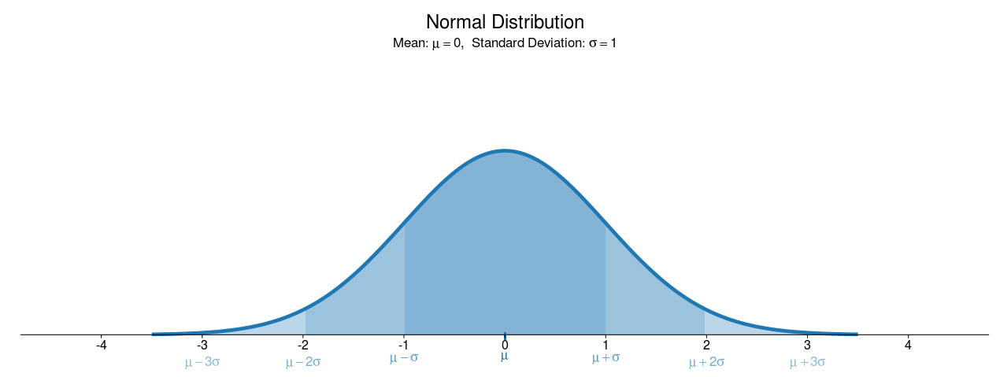
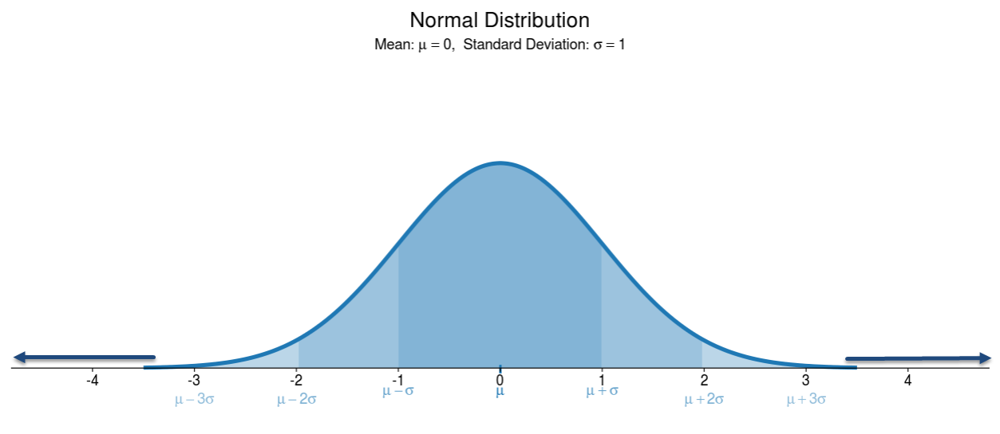
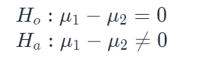

The focus of this module is twofold: it provides a framework for business experiments, and it provides statistics to rigorously examine those results. You will find that even questions that seem basic can get quite sophisticated when answered statistically.

Start with a very simple research question. You are a researcher at a hospital, and you want to know the following:

> Do patients with diabetes have higher glucose levels than patients without diabetes?

As a researcher and data scientist, you want a precise answer to this question. So before you even collect data, you should figure out how you are going to measure "higher." A common way to do this would be to compare the *average* levels between the two groups. You can calculate the average, no problem! The research question is now as follows: 
 
> On average, do patients with diabetes have higher glucose levels than patients without diabetes?

Great. Now make the rounds, get some glucose readings, and answer the question. But wait—not so fast!

As a researcher, one goal of your research is that it is generalizable to the entire *population* of interest, not just to the *sample* of observations that you are measuring. In this case, maybe you only collected the glucose readings of patients who happened to have an appointment this week. You want to know if the average of the *population* of patients is different. So, your research question is now as follows:
 
> On average, does the population of patients with diabetes have higher glucose levels than the population of patients without diabetes, given the samples that have been collected?

You have framed a testable research question to compare the population means of two groups, given a sample of each. Such a research question is relevant in any industry, not just health care. Here are some examples of other testable research questions that you could investigate:

> On average, does the population of products from Plant A have a higher quality rating than the population of products from Plant B, given the samples that have been collected?

> On average, does the population of customers in Region A spend more than the population of customers in Region B, given the samples that have been collected? 

> On average, does the population of homes with air conditioning have a higher sale price than the population of homes without air conditioning, given the samples that have been collected?

Note that a population does not necessarily have to consist of people; it's just the whole group of any category of interest. If your samples meet a few assumptions, you can answer any of these questions using probability. 

This is what's known as *inferential statistics*. This seemingly magical ability to make generalizable claims about a population given a sample is brought to you by the *central limit theorem*. And once you start looking for it, you'll see this theorem everywhere.

## Hypothesis testing

Continuing with the diabetes example, go ahead and proceed with the analysis. You have framed a precise research question. Now, you'll write this question as a set of *hypotheses*: testable propositions made on the limited evidence of what is known so far. 

First, build a *null hypothesis*:   
  
(Translation: The first population mean is equal to the second population mean.)

Opposite that, build an *alternative hypothesis*:   
  
(Translation: The first population mean is not equal to the second population mean.)

In this "math-speak," `µ₁` is the population mean of the first group and `µ₂` is the population mean of the second group. `H₀` and `Hₐ` stand for *null hypothesis* and *alternative hypothesis*, respectively—although "Ho!" and "Ha!" are far more entertaining descriptives. 

## Inferential statistics: Stick to the status quo

Often, research is conducted for the purpose of providing evidence of a quantifiable difference between groups. But the default setting is that the means are the same, and the burden is on you to demonstrate a difference. Why this counterintuitive phrasing? 

In research, there is a constant temptation to "prove" that you are right. (Wouldn't you rather tell your boss you succeeded rather than failed?) But what's the point of "successful" research that is fundamentally flawed? By setting the status quo as the null hypothesis, you place one more roadblock in the way of simply taking your hypothesis as a given truth and reverse-engineering the results. 

## Introducing the independent-samples t-test

Fortunately, you are not the first researcher ever to have wanted to test for a significant difference in population means given two sample means. In fact, there's a statistical test designed to do just that: the *independent-samples t-test*. You can use this test to potentially falsify your null hypothesis. When that happens, it is said that you "reject the null."

### Assumptions of the t-test

First, you need to confirm that your data meets the requirements of the t-test. Again, "terms and conditions apply" is something that you can rely on in inferential statistics. Your data must meet the following assumptions:

1. The *test variable*, which is the variable that you are comparing averages for, is continuous. 
2. There is no relationship between items. In other words, the measurement of one observation does not affect the measurement of another.  
3. The sample is drawn at random from the population. In the next checkpoint, you will get into *how* to randomly sample; for now, just assume that the sample has been drawn at random. 
4. The test variable's samples and population are approximately normally distributed. This is the assumption of primary interest for this checkpoint.
5. The sample is reasonably large enough to be representative of the population. Traditionally, a sample size of 30 was regarded as the bare minimum to establish a reflective sample; however, 60 could be used as a safer threshold. 
6. Variances are approximately equal in both the sample and population. Again, although you don't *know* the variance of the population, the variances should be pretty similar if the sample is indeed reflective of the population. There are ways to formally test this assumption, but here you will focus on meeting the fourth assumption—that the samples and population are approximately normally distributed.

## Establishing normality

What is meant by the assumption that things need to be *approximately* normally distributed? Ask five data scientists, and you'll get six different answers. There is no one guideline for establishing normality; it depends on things like sample size, domain knowledge, and the purpose of the experiment. This ambiguity means that to examine normality, you'll triangulate across different methods. Keep in mind that for a t-test to provide reliable results, *both* samples should be normally distributed.

### Method 1: Visual examination
Plot a histogram for each sample. Does each have an appearance of a bell curve?

### Method 2: Descriptive statistics

*Skewness* and *kurtosis* describe a distribution's shape; they can help you decide whether your sample data is normal enough for a t-test to perform well.

Kurtosis is a measure of the sharpness of a distribution's peak. This term comes from the Greek word for rock; a highly kurtotic distribution resembles a sharp rock. The normal distribution has a kurtosis of `0`.

Skewness is the measure of a distribution's asymmetry. A negatively skewed distribution is heavy on the left-side tail, and vice versa. The normal distribution has a skewness of `0`. 

Nearly every sample that you come across in the real world will have at least some measure of skewness or kurtosis. So long as they are close enough to `0`, you can assume that your data is normally distributed enough to do a t-test. 

How close is close enough? The truth is that there's no definitive answer, but a good rule of thumb is that anything with kurtosis from `-3` to `3` and skewness from `-3` to `3` is close enough for a t-test to work well. Keep in mind though that guidelines are very loose around these ranges.

### Method 3: Inferential statistics

There are statistical tests that you can use to infer whether a population is normally distributed given a sample. You'll learn about this in later checkpoints. 

## Calculating the t-statistic

In statistical hypothesis testing, you compare a test statistic to a critical value to decide whether to reject the null. The test statistic used for a t-test is conveniently called the *t-statistic*. It's calculated like so: 

Where:

`x̅₁` = Mean of first sample  
`x̅₂` = Mean of second sample  
`n₁` = Sample size of first sample  
`n₂` = Sample size of second sample  
`s₁` = Standard deviation of first sample  
`s₂` = Standard deviation of second sample  

The numerator consists of the means of each sample. On top of that, you are taking the difference between the means. And your denominator is a pooled combination of the variances of each sample. You are taking the difference in means and then dividing that by a "hybrid" standard error to come up with your test statistic. You'll compare this statistic to the *critical value* to decide whether to reject the null.

Your "number to beat" is `± 1.96`—that's the critical value for a two-tail hypothesis test at the 95% confidence interval.

*Two-tail* means that you are looking for a number that is significantly greater *or* less than the parameter. And that's why you are looking in both directions, for test statistics that are either greater than positive `1.96` *or* less than `-1.96`.

And you'll explore what the 95% confidence interval represents in the next section.

## Bridging the gap with confidence intervals

Going back to your null hypothesis, you want to establish whether the population means are likely to be the same. Of course, you don't know the population means for sure, so your hypothesis must be falsified on the basis of a probability instead. For this, you will look at the relationship between the *confidence interval* and *α*.

A confidence interval is so called because you assign a specified level of *confidence* that a given range is likely to contain the population mean. It is most common to infer a population mean at the 95% confidence interval. For example, a range of `1.3-4.2` at the 95% confidence interval means that you expect, with 95% confidence, that the difference in population means lies between `1.3` and `4.2`.

`1` minus this confidence level is known as α (the Greek letter alpha). This value indicates the likelihood that the true population parameter lies outside of the confidence interval. So, the α for the 95% confidence level is 5%, or `0.05`.

The formula to calculate a 95% confidence interval for a difference in means is as follows:

Where:

`x̅₁` = Mean of first sample  
`x̅₂` = Mean of second sample  
`n₁` = Sample size of first sample  
`n₂` = Sample size of second sample  
`s₁` = Standard deviation of first sample  
`s₂` = Standard deviation of second sample  

You may recognize that number `1.96`: that was the critical value to compare your test score against. Each of these statistics is providing a different perspective to the same analysis.

Whew! That was a lot of complex information. And when in doubt, draw a picture! Visualizing these confidence intervals may be helpful. The images below come from [an interactive dashboard](https://istats.shinyapps.io/NormalDist/) that is worth exploring (check out the *Find Probability* tab).

The bell curve of these visualizations should look familiar; this is the normal distribution, which you assume that your samples roughly follow. You may notice in these pictures that this distribution is centered around `0`, with a standard deviation of `1`. This practice is called *standardization*. Standardization is done in part for ease of interpretation; you can now easily interpret where values fall on a curve, based entirely on their relative standard deviation from the mean. 

Take a look at the 95% confidence interval. The dark blue range represents the set of values where there is a 95% probability that the value of the population mean lies within it.  

See the `1.96` on the x-axis? That's your critical value again. You've already calculated whether your difference in means is significantly different from zero. By calculating the confidence interval on top of that, you are giving a range of estimates of what this difference is actually likely to be. 

### Why not a 100% confidence interval?

That was a *lot* of information, so regroup by considering a question that's common in this stage of learning inferential statistics. The most common confidence interval is 95%. But why not just go for the complete 100% confidence interval? This makes an interesting thought experiment: with a 100% confidence interval, you're saying everything and nothing about your population mean at the same time.

How so? Look back at the normal distribution:

In most illustrations, including the one above, your line appears to end shortly after the three-standard-deviations mark. But in reality, it keeps going, and going, and—you get it. There is no way for you to tell *exactly* all the values that your population mean takes—that is part of what makes it a continuous variable.

So if you wanted to be 100% confident that your estimate matches the parameter, you would have to include *any* value. You would say, "I am 100% confident that my population mean is somewhere between any value that you could imagine." That's not helpful analysis, and that's why you don't aim for a 100% confidence interval. 

## Introducing the p-value

It was a while ago, but remember your hypotheses?

Your null hypothesis is the status quo; in other words, your values are the same, and it's up to you to disprove it. 

There is a possibility that you will find a significant difference between the two sample means even when the null is true, due to random chance. You can state this possibility as a probability from `0` to `1`. This is the *p-value*, which is another commonly reported measure of statistical significance.

Your p-value is evaluated against your chosen α to determine whether there is a significant probability of obtaining an effect at least as extreme as the one in your sample data, assuming the truth of the null hypothesis. This occurrence would be due to random error, *not* any meaningful relationship.

If `p < α`, the test *is* significant. There is a low probability that you would find an effect at least as extreme as this sample's, assuming that the null is true. 

If `p > α`, the test *isn't* significant. There is a high probability that you would find an effect at least as extreme as this sample's, assuming that the null is true. 

Now, practice interpreting a few p-values.

| p-value | Outcome of test (`α = 0.05`, two-tail) | Interpretation                                                                                                       |
| :------- | :------------------------- | :-------------------------------------------------------------------------------------------------------------------- |
| `0.030`    | Significant               | Assuming that the null is true, you would obtain the observed difference or more in 3% of samples, due to random error.    |
| `0.075`    | Not significant           | Assuming that the null is true, you would obtain the observed difference or more in 7.5% of samples, due to random error.  |
| `0.501`    | Not significant           | Assuming that the null is true, you would obtain the observed difference or more in 50.1% of samples, due to random error. |
| `0.005`    | Significant               | Assuming that the null is true, you would obtain the observed difference or more in 0.5% of samples, due to random error.  |

### The p-value is *not* the probability of making a mistake

Although the p-value is a valuable statistic, it is often misunderstood and even overused. The all-powerful `p < 0.05` result has been used as a green light for grant applications, published papers, and rollouts of clinical trials. The p-value does have the benefit of making it straightforward to evaluate. (All you have to do is check if a number is under `0.05`—could it get any easier?) But there are many misconceptions as to what the p-value means.

For example, you might hear the p-value defined as the probability of making a mistake and rejecting the null when it is actually true. But that's wrong! The p-value simply indicates the probability of observing a sample statistic at least as extreme as the one that you have, when you assume that the null hypothesis is true. This is a measure of how consistent your data is with the null hypothesis—not whether you have inferred correctly.

So, for a p-value of `0.03`, this means that you *can* say the following:

> There is a 3% chance of observing a difference as large as was observed, even if the two population means are identical (the null hypothesis is true).

But you *cannot* say this:

> There is a 97% chance that the difference that you observed reflects a real difference between populations, and a 3% chance that the difference is due to chance.

### The p-value is *not* a substantive measure

Another problem with overemphasizing the p-value is you are only looking at *statistical* significance. Although a p-value does tell you if the effect that you found is likely to generalize to a population, it doesn't give you any indication of the magnitude of that effect.

This is why you should provide confidence intervals along with the p-values, to provide both statistical and substantive measures.

## Confidence intervals: Where statistics meets domain knowledge

Just because some effect size generalizes to a population, that doesn't mean that you care about it. For example, perhaps you find that there is a significant difference in the average sale price between houses with and without air conditioning. The p-value is far less than `0.05`. 

However, you calculate your confidence interval and find that the average difference is likely to be between $57 and $103. If you were in the housing market, would you advise sellers to install air conditioning in their homes to fetch a higher sales price? It's probably not worth it—but the statistics can't tell you this. 

Whew! That was a lot of theory. Now, work through a demonstration to see how it all comes together.

This checkpoint started by asking the following question: do patients with diabetes have higher glucose levels than patients without diabetes? As it turns out, a lot goes into answering that question scientifically. With all that out of the way, try answering the question using a real dataset:

<jupyter notebook-name="t_test_checkpoint_experimental_design_pima_demo" course-code="DSBC"></jupyter>

To further understand why the assumptions of the t-test matter, check out the video below. 

<iframe id="kaltura_player_1590584886" src="https://cdnapisec.kaltura.com/p/2315191/sp/231519100/embedIframeJs/uiconf_id/45331192/partner_id/2315191?iframeembed=true&playerId=kaltura_player_1590584886&entry_id=1_5m3hhzdx" width="100%" height="500" allowfullscreen webkitallowfullscreen mozAllowFullScreen allow="autoplay *; fullscreen *; encrypted-media *" frameborder="0"></iframe>

## The t-test: What's next?

In this checkpoint, you learned how to formally test for a difference in means of two samples. This data and its findings are taken to be reliable, but can you think of other variables that might explain the difference? 

What if it's really age that explains higher glucose? What if the readings had been taken after all of these patients had given blood and then ate a pint of ice cream? Factors like this may skew, bias, or overlook underlying relationships in the results. The focus of the next checkpoint is to correct, or *control*, for these issues during the research process. 

For a visual recap of the concepts covered here, check out the below video.

<iframe id="kaltura_player_1604698921" src="https://cdnapisec.kaltura.com/p/2315191/sp/231519100/embedIframeJs/uiconf_id/45331192/partner_id/2315191?iframeembed=true&playerId=kaltura_player_1604698921&entry_id=1_xhh7vse9" width="100%" height="500" allowfullscreen webkitallowfullscreen mozAllowFullScreen allow="autoplay *; fullscreen *; encrypted-media *" frameborder="0"></iframe>

For a screencast demo of the topics covered here, check out the below video.

<iframe id="kaltura_player_1604705762" src="https://cdnapisec.kaltura.com/p/2315191/sp/231519100/embedIframeJs/uiconf_id/45331192/partner_id/2315191?iframeembed=true&playerId=kaltura_player_1604705762&entry_id=1_9p8k0vql" width="100%" height="500" allowfullscreen webkitallowfullscreen mozAllowFullScreen allow="autoplay *; fullscreen *; encrypted-media *" frameborder="0"></iframe>

## Assignment

For this assignment, you'll use a real-life dataset of housing prices, as published in the [Journal of Applied Econometrics](http://qed.econ.queensu.ca/jae/1996-v11.6/anglin-gencay/). [Download the data here](https://tf-assets-prod.s3.amazonaws.com/tf-curric/data-science/homeprices.applied.econ.csv). 

Explore the following questions. Include a hypothesis, test assumptions, and provide valid findings from the data. 

1. Do homes with air conditioning have a higher sales price than homes without air conditioning?
2. Do homes with a full basement have a higher sales price than homes without a full basement? 

As you are conducting the analysis, consider what other variables may be accounting for any significant differences that you find. 

When you are finished, compare your Notebook to [this one](https://colab.research.google.com/drive/1IDnrmj41g_oXGStAYVZ9qhKijC-7_3CX).
