**Objective:** By the end of this checkpoint, you will be able to navigate your computer via the command line.

In this checkpoint, you'll learn the basics of working from the command line. First, you'll walk through setting up the command-line environment on your computer. (Spoiler alert: If you're on a Mac or Linux, you're already set up!) After that, you'll learn about working with files and folders from the command line. You'll explore things like listing, creating, navigating, and deleting files and folders.

A *command-line interface* (or *the command line)* is a tool for browsing and interacting with your computer by typing commands. One of the most common things that you'll need to do from the command line is to work with files and folders (also known as *directories*). That means being able to do things like creating a new folder, adding a file to it, moving files and folders, and listing the contents of a folder. This checkpoint will get you up to speed on working with files and folders from the command line.

Here are the commands that you'll cover:

| Command | Purpose | Description |
|:---|:---|:---|
| `cd` | Change directory | Used to move from one directory (folder) to another|
| `pwd` | Print working directory | Used to print the name of the directory that you're currently in |
| `ls` | List | Used to list the contents of a directory |
| `mkdir` | Make directory | Used to create a new directory |
| `touch` | Touch | Used to create a new, empty file with a given name |
| `rm` | Remove | Used to remove a file or directory |
| `rmdir` | Remove directory | Used to remove a directory |
| `mv` | Move | Used to move a file or directory |
| `cp` | Copy | Used to copy a file or directory |

You'll also practice using [tab completion](https://en.wikipedia.org/wiki/Command-line_completion), which is a way to make yourself much more efficient and accurate when entering commands and navigating via the command line.

At the end of this checkpoint, you'll complete one assignment, where you'll practice each of the commands taught in this checkpoint.

## Key terms

* Command line
* Terminal
* Directory
* Concatenate

## Setup

If you're on a Mac or Linux computer, congratulations! You're already set up, and you can move on to the next step.

If you're working on a Windows computer, there's some basic setup that you need to do to get a Linux-like command-line environment. In other words, you'll set up an environment that has the same commands and features as the command-line environment on a Mac or Linux computer. Windows ships with a built-in command-line environment (`cmd.exe`), but it is meaningfully different from the Linux command-line standard.

To get set up, [install Git Bash](https://gitforwindows.org/), which is part of Git for Windows. This will give you a Linux-like command-line environment. It will also set you up for using Git, which you'll learn about later in this module.


## Open your command-line app

For Mac users, your command-line application is called Terminal. It's located in `Applications/Utilities/Terminal`. Go ahead and open it. You may also want to pin it to your Dock so that you can more easily access it.

If you're on Windows, your command-line application is Git Bash. You can open it by clicking Cortana and typing `Git Bash`.

All of the commands used in this assignment are the same in Git Bash on Windows and the Terminal on Mac and Linux; however, some more advanced commands differ between the two. When you're searching for more advanced commands later in the program, make sure that you're searching for the proper command for your system.


## Get oriented with `pwd` and `man`

Often, when you're working from the command line, you need to verify which directory you're in. That's what `pwd` is for. The `pwd` command stands for "print working directory". To be clear, that does not mean print to a printer; it means print to the screen.

To try it out, open a command-line console (with Terminal for Mac or Git Bash for Windows). By default, you should already be in your home folder. But to make sure, type `cd ~` and then press `Enter`. You'll learn more about `cd` later in this checkpoint. But for now, know that it stands for "change directory" and it's used to move from one folder to another. The tilde `~` is a variable that points to the current user's home folder.

Type `pwd` and then press `Enter`. If you're on Mac or Linux, you'll see something like `/Users/your-username`. Or, if you're on Windows, you'll see `/c/Users/your-username`. You can look at the screencast below to see these steps. But so that you get practice and start memorizing these commands, type along with each of the steps.

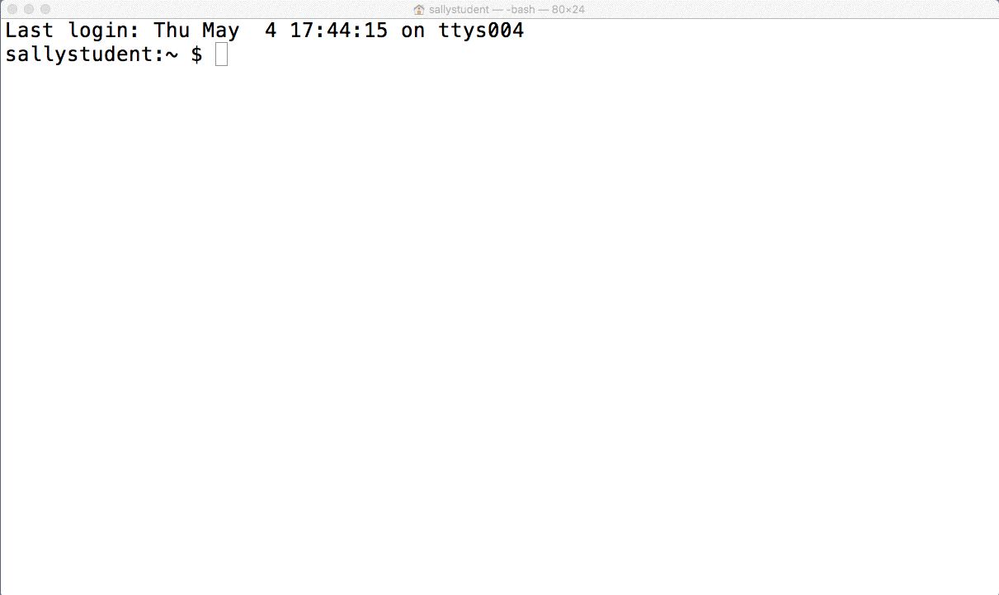

From now on, anytime that you're working from the command line and need to double-check which folder you're in, use `pwd`. And as you're starting out, repeat "print working directory" out loud to yourself when you enter the command; this will help with memorizing.

What if you've forgotten what `pwd` or some other command does? What you do will depend on your operating system.

If you're a Windows user in Git Bash, you can use the `help` command to pull up a brief summary of some commands. Now, try using the `help` command for `pwd`. Type `help pwd` and then press `Enter`; you'll see the documentation for the command. You can also find a full description of various commands for Git Bash online by visiting [Linux Man Pages Online](http://man.he.net/), entering the command that you're wondering about, and clicking **Find**. Try it out by searching for `pwd`.

If you're a Mac or Linux user, all of the built-in command-line commands have documentation that you can view directly from the command line. To do this, use [`man`](https://ss64.com/bash/man.html) (which is short for "manual"), followed by the command that you want to know about. Try using the `man` command for `pwd`. Type `man pwd` and then press `Enter`. You'll see documentation for the command, which you can scroll through by pressing the up and down arrow keys (or cursor control keys). To exit from the manual, type `q`.

Note that most commands have *flags* that you can add, and these will be documented in the manual. The `pwd` command is not one where you'll frequently need to use flags. But with others, like `ls` (which you'll learn about in a moment), you'll frequently use flags. For example, `ls -a ./` basically says list *all* (`-a`) of the files in the current directory, even hidden ones.

Also, note that there are both single-letter and multi-letter flags. When you're supplying one or more single-letter flags, precede the flag or flags with a single dash `-`; for example, you could type `ls -a` or `ls -al`.

For multi-letter flags, precede the flag with two dashes `--`. Here's an example: `git merge --no-ff`. (You'll learn about this command later in this module.)

So now, you know two commands: `pwd` and `man`. And if you're a Windows user, you know where to go to get equivalent documentation to running the `man` command.

## List and make files and folders with `ls`, `mkdir`, and `touch`

Next up, you'll learn about three more commands: `ls` (list files and folders), `mkdir` (make a directory), and `touch` (create an empty file). One of the most common things that you'll do from the command line is to list the contents of directories and create new directories and files. So you'll definitely want to get comfortable with these three commands.

Back in the same command-line terminal that you were working with in the previous step, type `pwd` to verify that you're still in your home folder. If you aren't, run `cd ~`.

Next, type `ls`. This will print all the folders and files located in your home directory.

Try creating a new directory and then putting a file in it. Enter `mkdir test` to create a folder called `test` in your home folder. Enter `ls test`. Unlike when you called `ls` on the home directory, nothing will be printed. This is because you just created an empty folder, and there's nothing in it.

To create a new file, use the `touch` command. Run `touch test/foo.txt` to create a new file called `foo.txt` in the `test` folder that you just created. This file will be empty. Run `ls test` again, and this time, you'll see `foo.txt` listed.

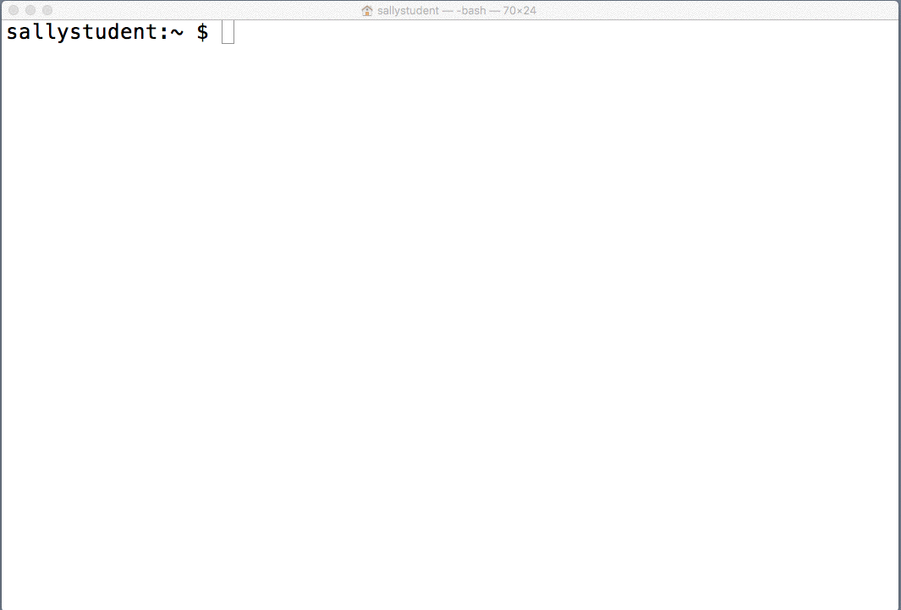

Your command-line environment has built-in text editing tools (for example, `vi`), but you won't be delving into those in this checkpoint. If you wanted to edit this file, you could do so by opening it via your operating system's graphical interface (Finder on a Mac and File Explorer on Windows).

To convince yourself that there's nothing magical about the file that you just created from the command line, go ahead and find it using your graphical interface. Try opening it in a text editor, adding some text, and saving. Then, back in the command line, try running the command `cat test/foo.txt`.

###### The [`cat` command](http://man.he.net/?topic=cat&section=all) (which is short for *concatenate*) is used to print out the contents of a file to the command line. Also, in the example below, you'll create directories with silly names, like `cats`, `dogs`, and `bears`. To be clear, the directory name `cats` has nothing to do with the `cat` command.

What if you want to create a series of nested folders? Right now, your `test` folder only has a file in it (`foo.txt`). But what if you wanted to create `test/cats/dogs/bears`?  That is, what if you wanted to create a directory called `cats` with a directory called `dogs` inside of it, which in turn has a directory called `bears` inside of it?

You could type a command for each folder (`mkdir test/cats`, `mkdir test/cats/dogs`, and `mkdir test/cats/dogs/bears`), but that's a lot of commands.

Maybe you can just do them all at once with `mkdir test/cats/dogs/bears`. But try running that command, and you'll get an error indicating that there's no directory at `test/cats/dogs`. This is true, since you haven't created it yet.

The way around this is to use the `-p` flag along with `mkdir`. This tells `mkdir` that it should create any intermediate directories along the way to creating the target directory, if they don't already exist. (And note that you could learn this information by running `man mkdir` or visiting [the online documentation](http://man.he.net/).)

Try running `mkdir -p test/cats/dogs/bears`. This time, you won't get an error message. Again, to convince yourself that there's nothing magical about creating folders from the command line, use your graphical interface to find the `bears` folder that you just created.

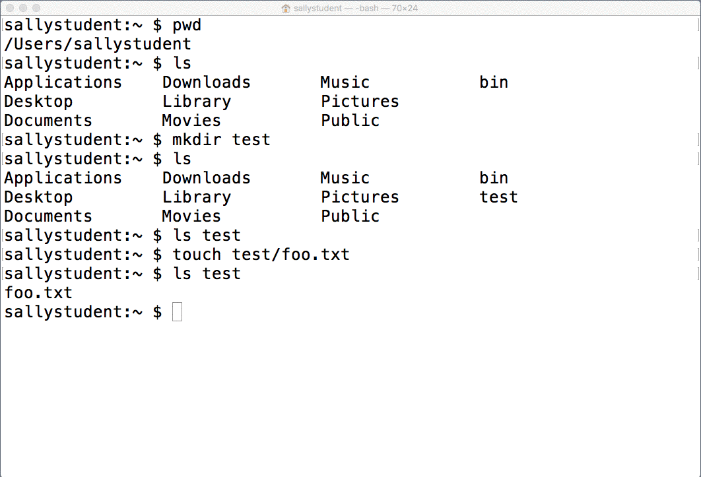

Before moving on to the next command, spend a moment on two handy, time-saving command-line features: [automatic tab completion](https://en.wikipedia.org/wiki/Command-line_completion) and viewing previous commands.

Run `cd ~` to ensure that you're in your home folder. Then type `ls te` and press `Tab`. If you don't have any other files or folders in your home folder that begin with `te`, when you press `Tab`, the command will automatically be expanded to `ls test/`. If you have other files or folders with that prefix, you'll see them listed below. And by typing in a few more characters to narrow down the selection, you can press `Tab` again to get the full completion. You can continue to use tab completion to navigate all the way to `test/cats/dogs/bears`.

Now you know about tab completion! This is something that you should try to make a habit of using as soon as possible. Not only does it save you typing time, but it also makes you more accurate. If you're using tab completion, you won't accidentally try to navigate to folders that don't exist, for example.

The other feature that you should know is that you can use the up and down arrow keys to cycle through commands that you've entered. The up arrow will cycle through previous commands, and the down arrow will cycle back to the most recent one.

###### When naming files or directories, avoid using spaces. Instead, you can separate words with dashes or underscores. If there is a space in your filename, you'll need to include a backslash `\` before the space in order for the command line to recognize it. For example, `cd desktop/Cute animal pictures` will return an error, but `cd desktop/Cute\ animal\ pictures` will take you where you want to go. The easiest route, though, is to avoid spaces altogether.


## Navigating directories with `cd`

Next up, you're going to learn about the `cd` (change directory) command. You already saw this command in passing with `cd ~`, which you can use to navigate to the home folder of the current user.

The `cd` command gets followed by the path of the folder that you're trying to get to. To try this out, run `cd ~` to get in your home folder. Then run `cd test`, followed by `ls`. You should see your `cats` folder and the `foo.txt` file listed.

Next, try running `cd ..` (note the space between `cd` and `..`). In the command-line environment, `..` is a shortcut for the parent directory. Running it from `~/test/` will bring you back to the home folder, which you can verify by running `pwd`.

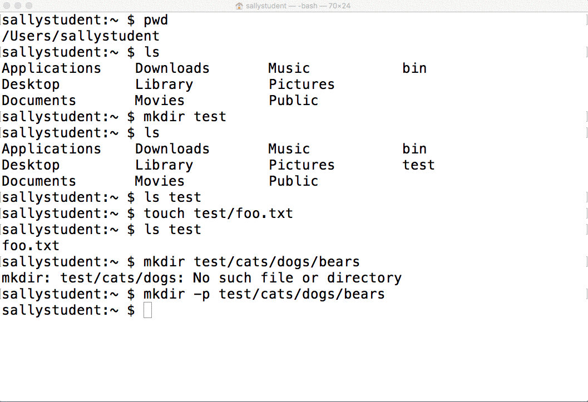

The counterpart to `..` is `.`, which is a shortcut for the current directory. If you were to run `cd .` and then `pwd`, you'd find that you're in the same directory that you started in.

Note that `..` (and `.`, for that matter) can be chained together. `cd ../..` would take you to the grandparent directory of the one that you're currently in. To see this, run `cd ~` to get back in your home folder. Then run `cd test/cats/dogs` (and make sure to use tab completion). Run `pwd` to prove that you're inside the `dogs` folder, then run `cd ../..` followed by `pwd`. You'll find that you're back in the `test` folder.

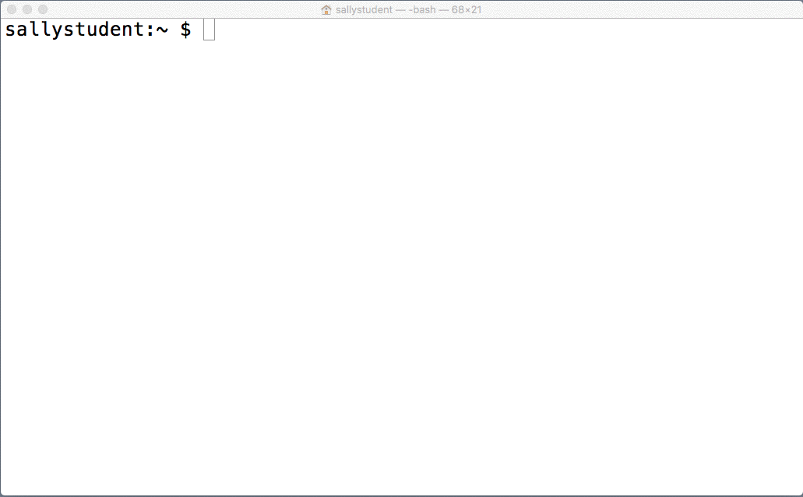

## Listing (and creating) hidden files and folders

Next up, you're going to learn how to list and create hidden files. A hidden file or folder is one that won't be viewable in your graphical interface (unless you change your operating system's preferences). Hidden files and folders are also not visible when you use `ls` (without the appropriate flag, which you'll learn about in a moment).

Hidden files and folders are commonly used for storing configuration data. For example, Git (the version control program that you'll learn about shortly) installs configuration settings for a project in a hidden folder called `.git` at the root of your project. And you'll surely encounter other hidden files as you learn more.

To make a file or folder hidden, all you have to do is use a period `.` as the first character in the name.

Now, try it out. Make sure that you're in your home folder (use `pwd`, and if you find that you're not in your home folder, use `cd ~`). Then do `cd test`. Run `ls`, and you should see the `cats` folder and `foo.txt` file that you created earlier in this checkpoint. Next, run `touch .hidden-file.txt` to create a new hidden file inside the `test` folder called `.hidden-file.txt`.

To verify that it's hidden, run `ls`. You should see `cats` and `foo.txt` listed, but not `.hidden-file.txt`. If you navigate to the `test` folder in your graphical interface, you won't see it there either.

To view hidden files and folders, you need to use the `-a` flag, which will include entries with names beginning with a dot `.`. From the `test` folder, run `ls -a`; this time, you will see `.hidden-file.txt`.

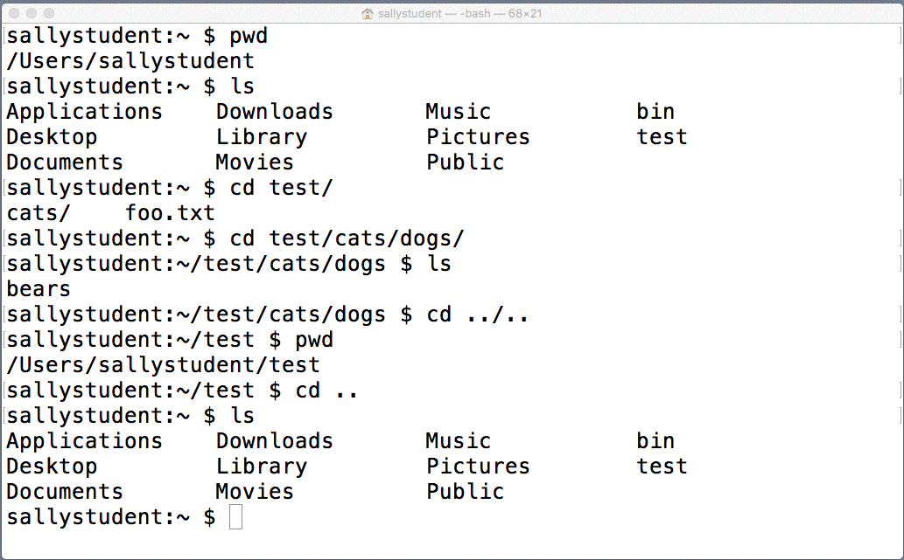

For Windows users, there's an extra step for creating hidden files and folders. Because Git Bash is a Linux interface, using a period `.` as the first character in the name will hide the file in the command line. But if you use the Windows graphical interface, you'll find that `.hidden-file.txt` is still visible.

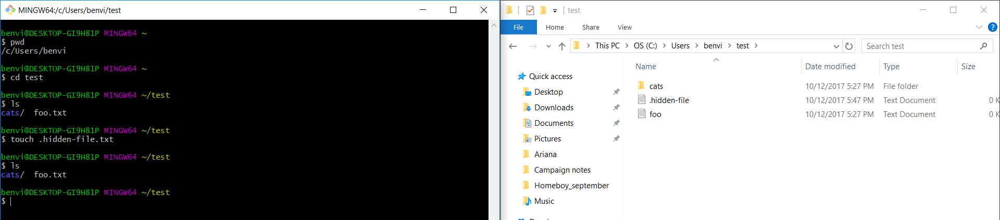

To hide a file on Windows, you must set the file's attribute to hidden as well. This can be done in Git Bash using the `attrib` command. Type `attrib +h` and then add the file path in quotations. Here's an example:

```$ attrib +h "C:\Users\benvi\test\.hidden-file.txt" ```

When you check the graphical interface again, the file will be hidden.

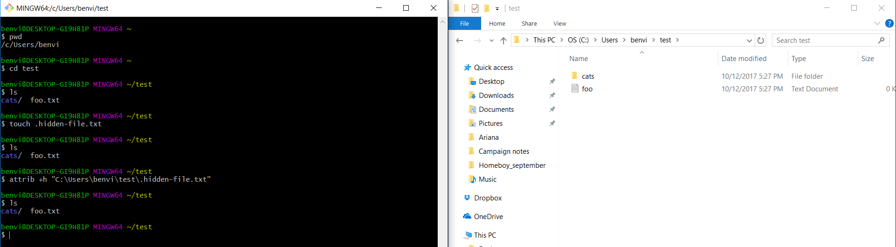

## Living dangerously: Deleting files and folders with `rm` and `rmdir`

Next up, you're going to learn about two useful but *potentially dangerous* commands: `rm` (remove) and `rmdir` (remove directory). These commands are used for deleting files and folders, which is extremely useful.

As you probably know, when you delete files or folders using the graphical interface, the deleted items are moved to a trash or recycle bin. There, they are recoverable until you empty the trash. In contrast, *deleting in the command-line environment is permanent!*

###### **Caution:** This can be especially dangerous because it's possible to permanently delete vital system files. Your computer can't function without these files, and you'd be forced to do a clean reinstall of your computer. For example, if you were to run (don't do this and don't suggest that someone else do this!) 💀`rm -rf /`💀, it would delete all the files and folders from your computer, beginning at the root folder.

None of this means that `rm` and `rmdir` shouldn't be used, but it does mean that you should be cautious when using them. And if you aren't totally comfortable with them, feel free to stick with using the graphical interface for deleting folders and files. There is no shame in avoiding the pain of accidentally deleting your entire hard drive.

For the `rm` command in particular, you can use the `-i` flag to give yourself a minimal layer of protection. When you run `rm -i the-file-or-folder`, you'll get an interactive prompt that will tell you what you're about to delete and ask you to confirm that you really want to delete it. It's a good idea to get into the habit of always using the `-i` flag when you use `rm`.

Now, enough with the caveats! Live dangerously for a moment. Make sure that you're still in the `test` folder where you left off in the previous step. Then run `ls -a` to list all the files. Start by deleting your hidden file with `rm -i .hidden-file.txt`. You will see a prompt asking you if you want to remove the file. If you type `n`, it won't be deleted. But if you type `y`, it will be. Go ahead and type `y`. Then run `ls -a`. You'll find that `.hidden-file.txt` is no longer there; it is *permanently gone*.

Next, delete `foo.txt` with `rm -i foo.txt`, and confirm the deletion by typing `y`.

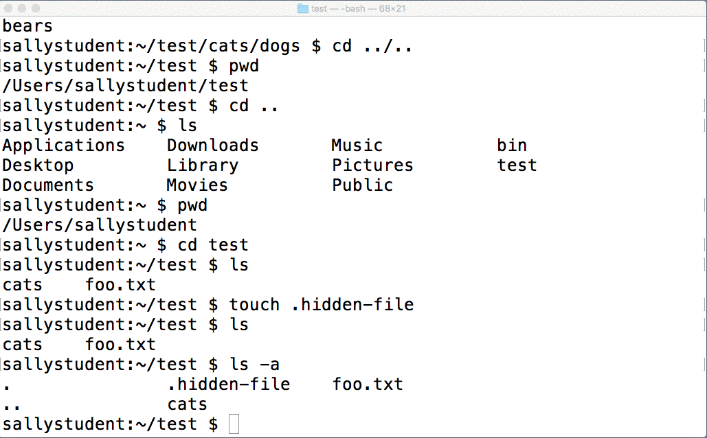

That's about all there is to know about deleting files. To delete folders, you have two options. The first one is `rmdir`. Make sure that you're in the `test` folder, then run `ls cats/dogs` (using tab completion). You'll see that the `bears` folder is listed. To delete that, run `rmdir cats/dogs/bears`, followed by `ls cats/dogs`. You will see that `cats/dogs` still exists, but `cats/dogs/bears` is gone.

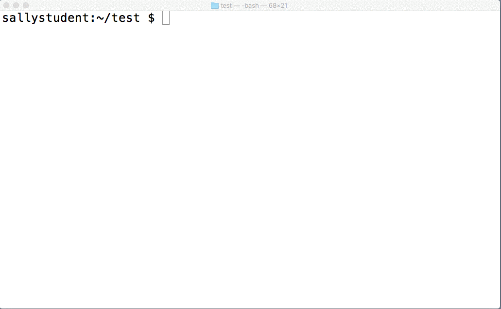

It turns out that `rmdir` can only be used to delete empty directories—and in that sense, it's relatively safe. If you need to delete a directory that has files or other directories in it, you'll need to use the `rm` command along with the `-r` and `-f` flags. The `-r` flag stands for "recursive" and will attempt to remove subfolders within the target folder. The `-f` flag will automatically remove files in the target folder and its subfolders without asking for confirmation. You could also run `rm -r folder-to-be-removed`. This will allow you to delete the folder and its contents, but you'll be prompted along the way to confirm the deletion of individual files.

Inside the `test` directory, try running `rmdir cats`. You'll get an error message that `cats` is not empty. Then try `rm -rf cats`. This time, the (permanent!) deletion will be successful, which you can confirm by running `ls` from the test directory.

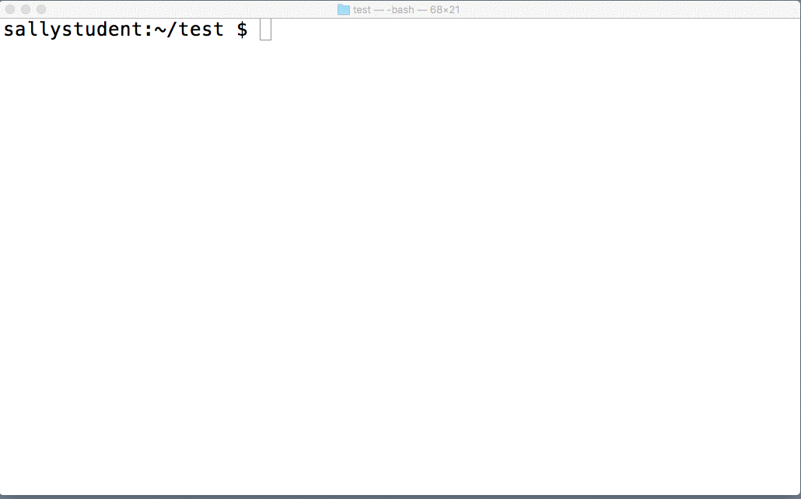


## Moving files and folders with `mv`

Next up is `mv` (move), which is used to move files and folders from one place to another.

You'll start by moving a file. In this case, you're going to move it within the same folder, which amounts to simply renaming it. First, make sure that you're in the `test` folder. Then create a file called `foo.txt` (assuming that you deleted the earlier one) by running `touch foo.txt`. Run `ls` to confirm that the file was created. To move the file within the same folder to a new name (`bar.txt`), run `mv foo.txt bar.txt`. You can confirm that the file was moved by running `ls`. You will see `bar.txt` but not `foo.txt`.

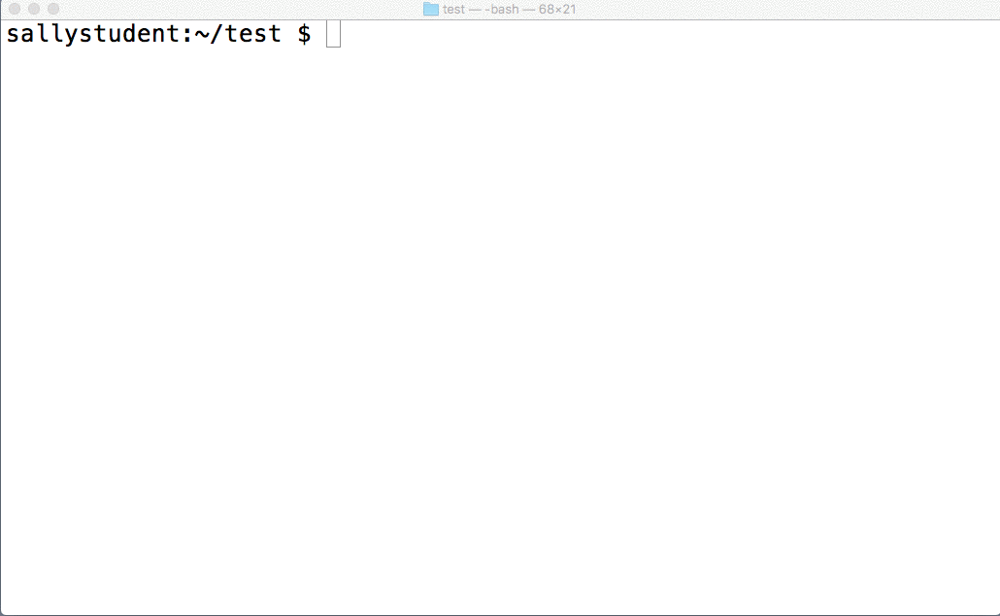

To move a file to a different folder, you need not rename it. You can keep the original filename and just change the directory that it's in. Now, try that out. Still in the `test` directory, create a new subdirectory with `mkdir foo`. Next, move `bar.txt` into `foo`, using `mv bar.txt foo`. Run `ls foo` to confirm that `bar.txt` was moved.

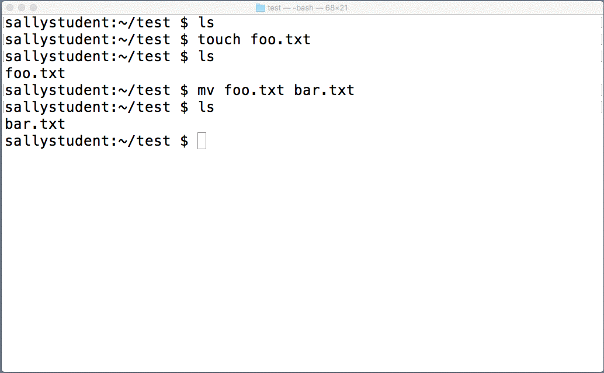

Renaming folders works just the same as moving files. Now, rename the `foo` folder to `bar` by running `mv foo bar`. To confirm that it worked, run `ls bar`. You'll see `bar.txt` listed (recall that its parent folder was originally called `foo`).

## Copying files and folders with `cp`

The final command that you're going to cover in this checkpoint is `cp`. This command is used for copying files and directories.

At the risk of pointing out the obvious, copying a file or folder is similar to moving it, except that the original is retained.

Start by making a copy of `test/bar/bar.txt`. From inside the `test` folder, run `cp bar/bar.txt bar/bizz.txt`, and then run `ls bar`. You will see that `test/bar` now contains two files: `bar.txt` and `bizz.txt`.

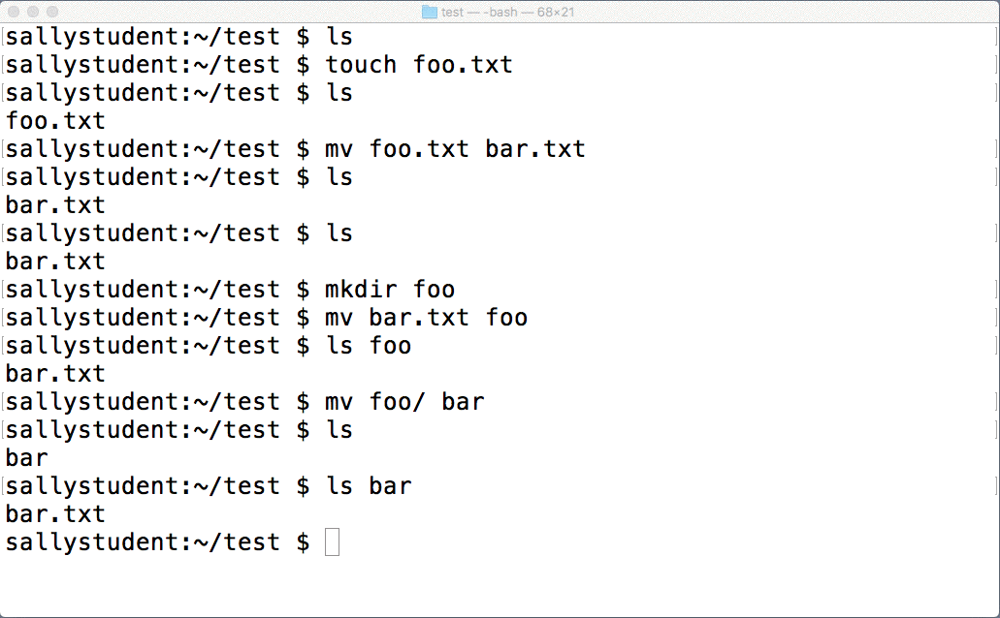

Next, try copying a folder. If you try `cp bar cats` to copy the `bar` folder to a new folder called `cats`, you'll get an error indicating that `bar` is a directory and, therefore, cannot be copied.

To overcome this, you just need to use the `-r` (for "recursive") flag. Run `cp -r bar cats` and then `ls`, and you'll find that you now have two folders listed: `bar` and `cats`.

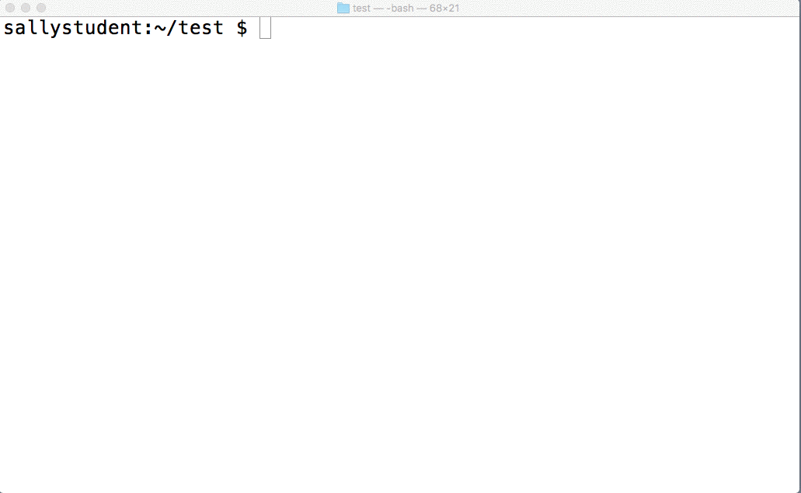
