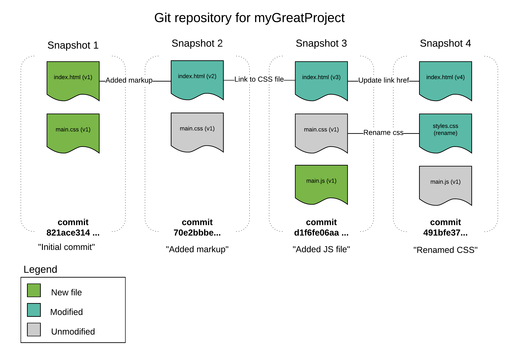
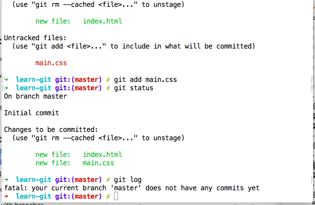
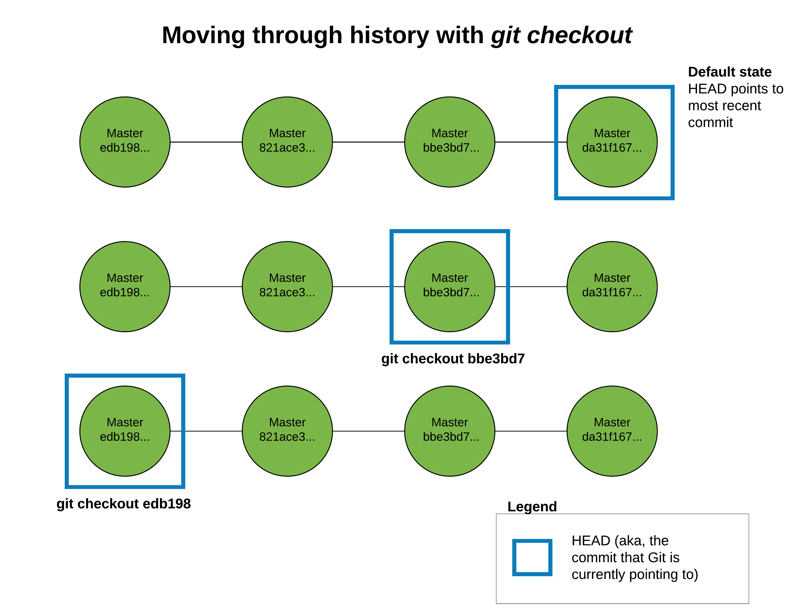
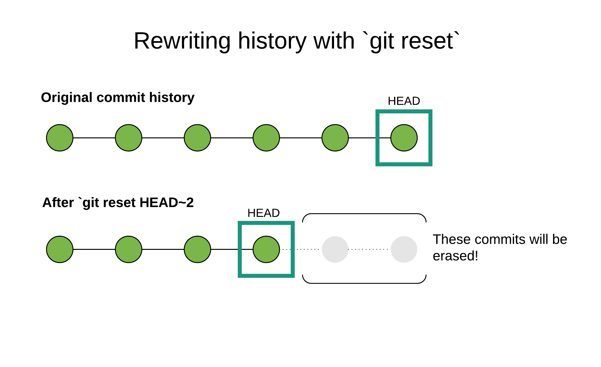

**Objective:** By the end of this checkpoint, you'll be able to back up code using Git.

In this checkpoint, you're going to learn the basic Git commands that you'll need to know to get started. These commands will allow you to take snapshots and move back and forth in your commit history. You will create two files, `index.html` and `main.css`, to use as an example to help you get to know Git commands better. 



Here are the commands that you'll cover:

* `git init`: Used to initialize a new Git repository
* `git status`: Used to find out the current state of the repository (or *repo*, for short)
* `git add`: Used to *stage* new or changed files. You'll explore the idea of staging changes in a moment.
* `git commit`: Used to take a snapshot of the repo at a point in time. This may require you to enter `git commit -m 'commit message here'`.
* `git diff`: Used to see what has changed in a repo since the last commit
* `git reset`: Used to reset your repository to a prior state
* `git checkout`: Used to look at a prior state of the repository

With these commands, you can take snapshots of your code and go back to an earlier state if you need to.

Be sure to follow along and enter the commands that are mentioned so that you begin memorizing them.

## Key terms

* Initialize
* Git repository
* Commit
* Stage
* Snapshot

## From new project, to new repository, to initial commit

From the command line, navigate to a directory where you don't mind putting a new subdirectory. (Thinkful recommends creating a directory called `projects` in your home drive to house all your coding projects.) Inside that directory, create a new subdirectory called `learn-git`. Then move into it using the following code:

```
// <tab> means that you should practice using tab completion!
cd pro<tab>  // move into projects folder
mkdir learn-git
cd lea<tab> // move into learn-git folder
```

Next, you're going to create two files: `index.html` and `main.css`. From the same command-line console, run the command `touch index.html main.css` to initially create these files. At this point, they'll be empty.

Now that you have some files, you're ready to *initialize* your project as a Git repository. All that really means is that you're telling Git that you want to use its version control system in this folder. Once initialized, Git will be able to tell you things like which files it's currently *tracking* (that is, which ones it pays attention to when it takes snapshots). It will also be able to tell you which files have changed since a previous commit.

From the same command-line window, run the command `git init`. You'll see a message like `Initialized empty Git repository in /Users/sallystudent/projects/learn-git/.git/`. Your message will vary according to your username and the location of your project directory.

You can confirm what this log says by running `ls -a`; you'll see that alongside `index.html` and `main.css`, you also have an invisible folder, `.git`. If you're curious, you can run `ls .git` to see the contents of that folder. Know that Git adds this folder and these files, but 99% of the time, you won't ever need to touch them. Indeed, unless you have a specific reason to alter these files and you know exactly what you're doing, you should avoid modifying them, as it may mess up your Git repository.

## Using `git status`

In the previous step, you created a new repository, but you didn't add or commit either of your files (`index.html` and `main.css`). In other words, you haven't yet taken a snapshot. You'll do that in a moment, but how can you tell what the status of your repository is?

That's the purpose of the aptly named `git status` command. The `git status` command can be run in any repo, at any point. You'll get a rundown of which files from previous commits have changed, which files are new and not currently tracked, and which files have been moved or deleted.

To see for yourself, run `git status` from the same command-line window as earlier. You'll get back something like this:

```
On branch master

Initial commit

Untracked files:
  (use "git add <file>..." to include in what will be committed)

    index.html
    main.css

nothing added to commit but untracked files present (use "git add" to track)
```

That message tells you a few things. First, you can see that you're on the *master branch*. You'll explore branches in detail in the next assignment, but for now, recall from the previous assignment that the master branch is the default branch. When you initialize a new Git repo, it will have a single branch: `master`.

Next, note that Git tells you that you have *untracked files* in your repository, and it specifically lists `index.html` and `main.css`.

So, what is an untracked file? To understand this, you need to understand *how* Git takes snapshots of your project. If you were to point a camera at a well-lit room and snap a photo, it would record an image of everything in the room. But with Git, snapshots work a little differently. You have to explicitly tell it to start *tracking* files (or objects in the room, to continue the photographic metaphor). It's like having a camera where you can say, "When you take a picture of this room, record the sofa and the coffee table. But don't record the herb garden—that's a work in progress that I don't want you to record just yet."

In short, Git tracks only the files that you tell it to track within a repo. So how do you start tracking files? The answer to that is also in the status message from above:

```
nothing added to commit but untracked files present (use "git add" to track)
```

To start tracking files, you need to use the `git add` command. Back on the command line, run the following commands:

```
git add index.html
git status
```

You'll get back something that looks like this:

```
On branch master

Initial commit

Changes to be committed:
  (use "git rm --cached <file>..." to unstage)

    new file:   index.html

Untracked files:
  (use "git add <file>..." to include in what will be committed)

    main.css
```

The `git status` command is now reporting that you have a set of changes that are *staged* to be committed. You'll learn more about what staged changes are in a moment, but for now, know that if you call `git commit`, any and all changes indicated in the "Changes to be committed" part of the message will be reflected in that commit.

Note that the "Untracked files" part of the message now only has `main.css` in it. You just told Git to start tracking `index.html` but not `main.css`, so that's why it's telling you that `main.css` is not tracked.

Now, run this:

```
git add main.css
git status
```

This time, you'll get back a log that looks like this:

```
On branch master

Initial commit

Changes to be committed:
  (use "git rm --cached <file>..." to unstage)

    new file:   index.html
    new file:   main.css
```

In the "Changes to be committed" section, Git is telling you that there are two new files that are staged to be committed. Notice how the "Untracked files" section has been omitted this time. That's because there are no longer any untracked files in the repo. You've told Git about all of the files in your project folder at this point.

Next, run `git log`. This gives you a list of all the commits (snapshots) of your code that have been made.

Uh-oh! When you run `git log`, you'll get back something that looks like this:

```
fatal: your current branch 'master' does not have any commits yet
```

Git is telling you that you don't have any commits yet. That's because, indeed, you haven't told Git to *commit* your changes yet. At this point, you have only *staged* them.

You're now ready to explore the differences between *tracking*, *staging*, and *committing*. When you say that Git is *tracking* a file, it means that Git's version control system knows about a file and is watching it. If a tracked file has been included in a commit, Git will be able to tell you how it's changed since the last commit.

Files are *tracked* by Git, and changes are *staged*. When you stage a change to a file, that's like telling Git, "Hey, pay attention to the (new) state of this file at this particular moment. If I call `git commit` right now, I want you to take a snapshot of this file at this particular moment." You can stage changes to multiple files, and even multiple changes to the same file—all before ever calling commit. The key is that the snapshot of your code doesn't happen until you finally call `git commit`.

That brings you to *committing*. With Git, you commit a set of staged changes. Go ahead and commit your code so far. From the command line, run the command `git commit`.

This will cause an interactive commit dialog to open up in your command-line terminal. By default, this interface is not in editing mode, and what you need to do is type a commit message. Type `:` (colon) and then `i`, and press `Enter`. This will put you in *insert mode*, which will allow you to edit the commit message. Type `initial commit` and press `Enter`. Then, to save your commit message and exit out of the commit prompt, press the `Escape` key. Then type `:wq`, which stands for write and quit, and press `Enter`.

The prompt will close, and you'll see a log that looks like this:

```
[master (root-commit) a462979] initial commit
 2 files changed, 0 insertions(+), 0 deletions(-)
 create mode 100644 index.html
 create mode 100644 main.css
```

This log has information about what happened in the commit. It tells you the branch that the commit happened on (`master`). It also reports the *secure hash algorithm* (SHA) of the commit; this is a unique identifier that Git assigns to each commit. Git also tells you that two files were changed and that it "created" `index.html` and `main.css`; the idea here is that this is the first time that these files had their snapshot taken by Git.

Now that you have made a commit, run `git log` again. This time, you'll get an interactive prompt that lists all of the commits that have happened for this repo (in this case, just the one). Notice that in the log, you can see the SHA of the commit, the commit message, when the commit was made, and who made it. This last part will correspond to the username and email that you set up when you configured Git in the previous assignment.

Finally, run `git status` one more time. This time, you'll see the following:

```
On branch master
nothing to commit, working tree clean
```

This message is telling you that the master branch is *clean*. That means that there's a 1-to-1 correspondence between Git's most recent snapshot of the repository and its current state. Git knows about all of the files in the repository (in other words, they're all tracked), and its snapshot of each file is up to date.




## Subsequent snapshots

Now, you have Git tracking files, and you've made an initial commit. As you make additional changes, you'll keep using `git status`, `git add`, and `git commit` to save your work as you go.

Now, make some changes to your project. Open `index.html` in your text editor of choice, and copy, paste, and save the following HTML:

```html
<!DOCTYPE html>
<html lang="en">
<head>
  <title>learn git</title>
  <link rel="stylesheet" type="text/css" href="main.css">
</head>
<body>
  <p>This is here so I can learn Git</p>
</body>
</html>
```

Next, open `main.css`. In that file, copy, paste, and save this code:

```css
body {
  background-color: green;
}
```

Recall that when you initially created and then committed `index.html` and `main.css`, they were empty. Now you've added some content to both files.

How does Git react to all this? To find out, run `git status`. You'll see something like this:

```
On branch master
Changes not staged for commit:
  (use "git add <file>..." to update what will be committed)
  (use "git checkout -- <file>..." to discard changes in working directory)

    modified:   index.html
    modified:   main.css
```


The status message is telling you that you're still on the master branch but you have some unstaged changes. Git knows all about `index.html` and `main.css` because you started tracking those files in your first commit. But since that commit, those files have changed, and they look different than Git's most recent snapshot of them.

To stage these changes, use the same `git add` command that you initially used to start tracking these files. But this time, use the `-u` flag, which causes Git to stage any files that it's already tracking but that have unstaged changes. Run the following commands:

```
git add -u
git status
```

Now, `git status` will return this message:

```
On branch master
Changes to be committed:
  (use "git reset HEAD <file>..." to unstage)

    modified:   index.html
    modified:   main.css
```

You no longer have unstaged changes. And if you make a commit right now, you'll get a snapshot of the HTML and CSS that you pasted into those two files.

Before making another commit, add an additional change to `main.css`. In your text editor, add the following code to the top of the file, then save.

```css
* {
  box-sizing: border-box;
}
```


Run `git status` again, and you'll see this:

```
On branch master
Changes to be committed:
  (use "git reset HEAD <file>..." to unstage)

    modified:   index.html
    modified:   main.css

Changes not staged for commit:
  (use "git add <file>..." to update what will be committed)
  (use "git checkout -- <file>..." to discard changes in working directory)

    modified:   main.css
```


This message is telling you that your initial changes to `index.html` and `main.css` are staged. Git knows about them, and if you run `git commit` right now, you'll get those changes in your snapshot.

However, it's also telling you that there are unstaged changes since the last time that you ran `git add -u`. That's because of the rule that you just added to `main.css`.

You can stage these new changes the same way as before, by running either `git add -u` or `git add main.css`. Run one of those commands and then `git status`, and you'll see the following message:

```
On branch master
Changes to be committed:
  (use "git reset HEAD <file>..." to unstage)

    modified:   index.html
    modified:   main.css
```

This is telling you that if you call `git commit`, your snapshot will be up to date with the current state of `index.html` and `main.css`.

Now, commit your changes. This time, though, use the `-m` flag, which allows you to supply a commit message in-line with the `git commit` command. Run `git commit -m 'added content to files'` (you may need to use `"` if on Windows), and you'll get back something like this:

```
[master 1c2febb] added content to files
 2 files changed, 17 insertions(+)
```

As with your previous commit, Git returns the branch and SHA of the commit, and you can see the commit message. You also get data about how many files were changed. Git can tell when lines of code are added, changed, or removed. Note that adds and changes are called *insertions* in Git terminology, and removals are called *deletions*.

Run `git log` again, and this time, you'll see info about both commits that you've made, with the most recent one at the top. Type `:q` to exit out of this prompt.

If you run `git status`, you'll see the same message from before indicating that the master branch is clean.

## Use `git diff` to see what's changed

The `git diff` command can be used to understand what has changed about tracked files. To see how it works, make some changes to `index.html`. Replace the current body elements with the following two paragraphs, and then save.

```html
    <p>This is here so I can learn Git. Now it's modified</p>
    <p>This is a new paragraph</p>
```

Make a change to `main.css` as well. Edit the style rule for the body so that it looks like this code, and then save.

```css
body {
  background-color: green;
  font-size: 24px;
}
```

As before, if you run `git status`, Git will tell you that there are unstaged changes to `index.html` and `main.css`.

But what if you need to know precisely what has changed? This is where `git diff` comes in. With `git diff`, you can see the changes made to a specific file or to all tracked files in the repo. You can also get an overview of the changes.

To see changes to a specific file, run `git diff path-to-changed-file`. Try that by running `git diff index.html`. That will bring up an interactive prompt that has something like the following information:

```
diff --git a/index.html b/index.html
index 418bd80..c07bcf1 100644
--- a/index.html
+++ b/index.html
@@ -5,6 +5,7 @@
   <link rel="stylesheet" type="text/css" href="main.css">
 </head>
 <body>
-  <p>This is here so I can learn Git</p>
+  <p>This is here so I can learn Git. Now it's modified</p>
+  <p>This is a new paragraph</p>
 </body>
 </html>
\ No newline at end of file
(END)
```

This message tells you precisely which lines of code have changed in `index.html` since your most recent commit. The original `<p>This is here so I can learn Git</p>` has been removed, as indicated by the minus `-` sign. Git sees that in its place, two insertions have been made:

```
+  <p>This is here so I can learn Git. Now it's modified</p>
+  <p>This is a new paragraph</p>
```

These are precisely the changes that you made to your `index.html` file. Type `:q` to quit out of the prompt.

If you want to see the *diff* of all changed files in the repo, you can run `git diff` without specifying a path. Try that, and you'll get an output that looks like this:

```
diff --git a/index.html b/index.html
index 418bd80..c07bcf1 100644
--- a/index.html
+++ b/index.html
@@ -5,6 +5,7 @@
   <link rel="stylesheet" type="text/css" href="main.css">
 </head>
 <body>
-  <p>This is here so I can learn Git</p>
+  <p>This is here so I can learn Git. Now it's modified</p>
+  <p>This is a new paragraph</p>
 </body>
 </html>
\ No newline at end of file
diff --git a/main.css b/main.css
index 366e4d6..81b9e81 100644
--- a/main.css
+++ b/main.css
@@ -4,4 +4,5 @@

 body {
   background-color: green;
+  font-size: 24px;
 }

```

Now you get the same diff that you saw for `index.html` just a moment ago, followed by the diff for `main.css`. Note that depending on the size of your command-line window when you run this, you may need to use the down arrows to see the entirety of the diff. As before, type `:q` to quit out of this prompt.

Sometimes, you just want to see a high-level view of unstaged changes. For that, you can use `git diff --stat`. Run that command, and you'll see something like this:

```
 index.html | 3 ++-
 main.css   | 1 +
 2 files changed, 3 insertions(+), 1 deletion(-)
(END)
```

This message is telling you that there were three total changes to `index.html`: two insertions (`++`) and one deletion (`-`). The `main.css` file had one insertion. You also see that "2 files changed" and that there were a total of "3 insertions(+)" and "1 deletion(-)." With the `--stat` flag, you can't see which specific lines changed, but you can get a high-level view.

It's important to note that `git diff` will report the difference between the most recent commit and unstaged changes. Once your changes are staged, they won't show up in `git diff`. To verify this, run `git add index.html`, followed by `git diff --stat`. This time, only `main.css` will show up as having a diff.

Run `git add main.css` to stage these outstanding changes, and then run `git commit -m 'updated html and css'` to commit them.

## Unstaging changes

Imagine that you're working on a project. You make changes to a file, stage the changes, then stage changes to a bunch of other files—only to realize that you don't actually want to commit the changes that you made to the first file. What do you do?

### "Time travel" with `git checkout`

Git's ability to take snapshots of your code is only valuable insofar as you can "time travel" between snapshots.

One command that lets you do this is `git checkout`. In the next checkpoint, you'll learn all about *branches*, which are different versions of the same repository. The `git checkout` command is used to move between different branches, but it can also be used to look at earlier snapshots of your repository. This can be valuable when you're working on larger projects with long commit histories, and you want to know how some part of your code worked in the past. This could be useful, for example, if you want to return to that state. Or perhaps you're working on some new project, and the way that you initially implemented a feature in this previous project is exactly what you want to do in the next project—you just can't remember how you did it!

Crucially—and unlike the `git reset` command that you'll get to in a moment—`git checkout` doesn't rewrite history. When you use `git checkout` to inspect the state of your repository at a different commit, it's like you're paging through a photo book and looking at different snapshots. When you look at a photo of yourself from ten years ago, it has no effect on a photo taken of you yesterday. The same is true for using `git checkout`.

Now, see how it works. Run `git log` inside your `learn-git` project folder. You'll see something like this:

```
commit 477f29291342f378a3266fcf5a7ae5bb95000f83
Author: Benjamin White <benjamin.e.white1@gmail.com>
Date:   Tue May 9 10:06:38 2017 -0400

    updated html and css

commit 1c2febba9ebdcab9d182e83a47b795a8ac05245f
Author: Benjamin White <benjamin.e.white1@gmail.com>
Date:   Mon May 8 16:52:51 2017 -0400

    added content to files

commit a46297929ba8d13af0955bfd310dcb5e468b6594
Author: Benjamin White <benjamin.e.white1@gmail.com>
Date:   Mon May 8 16:23:06 2017 -0400

    initial commit
```

To use `git checkout` to look at an earlier snapshot, supply it with the SHA of the commit that you want to see. Take a look at the second commit that you made in this repository: the "added content to files" commit. In the example above, that commit's SHA is `1c2febb ... `, but the SHA will be different on your machine. (Note that the ellipsis `...` here suggests that the SHA is a much longer alphanumerical code. But the first seven digits are often enough to identify the commit.) Copy that commit's SHA, and then enter `:q` to quit out of the Git log interface.

Now, run the command `git checkout <paste-the-SHA-you-just-copied>`. You'll see a log that looks like this:

```
Note: checking out '1c2febba9ebdcab9d182e83a47b795a8ac05245f'.

You are in 'detached HEAD' state. You can look around, make experimental
changes and commit them, and you can discard any commits you make in this
state without impacting any branches by performing another checkout.

If you want to create a new branch to retain commits you create, you may
do so (now or later) by using -b with the checkout command again. Example:

  git checkout -b <new-branch-name>

HEAD is now at 1c2febb... added content to files

```

This *detached HEAD state* probably sounds like a bad thing, but don't worry—nothing is broken. You'll circle back to what this state is in just a moment, but first, look at what happened when you returned to this previous snapshot.

Open your `project` folder in your text editor, and look at `index.html` and `main.css`. You'll find that the most recent changes that you made in those files are no longer there. The `index.html` file will look like this:

```html
<!DOCTYPE html>
<html lang="en">
<head>
  <title>learn git</title>
  <link rel="stylesheet" type="text/css" href="main.css">
</head>
<body>
  <p>This is here so I can learn Git</p>
</body>
</html>
```

And `main.css` will look like this:

```css
* {
  box-sizing: border-box;
}

body {
  background-color: green;
}
```

This is exactly how these files looked when you made this commit. To get back to your "normal" state, run `git checkout master`. This will put you back "in the present" where you started. When you do that, you'll see something like this:

```
Previous HEAD position was 1c2febb... added content to files
Switched to branch 'master'
```

That worrisome "detached HEAD" message is gone. Phew!

But what did it mean? And what is this *HEAD*? In Git, HEAD is a variable that points to a commit—by default, the most recent commit. To continue with the photo book metaphor, *HEAD* is like the page that you're currently looking at in the photo book, and the commit SHA is like the page number in the photo book.



The chart above depicts what happens to HEAD when you check out earlier commits. When you run `git checkout` on a specific commit, Git points the HEAD variable to that commit. This has the effect of putting Git in the detached HEAD state. This basically means that if you were to start making and committing changes to your repo from this state, and then you go back to your main branch (`git checkout master`), you'd have no way of recovering those changes.

But what if you really do want to check out an earlier commit of your repo, create a new version from that point, and then return to your new version? Then you need to create a new branch (which you'll cover in the next checkpoint) after checking out the old commit.

You've seen that you can use `git checkout <some-SHA>` to look at an earlier snapshot of your repo. But there's also an alternative syntax for this that uses the HEAD variable. Your current project only has three commits in it, and you know that HEAD defaults to the most recent commit. To look at your first commit, you could check out the SHA for it. Or you could run this command: `git checkout HEAD~2`. Try it out now. It says to look at the snapshot that was two commits earlier than wherever HEAD is currently pointing to.

Go ahead and run `git checkout master` to get out of the detached HEAD state.

### Rewriting history with `git reset`

If you've ever seen the classic eighties film *Back to the Future* or heard of the [grandfather paradox](https://en.wikipedia.org/wiki/Grandfather_paradox), you know that time travel can be *dangerous*. Specifically, when you go back in time and change something that happened, things can get messy, hard to think about, and possibly even broken.

Git gives you the ability to "rewrite history" by using the `git reset` command, which is the final command you'll explore in this checkpoint. This command should be used with caution because rewriting history is indeed the dangerous part of time travel. That said, there is one good use case for it: undoing commits that you haven't shared with anyone else.

At this point, you may be scratching your head about this idea of sharing commits with others, because you haven't covered that yet. You'll get to that in an upcoming checkpoint when you learn about GitHub, which is the platform that will allow you to share your repositories (and therefore, your commits) with others. For now, know that "a commit that you haven't shared with anyone else" basically means a commit that exists only on your local computer only; it's one that you haven't pushed up to a GitHub repo.

So imagine that it's one in the morning, you've had a few too many coffees, and you are feeling inspired. You somewhat hastily decide that you're going to add a new feature to your model. And because you haven't learned about branching yet, you don't know that you should do this work on a separate branch!

You code away, and before you know it, it's five in the morning, the birds are chirping, and you've made fifteen new commits to your repository. You head to bed to catch a few hours of sleep, exhausted, but eager to continue working on this feature in the evening.

Fast forward to the evening: after getting rested and slowly thinking through the feature you've added, you realize it was a horrible idea, and there's no way that feature should be shipped. At the same time, you've gotten an urgent bug report that you need to fix *right now*. The problem is that if you make new commits to your code and publish it in production, you'd send out the feature that you coded last night—the feature that you now realize was a horrible idea.

What's a data scientist to do? This is where `git reset` comes in. As with `git checkout`, you can point `git reset` to the SHA of a commit or to a number of commits back relative to HEAD. In the scenario that you're exploring, you'd run `git log` and read through your logs to find the SHA of the most recent commit before you started working on your ill-fated feature. Then you would run `git reset <the-SHA-of-that-commit>`.



The chart above depicts what happens when you use `git reset`. Recall that `git checkout <SHA>` points HEAD to the commit associated with the specified SHA, which is like turning to a different page in a photo book—when you do that, the individual pages don't change.

In contrast, when you run `git reset <SHA>`, it's like you're turning back to an earlier page in the photo book and then rip out all the pages that come after. This is why you could say that `git reset` rewrites history.

To get a better grasp of how this works, add an additional commit to your `learn-git` repo. Now, add two empty JavaScript files. Run `touch foo.js bar.js`. Then, when you run `git status`, you'll see `foo.js` and `bar.js` appear as new files, but there won't be any other changes. You can stage both files at once by running `git add .`, which will stage any unstaged changes (that is, changes to existing files and new files) in the current directory and its children. Next, run `git commit -m 'added js files'` to commit your changes.

Now, run `git log`. At the very top, you'll see the new commit that you just made. Now, pretend that you're in the scenario that was just discussed: you've fully developed `foo.js` and `bar.js`, but you've realized that was a bad idea. Now you want to rewrite your commit history so that it's like you never went down this path.

To do that, run `git reset HEAD~1`, which will move you back to one commit earlier than the most recent commit. After entering that command, nothing obvious will happen. There are no logs, so you'll have to investigate a bit to see what happened.

Run `git log` again. This time, you'll see that the commit that you just made ("added js files") is no longer in your commit history.

```
commit 477f29291342f378a3266fcf5a7ae5bb95000f83
Author: Benjamin White <benjamin.e.white1@gmail.com>
Date:   Tue May 9 10:06:38 2017 -0400

    updated html and css

commit 1c2febba9ebdcab9d182e83a47b795a8ac05245f
Author: Benjamin White <benjamin.e.white1@gmail.com>
Date:   Mon May 8 16:52:51 2017 -0400

    added content to files

commit a46297929ba8d13af0955bfd310dcb5e468b6594
Author: Benjamin White <benjamin.e.white1@gmail.com>
Date:   Mon May 8 16:23:06 2017 -0400

    initial commit
(END)
```

Next, run `git status`, and you'll see the following:

```
On branch master
Untracked files:
  (use "git add <file>..." to include in what will be committed)

    bar.js
    foo.js

nothing added to commit but untracked files present (use "git add" to track)
```

So what happened? Your commit history has been rewritten, but the files you added are still in the repo, and they're unstaged. When you run `git reset`, by default, it rewrites your commit history, but it does not change the contents of the directory. Instead, the most recent commit in your history is the one that you just reset to. Whatever changes that you had made up until that point will appear as unstaged changes.

Now, look at this again with one other example. In your text editor, add a new paragraph to `index.html` and save it. Then, back in the command line, run `git add .` to stage the re-added `foo.js` and `bar.js` and stage the changes to `index.html`. Run `git commit -m 'added js, updated html'`.

Then run `git reset HEAD~1` to reset to the previous commit. This time, you'll see the following log:

```
Unstaged changes after reset:
M   index.html
```

Although your commit history no longer knows about the new paragraph that you created in `index.html`, Git is aware that the file has unstaged changes. If you run `git diff index.html`, you'll see that the unstaged change is the paragraph that you added.

When you run `git status`, you'll see that `foo.js` and `bar.js` are still in the `project` folder, but they again appear as untracked files.

So the default behavior of `git reset` is to change the commit history but leave the files in the project unchanged. But what if you want to both rewrite your commit history and reset your files to their earlier state?

To do this, you need to include the `--hard` flag when you run `git reset`. Now, try that out. Run `git add .` to restage your changes (the new paragraph in `index.html` and the new files `foo.js` and `bar.js`). Then run `git commit -m 'updates to html and js'`.

You're now ready to reset your commit history *and* your project folder. Run the command `git reset --hard HEAD~1`. This time, you'll see a message that looks like this:

```
HEAD is now at 477f292 updated html and css
```

HEAD is now pointing at the previous commit. If you run `git log`, you'll find that the "updates to html and js" commit is no longer in the commit history. Finally, if you run `git status`, you'll see that the working directory is clean. And if you run `ls`, you'll see that `foo.js` and `bar.js` have been removed from the directory.

## In summary

You've covered a lot of ground in this checkpoint, and you may be feeling a bit overwhelmed with all the new commands. That's normal. Git is intrinsically complex, and it takes a while to build confidence with it.

That said, the key to staying sane with Git is keeping the basic mental model in mind. All the commands that you've covered in this checkpoint have to do with taking snapshots of your code, comparing snapshots (versus other snapshots, or versus the current state of your repo), and moving between snapshots.
