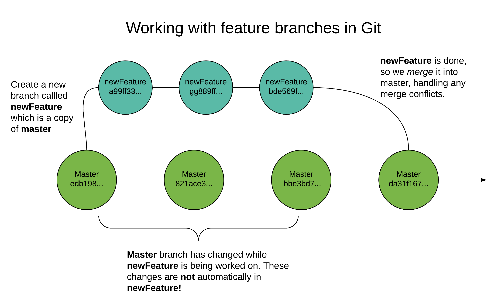

**Objective:** By the end of this checkpoint, you will be able to create branches in a Git repo.

In this checkpoint, you'll learn about *branches* in Git. A branch is a parallel version of a repository. For example, you might create a new branch called `feature/signup-form` when adding a sign-up form to a site. The starting point for this branch would be the most recent commit on `master`. Once you're on your branch, you can add, change, and remove files—and commit the changes—without affecting `master`. By the same token, `master` can change without affecting your feature branch. Then, when you have a working version of your sign-up form, and you're ready to release it to production, you *merge* your feature branch into your master branch. Then you can push that code out to your production server.



In this checkpoint, you'll get up to speed on the Git commands that you need to know to work with branches. Specifically, you'll cover the following:

* `git branch`: Used to create a new branch
* `git checkout`: Used to switch to a branch
* `git merge`: Used to merge changes from one branch into another

In your exploration of `git merge`, you'll touch upon *merge conflicts*. These arise when the branch that you want to merge into has code that's changed since you branched out—specifically, code that also changed in your feature branch. In this situation, Git can't automatically decide which set of changes should be in the final commit, and you have to decide. It's not uncommon for newcomers to Git to panic when they encounter merge conflicts, thinking that they've broken their repo. In reality, merge conflicts are just evidence that Git is working correctly. But you do need to understand how to resolve them.

As with the previous checkpoint, you should code along as you read so that you practice using these new commands.

## Key terms

* Branches
* Merge conflicts

## Creating and switching between branches

You're going to continue working with the `learn-git` repo that you created in the previous assignment. Run the `cd` command to move into that directory, and then run `git status` to verify that it's clean and there are no unstaged changes.

Imagine that you've been tasked with adding a sign-up form to this project, and the code that is currently in `learn-git` is live in production. To work on your new feature, you'll create a new branch and do your work there. From now on, it's recommended that you follow this flow whenever you're working on a project that uses Git. Reserve `master` for your production-ready code. And when it's time to add new features or fix existing ones, do your work in a separate branch. Then, when your work is done, merge it into `master`.

To create a new branch, you have two options. The first is to use the `git branch <branch-name>` command. Try that now. Run the command `git branch feature/signup-form`. Nothing obvious will happen; you won't see any logs. But if you run `git branch -a`, you'll get a list of all the branches in the local repo. When you run that, you will see something like this:

```
  feature/signup-form
* master
```

There are now two branches in your repository: `master` and `feature/signup-form`. The star `*` next to `master` indicates that it's the current branch.

To move from the master branch to the new branch, you can use `git checkout <branch-name>`. Run `git checkout feature/signup-form`, and you will see the following message: `Switched to branch 'feature/signup-form'`.

So you first created a new branch (`git branch feature/signup-form`) and then checked it out. That's two steps, and everyone knows that data scientists like efficiency gains—so now, investigate how you can do this in a single step.

First, go back to `master` by running `git checkout master`. Next, delete `feature/signup-form` so that you can recreate it using the quicker way. Run `git branch -D feature/signup-form`, and you will see a message that looks like this:

```
Deleted branch feature/signup-form (was 477f292).
```

Now, to create this branch and check it out in a single step, run `git checkout -b feature/signup-form`. You'll see a message like this:

```
Switched to a new branch 'feature/signup-form'
```

When you run `git checkout -b <branch-name>`, the `-b` flag allows you to indicate a new branch to be created before switching over to it.


## Merging a feature branch

Inside `index.html`, add this code to the bottom of the `body` element:

```html
<form name="signup" action="/signup">
    <div>
      <label for="username">Username</label>
      <input type="text" name="username" required>
    </div>

    <div>
      <label for="password">Password</label>
      <input type="password" name="password">
    </div>

    <input type="submit">
</form>
```

Save these changes in your text editor. Then stage them (`git add index.html`) and commit them (`git commit -m 'finished signup form'`).

Now, if this was a real project, you might have several other commits before you'd be ready to merge this code into `master`. But for the purposes of learning Git, you can pretend that this is all that you needed to do to complete this new feature.

To merge your changes into the master branch, move into `master`, then merge from `feature/signup-form`.

Run `git checkout master`. Before merging the changes from `feature/signup-form`, make sure to verify that you'll be getting exactly what you expected. Run `git diff feature/signup-form`, and you'll see the diff between the master and the feature branch. As expected, you'll see that from the perspective of `master`, the difference with `feature/signup-form` is that the master branch omits the sign-up form. Use `:q` to quit out of the `git diff` dialog.

You're ready to merge. Run `git merge feature/signup-form`, and you'll see a message like this:

```
Updating 477f292..aeef5c1
Fast-forward
 index.html | 13 +++++++++++++
 1 file changed, 13 insertions(+)
```


This is telling you that your previous commit in `master` (`477f292`) has been updated by merging in the most recent snapshot from `feature/signup-form` (`aeef5c1`). There's also a summary of the changes that this entailed. In this case, `index.html` is the only file that changed; 13 lines were inserted.

If you run `git log`, you'll see that there's a new entry at the top:

```
commit aeef5c13dcbcddc68918f4511e6ba93e0d9a7c47
Author: Benjamin White <benjamin.e.white1@gmail.com>
Date:   Tue May 9 14:39:26 2017 -0400

    finished signup form
```


Note that the log makes it look like your feature branch was done directly in the `master`—there's no indication that you merged from a different branch.

If you want to retain that information, you need to use the `--no-ff` flag (which stands for "no fast-forward"). To try that out, run `git reset --hard HEAD~1` to move back to where you were before the merge. Then run `git merge --no-ff feature/signup-form`, edit the commit message or run `:wq` to close the commit dialog interface, and then run `git log`. This time, your commit history will look a little different:

```
commit fed1687118db2d1b743c1fade91c4e41a40cf356
Merge: 477f292 aeef5c1
Author: Benjamin White <benjamin.e.white1@gmail.com>
Date:   Tue May 9 14:44:00 2017 -0400

    Merge branch 'feature/signup-form'

commit aeef5c13dcbcddc68918f4511e6ba93e0d9a7c47
Author: Benjamin White <benjamin.e.white1@gmail.com>
Date:   Tue May 9 14:39:26 2017 -0400

    finished signup form

//... other stuff

```

Instead of seeing only one new entry in your commit history, you see two. The `aeef5c13` commit happened in your `feature/signup-form` branch. But because you merged that branch into `master`, you can also see any commits that you made in `feature/signup-form` here in the commit history for `master`. You also get a separate commit history item for the merge commit (the one at the top).

It's recommended to get in the habit of using the `--no-ff` flag when merging branches; it makes it easier to see when feature branches were merged when you look at your commit history.

## Handling merge conflicts

The final topic that you'll learn about in this checkpoint is *merge conflicts*. A merge conflict arises when you're merging one branch into another, but the two branches have competing changes. A common scenario would be something like this: It's Monday, and you create a new branch to build a feature that you've been tasked with creating by Thursday. On Thursday morning, your work is done. Your feature branch changes the `index.html` file for the site and adds two new files.

Unbeknownst to you, another member of your team developed their own new feature on Tuesday and merged it into `master` on Wednesday. Your coworker's change also alters `index.html` at precisely the line where you linked to the two new files in your branch.

You get the green light to merge into master, and you run `git merge --no-ff feature/my-great-feature`—only to see a message indicating that the merge failed because of merge conflicts. What do you do?

Well, you'll find out now! You're going to simulate exactly the scenario that was just described. In your `learn-git` repo, make sure that you're in `master` (`git checkout master`) and that there are no unstaged changes (`git status`).

Next, create a new branch with `git checkout -b feature/foo-js`. In this new branch, you're going to create one new JavaScript file and then link to that JavaScript file in `index.html`. From the command line, run `echo "console.log('foo')" >> foo.js`. This will create a new file called `foo.js` in the current directory, with a single JavaScript command, `console.log('foo')`, in it. Open `index.html` in your text editor. Then, at the bottom of the `head` element, in the line below the `link` element, add the following:

```html
<script type="text/javascript" src="./foo.js"></script>
```

Save this change. Then, make sure to close `index.html` in your text editor. (Otherwise, you may inadvertently save code from this branch in a different branch that you'll be creating in a moment).

Once you have closed `index.html`, run `git add index.html`, `git add foo.js`, and `git commit -m 'added foo.js'` to take a snapshot of these changes.

Now, to ensure that you'll get a merge conflict, you need to go back to your `master` branch. There, you'll check out a separate branch, commit changes in it that alter one or more lines that `feature/foo-js` also alters, then merge those changes back into `master`.

Run `git checkout -b feature/bar-js`. Then run `echo "console.log('bar')" >> bar.js`. After that, reopen `index.html` in your text editor. You will no longer see the script element for `foo.js` because `feature/bar-js` branches from `master`. On the same line where you put the script element for `foo.js` a moment ago, now put the following:

```html
<script type="text/javascript" src="./bar.js"></script>
```

Save this change, then close your text editor. Back on the command line, run `git add bar.js`, `git add index.html`, and then `git commit -m 'added bar.js'`.

At this point, you have three branches: `master`, `feature/foo-js`, and `feature/bar-js`. You're going to merge `feature/bar-js` into `master`. Then, after that, you'll merge `feature/foo-js`. But when you try to do that, you'll get a merge conflict.

Run `git checkout master` to get back in your master branch. Now, merge `feature/bar-js` by running `git merge --no-ff feature/bar-js`. You'll see a message that looks like this:

```
Merge made by the 'recursive' strategy.
 bar.js     | 1 +
 index.html | 1 +
 2 files changed, 2 insertions(+)
 create mode 100644 bar.js
```

This tells you that the `bar.js` file, as well as the change to `index.html`, were merged into `master`.

Now you're ready to try merging `feature/foo-js` into `master`. Run `git merge --no-ff feature/foo-js`, and you'll get a message that looks like this:

```
Auto-merging index.html
CONFLICT (content): Merge conflict in index.html
Automatic merge failed; fix conflicts and then commit the result.
```

This message is telling you that a merge conflict occurred when Git tried to automatically merge the changes to `index.html` from `feature/foo-js` into `master`. This conflict arose because `index.html` in `master` has changed (and changed at precisely the line that `feature/foo-js` also changed) since you created the `feature/foo-js` branch as an offshoot of `master`.

Now, you need to manually resolve the merge conflict. To do this, open `index.html` in your text editor. Inside, you'll find some odd (non-HTML) text that you've probably never seen before:

```html
<!DOCTYPE html>
<html lang="en">
<head>
  <title>learn git</title>
  <link rel="stylesheet" type="text/css" href="main.css">
<<<<<<< HEAD
  <script type="text/javascript" src="./bar.js"></script>
=======
  <script type="text/javascript" src="./foo.js"></script>
>>>>>>> feature/foo-js
</head>
```


Git is telling you that there is a conflict between HEAD (which is the current commit of `master`) and the most recent commit from `feature/foo-js` (which you're trying to merge in). Specifically, this conflict occurs between `<<<<<<< HEAD` and `>>>>>>> feature/foo-js`. Everything between `<<<<<<< HEAD` and `=======` is what you have in the most recent snapshot of `master`. And everything between `=======` and `>>>>>>> feature/foo-js` is the conflicting code that you have in `feature/foo-js`.

In this case, what you ultimately want is your `index.html` to link to both `./bar.js` and `/foo.js`. That means that you just need to delete the `<<<<<<< HEAD`, `=======`, and `>>>>>>> feature/foo-js` lines. Go ahead and do that, and then save `index.html`.

Note that depending on the specifics of your merge conflict, you might want to keep both sets of changes, as you have done here. Or you might want to keep only those from the most recent version of the master branch, or only those from the most recent version of your feature branch.

It's possible to have multiple merge conflicts in the same file and multiple files with merge conflicts. You'll know that you have multiple merge conflicts in the same file if you scroll through it and see more than one block that looks like this:


```
<<<<<<< HEAD
  // ...code
  // ... code
  // ... code
=======
  // ... other code
>>>>>>> feature/my-feature
```

If you have conflicts in multiple files, that will be noted in the conflict message that prints to the command line when you first merge the two branches.

Once you've cleaned up the merge conflicts, you need to stage the changes and complete the merge commit. Run `git add index.html` to stage the changes that you just made to that file. Then run `git commit`, this time without providing a commit message. When you're taken to the commit interface, it will be prepopulated with a commit message about merging. You don't need to alter this message. Enter `:wq` to write and quit. If all goes well, you will see a message that looks like this:

```
[master 93dc247] Merge branch 'feature/foo-js'
```

Congrats! You just resolved your first merge conflict. Moving forward, if you encounter merge conflicts in the wild, first recognize that this is not an indication that something has gone wrong with Git or that you've done something wrong. Instead, this is a confirmation that Git is working correctly! Second, carefully inspect the files that Git tells you have conflicts, looking for the `<<<<<<< HEAD`,  `=======`, and `>>>>>>> feature/my-feature` markers. When you encounter such blocks, think through which set of changes you ultimately want to see in your project once the merge goes through. Alter the file accordingly to resolve the conflict, save your changes, and then stage and commit them.

## In summary

In this checkpoint, you explored how to create branches, move between them, and merge changes from one branch into another. Moving forward, make sure that you get into the practice of developing new features on separate feature branches. Then merge them into `master` when they're complete and you're ready to deploy your new feature to production.
