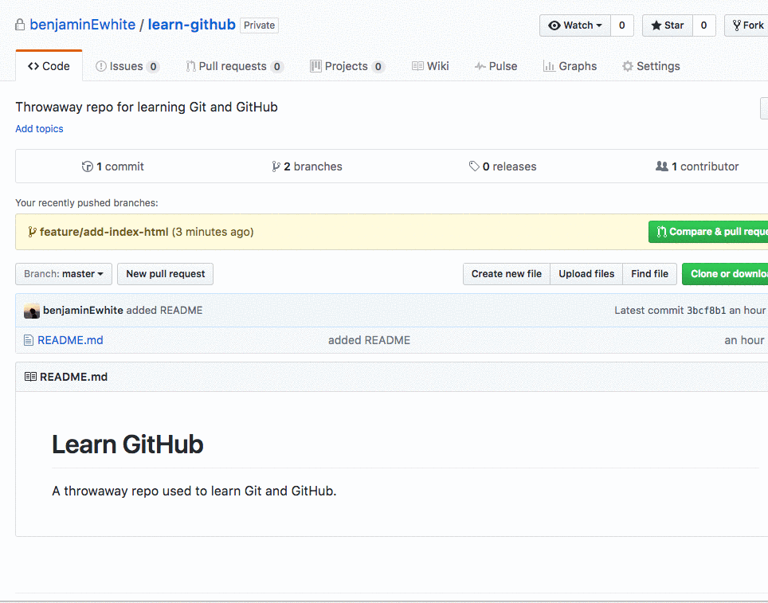
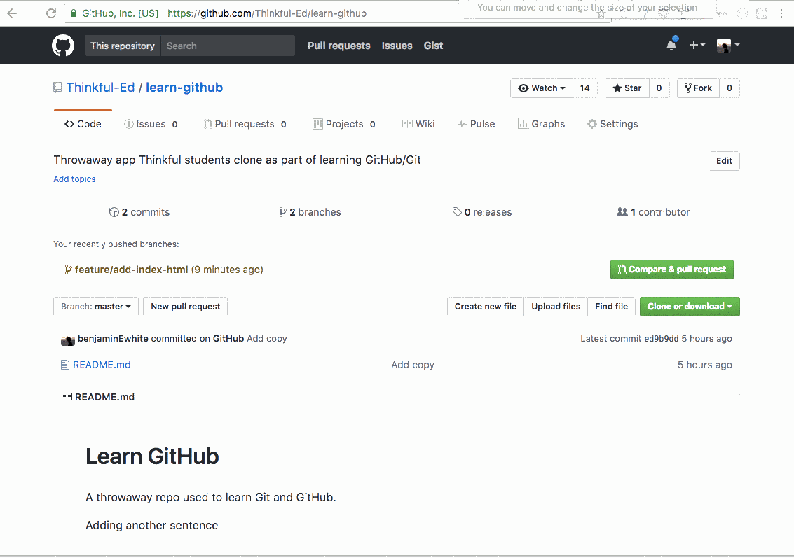
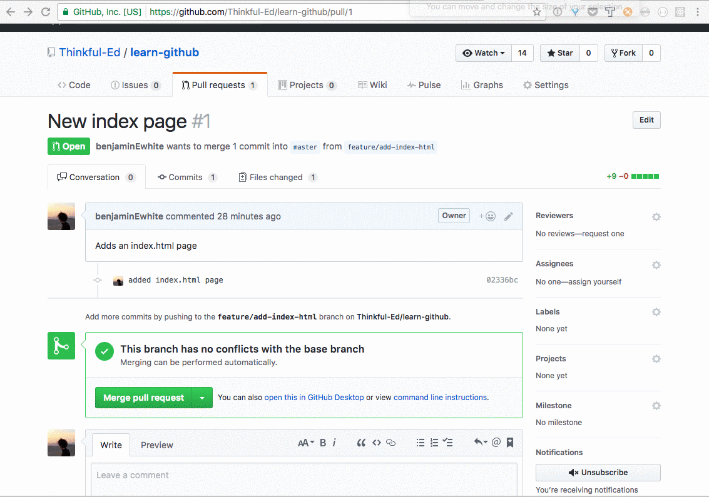
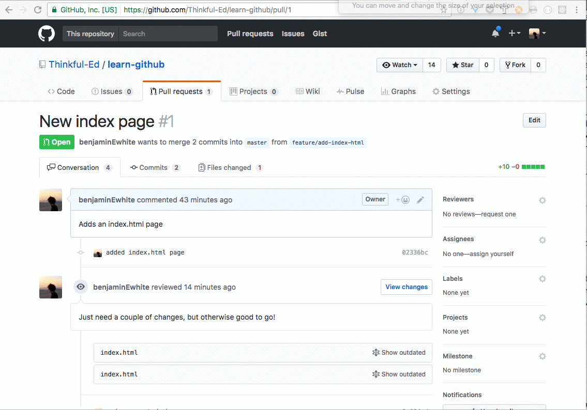
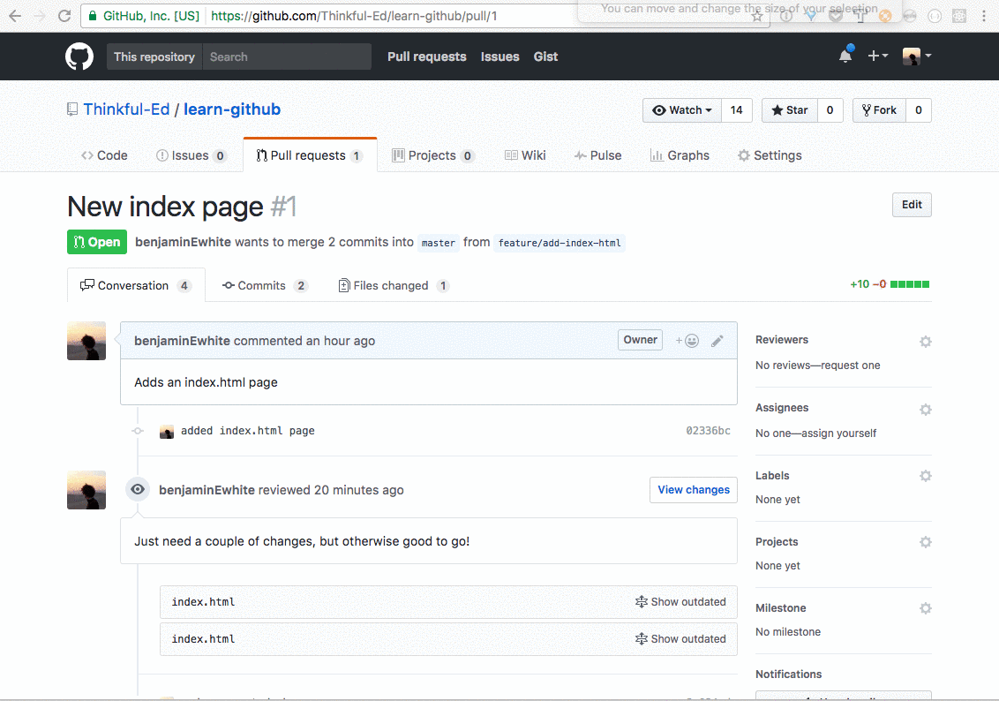

**Objective:** By the end of this checkpoint, you'll be able to back up your code on GitHub.

You've learned the basics of version control with Git, but up to this point, you've been confined to your local development environment.

In this checkpoint, you'll learn the basics of working with GitHub, which is the most popular web-based Git repository system. With GitHub, you can push your repositories up to the cloud. This allows you to back up your code and collaborate with others.

First, you'll sign up for GitHub and practice *cloning* existing repositories down to your local machine and pushing your local repositories up to GitHub.

Second, you'll briefly learn about pull requests. A *pull request* is when you formally request to merge one version of a repo into another. GitHub has a great user interface for collaboratively discussing, reviewing, and approving pull requests.

## Key terms

* Cloning
* Pull request

## Sign up, push up

If you don't already have an account on GitHub, you'll need to sign up for one, which you can do on [GitHub's sign-up page](https://github.com/join?ref_cta=Sign+up). You'll need to provide your email address, password, and desired username. When you submit the form, if the username that you want is already taken, GitHub will prompt you to choose a new one.

Next, you'll be taken to a screen where you select the plan you want. Choose the default, free plan, and make sure that the **Help me set up an organization next** checkbox is cleared. After that, you'll be prompted to complete a short, optional survey.

Voila! With that, you've created a GitHub account. You'll be taken to a welcome screen with two options: reading the getting started guide or starting a project. If you want to, feel free to spend a few minutes going through GitHub's guide. Otherwise, click the **Start a project** button.

You'll be taken to a screen that says that you need to verify your email address. You can do this by going to your inbox and finding a message from GitHub asking you to verify your email address. Inside, there will be a link that you can click to complete the verification.

Once you've verified your email address, you can go to [GitHub's website](https://github.com) to start a new project. You'll be greeted by the screen that you'll see from now on whenever you create a new project on GitHub.

For the repository name, put `learn-github`. The description field is optional, but you should get in the habit of always providing a short, one-sentence description of your project when you create a repo. You can enter something like "Throwaway repo to learn Git and GitHub."

You can choose to make a repository public or private. But so that your mentor and graders can see your work, you should make repositories for this program public.

Leave the **Initialize this repository with a README** checkbox cleared. A *README file* is where you provide an overview of the purpose of your project, how to run it, and things like that. When you visit a repo on GitHub, if there's a `README.md` file (`.md` is for [Markdown](https://daringfireball.net/projects/markdown/syntax), which is a simple language that reads like plain text but compiles to HTML) in the root of the repo, Git will display the contents of that file as the documentation for your project.  It's always a good idea to include a `README.md` file. But right now, you're going to create a local repo from scratch and push it up to GitHub. And if you already have a version of your repo up on GitHub, you'd have to merge it into your local version.

Click the **Create repository** button, and you'll be taken to a screen with setup instructions for your repository. You're going to create a repository locally, then push it up to this new GitHub repository. So you'll follow the " ... or push an existing repository from the command line" instructions.

First, though, you need something to push up. From the command line, create a new folder called `learn-github` (`mkdir learn-github`). Note that this is the same name as your remote repo on GitHub. Although nothing requires you to use the same folder name locally, it's a good idea to be consistent.

Next, move into the `learn-github` directory, and create a `README.md` file. Run `touch README.md`, and then open this new file in your text editor. Paste in the following code, then save.

```
# Learn GitHub

This is a throwaway repo used to learn about working with Git and GitHub.

```

Now you need to initialize Git for this project, stage this new file, and commit it. Run `git init`, then `git add README.md`, followed by `git commit -m 'added a README'`.

At this point, you have a new local repository with a single commit and a single file. How do you push this up to GitHub? This is where the instructions on your repo page come in.

```
git remote add origin https://github.com/<yourUserName>/learn-github.git
git push -u origin master
```

The first command tells Git that it should add a new *remote* repository named `origin`, which lives at `https://github.com<yourUserName>/learn-github.git`. When this command runs, Git will alter its config file in the repository so that your local repo points to your GitHub repo.

The second command tells Git to *push* your local commit history for the repo up to the remote repo `origin`. Specifically, you're saying to push to `origin` the local branch called `master`. The `-u` flag sets things up so that moving forward, when you want to push from your local master branch to the remote master branch, you only need to run `git push` instead of `git push origin master`.

Go ahead and run these two commands now. After you run `git  push -u origin master`, you'll see an output that looks like this:

```
Counting objects: 3, done.
Delta compression using up to 4 threads.
Compressing objects: 100% (2/2), done.
Writing objects: 100% (3/3), 274 bytes | 0 bytes/s, done.
Total 3 (delta 0), reused 0 (delta 0)
To github.com:<yourUserName>/learn-github.git
 * [new branch]      master -> master
Branch master set up to track remote branch master from origin.
```

This message tells you two things: Your local repo has been pushed up to the repo that you created on GitHub. And your local master branch is now set up to track the remote master branch. This means that in addition to being able to push local changes up to the GitHub repo like you just did, you'll also be able to pull down changes from GitHub to your local repo. This functionality is essential for collaborating on code with others, as well as for working on the same codebase across multiple computers (backing up your work on GitHub).

Head back over to your repo on GitHub, and refresh the page. Now, instead of the setup instructions, you will see the single-file repository that you just uploaded. You'll also see the `README.md` file rendered as HTML. Remember, GitHub looks for a `README.md` file in the root of each project; if it finds this file, it displays it as the documentation for the repo.

## Cloning repos

The next topic to consider is *cloning*. Cloning is when you first make a copy of a remote repository on your local computer. If you join a data team that uses Git and GitHub and you start working on existing projects, you'll probably need to clone these projects onto your local computer. Or, if you're working alone but across several different computers, you might create a repository on one computer, push it up to GitHub, and then clone it onto the other computers that you want to work on.

To practice cloning, you'll clone the starter files for a shopping list app that is part of another Thinkful program. In your browser, go to the [GitHub repo for the shopping list app](https://github.com/Thinkful-Ed/shopping-list). Click the **Clone or download** button, which will have the URL that you need to clone from.

In this window, you have two options for connecting with GitHub from the command line: HTTPS or SSH. When you clone a repository using HTTPS, you will be prompted to enter your Git username and password from the command line. The SSH approach requires you to set up SSH keys, which get used for authentication, which means that you don't have to enter your credentials from the command line. For now, you'll use the HTTPS approach, as it doesn't require setup. That said, it's a good idea to spend a few minutes [setting up SSH keys](https://help.github.com/articles/connecting-to-github-with-ssh/) at some point; this will save you having to enter your GitHub credentials each time that you want to interact with a remote repo from the command line.

Copy the URL in the **Clone with HTTPS** interface. Then, from the command line, navigate to a directory that you don't mind storing a new project in. From there, run `git clone https://github.com/Thinkful-Ed/shopping-list.git`. (That URL is the one that you just copied, so you can just paste it in instead of typing it out.) You will see an output that looks like this:

```
Cloning into 'shopping-list'...
remote: Counting objects: 32, done.
remote: Total 32 (delta 0), reused 0 (delta 0), pack-reused 32
Unpacking objects: 100% (32/32), done.
```

If you run `ls`, you'll see a new folder called `shopping-list` in your current directory. Move into the repo (using `cd shopping-list`), and then run `ls` and `git status`. As you can see, you have the same files locally that appear in the remote repository, and the local repository already has Git configured.

## GitHub and branches

Working with branches on GitHub is relatively straightforward. Next, you'll create a new branch of the `learn-github` project to see how.

Change directory (`cd`) into that project folder from the command line, then run `git checkout -b feature/add-index-html`. Next, run `touch index.html`, and open your new file in your text editor. Inside, paste and save the following code:

```html
<!DOCTYPE html>
<html>
<head>
  <title>Learn GitHub</title>
</head>
<body>
  <p>Just a throwaway index.html page.</p>
</body>
</html>
```

Run `git add index.html` followed by `git commit -m 'added index.html'` to track and commit this new file.

Now you need to push this new branch up to GitHub. If you run `git push` at this point, you'll get back the message "Everything up-to-date." This is telling you that the local branches that track GitHub (at this point, only `master`) are in sync with what's on GitHub. But this does not mean that your local `feature/add-index-html` branch is on GitHub.

To get it up there, you need to initially provide more details when you run `git push`. Run the command `git push -u origin feature/add-index-html`. This command tells Git to push the local branch called `feature/add-index-html` to `origin`. After running this command, you'll see an output that looks like this:

```
Counting objects: 3, done.
Delta compression using up to 4 threads.
Compressing objects: 100% (3/3), done.
Writing objects: 100% (3/3), 395 bytes | 0 bytes/s, done.
Total 3 (delta 0), reused 0 (delta 0)
To github.com:<yourUserName>/learn-github.git
 * [new branch]      feature/add-index-html -> feature/add-index-html
Branch feature/add-index-html set up to track remote branch feature/add-index-html from origin.
```

As you can see, a new branch has been created at `origin` (`github.com:<yourUserName>/learn-github.git`). Because you used the `-u` flag, if you need to push new changes up to the remote branch moving forward, you can run `git push` without `origin feature/add-index-html`.

Back in the browser, refresh your repo page on GitHub. Click the **Branch** button, and you can switch between `master` and `feature/add-index-html`.

## Getting upstream changes

The final topic you're going to cover in this checkpoint is how to pull down changes from a remote repo to your local repo. To do this, you're going to edit the master branch of the `learn-github` repo on GitHub, commit those changes, and then pull them down locally. The process that you'll use to get these changes is the same one that you'd use if you were collaborating on a codebase and your collaborators were developing locally and pushing their changes up to GitHub.

Go to your repo page on GitHub and make sure that you're looking at the master branch. Next, click the link for the `README.md` file, and then click the **Edit this file** ✏️ icon to edit the file directly on GitHub.

###### Although it's possible to do all your coding on GitHub, Thinkful's data science team strongly advises against this. You'll be much further ahead if you code locally with a dedicated text editor and push your changes up to GitHub. You're just using this approach now so that you can create some changes in your remote repository and practice pulling down locally.

At the bottom of the README, add an additional sentence (for example, "Adding another sentence"). Then scroll to the bottom of the page to the commit interface. Add a commit message, make sure that the **Commit directly to master branch** checkbox is selected, and click **Commit changes**.



Now you're ready to get those remote changes into your local repo. Navigate to your local `learn-github` project folder, then make sure that you're on the `master` branch (`git checkout master`). Next, run `git fetch`. You'll see an output that looks like this:

```
remote: Counting objects: 3, done.
remote: Compressing objects: 100% (2/2), done.
remote: Total 3 (delta 0), reused 0 (delta 0), pack-reused 0
Unpacking objects: 100% (3/3), done.
From github.com:benjaminEWhite/learn-github
   3bcf8b1..ed9b9dd  master     -> origin/master
```

This is telling you that you've pulled new commits down from GitHub. At this point, you've pulled these changes down to your local computer—but you have not merged them into your local version of `master`.

The `git fetch` command pulls down remote changes to your local environment but leaves your local branches untouched. You can run `git status` to verify that this is the case. You should see something like this:

```
On branch master
Your branch is behind 'origin/master' by 1 commit, and can be fast-forwarded.
  (use "git pull" to update your local branch)
nothing to commit, working tree clean
```

This message is telling you that your local copy of the master branch is one commit behind the remote version. Git knows this because you've used `git fetch` to download the remote changes.

To get your local repo in sync with the remote one, run `git merge`. You'll see a message like this:

```
Updating 3bcf8b1..ed9b9dd
Fast-forward
 README.md | 4 +++-
 1 file changed, 3 insertions(+), 1 deletion(-)
```

This is telling you that the remote commits have been incorporated into your local version of the branch. If you run `git status` now, you'll see that your branch is clean and up to date with the remote version (`origin/master`).

To review, you went through two steps here to sync your local branch with the remote one. You ran `git fetch` and then `git merge`. Git also has a command that will do both of these steps: `git pull`. When you run `git pull`, it will pull down remote changes and automatically attempt to merge them.

Now you know how to pull down remote changes and keep your local repo in sync. One final note: in the previous assignment, you learned about merge conflicts. In the example that you walked through, you intentionally created a merge conflict between two local branches. When you're working on GitHub repositories that other developers are also working on, the likelihood of merge conflicts increases.

The moral of the story here is that if you run `git pull` (or `git fetch` followed by `git merge`) and there's a merge conflict, don't panic! Nothing is broken; this just means that Git is doing its job. Specifically, it means that on the upstream repository (that is, the remote one that your local repo is tracking), the branch that you're trying to sync with has changed since you last synced, and you've made local commits that are in conflict with those unsynced changes. To resolve conflicts, you'll need to use the same process that you went through in the previous checkpoint. Be aware, though, that to understand how to best resolve the conflict, you may need to get in contact with your collaborators to understand the changes .

## Pull requests

In this section, you'll explore how to manage [pull requests](https://help.github.com/articles/about-pull-requests/) (PRs) in GitHub. A *pull request* is when a repository contributor makes a formal request to merge a set of changes from one branch of a repo into another. For example, imagine that you're a contributor to an open-source repository. You've added a new feature, you've tried it out locally, and you're confident that it works. Once you're ready to have that feature merged into the master branch of the project repository, you would make a pull request.

GitHub provides a nice user interface for managing pull requests. It allows contributors to see which changes are being requested and allows for *code review*, which is back-and-forth communication and iteration on a proposed set of code changes, with the goal of ensuring high-quality, working code that everyone is happy with.

Typically, when you make a pull request, someone will look over the changes. If they're happy with them, they may simply merge the pull request, in which case the changes that you requested will go through. More often than not, though, there will be at least some back-and-forth and tweaking of the code to get it ready for production.

To get a sense of how pull requests work, in the remainder of this checkpoint, you're going to create a simple pull request for the `learn-github` repository that you created earlier in this module.

Recall that in the previous assignment, you pushed the `master` branch of `learn-github` up to GitHub. You also created a feature branch called `feature/add-index-html` and pushed it up to GitHub. The rest of the instructions in this checkpoint assume that you followed those steps. So if you didn't, go back and get your local and remote repos in order.

### Creating, reviewing, and merging a pull request

To create a pull request on a GitHub repo, click the **Pull requests** tab from the main repo page. There, click **New pull request** to start setting up your PR.

You'll be taken to an interface where you can compare changes. In this screen, you'll indicate the `base` and the `compare` branch. The `base` is the branch that you want to merge changes into. The `compare` branch is the one that you want to merge from.

For your pull request, set `base` to `master`, and set `compare` to `feature/add-index-html`. Once you make those selections, the page will refresh, and you'll get a list of the commits that will be merged from `feature/add-index-html` into `master` when the PR is merged. Below that, you'll see a list of files and changes. In this case, you're only adding a single file, so on the left, you'll see a grey square, and on the right, you'll see a green square for the new `index.html` file. If this PR involved changes to existing files, you'd be able to see the original file on the left compared to the changes on the right.

Click the **Create pull request button**, and you'll be taken to a form that prompts you to add a name and a description for the pull request. You should provide both. Generally, you want the name to be short and descriptive. On repos with many contributors and lots of activity, maintainers want to be able to understand the pull request at a high level just by reading the name.

The description is where you provide details. For this simple PR, there's not much to say, but if you were making a PR that fixes a bug or adds a new feature, you'd want to provide any details that collaborators need to know to understand your PR's purpose.

Once you've set the title and description, click **Create pull request**. The page will update, and you'll now see a **Merge pull request** button. Hold off on pushing that for just now!



At this point, your pull request is live. Because there are no other collaborators on this repo, the idea of reviewing it is a little bit strange. But to give you a feel of what the review process consists of, you'll learn about that flow.

Click the **Files changed** tab, and you'll be able to see any and all changes that are part of this pull request. Hold your pointer over any of the lines in the `index.html` file, and you'll see a plus ➕ icon appear. When you click that plus sign, you can add review comments. Review comments are the place to leave questions, comments, and suggestions about the requested set of changes.



In the demo above, two review comments are added to the `index.html` page. On the line with the opening HTML tag, the contributor is asked to add a `lang` attribute. Then, inside the body element, the contributor is asked to add an `h1` element.

Comments are threaded, so you and your collaborators can have a back-and-forth about particular parts of the code. Typically, one or more reviewers would leave comments on your PR, and you'd respond.


Back in your local development environment, you can make additional changes on your feature branch and push them up to the remote repo branch. When you do so, those changes will make their way to the PR.

Now, make the requested changes to the `index.html` file. In your text editor, update the opening HTML tag so that it looks like this: `<html lang="en">`. In the body, before the paragraph element, add an `h1` element that looks like this:

```html
<h1>Learn GitHub</h1>
```

Save these changes, then run `git add .` followed by `git commit -m 'made requested changes for pr'`. Then push these changes up to GitHub with `git push`.

If you refresh your repo page on GitHub, you'll notice three things. First, original comments will be hidden because they're on outdated commits. You can still access these comments by clicking **Show outdated**.  Second, if you click the **Commits** tab of the PR interface, you'll see that your new commit is listed in the commits for this PR. And third, if you click the **Files changed** tab, you'll see that it reflects the most recent changes that you just pushed up.



Once a PR has been approved, either you or another maintainer (depending on the policies for the repo) will be responsible for merging. You can do that by clicking the **Merge pull request** button. When you do this, the feature branch will be merged into the target branch (in this case, `master`). You'll also see an option to delete the feature branch from GitHub. Usually, there's no reason to retain a copy of the branch on GitHub once it's been merged. So unless you have a specific reason not to, go ahead and delete the branch.




