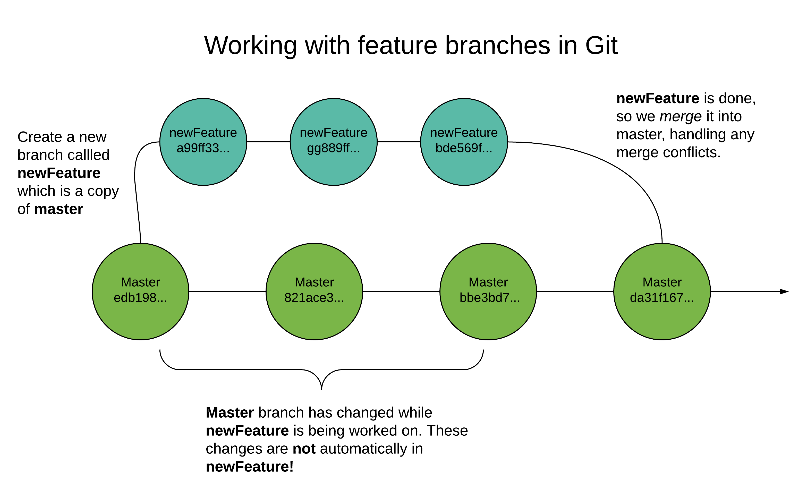

**Objective:** By the end of this checkpoint, you'll be able to set up Git on your machine.

In this checkpoint, you'll get up to speed on Git, which is the most popular *version control system* in existence today. *Version control* refers to the process of managing changes to code, and it's a critical part of modern web development.

First, you'll get up to speed on what Git and version control are all about. A lot of newcomers to Git find the mental model to be challenging, so you'll focus on nailing that down immediately.

Next, you'll walk through configuring Git to work in your local development environment.

## Key terms

* Version control
* Git
* Branches
* Commit

## What is Git?

Before you configure Git or learn commands, it's important to build up a mental model of what Git is all about. For many newcomers to Git, the challenge lies less with learning commands and more with understanding the underlying mental model that you need to know to use Git effectively and efficiently.

As with anything, the devil is in the details. But at a high level, there are really two key ideas to grasp about Git, and everything else more or less falls out from them. So here, you'll focus on taking snapshots of code and creating distinct branches of code.

### Snapshots

Being able to take snapshots (otherwise known as *commits*) is valuable for a number of reasons. But crucially, it makes it safe to make deep (or shallow) changes to your code with less fear that you're going to destroy everything. For example, if you try something really wild in a fifth commit or snapshot, and you realize it's not working, Git makes it possible to return to an earlier state of the code. You could, for example, return to your fourth snapshot, which was working fine, and then continue making changes from there. What's more, you go back to an earlier version of a single file from an earlier snapshot.

This ability to take snapshots of your code is extremely valuable in its own right. But it also enables branching code, which is crucial for collaboration, and what you'll consider next.

### Git is about collaboration and branches

Alongside the idea of snapshots, the other mental model that's important to grasp is the idea of *branches*. Branches allow you to have different, diverging versions of a code repository.

For example, you might have a model that is live and working smoothly. The code that you actually deploy to production is stored on the *master branch*, which is the default branch in Git. If you have a repository with a single branch, that branch will probably be called `master`.

Imagine that you've decided on a new feature that you want to add to your model. It's probably going to take about two weeks to design, build, and iterate on before you'll be ready to release it into production. You'll want to take snapshots of the code for your new feature as you go along, but you don't want those changes to go into production yet.



Fortunately, you know all about branching. You create and *check out* (that is, work on) a new branch that you call `newFeature`. Over the next couple of weeks, you make several commits in your feature branch as you iterate on the new feature.

Meanwhile, during that same two weeks, you get a couple of bug reports about the main model. You learn that there's a glaring typo in your README file, and you just can't wait to fix it. The `newFeature` branch is off on its own creating a wonderful new feature for your model, with no idea that you've now changed the `master` branch to fix some bugs.

At the end of two weeks, `newFeature` is ready to go into production. At that point, you *merge* `newFeature` into `master`. You end up with a new commit on `master` that contains everything from the previous commit on `master`, plus the changes made in the `newFeature` branch.

Because of branching, you've been able to ignore changes to the production-ready code on the master branch. You could simply go about your business figuring out how to implement the new feature. When it's finally time to release the new feature, Git makes it painless to merge this new feature into the changed master branch. This functionality is useful when you're working on your own. But once you're collaborating with others, it becomes even more valuable.

#### Using branching to support collaboration

Imagine that you and another data scientist are working on the same codebase. The two of you are developing separate, new features for a model. Unbeknownst to you both, feature X (which your collaborator is working on) and feature Y (which you're working on) both rely on an earlier feature (call it feature A).

The data scientist working on feature X uses the existing feature A to complete their work. Meanwhile, you find that with just a small change, feature A would be much better suited to feature Y, which is your current responsibility. So you make the change to feature A, not knowing that your collaborator is depending on the original feature A.

Now it's time for you both to ship your new features. But your respective features have different expectations about their common dependency (feature A); your code actually changed feature A slightly. So whose code is right? And how should you manage the conflicting versions of the code?

Git won't tell you who is right or how to best handle the conflict, but it will tell you when you have conflicts like this so that you're forced to fix them. This ability to manage conflicts is essential to collaborative coding. In this example, you only considered two people working on the same project, but you can imagine that branches and conflict management become even more important for larger projects with many contributors.

If you can wrap your head around the idea of snapshots and branching, you can get good at Git (and GitHub). If you're like many learners, you're going to get frustrated at times when learning about the particulars of, say, resolving merge conflicts in Git. At those moments, it's especially important to keep the basic mental model of Git in mind; it will help you reason about what's going on and how you should respond.

## Setting up Git

Now, you'll get set up to use Git locally. The good news is that this will only take a moment!

### Installation

#### Mac users

If you're on a Mac, your computer came preinstalled with Git. You can verify this by running `git --version` from the command line. If Git is installed, you'll see something like `git version 2.10.1 (Apple Git-78)`. Your exact version may differ, and the specific version is not super important.

Go ahead and skip down to the *Global configuration* step below.

#### Windows users

If you're a Windows user, you installed Git when you installed Git Bash in the previous checkpoint.

If for some reason you didn't install Git Bash earlier, make sure to do that now. You'll need it to run Git.

To confirm that Git is working, open a new Git Bash command-line window and run the command `git --version`. You'll see something like `git version 2.10.1.windows.1`. Your exact version may differ, and the specific version is not super important.

### Global configuration

The final setup step that you're going to do is set up a global username and user email for Git. Later, when you're creating commit messages in a Git repository, your messages will be associated with the user that you've set up.

From the command line, run the following two commands, substituting your own name and email in for Beyonce's:

```
git config --global user.name "Beyonce Knowles"
git config --global user.email "beyonce@thinkful.com"
```

Now, any time that you make commits to a Git project on your computer, this global-level user info will be associated with your commit messages.

In case you're wondering, it's possible to configure Git to override these settings in a particular project. But that is not a common need, so you won't learn about it here.
