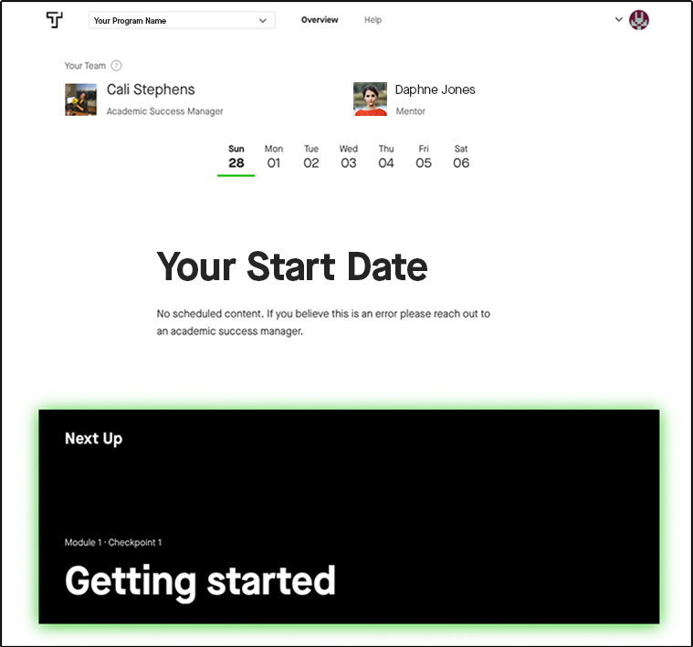
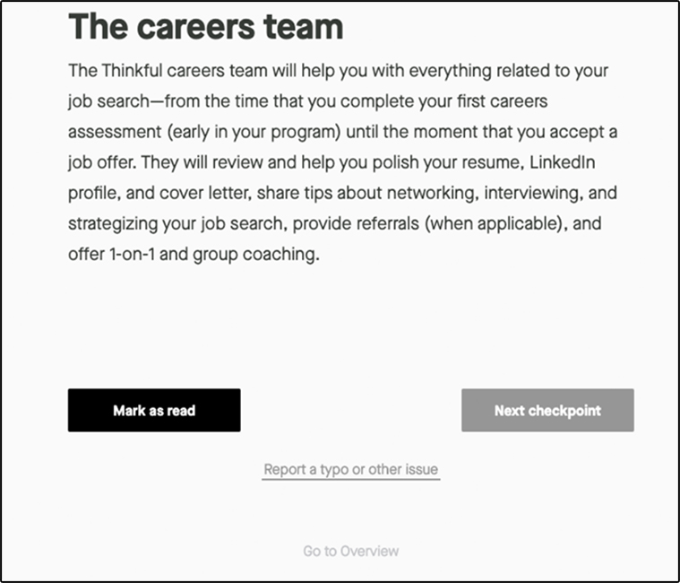
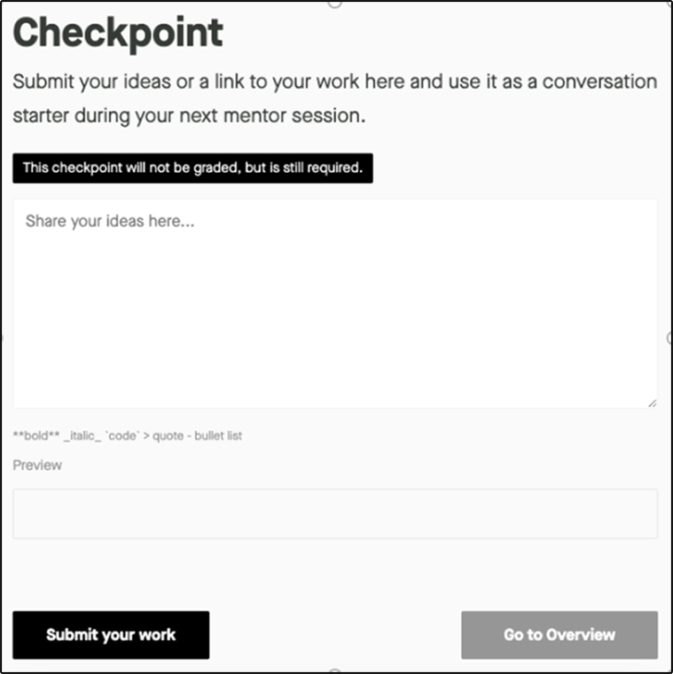
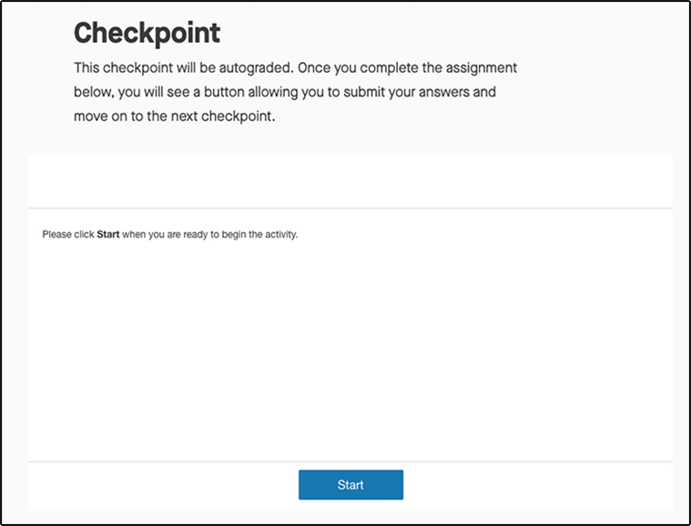
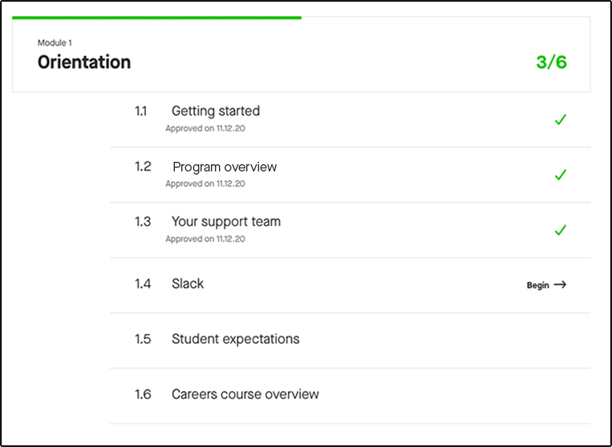
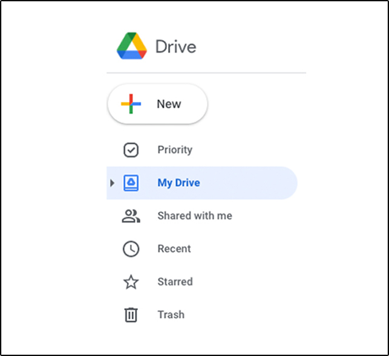
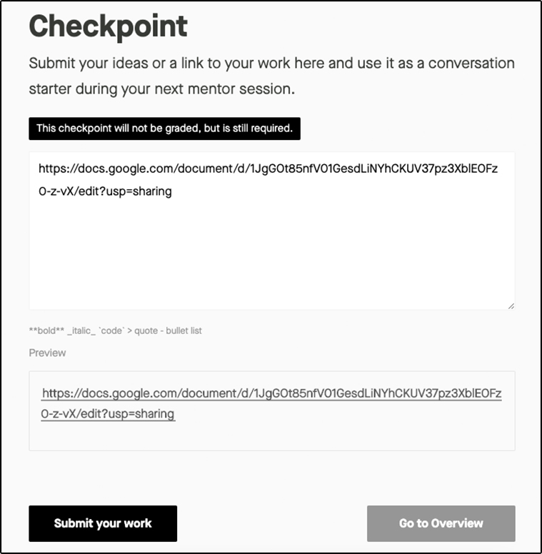

## Learning objective

By the end of this checkpoint, you should be able to identify the different
curriculum pieces of your program, the types of assignments that you'll
complete, and what is required for graduation.

## Overview 

Your program was carefully designed to give you the knowledge and skills that
you need to get a job in your chosen field. In this checkpoint, you'll learn the
major components of your program as well as what you can expect for assignments and
grading.

## Dashboard and curriculum overview

Thinkful programs are composed of courses, modules, and checkpoints. Courses are
the major topics of the program, modules are the units within a course, and
checkpoints are individual lessons within a module.

On [your Overview page](https://overview.thinkful.com/), you will see a list of
the curriculum modules to complete before you graduate. 

You'll always see the next checkpoint you need to complete at the top of your
**Overview** dashboard.

Take a look at the following video for a more in-depth overview of your Thinkful dashboard. 

<iframe id="kaltura_player_1608663884" src="https://cdnapisec.kaltura.com/p/2315191/sp/231519100/embedIframeJs/uiconf_id/45331192/partner_id/2315191?iframeembed=true&playerId=kaltura_player_1608663884&entry_id=1_csahf1mh" width="900" height="506" allowfullscreen webkitallowfullscreen mozAllowFullScreen allow="autoplay *; fullscreen *; encrypted-media *" frameborder="0"></iframe>

### Lesson types and assignments

You will be required to complete every lesson in your program. And each lesson
will contain a learning objective for you to master. These learning objectives
are assessed through different types of lessons, which are called checkpoints:

#### Reading
These checkpoints have no assignment at the end. Click **Mark as
Read** to move on to the next checkpoint.

Below is an example of a reading checkpoint:

#### Self-approved
These checkpoints include short written assignments that you
will need to submit but that won't be graded. Often, self-approved assignments
are used as building blocks for larger assignments, so make sure to save a copy
of all your work before submitting! Click **Submit your Work** to progress.

And this is an example of a self-approved checkpoint:

#### Auto-graded 
These checkpoints include multiple-choice, matching, or other
sets of questions that must be answered before moving on to the next lesson.
These questions assess your understanding of the content in the lesson and often
build upon it with real-world scenarios. To complete these assignments, click
**Start**, **Submit**, and then **Next Checkpoint.**

Here is an example of an auto-graded checkpoint:

#### Human-graded
These checkpoints contain assignments that will be approved by
a grading team. Human-graded assignments often require more time to complete
than auto-graded or self-approved checkpoints and can be building blocks for
larger projects. There will be a box in which you can submit your work at the
end of the checkpoint. It is helpful to provide context for your grader, like
your thought process when completing the assignment, any questions that you have,
and concepts that you're struggling with. This allows the grader to provide you
with more accurate, specific, and detailed feedback. 

Within three to five business days, these assignments will be returned to you
with specific feedback. Sometimes, you may be asked to revise and resubmit the
assignment. It's important for you to know that receiving feedback is not a
negative thing; rather, it is designed to help prepare you for feedback and
critiques in the workforce. Read the feedback carefully, make the adjustments,
and resubmit the assignment to be graded again. If you do receive a revise and
resubmit, you will need to do so within one week of receiving feedback.

If you have new feedback on one of your graded checkpoints, the **Course
Outline** anchor bar on your **Overview** dashboard will turn purple and say
**New Feedback**.

And this is an example of a human-graded checkpoint:

Just because a checkpoint is self-approved or auto-graded doesn't mean you can
skip the work required. It is crucial that you complete every assignment in the 
timeframe dictated by your specific program. The ability to complete work
independently and to self-evaluate is crucial to landing a good job and getting
promoted. Try to remember this as you embark on this e-learning experience—even
if it feels weird at first.

If you rush through your program without really absorbing the knowledge
presented, you'll only make it harder on yourself when you're in your job search
and starting your new career.

These checkpoints follow a sequential progression, which means that they must be
approved before you can proceed to the next steps. You can see the completion
status of your checkpoints in the course outline on your **Overview** dashboard.

### Capstone projects and live assessments

Throughout your course, you will have to complete larger capstone projects and
live assessments that are evaluated by the grading team. Sometimes, live
assessments are mock interviews, and other times they are presentations of a
capstone or other larger project. Review your Course Catalog to see the
specifics for your program.

#### Capstone projects

Your capstone projects will be the most valuable thing that you leave your
program with. Your portfolio of capstone projects will be what you show to
employers to demonstrate that you are ready to work.

Capstones can be hefty projects. A typical capstone can take about one to two
weeks to complete. You will also want to plan for revision time. And don't worry
if you don't pass on your first attempt; that's common. You’re going to find
that your capstones have a lot of moving parts. This is reflective of the work
that you will deliver in the workplace. It is very rare that you will submit a
major project without getting revisions from your manager or project lead.

Depending on your program, some capstones allow you some leeway in choosing a
topic. When choosing a topic for these capstones, it can help to pick something
that aligns with one of your hobbies or interests. It's important to have fun
with this! You will put more heart into your work if you are enjoying yourself.
This can also be an opportunity to show employers your personality.

If you are aiming to get into a very particular industry, it may be helpful to
have at least one of your capstones built around that subject.

#### Mock interviews

To get a job, you not only need to have the right technical skills, but you also
need to perform well in demonstrating what you know—which is itself a skill that
requires practice. Every program has at least one mock interview (some will have
several) for you to complete. These mock interviews are designed both to assess
your mastery of the skills in the program and to prepare you for real interviews
once you begin the job search.

You'll get written feedback for each mock interview, which you can go over with
your mentor to shore up any weak spots in your knowledge. To schedule these
interviews, you'll get a prompt on your dashboard at different points in the
course.

Before each mock interview, it is recommended that you set aside time to
prepare. You should also run through some practice questions with other students
during your group work sessions. Once you pass your mock interview, your goal
will be approved, and you'll move on to the next module. If you don't pass on
your first try, you'll have the chance to study and retake the interview. If you
don't pass after two attempts, your academic success manager will chat with you
about your progress in the program.

### Careers course

In addition to the core content, you will also complete Careers modules
throughout your program. These modules are intentionally woven into your program
and are meant to be completed at the point in which they appear in the
curriculum. They will also be required for graduation. More details on the
Careers course can be found in a later checkpoint.

## Graduation

There are a few components to graduating from your Thinkful program. *All*
content must be completed by graduation day in order to graduate. This includes
checkpoints and their assignments (no matter the grading type), projects,
capstones, mock interviews, and Careers modules.

Make sure to follow your syllabus and weekly cohort schedule and schedule any
live assessments well in advance. Knowing what capstones and other projects are
coming up and planning your time accordingly will be vital to your success in
your program. It will take hard work, but if you plan and stay on track, you
will be successful!

## Assignment

Are you ready to get started on your new career journey? Start by submitting
your first assignment. This assignment will also show you the process for
submitting your coursework. In a text document, answer the following questions:

-   Why are you taking this program?

-   How do you see your life changing by learning your program-specific skills?

-   How would you describe your ideal career?

This will be an intense (and rewarding) program, and there may be times when you 
lose your motivation. In times like those, it is important to remember your 
"why." Reminding yourself why you are doing this will help you move forward and
persevere.

Because you will want to save this as a document, typing your answers into the
box below won't be enough. Make sure to save your answers in a place that you can 
easily access in the future. You can share files using the following steps:

1.  Sign up for a [Google Drive](https://www.google.com/drive/) account.

2.  Upload your file to the drive.

    

3.  Turn on link sharing for your file.

4.  Paste your link in the submission box.

You will learn other ways to share files in the future, but this method will
allow you to share files with anyone, anywhere.
