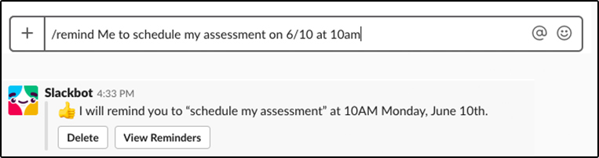

## Learning objective

By the end of this checkpoint, you should be able to join Thinkful's Slack
community.

## Overview

Even though your program is remote, you're not alone. Thinkful uses the
messaging application Slack, which serves as a space for you to chat with your
peers, collaborate, get help, and grow your professional network.

This checkpoint covers how you can join the Thinkful Slack team and the
guidelines that have been established to keep it a supportive, thriving
community.

## Slack setup

To start using Slack, first, you need to create an account. To do this, follow
these steps:

1.  Find your email invitation to Thinkful's Slack team. (When you enrolled in
    your program, you should have received an email inviting you to the Slack
    community at thinkful.slack.com. If you didn't receive that email, email
    <success@thinkful.com> for help.)

2.  Click on the **Join Now** button in the email.

         
3.  Complete your profile. Fill in your name, handle, and other basic
    information. At this point, you're also given options to download Slack's
    desktop and mobile apps. It's recommended that you download both.

4.  Join your program channel and any local groups that interest you.

You will be added to two cohort-specific channels before your program begins:

-   **Cohort channel:** This is where your instructor will post meeting times,
    updates, and important information regarding your program. You will also be
    able to collaborate with your fellow cohort members in this channel.

-   **Support channel:** In this channel, you will be able to create support
    tickets for your instructor team and TAs while you are working through your
    activities.

## Slack features and productivity tips

Slack has a ton of ways to help you use the platform more effectively and
increase your productivity. Here are a few key tips:

-   **Master notifications.** If you aren't careful, Slack notifications can
    take over your life; this means that you can easily get overwhelmed or miss
    the information that you are really interested in. Slack gives you a lot of
    power to adjust what you get notifications for and how those notifications
    look. Go to **Preferences** to set your notifications by channel or to add
    keywords that you want to be alerted to. You can also change what you are
    notified about in the app, on your phone, and by email. Play around and see
    what works for you. In the middle of something important? You can also mute
    your notifications. Read more [here](https://slack.com/help/categories/360000047906) to learn how to adjust your profile and 
    preference settings. 

-   **Threads keep it clean.** Many of Thinkful's Slack channels are busy and
    noisy. It's easy to get lost when people are responding to each other about
    different topics. To keep things clean and easy to read, use threads. If you
    see a post that you'd like to respond to, or if you want to add something to
    your own post, hold the pointer over the post and click the **Start a
    thread** 💬 icon. This will take you to a thread in your sidebar. Now, all
    the posts for this conversation will be in one easy-to-find place. Click [here](https://slack.com/help/articles/115000769927-Use-threads-to-organize-discussions-) to learn how you can use threads to organize discussions. 

-   **Shortcuts FTW!** Rather than scrolling all over to find what you need, use
    Slack shortcuts to help you work faster. To see a list of shortcuts, press
    `Control+/` (`Command+/` on a Mac) when you have the Slack app open.

-   **Remind me.** Just saw an interesting message but don't have time to
    respond immediately? Hold the pointer over the message and click the **More
    actions** icon. Then click **Remind me about this** and set a time when you
    want Slack to send you a reminder. You can also type `/remind` and tell
    Slackbot to remind you about anything you like.

-   **Tag responsibly.** If you have a message that you want a person or a small
    group of people to notice right away, you can send them a notification by
    sending them a direct message (located under the **Channels** section in the
    sidebar) or by tagging them using the `@name` function. However, avoid using
    `@here` or `@channel` because these tags will send notifications to all of the
    members in that group—which could include thousands of people!

-   **Keep in contact.** If you have a quick question or comment, you are
    welcome to use Slack to send direct messages. For longer policy-related 
    questions, concerns, or emergencies, reach out to your academic success manager 
    or mentor via email.

Excited about all the cool things that Slack can do? Read more
[here](https://slack.com/help/articles/218080037-Getting-started-for-new-members).

## Slack community guidelines

Finally, Slack should be a positive resource and experience for the entire
Thinkful community. To ensure this, Thinkful has required everyone to follow the guidelines below.

### Be respectful

-   No harassment of any kind is tolerated.

-   Don't make offensive or derogatory comments related to physical appearance,
    body size, age, race, language, national origin, ethnic origin, nationality,
    immigration status, religion or lack thereof, gender, gender identity and
    expression, sexual orientation, (dis)ability, mental health, or similar
    identifying traits.

-   Don't send excessive direct messages to or harass people who don't respond
    to you.

### Be inclusive

-   Don't question or challenge the way that someone self-identifies or
    self-expresses.

-   Don't post unwelcome comments or opinions regarding a person's lifestyle.

-   Don't make general statements about groups that you don't belong to.

-   Be mindful of the many voices in Thinkful's Slack community and make room
    for everyone who wants to engage in a conversation.

### Be relevant

-   Don't post sales pitches of any kind. (All job listings and job offers can
    be posted in the \#job_opportunities channel.)

### Be smart

-   Any information that you don't want shared outside of Slack shouldn't be
    posted in Slack.

If you feel that someone posted something that violates these guidelines, email
the group administrator.

Happy Slacking!

## Assignment

Join the channel for your program and for at least one of your interest groups
and introduce yourself to your colleagues. Post a short, one- or two-sentence 
message. Copy and paste your introductory message into the box and click **Submit**.
