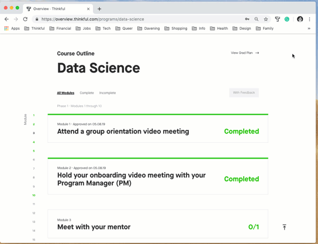
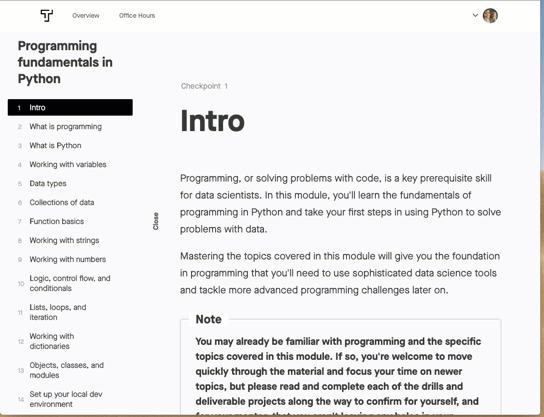
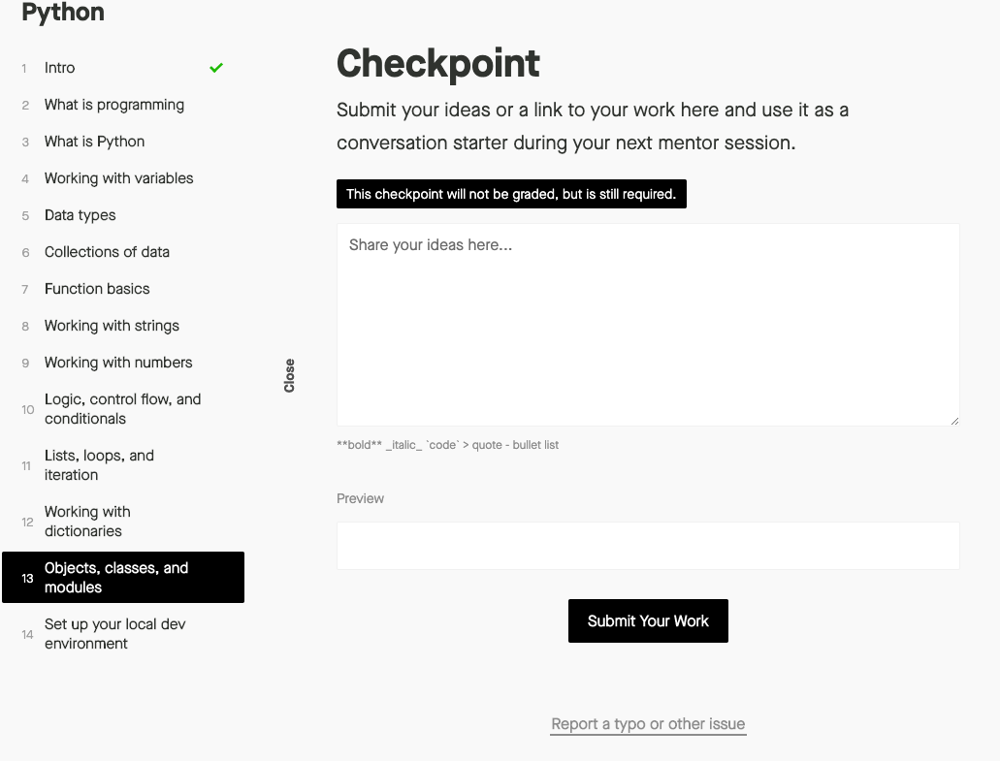
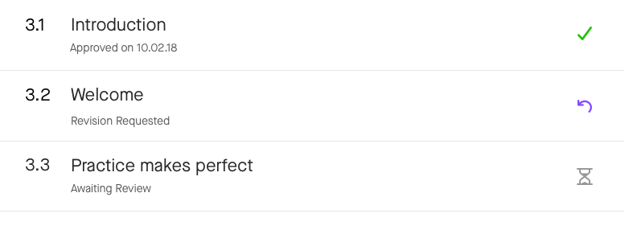

For both the prep course and the full immersive program, you'll be working quite a bit with the Thinkful platform. 

**In this checkpoint, you'll get an overview of how the platform is structured and what you need to know to use it effectively.**

## Modules and checkpoints

On your Overview page, you will see a list of *modules* to complete. Each module covers a distinct learning objective. If you click on a module, you will see that it consists of several *checkpoints*, which break the subject matter into smaller chunks. 

At the top of your Overview dashboard, you'll always see the next checkpoint you need to complete to continue making progress.

There are a few different types of checkpoints. When you get to the bottom of a checkpoint's corresponding curriculum page, you can click **Mark as read** or submit an assignment. Some checkpoints are self-approved. Just because a checkpoint is self-approved doesn't mean that you can skip the work required.  

Other checkpoints will be graded by a member of Thinkful's educator team.  In the prep course, you'll encounter graded checkpoints in the modules *Accessing data in Python* and *Programming fundamentals in Python*.

Checkpoints follow a sequential progression. You can see the completion status of your checkpoints in the course outline view in your dashboard.

## Grading

You will have the chance to experience grading through a mock interview and challenges within modules in the prep course.

The grading team reviews and approves certain checkpoint assignments. They will review your work, evaluate it, give feedback, and request revisions, even within checkpoints when the work is not entirely where it should be. The grading team will share the results of their review with you and your mentor so that your mentor can use this information to advise you in your sessions. The grading process is intentionally designed to be detail-oriented. It is designed to push you to produce the best work possible and stand out in the job market. 

When submitting work, it's a good idea to include context and some explanation with your submissions rather than only posting a link to your work. Graders can provide more detailed feedback if you explain your process, ask questions, or let them know what concepts you are struggling with. This helps the grading process become more of a conversation, and you will get better insight into where you can improve. 

Throughout your program, you will receive feedback and requests for revision on your work. This isn't something to get discouraged about. The graders are all experienced data scientists, and the feedback that you receive from them is a valuable resource for you to understand how to improve and produce work that is going to impress employers when you are on your job search. 

## Getting feedback

When you have new feedback on one of your graded checkpoints, the dashboard displays a *New Feedback* message.

## Signing up for your mock phone screen interview

The final task for this course is to complete a mock phone screen interview. For this mock interview, an educator from Thinkful will meet with you over video chat at a designated URL emailed to you ahead of time. You'll need to schedule this interview from your dashboard.

You'll find different time slots available for different educators from Thinkful. Sign up for the earliest available time that makes sense with your schedule. 

## Assignment

- Spend 10 minutes clicking through each module in the prep course and each checkpoint in each module to get a sense of what's there.
- Submit the text "Hello, World" at the bottom of this checkpoint to practice submitting a checkpoint with an assignment submission. Note that you **won't** get graded feedback on this assignment.

