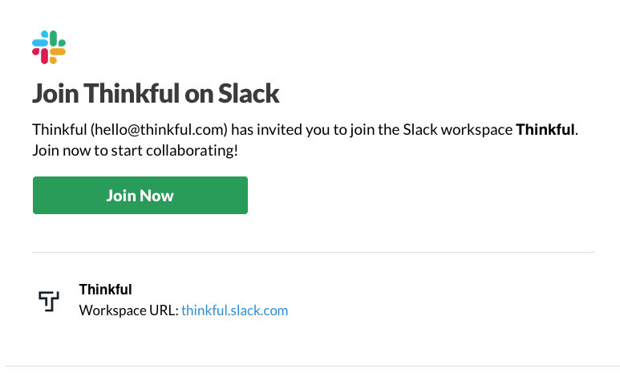
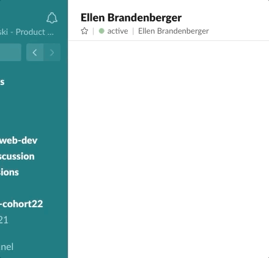
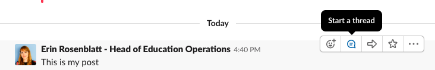
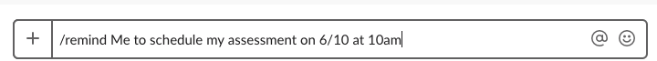
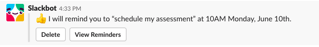

The messaging application Slack serves as the de facto public space where the members of the Thinkful community hang out. This is where you can band together with fellow learners who are tackling the same problems you're working through, learn about local events, and make valuable contacts. 

**In this checkpoint, you'll learn how to do the following tasks**:

- Sign up for and install Slack
- Configure your notification settings
- Join channels

## Signing up

1. **Find your email invitation to Thinkful's Slack community**. When you enrolled, you should have received an email inviting you to our Thinkful community Slack team (thinkful.slack.com). If you didn't, please email success@thinkful.com. 

2. **Click the invitation link from the email**.
3. **Create your profile**. You'll be prompted to provide your name, handle, and other basic information. Keep things simple for now: you can always update it later. 
3. **Download the mobile application as well as the desktop app version.**

## Optimizing your Slack setup

It is recommended to set up Slack on your desktop and mobile devices, but you don't want to drown in a sea of irrelevant notifications. Here's how to use Slack's built-in tools to make sure you're only receiving what you need.

### Notifications

By going to **Preferences**, you can set your notifications by channel, add keywords that you want to be alerted to, and change what you are notified about in the app. You can also control whether you get those notifications on your phone, through email, or with a pop-up on the desktop app. In the middle of something important? You can also mute your notifications by clicking on the bell icon in your sidebar, which you can see in the screencast below.

### Threads

If you see a post that you'd like to respond to or if you want to add something to your own post, hover over the post and click the **Start a thread** icon (it looks like a speech bubble, which you can see in the screenshot below) to create a thread. Now, all the posts for this conversation are in one easy-to-find place. 

If there's too much information, you can stop getting notifications for responses to a thread by hovering on the post and clicking on the **More actions** icon (which looks like three  dots; you can see it in the screenshot above), then clicking **Unfollow thread**.

### Reminders

Just saw an interesting message but don't have time to respond now? Hover over the message and click on the **More actions** icon. Then click  **Remind me about this** and set a time when you want Slack to send you a reminder. You can also type "/remind" and tell Slackbot to remind you of anything you type in. 

## Avoiding "reply all" mishaps

**Don't** use @here or @channel-this will send a notification to *all* of the members in that particular group, which could be thousands of people! If you are looking to notify someone or a small group of people of a message at once, please send a *Direct Message* to them (located under the **Channels** area of the sidebar) or simply tag them using the @ function in the specific group.    

Excited about all of the cool things that Slack can do? Read more in Slack's [comprehensive guide](https://get.slack.help/hc/en-us/categories/360000049063-Tips-Tricks-More)!

## Assignment

In Slack, 

1. Join the #data-science channel, any local channels (such as #atlanta, #los-angeles), and any other channels of interest (such as #python, #sql). 
2. Say hello! Send a short one to two sentence Slack message in the #data-science channel introducing yourself.

