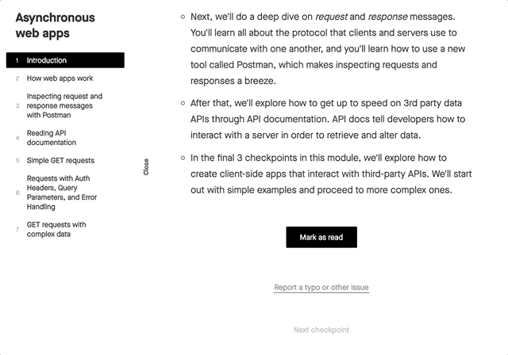
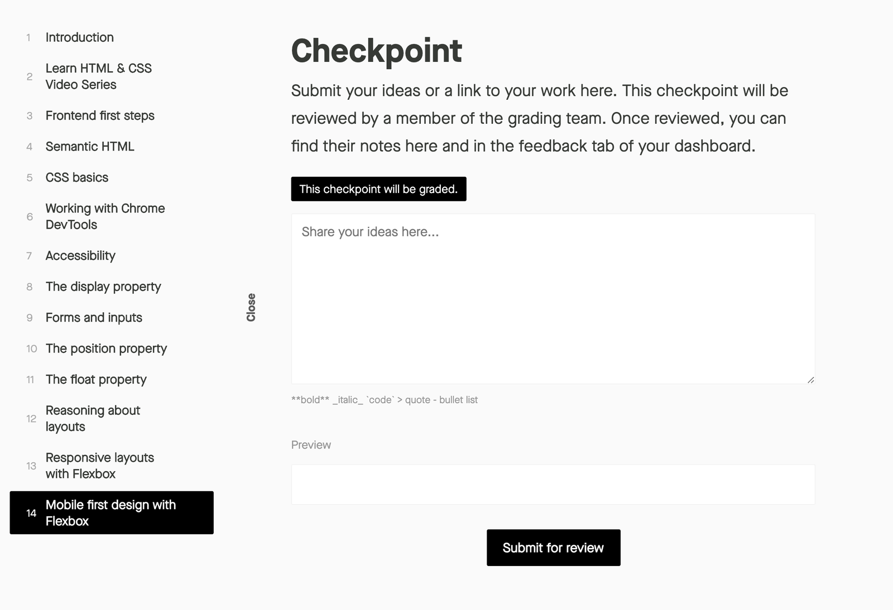
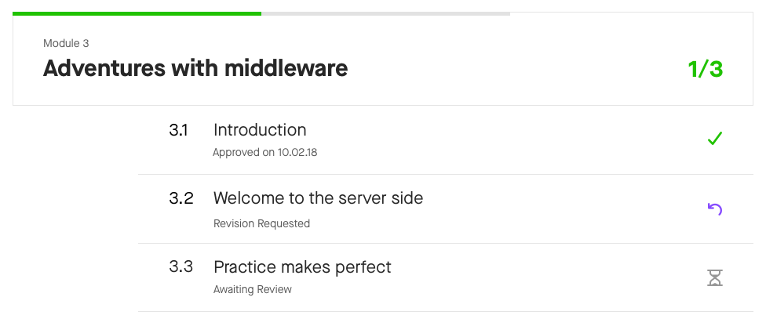
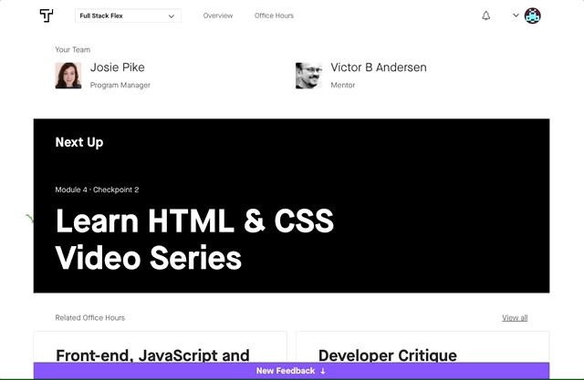
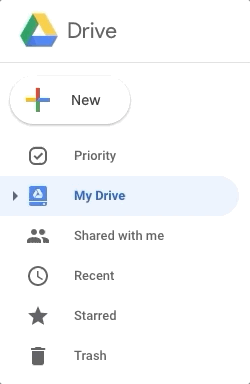
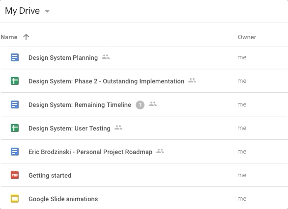
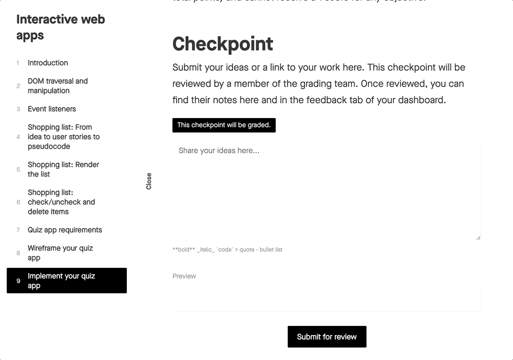

Hiring managers have a high bar for professional work, and this program's standards are set accordingly. Thinkful team members will rigorously review each stage of your work, providing critical feedback along the way. As a result, graduates land the jobs that they want and can perform from day one.

Here are some of the central pillars of your experience in this program.

## The curriculum

On [your Overview page](https://overview.thinkful.com/), you will see a list of curriculum modules to complete before you graduate.  If you click on a module, you will see that it is composed of several checkpoints, which break the subject into smaller chunks. Each checkpoint covers a distinct learning objective.

You'll always see the next checkpoint that you need to complete at the top of your **Overview** dashboard.

There are a few different types of checkpoints. Some checkpoints are self approved. When you reach the bottom of a checkpoint's corresponding curriculum page, you can click the **Mark as read** button or submit an assignment. Just because a checkpoint is self approved doesn't mean that you can skip the work required. If you rush through your program without really absorbing the knowledge presented, you'll only make it harder on yourself when you're in your job search and starting your new career.

Other checkpoints will be approved by Thinkful team members as you work your way through the curriculum. Some may be approved by an academic success manager or career coach, others by your mentor, and many will be approved by the grading team.

These checkpoints follow a sequential progression, which means that they must be approved before you can proceed with the next steps and submit a completed capstone. You can see the completion status of your checkpoints in the course outline on your **Overview** dashboard.

If you have new feedback on one of your graded checkpoints, the **Course Outline** anchor bar on your **Overview** dashboard will turn purple and say **New Feedback**.

## Grading

A specialized team reviews and approves certain checkpoint assignments. This team will review your work, evaluate it, give feedback, and request revisions when it's not entirely where it should be. The grading team will share the results of their review with you and your mentor, so that your mentor can use this information to advise you in your sessions. The grading process is intentionally designed to be detail oriented. It's meant to push you to produce the best work possible and stand out in the job market.

When submitting work, it's a good idea to include context with your submissions rather than only posting a link to your work. Graders can provide more detailed feedback if you explain your process, ask questions, or let them know what concepts you are struggling with. This helps the grading process become more of a conversation. You can gain better insight into where you can improve and receive tailored advice from experienced data scientists.

Over the course of your program, you will likely receive a number of revision requests on your work. This isn't something to get discouraged about. All of your graders are experienced data scientists, and the feedback that you receive from them is a valuable resource for you to understand how to up your game and produce work that will wow employers during your job search.

## Mock interviews

To get a job, you not only need to have the right technical skills, but you also need to perform well in demonstrating what you know— which is itself a skill that requires practice. You will complete several mock interviews over the next few months. These mock interviews are designed both to assess your mastery of the skills in the program and to prepare you for real interviews once you begin the job search. You'll get written feedback for each mock interview, which you can go over with your mentor to shore up any weak spots in your knowledge. You'll be prompted on your dashboard to schedule mock interviews at different points in the course.

Before each mock interview, talk with your mentor about the best ways to prepare. You should also run through some practice questions together. Once you pass your mock interview, your goal will be approved and you'll move on to the next module. If you don't pass on your first try, you'll have the chance to study and retake the interview. If you aren't able to pass after two attempts, your academic success manager will chat with you about your progress in the program.

## Capstone projects

Your capstone projects will be the most valuable thing that you leave your program with. Your portfolio of capstone projects will be what you show to employers to demonstrate that you are ready to work.

Capstones can be pretty hefty projects. A typical capstone can take about 1-2 weeks to complete if you are working 25-30 hours each week. You will also want to plan for revision time. Capstones rarely pass on the first attempt. They have a lot of moving parts. This is also reflective of the work that you will deliver in the workplace; it is very rare that you will submit a major project without getting revisions from your manager or project lead.

Some capstones allow you some leeway in choosing a topic. When choosing a topic for these capstones, it can help to pick something that aligns with one of your hobbies or interests, when possible. It's important to have fun with this! You will put more heart into your work if you are enjoying yourself. This also shows employers your personality.

If you are aiming to get into a very particular industry, it may be helpful to have at least one of your capstones built around that subject.

## Assignment

Are you ready to get started on your new career journey? Start by submitting your first assignment. This will also show you the process for submitting your coursework. In a text document, answer the following questions:

1. Why are you taking this course?
2. How do you see your life changing by learning data science?
3. How would you describe your ideal career?

Make sure to save your answers in a place that you can easily access. This will be an intense (and rewarding) program, and there may be times when you lose your motivation. In times like those, it is important to remember your "why." It may sound a little cheesy, but reminding yourself why you are doing this will help you move forward and persevere.

Because you will want to save this as a document, typing your answers into the box below won't be enough. You can share files using the following steps:

1. Sign up for a [Google Drive](https://www.google.com/drive/) account.

2. Upload your file to the drive.

  
  
3. Turn on link sharing for your file.

  
  
4. Paste your link in the submission box.

  

You will learn other ways to share files in the future, but this method will allow you to share files with anyone, anywhere.
