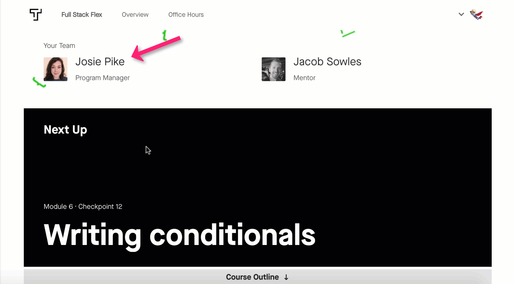

Your academic success manager is here to support you with any non-technical issues or questions that you have. They are here to make sure that you have the information, support, and advice that you need to complete your program and have a successful job search. This can be anything from questions about your progress to tips on time-management or dealing with stress and anxiety. Whatever it is, the program management team is in your corner every step of the way.

## Working towards graduation

Graduating within 6 months is essential, whether or not the job guarantee applies to you. Your payment amount covers 6 months in the program with 1-on-1 mentor support. If you haven’t finished all your goals in that time, you’ll still have the option to finish the rest of the program on your own or pay for additional months of mentor support. 

You and your academic success manager will work together to create a graduation plan for you as a guide for when you should hit each target to complete the program in 6 months. It’s okay if you need to adjust this plan somewhat as you go, but make sure you are proactive about discussing your plan with your academic success manager.

If you start to fall behind, your academic success manager is your best ally and resource for getting back on track. Reach out to them if you have any concerns about meeting deadlines. They'll help you work on a solution so that you don't fall further behind.

## Regular check-ins

To make sure you're on a path to success, your academic success manager will review your progress at least once a month. They'll look at your completion of the course material, 1-on-1 session attendance, assignment submissions, and feedback from your mentor to determine if you are on track for success. If you’re on track, they'll give you the thumbs up to move forward in the program. But if it looks like you’re not making consistent progress, your academic success manager will schedule time with you to discuss your progress. 

Together, you’ll review your work habits, time-management, where you might be struggling, how you are utilizing the resources available to you, and, based on the results of this conversation, build a plan to get back on track. It’s important to be honest with your academic success manager in these conversations. Your academic success manager isn’t there to get you in trouble or make you feel bad; they are there to help you succeed and helping you succeed means holding you accountable to the work you signed up for and your goals of enrolling in this program. If you aren’t able to meet the goals set out in your graduation plan or the plan for getting you back on track, your academic success manager will want to talk to you about whether this program is the right fit for you. We rarely withdraw students from the program based on a lack of progress. However, we want to make sure you have a clear understanding of where your progress is at and what it’s going to take to catch up.

## Reflections

Having worked with thousands of students, we know one thing for sure: as learners, the hardest challenge we face is holding ourselves accountable. [Research suggests that the best way to make consistent progress is to reflect frequently on your work](https://medium.com/thrive-global/why-you-should-harness-the-power-of-reflection-4a8f6d7710d4). Throughout your program, you’ll fill out a few surveys with some questions that encourage you to think critically about your learning goals, work habits, and project management skills. 

What should you reflect on? Consider answering these questions in your reflections.
- What have you learned since your last check-in? 
- Is there anything you wish you had done differently?
- How did you divide your time between reading, project work, and other activities? 
- How could you achieve your goals more efficiently and improve your process?
- Could the curriculum, the community, or your mentor have been a more significant part of your learning? How?
- Do you feel good about your progress since your last check-in?

Is this mandatory? Yes. Reflections are mandatory. Why are they mandatory? Because spending time thinking about what’s working for you as a learner and where you can do better has been [demonstrated to be an effective tool](https://hbswk.hbs.edu/item/learning-by-thinking-how-reflection-improves-performance) in improving your results as a student.

Your academic success manager will read your reflections to make sure you’re feeling good about your work and are getting the support and tools you need to be successful. Our PMs are vigilant! They read every response and will know if you haven’t filled yours out. Expect to hear from them if you don’t fill your reflection survey out!

Don’t take the reflections lightly; understanding your progress is crucial to your success in learning the concepts and completing the program. It’s incredibly valuable to understand your strengths and weaknesses both as a student and as a data scientist. And it shouldn’t take you more than 10 minutes to complete!

## Contacting your academic success manager

You will find your academic success manager’s contact information on the top of your dashboard under “My Team.” If you hover over your PM’s name, you will see links to their email address and Slack account. You can also find a link to directly schedule a time to meet with them by clicking “Schedule call”.

## Tips for Working with academic success managers

academic success managers are here to give you the tools to succeed. Here are some ways we recommend to use your PM as a resource:
- Over-communicate! We find that the students that do the best in this program are the ones that speak up. Your PM wants to help you, but they can’t read minds. If there is anything at all that you aren’t sure about, please do not hesitate to reach out. When it comes down to it, they would rather hear too much from you than too little.
- Ask for advice on productivity and time-management. The PM team is comprised of nerds that love coming up with strategies to make the most of your time. If you feel like you are having trouble balancing everything, let them know! They have helped many people in your shoes get to the finish line.
- Share your feelings. You are taking a very intense course! There will be points in the course where you feel like you hit a wall and you don’t know what to do. We promise you that this is normal and you will come out the other side feeling so accomplished for getting through it. You aren’t in this alone. academic success managers are excellent listeners and are happy to talk about what you are going through and also explore ways to mitigate the stress. 
- Understand that feedback comes from a place of support. academic success managers are here to give you the information you need to make informed choices. They will check in on your progress and will hold you accountable to your timelines. This is not to make you feel bad, but to ensure that you can still complete the course and meet all of your goals. If you are not on track to meet your goals, your academic success manager will encourage you to examine what is best for your learning, your financial well being, and your emotional well being. In the end, we all want the same thing - your success!
- Talk about your experience with other aspects of your program. If your experience with mentorship, grading, and assessments isn’t meeting your expectations, your academic success manager is a safe space to go to. Your PM wants you to have the best learning experience possible and will look into your concerns.

## Schedule your first academic success manager check-in

Excited to meet your academic success manager? Please schedule your first video meeting with your academic success manager through the modal on your [dashboard](https://overview.thinkful.com/). This meeting should occur when you are 2-3 weeks into your program.

For this meeting, you will need to be at a desktop or laptop computer with a working camera and reliable internet. You will find the link to the meeting room in the confirmation.

In this meeting, you will get to meet your academic success manager, ask questions, and plan out ways to be successful in your program. Your PM would also love to know more about you, your background, and what your goals are for the course. Knowing your goals means that they can make better recommendations for your learning.
