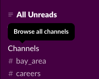
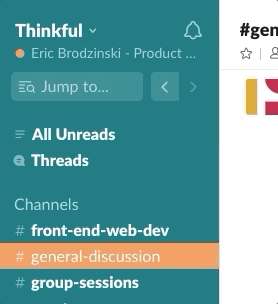
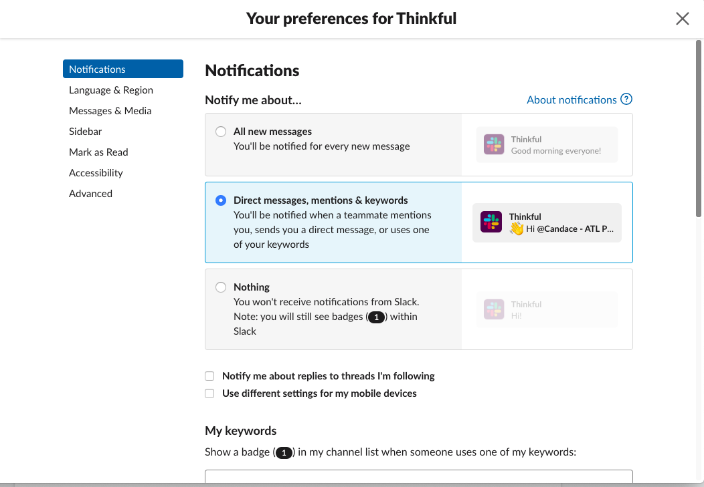

Even though the Thinkful experience is remote, that doesn't mean that you're in it alone. More than anything else, Thinkful is a community of like-minded learners and practitioners of professional skills getting together to discuss and collaborate on those skills.

The messaging application Slack serves as the de facto public space where all the members of our community hang out. It's where you can band together with fellow learners tackling the same problems that you're working through, learn about local events, and make valuable contacts.

In this checkpoint, you'll set up Slack and learn how to do the following:

- Sign up for and install Slack
- Configure your notification settings
- Join channels

Later in this module, you'll learn more about how to get the most out of Slack and what you need to know to get technical support on Slack.

## Sign up and say hello

1. **Find your email invitation to Thinkful's Slack community.** When you enrolled, you should have received an email inviting you to our Thinkful community Slack team (thinkful.slack.com). If you didn't, please email success@thinkful.com.
  
2. **Click the invitation link from the email.**
3. **Create your profile.** You'll be prompted to provide your name, handle, and other basic information. Keep things simple for now—you can always update your info later. You will be given options to download the mobile and desktop apps. We recommend that you download both.
4. **Join your program channel and any local groups that make sense.**

  
  
5. **Say hello.** Don't be shy! Introduce yourself with a short, one- or two-sentence Slack message in your program channel.

## Optimize your notifications

We recommend setting up Slack on your desktop and mobile devices, but you don't want to drown in a sea of irrelevant notifications. Here's how to get some reasonable default notification settings:

1. In the top left corner of the Slack app, click on on your name, then click **Preferences**.

  
  
2. Ensure that **Direct messages, mentions & keywords** is selected.

  

That's the quick and easy start to setting up Slack! You'll learn more about how to make the most of our Slack community later in this module. For now, if you need more help, [Slack has a great help site](https://get.slack.help/hc/en-us/articles/218080037-Getting-started-for-new-members) with lots of articles that are easy to understand. You can also email success@thinkful.com if you'd like more support getting set up.

Happy Slacking!
