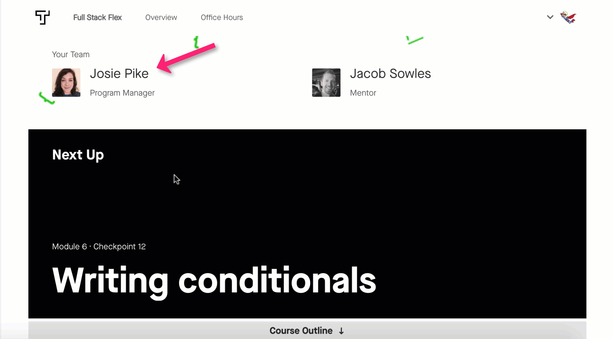
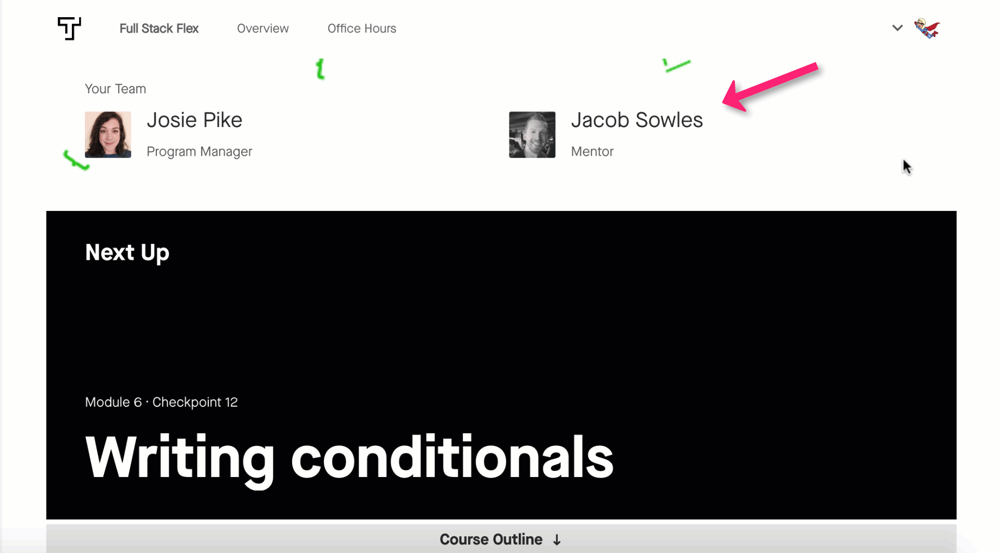

One of the best things about being part of the Thinkful community is that you have a team of people to support you. The people and teams listed below are here to help you succeed in the program.

## Your academic success manager

Your academic success manager helps you navigate the journey to becoming a data scientist and holds you accountable for putting in the work necessary to succeed. Starting in the second week of your program, you will have regular check-ins with your academic success manager to ensure that you're on track to reach your goals. If you're struggling to manage your time, absorb information, or build your career-readiness skills, your academic success manager will provide coaching and advice. You'll learn more about how to best utilize your academic success manager's support in a later checkpoint. You can find your academic success manager's information at the top of your **Overview** dashboard.

## Your mentor

Your mentor is there to give you technical guidance throughout your program. You will meet with them every week via video sessions. Your mentor is an experienced data scientist who can provide insight into what it's really like to work in this field. They help to unravel tricky concepts, hold you accountable for your goals, and talk you through imposter syndrome. You'll learn more about how to best utilize your mentor's support in a later checkpoint. You can find your mentor's information at the top of your **Overview** dashboard.

## The careers team

As you near the end of the curriculum, you'll start working with the careers team. The careers team will support you as you embark on your job search. They will help you develop your resume and LinkedIn profile, hone a practical approach to your job search, strategize salary negotiation, and more. Once you complete your program, you'll work with your personal career coach, who will guide you through the ins and outs of a successful job search and hold you accountable for the necessary steps for launching your career as a data scientist.

## Technical coaches

We can say with 99.99% certainty that you will get stuck at different times during this course. How do we know? Because even professional data scientists regularly get stuck. They also happen to be experts in getting unstuck—which is a skill you'll develop over time. As a newcomer to data science, you're even more likely to get stuck. It's important to remember that getting stuck and then figuring out how to move forward is an important part of the learning process.

If you find that you are still stuck after you've spent 30 minutes trying to solve an issue, our team of experienced technical coaches can answer your questions and point you in the right direction. (You can start talking with a technical coach by opening the chat in the lower-right corner of the screen when you're viewing the curriculum.) Since you won't have technical coaches or personal mentors in a real job, it's important that you build your skills related to troubleshooting, debugging, understanding errors, and researching solutions while you are in your Thinkful program. Coaches will help guide you in figuring out the solution to your problem.

You can learn more about how to best utilize the support of the technical coaching team later in this module.

Our goal is to see you succeed. That's why we provide robust, 360-degree support for your learning. If you need guidance on using any of these support options or if you ever want to talk about your progress, make sure to reach out to your academic success manager. That's why we are here!
