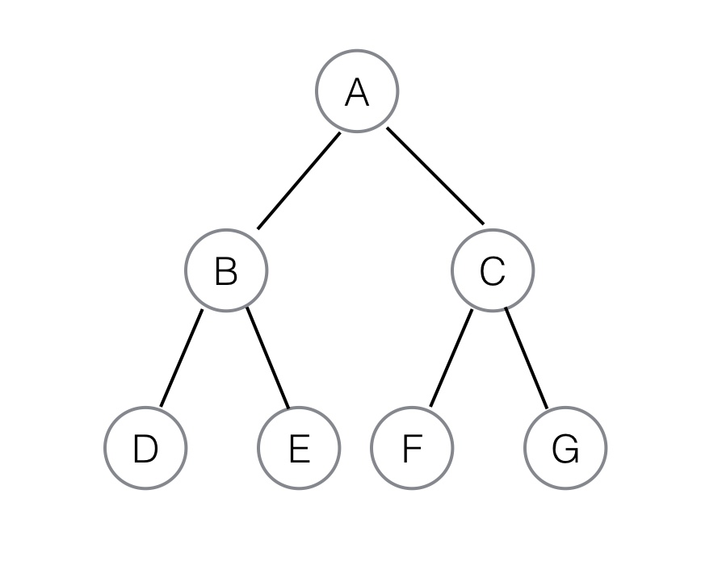
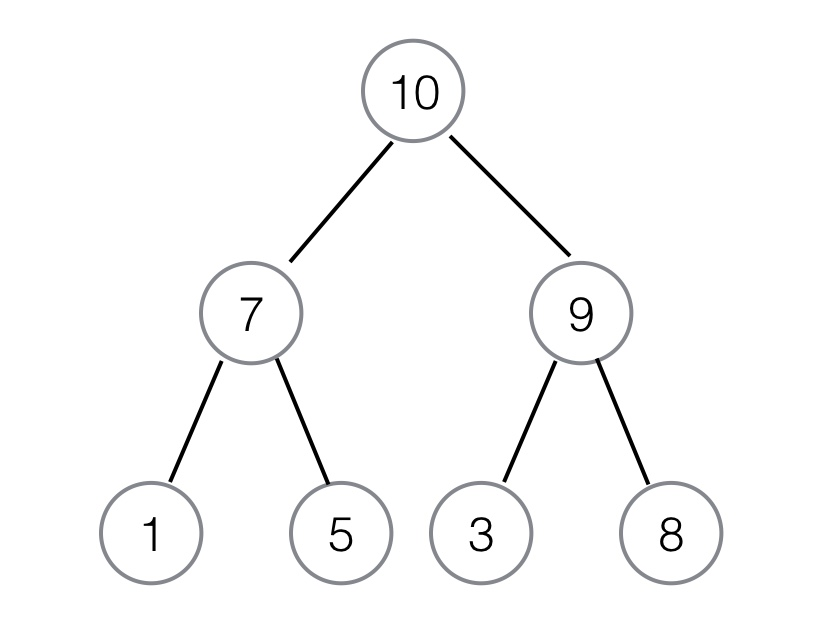

The last data structure that you'll learn about in this module is the *tree*. Trees are a bit different than the other data structures that you've seen so far, but they present a useful way to store information that has a hierarchical structure or that needs to be rapidly searchable. But the most distinguishing trait of trees is their sheer flexibility. You'll explore what that means below.

## What is a tree?

Here, you're going to focus on the most common variety of tree: the binary tree. You'll use that example to go over the vocabulary of trees.

All trees are a set of *nodes* connected in a hierarchy. Each node is a value. That node can connect to nodes below it, which are called its _children_. The node linked above it, if there is one, is called a *parent*. The top node is called the _root_. If the node has no children, it's called a _leaf_. Every tree is a combination or permutation of these elements.

Next, look at a simple tree and review those definitions, because they'll be relatively fundamental to what's to follow. You'll rely on them whenever trees are mentioned. And although they're similar to how you've learned about decision trees as a model, you cannot conflate the two types of trees. This is because the terms will vary and may have subtle differences in meaning.



In the image above, A is your root. B and C are children of A. A is therefore a parent of B and a parent of C. B, in turn, is a parent of D and E, while C is a parent of F and G. D, E, F, and G are your leaves.

A tree is binary if each nonleaf node has no more than two children. By this definition, a tree can still be binary even if the leaves aren't all in pairs. The example above is a special type of binary tree called a *full binary tree*; this is where all parent nodes have two children. More specifically, this example is a *perfect binary tree*, because it is a complete tree with all leaves on the same level.

## A simple Python implementation

So, how do you make a binary tree of your own?

You can do it in two steps. First, you must create a node class:

```
class Node:
	def __init__(self, val):
		self.left = None
		self.right = None
		self.val = val
```

The code above creates the framework for nodes. A node will take a value, which gives you the value at that point. It also lets you establish a left and right value, which are the two children of this node. To create a binary tree, simply populate those children with their own nodes.

So to reconstruct the tree from above, you'd do this:

```python
# Establish the initial root node and children
root = Node('A')
root.left = Node('B')
root.right = Node('C')

# Add the appropriate children for 'B' and 'C'
root.left.left = Node('D')
root.left.right = Node('E')
root.right.left = Node('F')
root.right.right = Node('G')
```

And there you have it. You've now successfully implemented your example tree in Python. Note that this tree can easily grow by adding further children to leaf nodes. That's an important feature of trees that can be valuable if you need your tree to dynamically grow and prune.

## Flexibility and use cases

One of the main features of trees as a data structure should be apparent. For arrays and linked lists, there's a pretty clear order to things—and that order was very clearly specified when you were building a list. That order also creates rigidity.

Trees, however, are much more flexible. You can put data into them in a variety of different ways, leading to a variety of differently shaped trees. Trees can have three children per node. They can increase as you move down from node to children. They can do almost anything that you could imagine in that structure of nodes and children. Now, naturally, some will be more suited to certain datasets than others, and efficiencies of various operations will likewise vary. But the sheer flexibility is a key advantage.

So, what are these kinds of trees good for? The most obvious answer is hierarchical data. If you think of your data in layers, then trees can represent that. Academic courses (broken down into department, level, and then course) are a classic example. Machine-learning models (broken down as supervised or unsupervised, then by class, then down to specific kinds of implementations) could also work.

## Traversing a tree

*Traversing a tree* means seeing the value of all of the nodes in a tree and discerning its structure. If you are simply given a tree, you have to traverse it to know what its structure is and what its values are. This is another point where trees offer serious flexibility and a great deal of choice for the user. For an array or a linked list, there is a single best way to read the data (though you could argue that arrays could also be read backward). Trees have many, many more options.

The simplest way is probably _breadth first_. In a breadth-first traversal, you try to explore the full breadth of a layer, one layer at a time, starting from the root. For all traversal algorithms, it's more common to work from left to right. So for this example, a breadth-first traversal would look like this:

A, B, C, D, E, F, G

You can also read a tree in a preorder fashion. This moves all the way through the left side of the tree. Then it moves back one layer at a time to move to the right before proceeding down the left side of the tree. So this would read your tree as follows:

A, B, D, E, C, F, G

This is called a *depth-first traversal*, because it first aims to find the depth of a tree, in direct contrast to the breadth-first method.

## Binary heaps

*Binary heaps* are a particular variety of binary tree. They have two defining features. First, they must be complete binary trees. Second, the values within the heap either always increase or always decrease as you move from layer to layer. This means that every parent must either be greater or less than all children. This property must hold for the whole tree. A *minimum binary heap* sees the parent as always less than the children, and a *maximum binary heap* sees it as always greater than the children.

Take a look at an example.



This is a maximum binary heap. Each parent is greater than its subsequent children. Now, obviously, to have this greater than or less than property, the heap has to be used to store numeric data.

Why do this? Well, this gives you some advantages in searching for data. For example, when you look to the second layer, you know that the only place that an 8 could be is as the child of a 9. You gain that information without having to look through the children of 7. Data scientists use this for times when they want to quickly find and use subsets of a dataset, so the tree will need to have logic that a data scientist can use.

You can see a broader Python implementation of the binary heap [here](http://quiz.geeksforgeeks.org/binary-heap/).

## Drill

Implement a binary tree that is filled with 15 pieces of random data. Then write a program to traverse the tree using a breadth-first traversal. If you want additional practice, try other forms of traversal.

