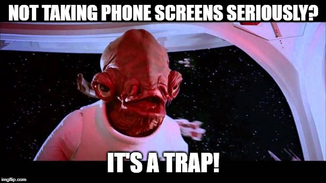

The objective of this checkpoint is to provide you with actionable tips on preparing for a phone screen, and what to expect before, during, and after the phone screen. 

If there is one tip from this checkpoint to remember, it's this: *Take phone screens seriously!* It's easy to dismiss the phone screen as not a real interview because it's done over the phone. Don't do this!

Being too haphazard about a phone screen is just another reason for employers to "screen" you out of the candidate pool. Take the process seriously, from booking the call to receiving the results. 

# Before the phone screen
## Remember that you even applied for the position

Congratulations: A recruiter has contacted you to schedule a phone screen at… *what company again*? Job applications can become a blur, and it's easy to forget you've even *applied* to a position by the time you're contacted. Fortunately, you've organized yourself out of this bind by diligently updating your [Job & Activity Tracker](https://docs.google.com/spreadsheets/d/1S6X1XgAh4ImWq68KXBntIjLWnXoEf6S9rMRn7R2U9po/edit?usp=sharing) and keeping notes on the status of each application.  

## Prepare your statements of knowledge and interest

Review the job description, which you've linked to in the tracker. What is the job title? What are the key roles and responsibilities of this position? What technical skills are required?   

Next, do some research about the company. How many people work there? What products or services is the company known for? What big projects has the company announced lately? If it's a public corporation, a good way to gather this information is to find the company's [investor relations](https://www.investopedia.com/terms/i/investorrelations.asp) page. 

With this information, you can express your *knowledge* about the role you've applied for. When the recruiter asks, "What can you tell me about this company?" a response of "I don't really know anything; I just applied for every job ad that said 'data scientist,' and I need a job," won't take you far as a candidate! 

On top of *knowledge* about the job, you need to be able to express your *interest*. Employee turnover is at [record highs](https://www.salary.com/news-and-events/workplace-turnover-rate-hits-all-time-high/) across the economy. This is especially true [in data science](https://www.kdnuggets.com/2015/09/how-long-data-scientists-stay-jobs.html), so recruiters want to determine whether your interest in data science and in their company has staying power. 

Prepare answers for *both* the "What interests you about being a data scientist?" question and the "What interests you about being a data scientist at this company?" question. For the latter, consider things like the company's mission, culture, or reputation for excellence. Perhaps specific duties of the job interest you, such as working with a particular source of data or in a particular industry. 

## Prepare your sales pitch

By answering the above questions, you'll establish yourself as a knowledgeable and enthusiastic candidate. But you'll also need to establish yourself as a *qualified* candidate. 

Print a copy of the job description. Now, print a copy of your resume. How do these documents align? How does your background prepare you for the job? Which technical skills do you possess, and how have you demonstrated them? Outside of your data science experience, do you have other relevant professional experience, such as experience working in the company's industry? 

## Set a time

Generally, a recruiter will ask to arrange a phone screen with you using your email on file (which is why you used a professional-sounding email on your resume!). The recruiter might ask you to name available times, ask you to pick your preferred time from a series of options, or provide a link to a scheduling app like Calendly or YouCanBookMe.

Regardless of the method, be explicit as possible when confirming the date and time. For example, rather than replying, "I will talk to you next Thursday," write something like: "I will talk to you next Thursday, July 22nd, at 10 am Eastern." This helps prevent any scheduling mix-ups. 

Generally in phone screens, the interviewer calls the candidate, so confirm that you have provided them with a reliable line. If your phone does go to voicemail, have a professional voicemail message set up for the interviewer to hear. 

## Make the interview space come to you

Imagine what it's like to walk into an in-person interview. You're professionally dressed, and you have all the necessary information at your fingertips. You are greeted by the interviewer, offer them a firm handshake, and walk confidently to a private, quiet interviewing room.

For a phone screen, you won't actually be traveling to meet your interviewer, but you can still take many of the same steps to prepare. Have your resume, the job description, answers to the most common questions like "Tell me about yourself" and "What interests you about this job?" printed and in front of you. Prepare a quiet place for yourself that is free of distractions. 

To simulate a real interview situation, some candidates go so far as to dress as if they were headed to an in-person interview and even print a picture of the interviewer for a point of reference when speaking. 

At the minimum, you should have all the relevant information prepared in front of you, be in a quiet place that is free from distractions, and have provided the interviewer with a reliable method to reach you at the explicitly agreed-upon time. 

# During the phone screen
## The phone screen in five acts

The typical phone screen takes the below arc of five steps:
 

1. **Introduction.** Typically, the recruiter will begin your interview with something along the lines of "Hi, is this still a good time to talk?" That's almost always going to be yes, since you agreed to this time anyway, but in the rare case that it's a no, be honest, flexible, and courteous in rescheduling.  
2. **Knowledge screen.** The first questions asked during a phone screen usually have to do with establishing your knowledge in the position, company, and industry and why it interests you. Typical questions here are "What interested you in this job?" or "What can you tell me about this company?" 
3. **Technical screen.**  The interview will then proceed to establish that you are technically qualified for the position. Questions here might be "What similar projects have you worked on?" or "Have you worked with this kind of data before?"
4. **Questions.**  After three or so questions, the interviewer will generally ask, "Do you have any questions for me?" Have a few good questions prepared to ask ahead of time. You'll see some examples of questions you can ask later in the checkpoint.
5. **Conclusion and next steps.** Finally, the interviewer will thank you for your time and usually provide a rough outline of the next steps in the selection process. If the interviewer does not offer a sense of what the next steps are, ask about them.

This is a common pattern for interviews, but some might operate differently. Stay calm by knowing you have prepared for the interview. Here are some more preparation tips:

## Open strong

Your interview performance begins as soon as you pick up the phone. 

Answer the phone at the appointed time professionally. A safe opening is "Hello, this is *[insert name]*?" This is not the situation to answer with "Hey, what's up?" or "I told you telemarketers to quit calling me!" 

## Be prepared but not scripted

Just because you're prepared with all sorts of notes in front of you, doesn't mean that you should read them directly to the interviewer. Even though you're on the phone, this will come across as forced and disingenuous. Speak naturally, knowing what you need to say and delivering it in your own voice. 

## Pace yourself

Another benefit of preparing what you wish to convey in a phone screen is that you will stay on topic. Remember, phone screens are meant to be brief. While you might feel like you need to share your entire life story with the recruiter, all they asked you is "What interested you in this job?" Try to keep your answers between thirty seconds and two minutes.  

## Be eager

As a new data scientist, it's going to be hard to distinguish yourself from competitors based on your track record. Instead, you can sell yourself on your enthusiasm about the position and the company.

Give the impression that working as a data scientist at this company would be like winning the lottery (without overdoing it). 

Sit up straight, breathe deeply, and smile during your interview. This will project over the phone! 

## Be honest

[Imposter syndrome](https://caitlinhudon.com/2018/01/19/imposter-syndrome-in-data-science/) is a grave condition among data scientists. The phone screen is your first step in interviewing to become a data scientist. Your first inclination might be, "I don't belong here." *You do*. If you booked a phone screen, you've made it to being actively considered as a data scientist. Nice work!
 
During the interview, don't qualify yourself as an amateur data scientist. Be honest that this is a new career for you, but stand by the work that you've done in data science thus far.

If something the interviewer asked doesn't make sense, ask them about it. If you don't know the answer to something they ask, admit it, but try to give an answer anyway. 

Some questions—such as asking you to describe your ideal work environment—don't have one right answer. Instead, the questions are trying to help the interviewer determine whether you'd fit in culturally with the organization. Your inclination might be to say what they want to hear, but this will again likely come off as inauthentic. If there is truly a culture mismatch, it's better to discover that before landing a job at a company you don't like. 

# After the phone screen
## Ask good questions

An interviewer will often end their interview with "Thank you for your time today, [your name here]. That's all the questions I have. Do you have any questions for me?"

This might sound like a good time to end the conversation—but look out, it's another trap! Ending a phone screen with some questions of your own show that you came prepared and that you are truly interested in working as a data scientist at this organization.

Ask about things such as the history of the position, the organizational structure that the position falls under, and big initiatives that the company is undertaking. You can even ask their interviewer to tell you a little bit about themselves and why they like working at the organization. People love talking about themselves! Below are some examples of questions to ask at a phone screen:

- "What are the key challenges and objectives for this job over the next three months?"
- "Is this a new role?"
    -  If yes: "Why was it created?"
    -  If no: "How did the role become available?"
- "What do you see the future of this company or industry looking like?"
- "What are the three main factors you will use to determine the right person for this job?"
- "What has surprised you most about working in this company or industry?"
- "If I was starting in this position today, what would you advise me to learn first and do first?"
- "What do you like best about working here?"
- "What do the day-to-day responsibilities of the role look like?"
- "What does success look like in this position, and how do you measure it?"
- "What are the biggest challenges facing the company or department right now?"

## Say thank you

Be sure to thank the interviewer for their time and consideration. If they haven't discussed what the next steps are in the process, feel free to ask.

It's also wise to send a brief thank-you note over email within a day or two of the interview. The purpose of this note is twofold: to express your professionalism *and* to keep your candidacy at the front of the interviewer's mind.

Using the interviewer's email address that you received from the interview or prior correspondence, send a brief note from the professional-sounding email address you used on your resume. Keep the subject line short and specific to your interview: for example, "Data Scientist Interview on August 2nd."

Use the body of the message to express your gratitude for the interview and recap what you took from the conversation. Then, highlight your skills that overlap with areas of the job description that were highly emphasized in the phone screen. In closing, add your phone number and links to relevant pages such as your LinkedIn profile or GitHub account. 

Using these guidelines, a sample thank-you note can be seen below:

*Subject*:  Data Scientist Interview on August 2nd

*Message:*  Dear Mr. Berra,

I enjoyed speaking with you this afternoon about opportunities in data science at Confusion Matrix Consulting. I agree that there is strong market potential for AI-generated paradoxes and oxymorons. 

As we discussed, I am the winner of the 1998 Pun-Off World Championships. Combining this with my recent training in data science, particularly natural language processing, I am well-suited to develop the worst puns in the English language. 

Thank you for your time and consideration. I look forward to hearing from you. Best wishes in the selection process. 

Regards,\
John Jacob Jingleheimer Schmidt\
1-440-555-5555\
linkedin.com/in/jjjschmidt\
github.com/pummerofjohn

## Be patient

Filling positions takes time. A [2015 report](http://press.indeed.com/wp-content/uploads/2015/01/Time-to-fill-jobs-in-the-US.pdf) from Indeed and the Center for Business and Economics Research found that while 43% of job openings are filled within the first 30 days, the 57% of job openings that aren't filled in that first month will remain unfilled for three months or more. 

So be patient. It's acceptable to follow up on the status of your application, but be careful. While following up can express your dedication and enthusiasm for the position, you don't want to do so too quickly and risk annoying the company. Wait at least a week after your phone screen to check in, and wait at least another week thereafter to follow up. If you haven't heard anything after several rounds, silence might be the only answer you'll get. 

## If at first, you don't succeed…

Simply booking a phone screen shows that you're in the running to be a data scientist. Congratulations! 

However, successfully landing a job on your first try is the careers version of getting a hole in one. If you aren't selected to move on in the process, be gracious and thank the recruiter for their time. If you wish, you can ask for feedback from the interview, which the interviewer can provide at their discretion. Find some actionable steps you can take to improve for next time, and keep going with your search. 

# Assignment

Below are some typical phone screen questions. Take 40 minutes to write down your answers to them and submit them using a shared Google Doc link or in plain text below. Then take 20 minutes to practice how you would answer them out loud during an interview.

About you

- Tell me a little bit about yourself.
- What is your dream job?
- What is your most significant accomplishment thus far?
- What experience do you have with data science?
- What things do you consider to be the most important in your next job?
- Why do you want to be a data scientist?
- What are you looking for in a new position?
- What kinds of work interest you the most?

Job

- What do you know about this job?
- What software do you have experience with? How would you describe your experience level with that software?
- What types of datasets do you have experience with? How would you describe your experience level with analyzing them?
- What types of data analysis techniques do you have experience with? How would you describe your experience level with analyzing them?
- What qualities do you think are necessary to be successful in this job?
- What interests you about this job?

Company

- What can you tell me about this company or position?
- What interests you about working at this company?
- What type of work environment do you prefer?
