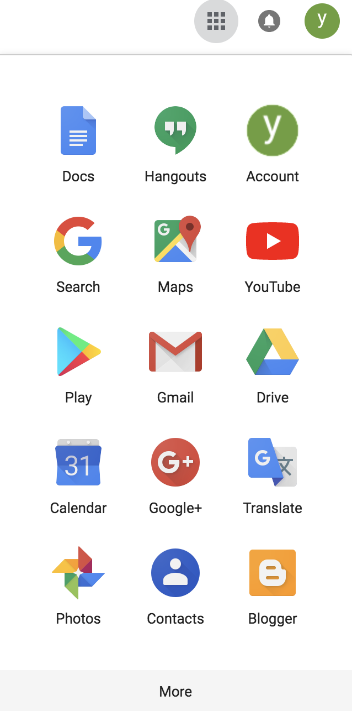
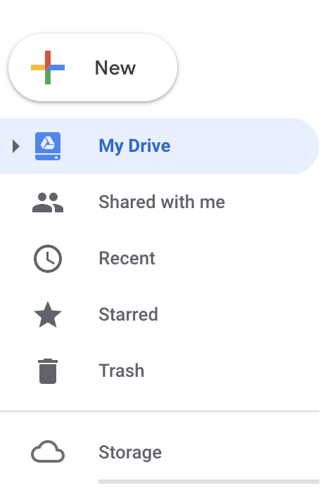
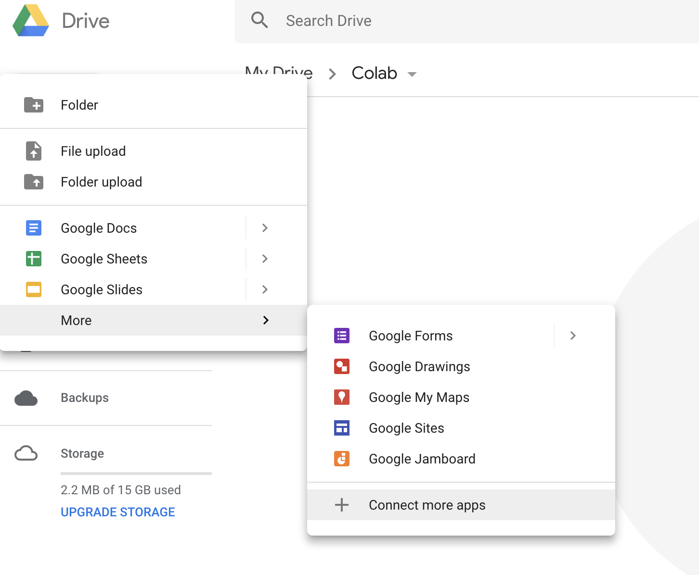
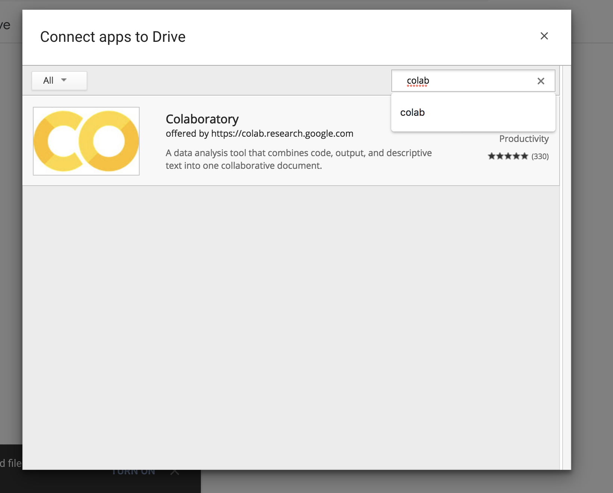
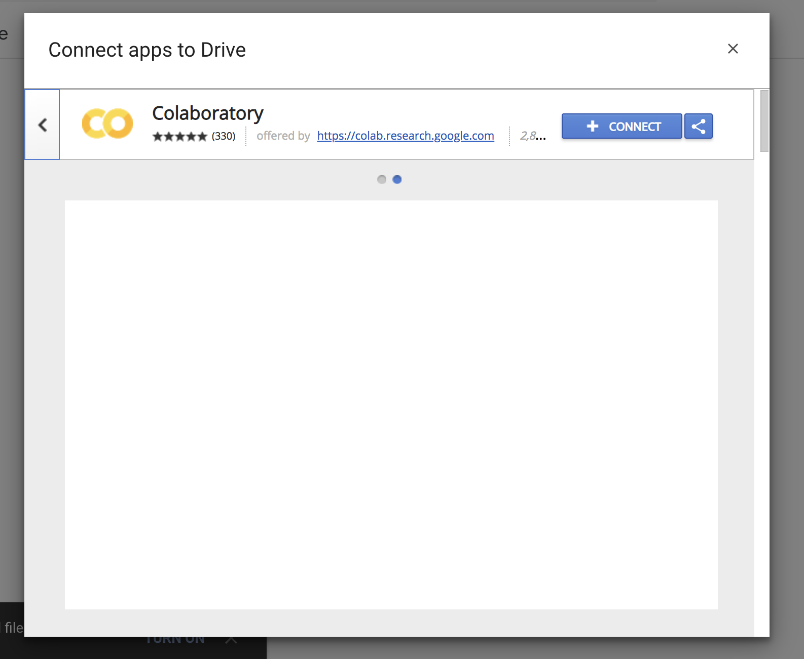
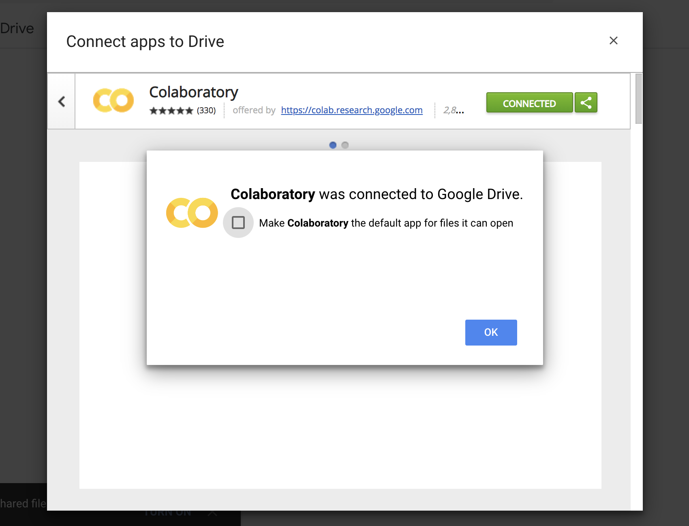
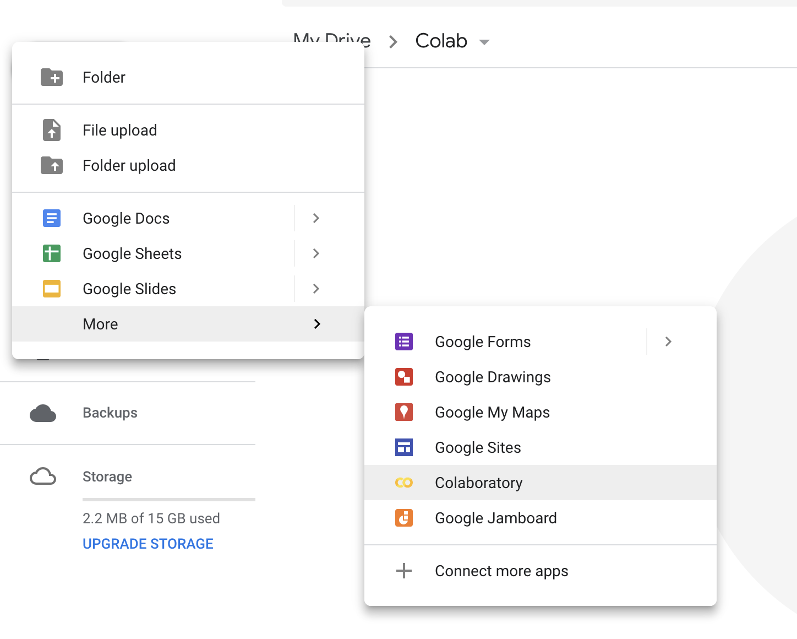
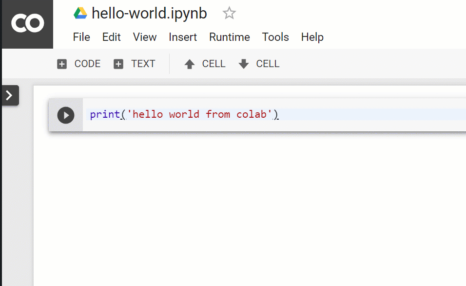
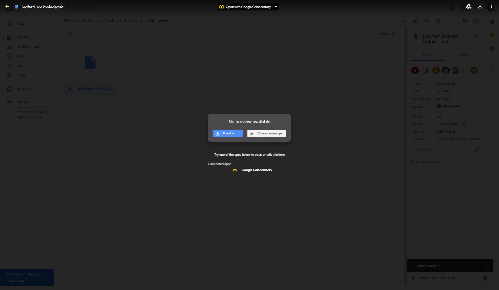

In this checkpoint, you'll get up and running with [Google Colaboratory](https://research.google.com/colaboratory/faq.html) (*Colab* for short). Colab is a platform for data analysis and data science, powered by Google. This platform will be your primary development and research environment for Python in this program.


## What is Colab?

Colab is a free platform for running Jupyter Notebooks in the cloud. And Jupyter Notebook is an interface for writing, executing, and presenting Python code. 

Here's what you should know to begin:

* Python and all of its major data analysis libraries are already installed. So, most of the time, you'll just run your Notebooks without installing anything. You can upload your Jupyter Notebooks and run them on Colab without any modifications to your code.
* Here's what your workflow will look like: you'll do work in Colab, save a Notebook file, and then share it with the Thinkful team.

## Setting up Colab

### Step 1: Create a Google account

If you're using Gmail or any of Google's other services, then you have a Google account. But if you don't already have a Google account, then you'll need to create one.

You can [sign up for an account here](https://accounts.google.com/signup/v2/webcreateaccount?flowName=GlifWebSignIn&flowEntry=SignUp). Once you create your account, you can move on to the next step.


### Step 2: Set up your Colab on Google Drive

In this step, you'll connect Colab to your Google Drive. This step involves multiple substeps, as follows:

#### Enter Google Drive

Log in to your Google account and click the **Google apps** icon at the top-right corner of the screen. Then enter Google Drive by clicking the **Drive** icon.



This will open Google Drive in a new tab on your browser. This is your drive, and you can upload any files to it.

#### Connect Colab to your drive

Once you enter your drive, click **New ➕**.



Then, hold your pointer over the **More** menu and select **Connect more apps**.



Search for `colab`.



Select **Colaboratory**, then click the **Connect** button.



You'll see a message that reads, "Colaboratory was connected to Google Drive." This indicates that you successfully connected Colab to your drive.



To confirm that Colab has been added to your connected apps, you can click **New > More** and look for **Colaboratory** in the drop-down list.



**Note:** If **Colaboratory** doesn't show up in **Connect more apps**, go to [the Colab website](https://colab.research.google.com/) to access it.

### Step 3: Create a folder for your work

Next, you need to create a new folder on your Google Drive. You'll use the folder to store and share Colab files and any data source files required for your projects.

In your Google Drive, create a new folder by selecting **New > Folder**.

All the Python-related work that you'll do in the *Python for data scientists* modules will live in this folder, so give it a descriptive name like *python_for_data_scientists*.

### Step 4: Create a new Colab project

Select **New > More > Google Colaboratory** to create your first Notebook.

Add a single cell to your Notebook. Inside this cell, enter and execute the following code:

```python
print('hello world from colab')
```

To execute a cell, click the **Play** ▷ button to its left. Or, with your cursor in the cell, press `Control+Enter` (or `Command+Enter` on a Mac). 



Save your Colab project and update its sharing setting so that anyone with a link can access it. You'll share a link to this project at the end of this checkpoint.


## Importing Notebooks into Colaboratory

Next, you'll learn how to import an existing Jupyter Notebook into Colab.

[Download this Notebook](https://tf-assets-prod.s3.amazonaws.com/tf-curric/data-analytics-bootcamp/jupyter-import-colab.ipynb) to your computer. Next, upload it to the Google Drive folder that you created earlier for storing projects for this program. Find the uploaded file in your drive and double-click it. As shown below, you'll see an option to open this file with Google Colaboratory.



You can follow these same steps to save a personal copy of any checkpoint. 

## Demo: Programming fundamentals in Python

Check out the videos below for screencast demonstrations of working with Python in Colab. You'll learn some programming basics, which you'll build on throughout these modules, and you'll pick up some handy tips and tricks for working from Colab. 


<iframe id="kaltura_player_1590532200" src="https://cdnapisec.kaltura.com/p/2315191/sp/231519100/embedIframeJs/uiconf_id/45331192/partner_id/2315191?iframeembed=true&playerId=kaltura_player_1590532200&entry_id=1_86btws1e" width="100%" height="500" allowfullscreen webkitallowfullscreen mozAllowFullScreen allow="autoplay *; fullscreen *; encrypted-media *" frameborder="0"></iframe>

<iframe id="kaltura_player_1590532215" src="https://cdnapisec.kaltura.com/p/2315191/sp/231519100/embedIframeJs/uiconf_id/45331192/partner_id/2315191?iframeembed=true&playerId=kaltura_player_1590532215&entry_id=1_8iazu3oa" width="100%" height="500" allowfullscreen webkitallowfullscreen mozAllowFullScreen allow="autoplay *; fullscreen *; encrypted-media *" frameborder="0"></iframe>


<iframe id="kaltura_player_1590532232" src="https://cdnapisec.kaltura.com/p/2315191/sp/231519100/embedIframeJs/uiconf_id/45331192/partner_id/2315191?iframeembed=true&playerId=kaltura_player_1590532232&entry_id=1_or2lbeji" width="100%" height="500" allowfullscreen webkitallowfullscreen mozAllowFullScreen allow="autoplay *; fullscreen *; encrypted-media *" frameborder="0"></iframe>

<iframe id="kaltura_player_1590532309" src="https://cdnapisec.kaltura.com/p/2315191/sp/231519100/embedIframeJs/uiconf_id/45331192/partner_id/2315191?iframeembed=true&playerId=kaltura_player_1590532309&entry_id=1_etv0umjh" width="100%" height="500" allowfullscreen webkitallowfullscreen mozAllowFullScreen allow="autoplay *; fullscreen *; encrypted-media *" frameborder="0"></iframe>

