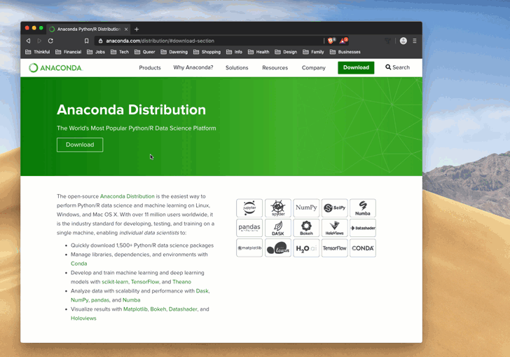

So far, you've been working with Google Colab, a web-hosted Jupyter Notebook. In Colab, the Python code that you write is sent to another machine and executed remotely. Then the results are sent back to your web browser.

In this checkpoint, you'll set up your local development environment with an up-to-date installation of Anaconda. Below are instructions for installing on Mac, Linux/Unix, and Windows systems. 

### Installing Anaconda

Anaconda is a platform to perform Python data science and machine learning on macOS, Windows, and Linux systems. Many of the essential tools for data science in Python, such as Jupyter Notebooks, pandas, and Matplotlib, come preinstalled with Anaconda. 

[Install Anaconda](https://www.anaconda.com/distribution/) by clicking the **Download** button. You will see options for Windows, Linux, and Mac OS X platforms. Download the **Python 3.7+** version.

You can start up Anaconda by searching for `Anaconda Navigator` on your computer.

Once it launches, click **Jupyter Notebook**. Create a folder in the Navigator by clicking **New folder** in the top-right corner. Rename it something like *Thinkful Data Science Projects*. This is the folder where you will be storing all of your Jupyter Notebooks for the time being. After creating the folder, create a new Python 3 Jupyter Notebook file as a test. 

Congratulations on getting this all set up. You're ready to start using this stuff!
