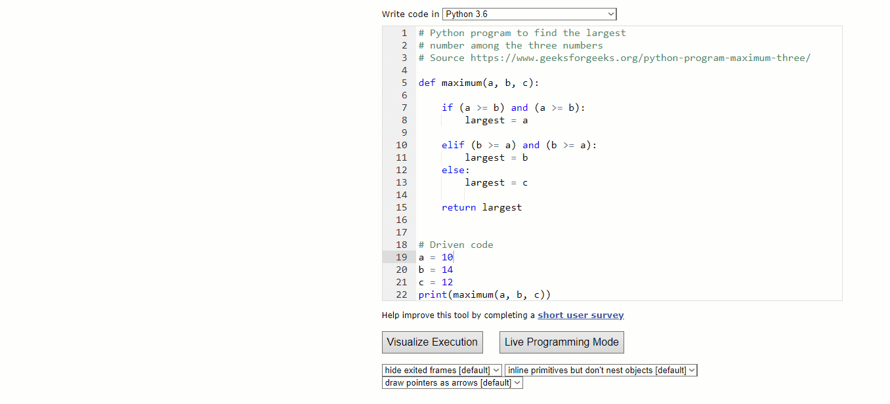
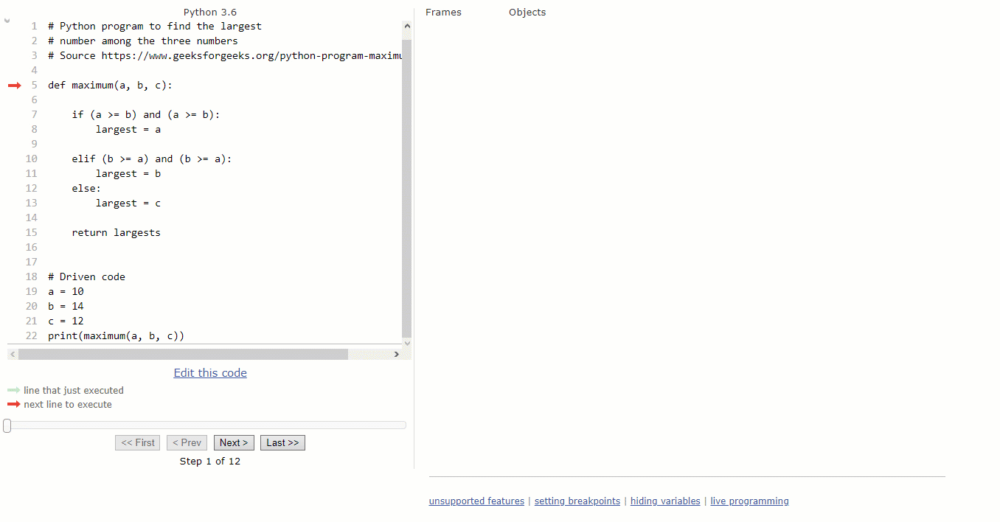

Functions are one of the most important concepts in programming. A *function* describes a repeatable process or behavior. You define that behavior once, and then you can run and rerun your set of instructions whenever, as many times as you need.

As a data scientist, you'll want to be able to use built-in functions and create your own. Functions are a central organizing principle in code, and you should be comfortable with the mental model and be able to apply it.

For a visual demonstration of how Python functions work, check out the video below.

<iframe id="kaltura_player_1590532905" src="https://cdnapisec.kaltura.com/p/2315191/sp/231519100/embedIframeJs/uiconf_id/45331192/partner_id/2315191?iframeembed=true&playerId=kaltura_player_1590532905&entry_id=1_vxf78yo5" width="100%" height="500" allowfullscreen webkitallowfullscreen mozAllowFullScreen allow="autoplay *; fullscreen *; encrypted-media *" frameborder="0"></iframe>

In this checkpoint, you'll be introduced to the basic anatomy of functions. You'll learn everything that you need to know to use them as a data scientist.

The remainder of this checkpoint will load in this Jupyter Notebook:

<jupyter notebook-name="working_with_functions" course-code="DSBC"></jupyter>

Check out the video below for a screencast demonstration of the topics covered in this checkpoint. 

<iframe id="kaltura_player_1590532863" src="https://cdnapisec.kaltura.com/p/2315191/sp/231519100/embedIframeJs/uiconf_id/45331192/partner_id/2315191?iframeembed=true&playerId=kaltura_player_1590532863&entry_id=1_ldie015w" width="100%" height="500" allowfullscreen webkitallowfullscreen mozAllowFullScreen allow="autoplay *; fullscreen *; encrypted-media *" frameborder="0"></iframe>

## Stepping through your code visually

Thinking in Python—and particularly thinking in functions—can take some getting used to. [Python Tutor](http://pythontutor.com) provides a free editor for visually stepping through how your Python code is being executed. Using Python Tutor is straightforward: paste the code that you want to execute, and begin the visual execution by clicking **Visualize Execution**. Note that it's a good idea to actually call your function and try it out after you've defined it.

For example, the screencast below steps through a function that finds the maximum of three numbers. This is a function that you will be able to write by the end of the module! But for now, you will just see how it works using Python Tutor. Below, you'll see the results of the code being executed with each step, through to the final answer—which in this case is the result of the function.

If your code returns an error, Python Tutor will also indicate where it is, what type of error it is, and what part of the code it's affecting.

 

This is a great resource to help you get unblocked when you're writing Python code. 
