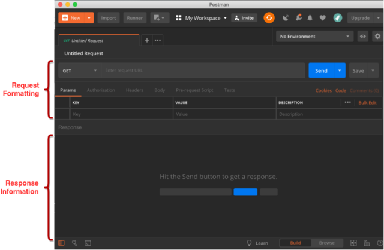
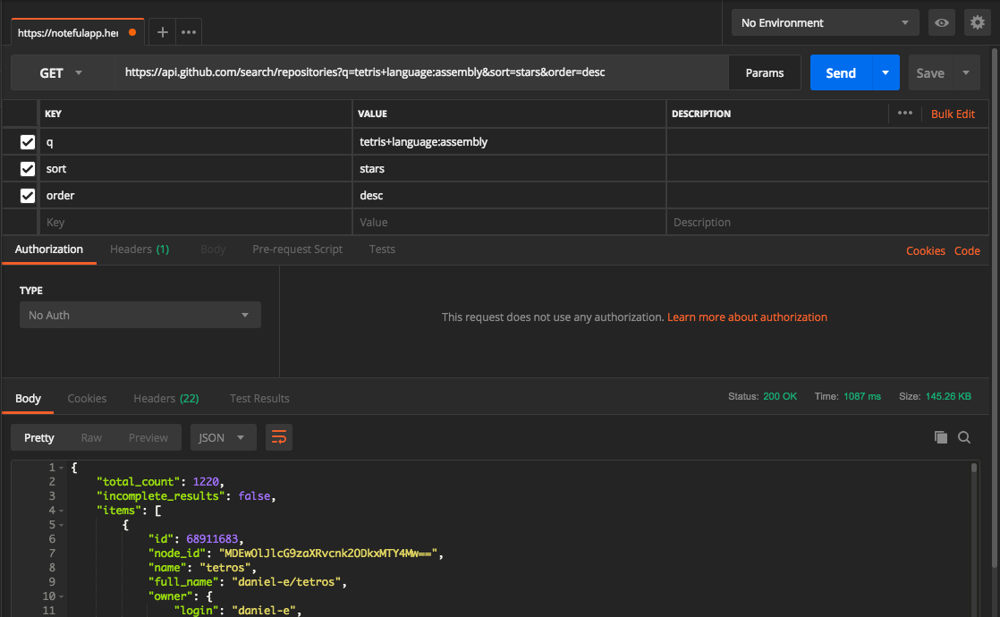

Web-based data APIs are the first data source that you'll learn to work with in Python. In this checkpoint, you'll get a conceptual introduction to APIs and web requests. You'll also use Postman, which is a tool that allows you to inspect and better understand web requests. Then, in the next checkpoint, you'll explore how to make requests to APIs in Python.

| Term           | Definition                                                                                                                                                                                                                                                                                              |
| :------------- | :--------------------------------------------------------------------------------------------------------------------------------------------------------------------------------------------------------------------------------------------------------------------------------------------------------- |
| API (Application programming interface)          | A set of defined methods of communication among components, often in the context of a user requesting data from a website server                                                                                                                                                                         |
| Request       | A query from the user to the web                                                                                                                                                                                                                                                                         |
| Response      | What the web server returns as a result of the request                                                                                                                                                                                                                                               |
| Status code   | A numeric code that the server sends in response with regard to the request's status. For example, a status code of `200` indicates a successful action, and a status code of `400` indicates a bad request. To see a longer list of status codes, visit [HTTP Status Codes](https://restfulapi.net/http-status-codes/). |
| Rate-limiting | A policy to limit the use of an API to a certain number of API requests over a period of time                                                                                                                                                                                                         |
| API key       | An authorization code that is passed to an API request and identifies the requester                                                                                                                                                                                                                             |
| JSON (JavaScript Object Notation)          | A common data format used for API requests and responses                                                                                                                                                                                                                    |
| Parameters    | Arguments sent to the API that define the request and expected response                                                                                                                                                                                                                                 |


## What is an API?

Data has become a commodity of great value. One mechanism for safely sharing data is the *web service* or *web API*. The data is exposed via a series of functions that are accessible using web technologies.

APIs can be complex. They range from a single function that provides a simple result, to many thousands of functions that provide a variety of results. Some accept parameters, and some don't. Some parameters have constraints on their values, and some don't. Some APIs require special authentication. Some have restrictions on the number of times they may be called. Unfortunately, there is no standard way that any of this is done. So, for each API that you wish to use, you'll need to delve into the documentation and figure out its particular structure and rules.

A popular form of API is the *REST API*. Short for *representational state transfer*, REST is a way for two computers to communicate over *hypertext transfer protocol* (HTTP)—which is the way that your web browser interacts with servers. You'll be learning how to manipulate REST APIs, so it's a good term to know. But don't get too hung up on the computer engineering—you're mainly focused on retrieving data.  


## Some examples

Before you can use an API, you need to find it. In many instances, the organization that wants to use the data already knows where this data may be accessed. But in many other cases, you may need to search for data. Here are a few good places to start:

- **Data.gov:** [Data.gov](https://www.data.gov/) is the U.S. Government's open data website. It lists over 300,000 datasets, with subjects ranging from agriculture to energy to science to health. The data is provided in many different formats and from many different agencies within the government, so some searching is necessary to find relevant data.

- **AnyAPI:** [AnyAPI](https://any-api.com/) lists and documents over 500 public APIs from a large number of organizations. Again, these APIs vary in what they offer, so some searching and digging around may be necessary.

## Endpoints

An API exposes its functions as *endpoints*. An endpoint is composed of an HTTP method and a URL path. This uniquely identifies some function on the server that returns data. Some endpoints accept *parameters*, which are bits of data that help the API do its job. For example, if you request weather data from a weather API, you may also need to provide your city or zip code as a parameter.

To call the endpoint, you need the full URL. The parts of a URL are as follows:


Together, the *protocol*, *domain*, and *port* are called the *base URL*. The base URL identifies the server that hosts the API. The *path* is the endpoint path that identifies the specific function that you are calling on this server. The *query string* is made up of the parameters needed by this endpoint function. You will look at a few examples shortly.


## Postman

Before you start writing code to get data from an API, you'll need to know what the API has to offer. This information is primarily found in the API documentation. But even reading the documentation may leave some questions unanswered. This is why Postman—a tool that allows you to make HTTP calls to web APIs without writing code—is useful.

Next, you'll install Postman. Then you'll turn to the documentation of an API and make some calls to see what happens.

To get started with Postman, the first thing that you need to do is download the app. There's a Chrome extension and a command-line tool available, but you will be using the native app in this program. Go to [Postman's website](https://www.getpostman.com/apps) and download the appropriate version for your operating system. Once it finishes downloading, open the app. Keep it open for the remainder of this checkpoint. The app will open a window that looks like this:




## API documentation

APIs differ from each other greatly, and there is no standard way to document them. To properly use an API, you must read the documentation carefully. There are a few things that you should know about an API if you plan to use it. When reading API documentation, you may want to look for the following:


- **Cost:** Do you have to pay to access the API? Is there a free tier, and if so, what are its limitations?
- **Authentication:** Is authentication required, or is it open? Most interesting datasets require some form of authentication, meaning that using the API will require registering for an account.
- **API key:** Is an API key required? (This usually goes along with authentication.) How do you get an API key?
- **Base URL:** What is the base URL of the API?
- **Responses:**
  - What data format options are available? Many provide JSON formats, but that is not always the case. XML is also quite popular.
  - What are the status codes that may be returned by this endpoint?
  - What is the structure of the data that is returned by this endpoint?
  - What limitations exist on the returned data?
- **Examples:** Are there examples of typical calls? Are there code examples? Are the examples in a relevant language or environment for you?
- **Endpoints:** What endpoints are available?
  - What is the endpoint URL?
  - Which HTTP method is used to call this endpoint?
  - What path parameters are needed?
  - What query parameters are needed?
  - What body parameters are needed?
  - Which parameters are required, and which are optional?
  - For each parameter, consider the following:
    - What is the data type of the parameter value?
    - What is the valid set of values allowed for this parameter?
    - If the parameter is optional, what default value is used by the API?

API documentation varies considerably in terms of comprehensiveness. Some API docs won't answer all of the questions above, while others will answer all of these questions and then more.

Next, you'll take a look at an actual API.

##  The GitHub API

For this example, you'll look through the GitHub API. As you know, GitHub is a popular platform for managing versioning, backup, and collaboration on coding projects. 

Now, visit [GitHub's API documentation](https://docs.github.com/v3/). You are going to take a deep dive into this API documentation, primarily as a way to understand how API documentation may be useful. Learning how to actually use the GitHub API is not important unless you plan to use this API in your own projects later.

A quick glance shows that this API provides many available options and thorough documentation. The GitHub API docs are made with developers in mind, with enough information to satisfy a wide variety of use cases.

The first feature to notice is that this API is explicitly versioned. The current version of the API is version three; this implies that there were two previous versions and that there is potential for further versions in the future. It's important to note the version number; the API may change from version to version, and your application may break if you depend on a version three feature but accidentally request a version four endpoint.

Notice that this documentation is organized into two main sections: *Reference* and *Guides*. The *Reference* section provides exhaustive, detailed information about everything that this API has to offer. In this section, you can find the answers to most of the questions from the above checklist. It includes the complete list of all API endpoints, parameters, types, responses, exceptions, constraints, limits, and options.

The guides, on the other hand, are more like tutorials that explain how to use various features of the API. Guides are good places to find examples of how the API may be used. But the information about the endpoints will not be as detailed as in the *Reference* section.

Many of the questions from above are addressed in this documentation:

- **Cost:** GitHub is an open platform. Even though pricing is not explicitly discussed on this page, access to the API is free. For more details, see the section on rate limits.
- **Authentication:** There are different levels of authentication in use for different scenarios. Notice that OAuth2 is required for many endpoints. You can look at the guides for some suggested ways to use authentication.
- **Base URL:** There is a note about this under the heading *Root endpoint*.
- **Data format:** In this documentation, this information is under the heading *Schema*. The word *schema* is used to mean the definition of data formats. In some documentation, it may be called *model*. GitHub accepts and responds with JSON data.
- **Examples:** Take a quick look through the page. It is chock-full of example calls. You'll find that for any endpoint you look at, there's extensive documentation and example calls. The calls in these examples are presented as *cURL* commands. [cURL](https://curl.haxx.se/) is a command-line tool for making HTTP requests. It can be very helpful in figuring out how an API works, but it's typically used by dedicated software developers. Fortunately, you have Postman, which will allow you to easily explore some examples.

For example, on the [repository search endpoint](https://developer.github.com/v3/search/#search-repositories), the very first example on the page is this:

```
curl https://api.github.com/search/repositories?q=tetris+language:assembly&sort=stars&order=desc
```

If you are on a Mac or Linux machine, you may run this command in your terminal and see the output right away. Or, you can take it apart and use Postman to make the same call. The URL is `https://api.github.com/search/repositories`, and there are three query parameters: `q`, `sort`, and `order`. The three parameters have three respective values: `tetris+language:assembly`, `stars`, and `desc`. In Postman, the very same call can be made like this:




### Endpoints

The full list of endpoints is given in the navigation menu on the right side of the page. To determine which ones you need, you have to read through them until you find the ones that you need. Notice that the endpoints are named for the objects that they serve. So, if you are interested in gists, look under the *Gist* heading. Or, if you are interested in organizations, look under the *Organizations* heading.

Next, continue looking at the repository search endpoint page. This endpoint has the URL `/search/repositories`, and it is a `GET` endpoint. There are only three parameters:


| **Name** | **Type** | **Description**                                                                                   |
| :------- | :------- | :------------------------------------------------------------------------------------------------ |
| `q`      | `string` | **Required.** The search keywords, as well as any qualifiers.                                     |
| `sort`   | `string` | The sort field—one of `stars`, `forks`, or `updated`. By default, results are sorted by best match. |
| `order`  | `string` | The sort order if the `sort` parameter is provided. One of `asc` or `desc`. By default, results are sorted by `desc`.          |


Notice that only `q` is required. Use Postman to test what happens when you leave out this required parameter. You should see a response like this:

```json
{
    "message": "Validation Failed",
    "errors": [
        {
            "resource": "Search",
            "field": "q",
            "code": "missing"
        }
    ],
    "documentation_url": "https://developer.github.com/v3/search"
}
```

That is a fairly descriptive error response, which makes it easy for you to handle in your code. Further details of error responses, in general, can be found in the [*Client errors* section](https://developer.github.com/v3/#client-errors) of the documentation.

Notice also that each parameter has a data type of string, and both `sort` and `order` are given specific lists of valid values. Defaults for each of these optional parameters are also provided.

GitHub has a robust search syntax that can be used via its web interface as well as in this API. Some details are given directly in this endpoint documentation, but full details of how you can format the value of `q` can be found on the [*Searching for repositories* page](https://help.github.com/articles/searching-for-repositories/).

Use Postman to examine a few other calls to the GitHub API.

Check out the video below for a screencast demonstration of the topics covered in this checkpoint.

<iframe id="kaltura_player_1590583328" src="https://cdnapisec.kaltura.com/p/2315191/sp/231519100/embedIframeJs/uiconf_id/45331192/partner_id/2315191?iframeembed=true&playerId=kaltura_player_1590583328&entry_id=1_xxq8k4mu" width="100%" height="500" allowfullscreen webkitallowfullscreen mozAllowFullScreen allow="autoplay *; fullscreen *; encrypted-media *" frameborder="0"></iframe>
