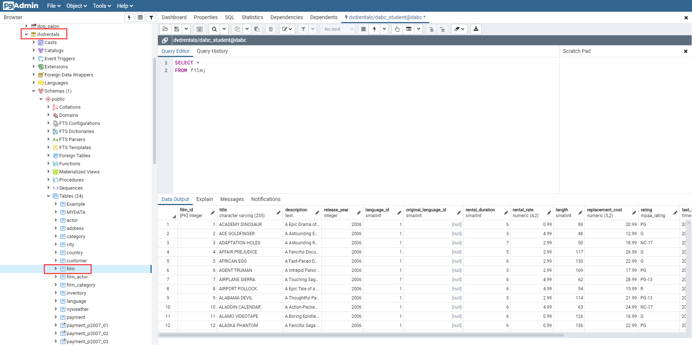

Earlier in this program, you learned the basics of working with SQL as a data scientist. You are going to build on that knowledge now; you'll programmatically construct queries and execute them in Python. Then you'll process the results in some meaningful way.

To connect to a database system, you need a *database driver* or *adapter*. This is a small piece of software, written in your language of choice, that understands how to connect and execute SQL statements on a database. The most commonly used database driver for connecting Python programs to PostgreSQL databases is called [psycopg2](https://pypi.org/project/psycopg2/).

In this checkpoint, you will go one step further and use [SQLAlchemy](https://www.sqlalchemy.org/), which is a very popular Python toolkit for SQL. This tool is extensive, and it has many features that go way beyond the scope of this program. You will use it to make connections to the database simple, and to make the execution of SQL statements fast. But SQLAlchemy depends on psycopg2 to make the database connection, so you need both installed on the system.

<jupyter notebook-name="python-sql" course-code="DSBC"></jupyter>

Check out the video below for a screencast demonstration of the topics covered in this checkpoint.
<iframe id="kaltura_player_1590583392" src="https://cdnapisec.kaltura.com/p/2315191/sp/231519100/embedIframeJs/uiconf_id/45331192/partner_id/2315191?iframeembed=true&playerId=kaltura_player_1590583392&entry_id=1_nwfcznqt" width="100%" height="500" allowfullscreen webkitallowfullscreen mozAllowFullScreen allow="autoplay *; fullscreen *; encrypted-media *" frameborder="0"></iframe>

## Assignment

Create a Jupyter Notebook that uses SQLAlchemy to access a SQL database containing data about movies. Use Python to answer some basic questions about the data.

Use the following connection credentials:  
- postgres_user = 'dsbc_student'  
- postgres_pw = '7*.8G9QH21'  
- postgres_host = '142.93.121.174'  
- postgres_port = '5432'  

Then, answer the following questions about the `dvdrentals` database. You will need to read from the *film* table. 

For each question, you should have a separate cell in your Notebook that prints out the answer. 
1. How many movies are released for each rating?
2. What is the average rental duration for each rating? 
3. What is the mean movie length? Calculate this by defining a function.
4. What is the median movie length?  Calculate this by defining a function.
5. Calculate the standard deviation of the movie lengths. Calculate this by defining a function.
