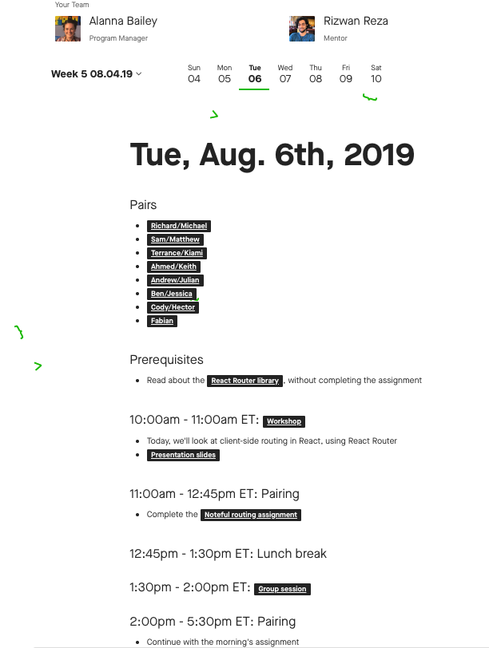

If you're reading this checkpoint, you've made it through the Prep course. Now, you're ready to get rolling through the *Data Science Immersion* program on your journey to becoming a data scientist.

You may be wondering why there's another orientation. This module explains what the program will look like over the next few months, and it describes the additional resources that you can access in this program.

By the end of this module, you should feel comfortable with what to expect as you head into your first day of the *Data Science Immersion* program.

## What content will you learn in the *Data Science Immersion* program?

Below, you will find an overview of the topics covered in this program.

### Data science toolkit

- Python
- Git, GitHub, and the command line
- SQL
- Experimental design
- A/B testing

### Supervised learning

- Model preparation
- Regression problems
- Classification problems
- Random forest models
- Similarity models
- Support vector machines
- Boosting models

### Unsupervised learning

- Clustering
- Dimensionality reduction

### Specializations and other topics

- Time series analysis
- Natural language processing
- Big data with Spark
- Deep learning with Keras and TensorFlow

## How long will this program take?

*Data Science Immersion* is a 20-week-long program. Class meets via video from 10 AM through 5 PM Eastern Time (ET), Monday through Friday.

For three weeks during the program, you'll focus on creating and presenting your capstones and doing mock interviews, without instructional time. The rest of the time will follow a schedule with a similar pattern each day. A sample schedule is below.

| Time (ET) | Activity |
| :--- | :--- |
| 10:00 AM–12:00 PM | Morning instructional session |        
| 12:00 PM–12:45 PM | Lunch break |        
| 12:45 PM–2:15 PM | Afternoon instructional session |
| 2:15 PM–3:00 PM | Afternoon break |       
| 3:00 PM–5:00 PM | Study hall |       
| 6:30 PM–10:00 PM | After hours (mentor and group sessions) |      

You can always access your daily schedule from your dashboard, as shown in the example below. This way, you will always know what you are doing for the day.

## What will the day-to-day look like?

During a typical day, you will begin class with instructional time. Your instructor will lecture about the topic of the day, and you will have an opportunity to practice assignments based on what you have been learning. Afterward, you'll have a break for lunch, and then you'll resume instructional and practice time. After another break, you'll continue to work on assignments from your instructor, either in pairs or by yourself. Pairs will be assigned in the dashboard, and video meeting URLs will be provided. In the evening, you will have the opportunity to meet with your mentor, attend workshops, and continue working on assignments and the curriculum.

### Capstone projects

You will also experience working on a new type of project: the capstone.

Your capstone projects will be the most valuable thing that you leave your program with. Your portfolio of capstone projects will be what you show to employers to demonstrate that you are ready to work.  

These can be pretty hefty projects! A typical capstone can take about 1-2 weeks to complete. You will also want to plan for revision time. The capstones are designed to be reflective of the work that you will deliver in the workplace; you will rarely submit a major project without getting revisions from your manager or project lead.

Some capstones allow you some leeway in choosing a topic. When choosing a topic for these capstones, it can be helpful to pick something that aligns with one of your hobbies or interests, when possible. If you are aiming to get into a very specific industry, it may be helpful to have at least one of your capstones built around that subject. And it's important to have fun with the capstones! You will put more heart into your work if you are enjoying yourself. It also shows employers your personality.

## What are some of the additional resources?

In *Data Science Immersion*, instructors and teaching assistants (TAs) will form part of your experience in the program. Instructors will lead daily sessions, and they will be around for support when you are working through assignments in class and between lecture sessions.

TAs are available after lecture sessions. You can check in with them and ask for support if you have questions or if you're struggling with pair or solo work.

### Careers

Throughout the program, you'll be indirectly working with the careers team as you complete the *Careers* checkpoints. These checkpoints are designed to ensure that you'll be prepared for your job search. Once you graduate from *Data Science Immersion*, the careers team will support you as you embark on your job search with an assigned career coach. You'll learn more about that in the next checkpoint.

## Welcome!

The Thinkful team can't wait to support you in your ultimate goal of starting a new career path. Welcome to Thinkful's immersive *Data Science* program!

## Assignment

For the following prompt, write a 2-3 sentence response. Submit your text in the submission interface below.

- What worries, fears, or questions do you have as you begin the next five months of intensive learning to become a data scientist?
