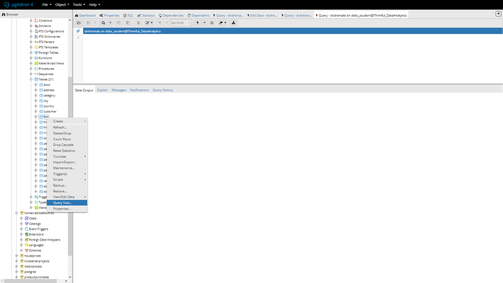
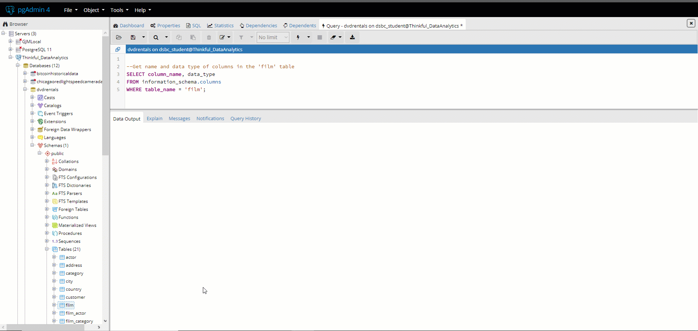
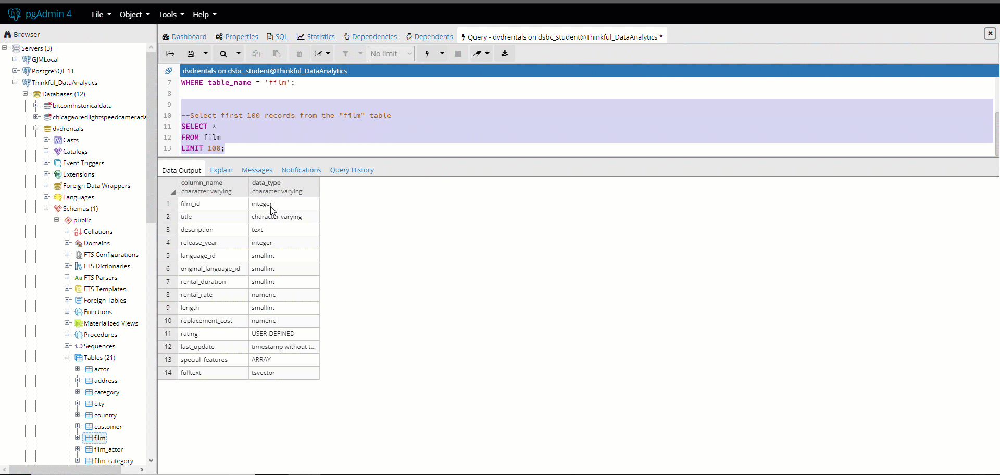
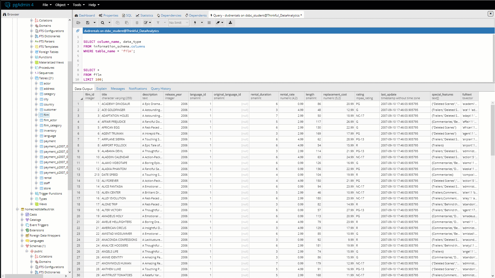
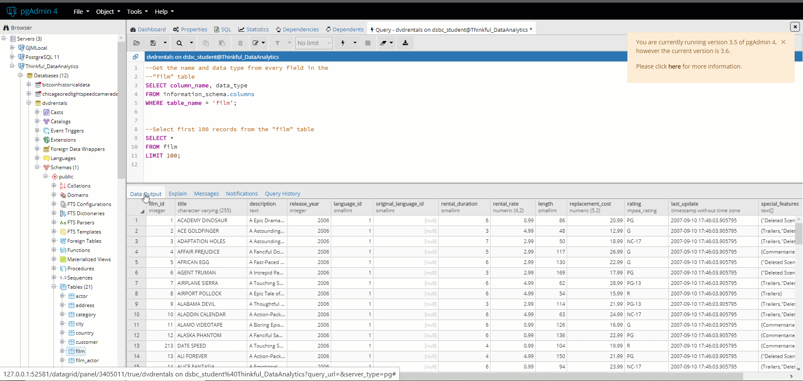
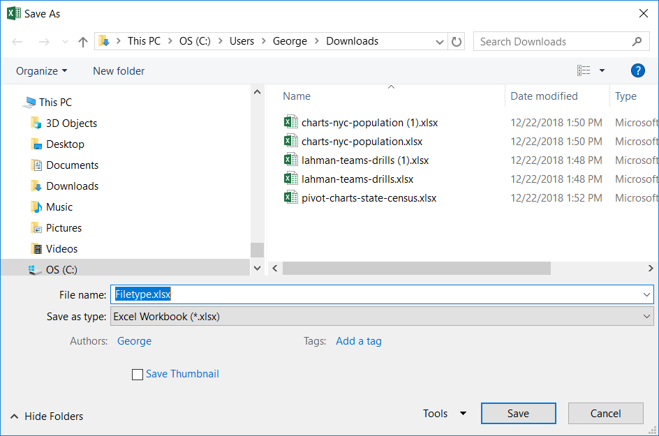
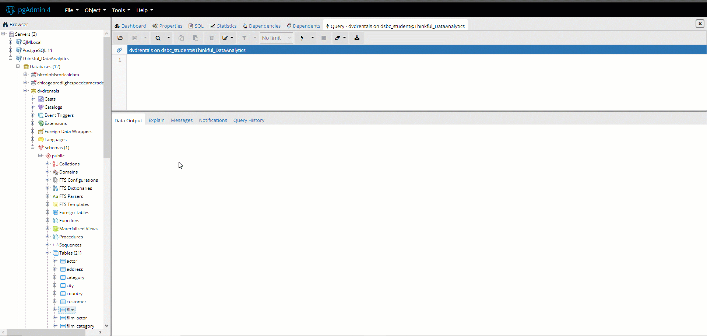
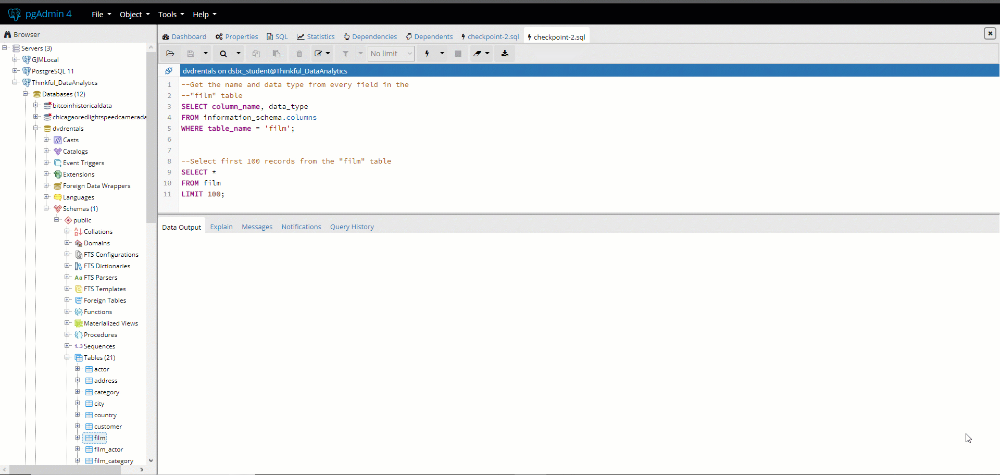
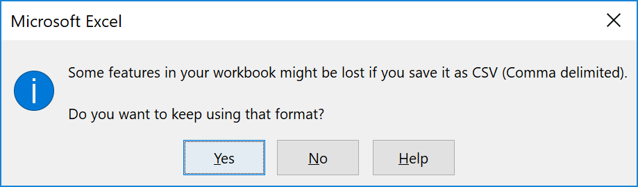
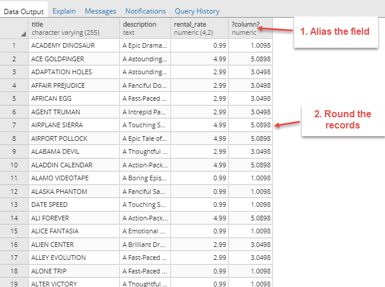

## Introducing the query tool

In the previous checkpoint, you used pgAdmin to explore a database table. You practiced retrieving the names and types of columns, and you viewed the first 100 rows of the table. Although you used pgAdmin's interface to achieve these tasks, you also discovered what was really going on behind the scenes: SQL was being generated and then executed.

Now, you'll cut out the middleman and start working directly with SQL queries. To do that, continue to explore the *film* table in the *dvdrentals* database. Right-click this table and select **Query Tool** from the menu. This will reveal a window at the top of your screen where you can write and execute SQL queries. You'll see the output of the queries that you execute in the **Data Output** tab, as shown in the image below.



There are several essential buttons to pay attention to in the **Query Editor**. The **Open File** 📂 button and the **Save File** 💾 button allow you to load and save queries from and to files. There's also an **Execute** button, which looks like a lightning bolt ⚡ button or play ▶️ icon (depending on which version of pgAdmin you have). This button allows you to *execute* (run) the queries that you write in this window. And the **Download** 📥 button allows you to save your data outputs.
 

 

## Exploring your table

Now, jump into writing queries. You'll get into the details of these SQL statements in a bit. But for now, you'll focus on writing queries to reproduce the data exploration tasks that you used pgAdmin to do in the previous checkpoint.

### Getting table information

To begin, inspect the *schema*—which comprises the names and data types of the columns—for the *film* table. You've already done this with pgAdmin; now, try writing an SQL query to inspect the schema.

In the **Query** window, enter the following SQL query. Then, click the **Execute** button. 
 
```SQL
--Get the name and data type from every field in the 
--"film" table
SELECT column_name, data_type 
FROM information_schema.columns
WHERE table_name = 'film';
```



Next, take a look at the first 100 records in the *film* table. Again, this is similar to viewing the first 100 records via the pgAdmin interface.

Clear out the previous statement from the **Query Editor**, and then enter the statement below. Then click the **Execute** button.

```SQL
--Select the first 100 records from the "film" table
SELECT *
FROM film
LIMIT 100;
```




### Working with scripts

At this point, you've written two statements. Huzzah! You might not understand what you've done just yet, and that's totally fine. But you should be starting to get a feel for working with pgAdmin.

As stated in its name, SQL is a language. You already know how you would read, write, and save text and written records in a word-processing document. You'll do the same thing with SQL statements in *scripts*.

Just like a document can have several paragraphs, a script can have multiple statements. For example, you can combine the two previous statements into a single script, as shown below:

```SQL
--Get the name and data type from every field in the 
--"film" table
SELECT column_name, data_type 
FROM information_schema.columns
WHERE table_name = 'film';

--Select first 100 records from the "film" table
SELECT *
FROM film
LIMIT 100;
```

Now, go ahead and execute this script by clicking the **Execute** button. When you do this, the entire script is executed. But even though you executed both statements, the **Data Output** tab shows only the resulting table of the last statement.

But what if you wanted to get the output for the first statement? To do this, highlight the entire statement that you want to execute. Then click the **Execute** button, as shown below:




### Viewing your query history

To track exactly what was executed in a script, you can go to the **Query History** tab. If you're using Windows, you can find this tab in the lower pane of pgAdmin. And on macOS, it's above the script next to the **Query Editor** button.

In **Query History**, you can see your previous queries. For example, it shows that when you executed the entire script—instead of just one specific statement—both statements were executed.



In addition to serving as a log of what was executed, **Query History** can be a time-saving feature. It allows you to rerun a query that you previously ran, and it can help you fix an issue if you accidentally clear out a statement that you need.

## Saving scripts and output tables

The analogy between word-processing documents and SQL scripts extends even further. The process of saving and loading scripts in SQL is similar to what you would do in a word-processing document.

To save a script, click the **Save File** button and navigate to the desired folder. By default, pgAdmin will save a script wherever the last script was saved. To save the script in a different folder, you can return to the main drive by clicking the **Home** 🏠 button. Then you can navigate to the desired folder. Provide a file name for the script that you're saving, and add `.sql` to the end of the file name.


**Note:** If you're using a Mac and you see a "Permission denied" error message when you try to save a script, try saving in your **Users** folder.

In pgAdmin, you must specify both the file name and the file extension. Why is this? Consider what you would do in a desktop tool like Excel. When you save a workbook in Excel, there is a **Save as type** option. Although Excel defaults to saving an `.xlsx` file, you can choose to save the workbook as another file type, such as `.csv` or `.pdf`.




This is the same in pgAdmin. Technically, you can save a script as a CSV or text file. But you probably want to save it as an SQL file. To do this, use the designated file extension for a SQL script: `.sql`.

Loading scripts works in the same way. Click the **Open File** button, and navigate to the folder holding the desired script. This loads your old script, and you can execute these statements just as before.




### Output tables

It's important to remember that in these SQL statements, you're simply returning bits and pieces of various tables. You aren't creating or saving new tables. If you want to save the result of a statement, you can do so by executing the statement and then clicking the **Download** icon. This will generate a saved CSV file of the results on your computer. 



If you open this exported file, it will likely open in Excel. But it's not actually an Excel workbook—it's a CSV file. And even though Excel can read CSV files, the application is restricted. CSV files don't have the same features as native Excel files. Whenever you save a CSV file in Excel, you might see the error message pictured below.



To get around this warning, you can do a couple of things. You can either click **Yes** and save it as a CSV file. Or, you can convert the existing CSV file into an Excel workbook. To do the latter, go to **File > Save As**. Select the target folder, and then click the drop-down menu next to **Save as type**. Here, you can convert the file from `.csv` to `.xlsx`. This is the first option in the menu, as you can see below.


It's possible to save the results of a SQL statement or a CSV file into a new table. But you won't learn about writing, modifying, and deleting operations in SQL in this program. Instead, you'll focus on learning how to retrieve information from tables.

Check out the video below for a screencast demonstration of how to navigate the pgAdmin interface.

<iframe id="kaltura_player_1590583560" src="https://cdnapisec.kaltura.com/p/2315191/sp/231519100/embedIframeJs/uiconf_id/45331192/partner_id/2315191?iframeembed=true&playerId=kaltura_player_1590583560&entry_id=1_riossj5u" width="100%" height="500" allowfullscreen webkitallowfullscreen mozAllowFullScreen allow="autoplay *; fullscreen *; encrypted-media *" frameborder="0"></iframe>


## The grammar of SQL

The simplicity and stability of SQL's grammar is part of why SQL has remained popular over the years. Like sentences in natural language, SQL statements are composed of clauses.

### Common SQL clauses

Here are the clauses that you're most likely to use when retrieving data:

| Clause   | What to do with it                                            |
| :-------- | :------------------------------------------------------------- |
| `SELECT`   | Specify what fields you want information from                 |
| `FROM`     | Specify what tables those fields are coming from              |
| `WHERE`    | Specify any criteria that records in those fields should meet |
| `GROUP BY` | Specify how to aggregate the results                          |
| `HAVING`   | Specify any criteria that the aggregate results should meet   |
| `ORDER BY` | Specify how to sort the results                               |
| `LIMIT`    | Specify how many records to return in results                 |


### SQL terms

SQL also has terms that are equivalent to the parts of speech in a sentence. Here are some of them:


| Term       | What to do with it                                               | Example     |
| :--------- | :--------------------------------------------------------------- | :---------- |
| Identifier | Identify a database object, often a table or the name of a field | `film`        |
| Operator   | Take some action, such as adding fields or renaming or aliasing a field    | `AS`, `+`       |
| Expression | Find specific sets of data                                       | `rating > .9` |


### SQL style conventions

As mentioned earlier, there are various relational database management systems. Each has its own *flavor* of SQL. Although much of the syntax that will be covered can be used in any of these systems, the style in which SQL is written often varies.

Here's the basic style that you'll follow in this program:

1. Each clause is placed on its own line and is capitalized.
2. All identifiers are lowercase.
3. All operators are uppercase.
4. Statements end with a semicolon `;`. The semicolon is the traditional SQL *escape character* to identify the end of a statement.
5. Comments start with two hyphens `--`. Leaving instructive comments about what the code is doing—and how it's doing it—is one of the best habits that a data analyst can pick up. To that end, you'll see frequent comments throughout the examples in this program.

Ultimately, pgAdmin does not require that you use many of these stylistic choices. For example, it won't complain if you use lowercase letters for your clauses. However, this style creates consistency in your statements. It also improves legibility, making it easier to follow the ordering and placement of clauses and identifiers. And if you were to interact with a PostgreSQL database from a command-line shell environment, you would *have* to include semicolons at the end of each statement. Otherwise, they would not execute. 


## Getting started with `SELECT`

Now that you have a basic understanding of the query tool and SQL grammar, you'll practice using column names to retrieve information. Whenever you're retrieving information from a table in SQL, your best bet is to start with a `SELECT` clause. And wherever there's a `SELECT` clause, you know there's also a `FROM` clause. This makes sense if you consider what you're trying to do. If you were looking for a book in the library, for example, you would want to know both the name of the book (what to `SELECT`) and where it was located (`FROM` where you want to collect it).

### Using `SELECT` with one or more fields in a table

Tables can have dozens and dozens of fields. Often, you'll pare down the number of columns that you want to retrieve. To do this, you'll use the `SELECT` statement.

For example, if you were only interested in the *title* field in the *film* table, how would you use `SELECT` to retrieve this field? Remember, a `SELECT` clause needs a `FROM` clause.

```SQL
--Select "title" field from "film" table
SELECT title
FROM film;
```

To select more than one field, supply each field name, and separate each of them with a comma. The statement below selects *title*, *description*, and *release_year*.

```SQL
--Select "title", "description", and "release_year" fields from "film" table
SELECT title, description, release_year
FROM film;
```

### Using `SELECT` with all fields in a table

You can also select all the fields in a table. One way to do this is to type them all into the `SELECT` clause. However, your database could have dozens of fields, so this approach would result in a long, error-prone, and illegible `SELECT` clause.

When you need to select all fields, use an asterisk `*` to represent "all". This is called a *wildcard character*, which means that it is used to substitute one or more characters in a string. In the statement below, the asterisk instructs SQL to `SELECT` all fields.

```SQL
SELECT *
FROM film;
```

## Expressions and aliasing in `SELECT` statements

You can create new fields in your table in SQL by operating on existing columns. But these changes hold only for the duration of the query itself; they do not alter the underlying data. 

For example, try creating a new column calculating a 2% increase to all rental rates. Select these fields along with *title* and *description*. Your query should look like this:

```SQL
SELECT title, description, rental_rate, rental_rate * 1.02
FROM film;
```

Note that in order to get a 2% increase, you multiply the rental rate by 1.02, or 102%. Do not multiply by 0.02, or 2%.

The resulting data output leaves a few things to be desired. First, your resulting field—*rental_rate* _*_ *1.02*—lacks a meaningful name. Second, the resulting records in this field have many decimal places, calculated out to fractions of a penny.

Next, you'll learn how to use aliasing and rounding to take care of both of those issues.




### Aliasing fields

To create more meaningful field names in the results of your queries, you can use *aliases*. Aliases are temporary names that don't change the underlying data. They are used to make column names more readable, and they exist only for the duration of the query. 

Use the `AS` operator after using `SELECT` on a field to alias it. 

```SQL
SELECT title, description, rental_rate, rental_rate * 1.02 AS rental_rate_increase
FROM film; 
```

Aliasing is possible for any field, not just calculated ones, as shown here:

```SQL
SELECT title AS film_title, 
description AS film_description, 
rental_rate AS old_rental_rate,
rental_rate * 1.02 AS new_rental_rate
FROM film;
```

Note that you can still achieve the same result if you omit the `AS` operator. For example, you could also use the following query:

```SQL
SELECT title film_title, 
description film_description, 
rental_rate old_rental_rate,
rental_rate * 1.02 new_rental_rate
FROM film;
```

PostgreSQL will also parse aliases from this statement. But try to use the longer approach that includes `AS`. It makes everything clearer, and anyone reading the code will have a better understanding of what is happening.

### `ROUND` the records


Like functions in Python, your calculation created a field that you need to adjust slightly. The new field contains records calculated out to fractions of a penny. And, just as you would in Python, you can use `ROUND` to clean up the number of decimals stored in each record.

So to round the results of your alias *rental_rate_increase*, use the `ROUND` function. Try executing the following query:

```SQL
SELECT title, description, rental_rate, 
ROUND(rental_rate * 1.02, 2) AS rental_rate_increase
FROM film;
```

### String expressions

You can also create bespoke fields using string expressions. One common task is to concatenate the text of multiple fields into one. 

The query below will create a new field called *title_rating.* It uses the double pipe operator `||` to tell you both the film's title and its rating.  

```SQL
SELECT title || '. Rated: ' || rating AS title_rating, release_year
FROM film;
```
But many modern databases contain more intuitive ways to concatenate. In this case, PostgreSQL has a `CONCAT` function, which works like the concatenate operator `+` in Python. The following query produces the same result as the above query.

```SQL
SELECT CONCAT(title, '. Rated: ', rating) AS title_rating, release_year
FROM film;
```

PostgreSQL contains numerous other string functions. For example, you can use `INITCAP` to capitalize the first letter of every word in *title* while making the other letters lowercase. 

```SQL
SELECT CONCAT(INITCAP(title), '. Rated: ', rating) AS title_rating, release_year
FROM film;
```

Check out the video below for a screencast demonstration of writing SQL `SELECT` statements. 

<iframe id="kaltura_player_1590583583" src="https://cdnapisec.kaltura.com/p/2315191/sp/231519100/embedIframeJs/uiconf_id/45331192/partner_id/2315191?iframeembed=true&playerId=kaltura_player_1590583583&entry_id=1_o0bz2xko" width="100%" height="500" allowfullscreen webkitallowfullscreen mozAllowFullScreen allow="autoplay *; fullscreen *; encrypted-media *" frameborder="0"></iframe>


## Recap

This checkpoint has served as a more substantial introduction to pgAdmin. You also explored the basic grammar and style of SQL. You learned how to use the `SELECT` and `FROM` clauses to retrieve fields of a table, and you looked at basic field math and string operations. In upcoming checkpoints, you'll continue to work your way through SQL clauses to retrieve information from tables. 
