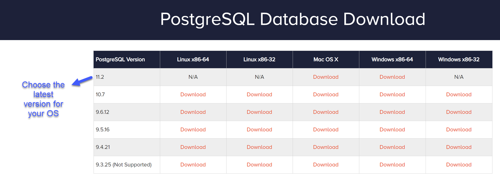
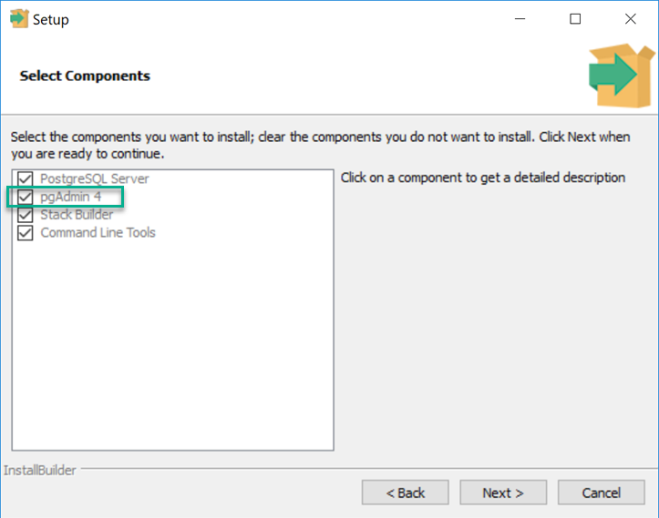
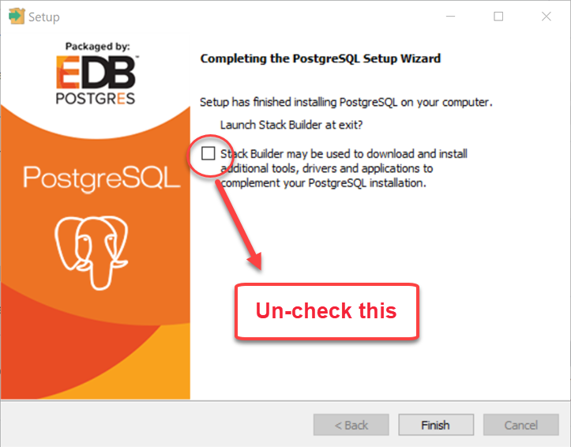
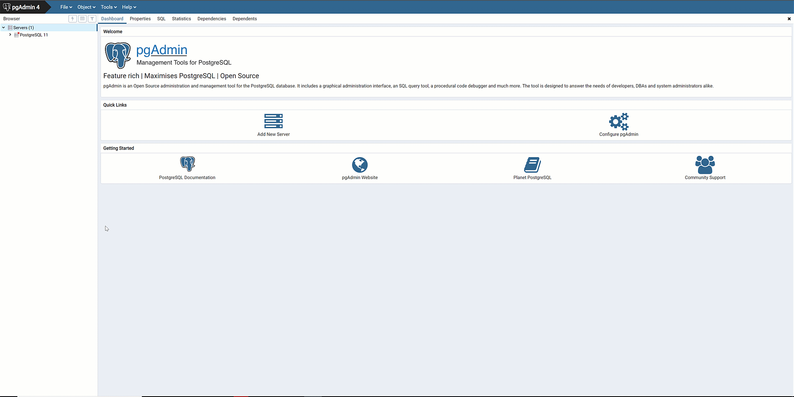
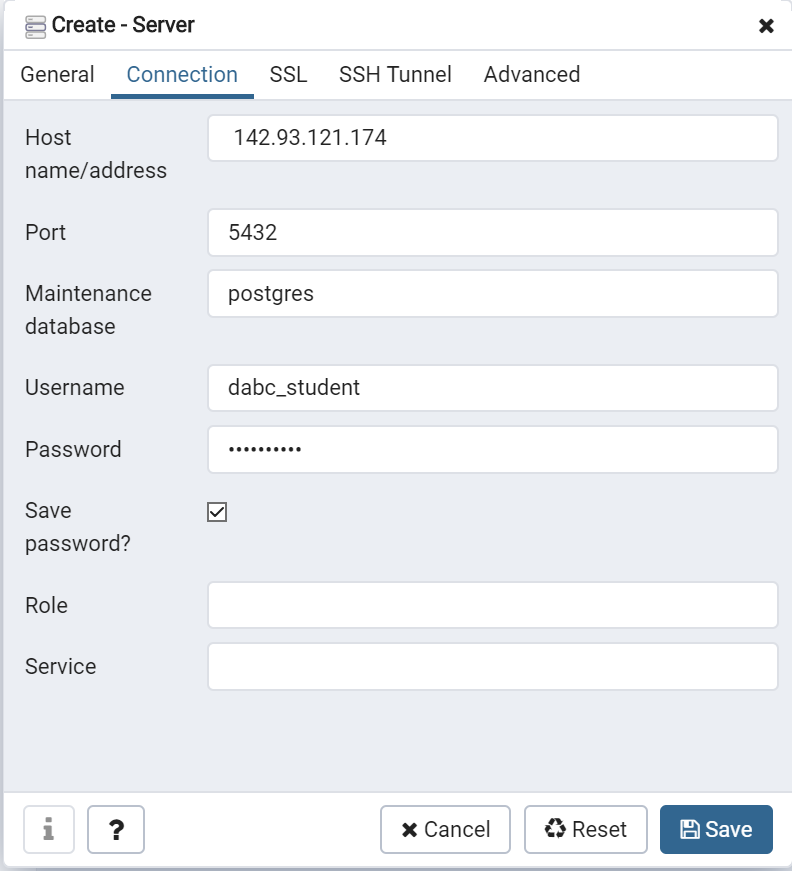
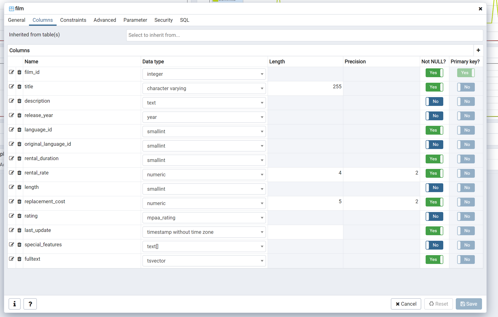
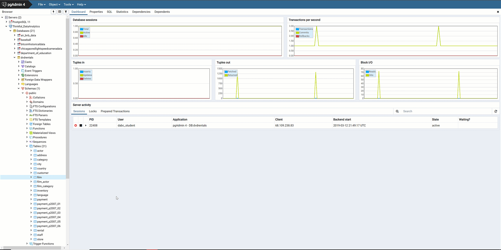
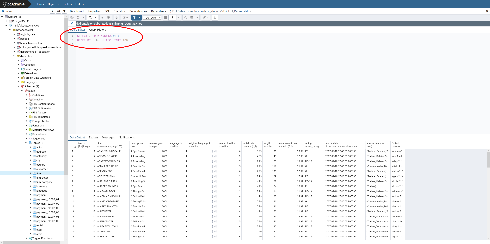

In the ever-changing world of data science, there's one tool that has certainly stood the test of time. That tool is *Structured Query Language*, or *SQL*. Often pronounced "sequel," SQL is one of the most widely used programming languages. And it's not just a fad—SQL has been around since the early 1970s!

This checkpoint serves as an introduction to SQL. You'll explore what this language is and where it fits into the business intelligence stack. Because SQL is a language designed for database queries, this checkpoint also serves as an introduction to PostgreSQL, which is the database management system that you'll use in this program.

## What is SQL?

SQL is the lingua franca for manipulating and querying data in relational databases. You'll explore the concept of the relational database more intensively later on. For now, you just need to know the basic definition: a *relational database* is a database in which the relationships between the data matter. For example, imagine that you have a database with two tables: table A, which has customer data, and table B, which has order data. Each order in table B points to a customer whose information is stored in table A. Because these tables are related to each other, the database is relational.

Now, unpack this further. So, a database has a server containing data and some way to query that data. The server might be in the cloud, on a local network, or on your computer. And SQL—which stands for Structured *Query* Language—provides a way to *query*, or talk to, the database. 

As a data scientist, you'll use SQL primarily to access various bits and pieces of your database. You might use SQL to answer specific questions about the data, like "What was the average number of transactions per store last week?" or "How many districts in Region A have sold more than 1,000 units of our new product?" 

But with SQL, you can do more than simply access information; there are also other types of queries available. You can use SQL to update, delete, and create tables by modifying rows and columns.

Check out the video below to learn more about how data scientists use SQL and relational databases.

<iframe id="kaltura_player_1590583659" src="https://cdnapisec.kaltura.com/p/2315191/sp/231519100/embedIframeJs/uiconf_id/45331192/partner_id/2315191?iframeembed=true&playerId=kaltura_player_1590583659&entry_id=1_0q59g79p" width="100%" height="500" allowfullscreen webkitallowfullscreen mozAllowFullScreen allow="autoplay *; fullscreen *; encrypted-media *" frameborder="0"></iframe>

## How relational databases work

A database consists of tables containing columns and rows, which are often referred to as *fields* and *records*, respectively.

### Fields

Every field includes two pieces of information:

1. **A name:** A name must be a string of 63 characters or fewer. It must start with a letter or an underscore, and the remaining characters can be letters, digits, or underscores. A good column name is legible and logically related to the data stored in that column. Creating good column names is especially important for your work with SQL, because you'll be referring to them a lot.
2. **A column type:** In a SQL table, you must specify a data type for each column; all the rows in a column must contain the same type of data. Even though there are plenty of exotic SQL data types ([see the PostgreSQL documentation for a complete list](https://www.postgresql.org/docs/8.4/datatype.html)), you'll focus on the most common ones for now.

| Data Type            | Description                                                                                                                                                                                                                                                                                                                               |
| :------------------------ | :--------------------------------------------------------------------------------------------------------------------------------------------------------------------------------------------------------------------------------------------------------------------------------------------------------------------------------------------- |
| Float                    | This stands for *floating decimal*, and it means that a value is being held as a floating-point approximation decimal. If that sounds confusing, don't worry. It's not a common data type in business intelligence use cases.                                                                                                                                   |
| Integer                  | Integers can be positive or negative, but they must be whole numbers. (In other words, they can't have decimals.)                                                                                                                                                                                                                                                            |
| Decimal                  | This is your run-of-the-mill decimal number.                                                                                                                                                                                                                                                                                                         |
| Character                | This is text data, such as "Hello" or "Hello World!" A character data type can take strings of any length; this is often known as *varying character* or *varchar*.                                                                                                                                                                                       |
| Character (fixed length) | In this text data type, entries must be a specified length (measured by the number of characters). This may sound like an unusual constraint. But consider, for example, a field for two-letter state abbreviations. Setting the column to a two-character fixed length serves as a built-in data validation precaution and works to save memory. (You'll learn more about this later.) |
| Boolean                  | This is the standard `TRUE`-`FALSE` flag.                                                                                                                                                                                                                                                                            |
| Date                     | This type expresses a date according to the year, month, and day. It can take several formats, such as 1999-01-08, 1/8/1999, 08-Jan-1999, and so forth.                                                                                                                                                                                |
| Time                     | This type expresses a time of day, with or without a time zone. This can also take several styles, such as 04:05 AM, 04:05:06, or 04:05:06 PST.                                                                                                                                                                                          |
| Timestamp                | This type expresses both a date and a time, with or without a time zone. A timestamp can take several styles, such as 1997-12-17 07:37:16-08, 12/17/1997 07:37:16.00 PST, or Wed Dec 17 07:37:16 1997 PST.                                                                                                                          |

#### Why are there so many data types?

Decimal versus float, fixed versus varying character, date versus time—doesn't this seem a little over the top? What is up with all of these data types? Part of the answer has to do with how long SQL has been around. Memory was at a premium back when SQL was first invented, so constraining numeric data to a certain number of digits was necessary to have reasonable performance. Today, memory is more abundant. You don't have to worry quite as much about choosing the right numeric data type. 

But requiring that a given field conforms to a certain data type does have certain benefits—it ensures that the data is clean, regular, and predictable. A two-letter state abbreviation is a great example of this. Because it is a standardized, reproducible naming convention, anyone in the United States knows that `NY` in an address field stands for New York. Similarly, some numbers only make sense as whole numbers; for example, fractions don't make sense for the total number of customer orders in a month. So setting a field type to numeric adds some logic to that field's design and saves memory.

### Records

Records are the data in your table. Once the field structure is established, you can add as many records as you want. A database table is designed as a perfect grid; every record has a value for every column. (Of course, that value might be `NULL`, which is used to represent a missing value.) Although this is similar to the basic row-and-column setup of a spreadsheet, a database table has a much more precise structure.

For a visual illustration of how databases work, check out the video below.

<iframe id="kaltura_player_1590614951" src="https://cdnapisec.kaltura.com/p/2315191/sp/231519100/embedIframeJs/uiconf_id/45331192/partner_id/2315191?iframeembed=true&playerId=kaltura_player_1590614951&entry_id=1_n2ohrilh" width="100%" height="500" allowfullscreen webkitallowfullscreen mozAllowFullScreen allow="autoplay *; fullscreen *; encrypted-media *" frameborder="0"></iframe>

## Getting started with databases

At this point, take a brief look at the SQL database management system that you'll be using: PostgreSQL. Later on, you'll learn more about how tables operate and interact with other tables.
 
SQL is a database computer language. The data that it operates on must be held in some type of *relational database management system* (RDBMS). Some of the most popular RDBMSs are MySQL, Microsoft Access, Oracle, and PostgreSQL. Some of these are open source and free, such as PostgreSQL, MySQL, and SQLite. Others require payment and are closed source, such as Oracle and Microsoft Access.
 
Although all of these systems use SQL, each has its own variation on the language. SQL written for MySQL, for example, might not work when used in SQLite. However, the differences are negligible for the fundamental SQL operations that you'll be focusing on in this program.
 
In this program, you'll use PostgreSQL, which is a popular open-source RDBMS. More specifically, you'll use the EnterpriseDB edition, which offers a free installation of PostgreSQL. It also lets you install pgAdmin, a graphical database management tool that you'll use to get started with SQL.

### Installing PostgreSQL and pgAdmin

**Note:** Make sure that you're using pgAdmin 4 v5.0 or newer!

You can [download the latest copy for your operating system here](https://www.enterprisedb.com/downloads/postgres-postgresql-downloads).

Clicking the **Download** link will take you to a **Setup** menu. The menu will prompt you to **Select Components**, as shown below. Leave this as is. With the default settings, you'll install both pgAdmin and PostgreSQL.

Click **Next** and begin the installation. It will eventually finish with the menu shown below. All done! Clear the **Launch Stack Builder at exit** checkbox, and then press **Finish**.

You now have both PostgreSQL and pgAdmin on your machine. 

## Getting started with PostgreSQL

### Connecting to a server

To get started with PostgreSQL, launch pgAdmin. This program will open in a new tab in your browser. As mentioned above, pgAdmin is a graphical tool for managing a PostgreSQL database.

In pgAdmin, you'll see that the **Browser** pane has a **Servers** drop-down menu. Remember that a *server* is where your database is stored. If you click the drop-down menu here, you'll see all of the databases that you are connected to.

**Note:** You may see a message indicating that there is a newer version of pgAdmin available. If that is the case, you can [download the latest version here](https://www.pgadmin.org). 

You aren't connected to any servers yet—so set yourself up to one! Right-click **Server** and select **Create**. Select **New Server**, and then give the server a descriptive name. For example, you could call it *Thinkful_DataScience*. 

**Another note:** If you see a message indicating that **"The pgAdmin server could not be contacted"** (especially if you're using a Windows machine), you can [use this debugging technique](https://knowledgebase.progress.com/articles/Article/PGAdmin-4-error-Application-Server-could-not-be-contacted) to get you on your way. 

After naming your server, head to the **Connection** tab. Using the following credentials, set a connection to the server.

- **Host name/address:** 142.93.121.174
- **Port:** 5432
- **Username:** dsbc_student
- **Password:** 7\*.8G9QH21

### Navigating the browser

You should now see your new server in the **Browser** pane. If you click the drop-down menu for your new server, you'll see all the databases that you have access to on the server. Click one of the databases—*dvdrentals*, for example—and you'll see *a lot* of options to learn more about the database. 

You can also learn more about the tables that make up this database. Select **Schemas** under *dvdrentals*. Go to **Public**, and then **Tables**. You should see 24 tables listed there.

You can learn more about these tables by right-clicking them. Take the *film* table, for example. Earlier, you learned that every column has a name and a specific data type; that information will help you here. Use pgAdmin to learn more about the columns for this table. Right-click the table and select **Properties**. Then, head to the **Columns** tab.

The **Columns** tab lists every column in the table, each column's data type, and any length or precision constraints. It also lists two other important pieces of information—**Not NULL?** and **Primary key?**—which you'll learn about later on.

Now that you have a sense of the columns in your database, take a look at the rows. As mentioned earlier, a database table can have millions of records. Because of this, it's often not feasible to scroll through and visually inspect every record. However, seeing is believing! A great way to familiarize yourself with a dataset is to look at a sample of its records.

To do that from pgAdmin's interface, right-click the table again. Select **View/Edit Data**. Here, you have the option to view the first 100 rows, the last 100 rows, or even the whole table. Choose **First 100 Rows** and let the query execute. The rows will be returned, and you'll be able to scroll through them and view the data as if it were in a spreadsheet. 

You may have noticed a grayed-out box with some script in it above the data output. This script is SQL! When you gave the command to view rows in the *film* table, you were generating and executing SQL via the pgAdmin interface. If that SQL code doesn't mean much to you yet, don't worry. By the end of the SQL portion of this program, you'll be able to write this query yourself—and do much, much more. In the following checkpoints, you'll begin to write your own SQL commands. 

