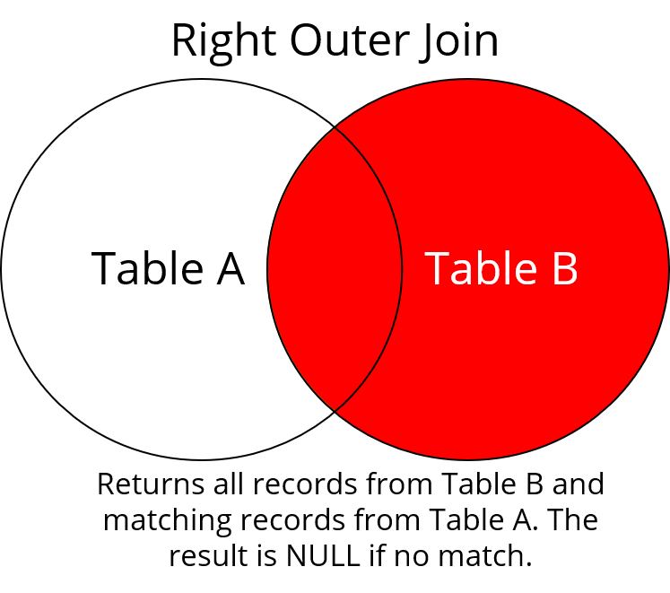
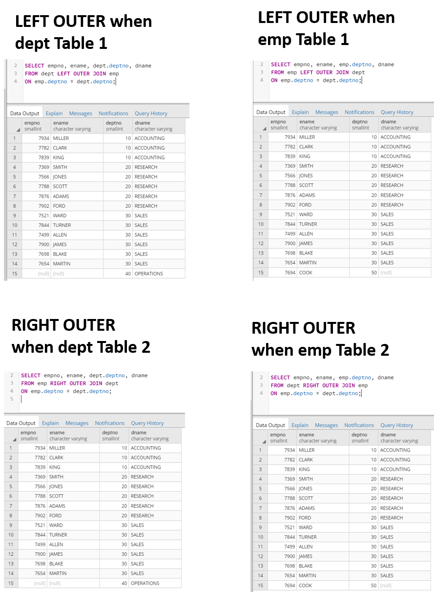
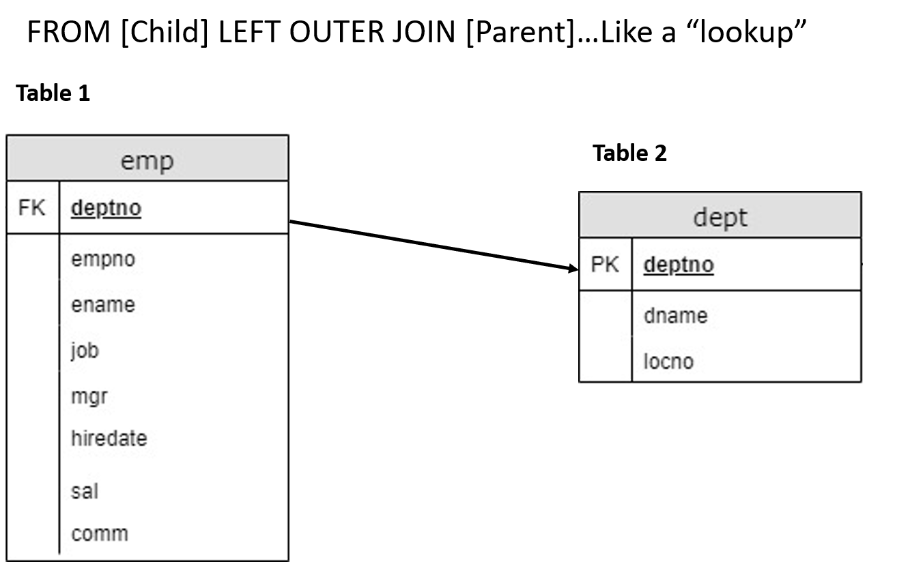
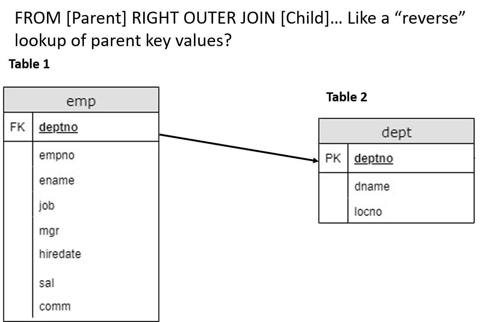
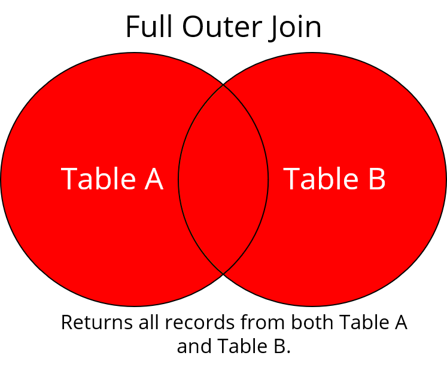
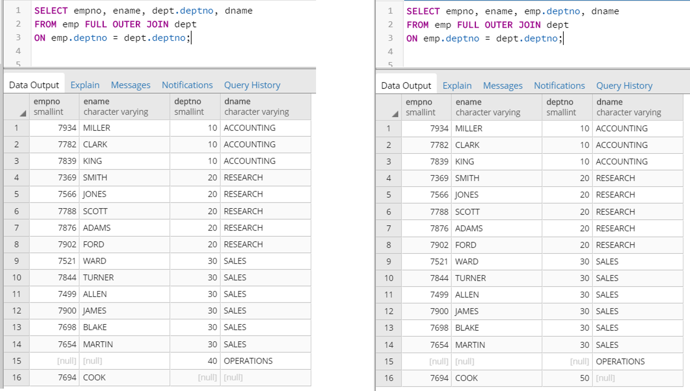
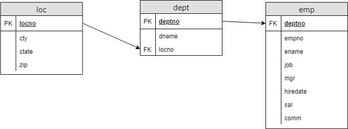

The previous checkpoint provided an introduction to the `JOIN` operator in SQL. You looked at the more common `JOIN` types: `INNER JOIN` and `LEFT OUTER JOIN`. This checkpoint will cover the more exotic types: `RIGHT OUTER JOIN` and `FULL OUTER JOIN`. You'll also look at using `JOIN` on more than two tables, and you'll explore how `JOIN` works with aggregations. 

## `RIGHT OUTER JOIN`

With `RIGHT OUTER JOIN`, all records are returned from Table B—regardless of whether or not they have matches in Table A. Any rows from Table B that *don't* have a match in Table A get `NULL` values returned for the values meant to come from Table A.



Now, take a look at the two ways to frame this. Here's one:

```SQL
SELECT empno, ename, dept.deptno, dname
FROM emp RIGHT OUTER JOIN dept
ON emp.deptno = dept.deptno;
```

Again, you must explicitly name which table you want to get the *deptno* field from. And it makes most sense to get it from the table on the "right".

Compare the above query to this one, which uses `LEFT OUTER JOIN`.

```SQL
SELECT empno, ename, emp.deptno, dname
FROM dept LEFT OUTER JOIN emp
ON emp.deptno = dept.deptno;
```

The resulting tables look familiar—almost *too* familiar. Except for the final row in the output, these tables are identical.




## Why `LEFT OUTER JOIN` *and* `RIGHT OUTER JOIN`, then?

Although the computer doesn't care about which `JOIN` you use, you need to choose carefully. When you're deciding between `LEFT OUTER JOIN` and `RIGHT OUTER JOIN`, you should consider code readability and human understanding. People tend to think about `JOIN` clauses in the same way that they speak about them. In plain English, you might say this: "Bring in the department names from the department table into the employee table." This is what `LEFT OUTER JOIN` does.



But sometimes, you *do* want to drop the nonmatching rows in *emp*, as shown below.



This style of referring to Table 1 as *child* and Table 2 as *parent* makes for a more understandable statement.


## `FULL OUTER JOIN`

The `FULL OUTER JOIN` does what it sounds like it does. It returns *all* records from both Table A and Table B, regardless of whether or not there's a match in the other table.



Because you want the records from both tables, the order of *emp* and *dept* in the `FULL OUTER JOIN` clause does not matter.

Here's an example:

```SQL
SELECT empno, ename, emp.deptno, dname
FROM emp FULL OUTER JOIN dept
ON emp.deptno = dept.deptno;
```

The query above gets the same result as the query below.
 
```SQL
SELECT empno, ename, dept.deptno, dname
FROM dept FULL OUTER JOIN emp
ON emp.deptno = dept.deptno;
```

What will vary, however, is which records in the *deptno* field return as `NULL`. If you pull *deptno* from the *dept* table, you won't find a value for Department #50. And vice versa with the *emp* table for Department #40. It's quirky, but it's also logical. 




## The power of the `JOIN` clauses

> "Computers are good at following instructions, but not at reading your mind." —Donald Knuth

All these `JOIN` clauses might seem like a lot—but consider the raw power that you have unleashed! You can now `JOIN` more than one table together at a time. And you're using logical relationships between data to build entirely new datasets.

So, which `JOIN` clause is the most useful? Well, as a data scientist, you'll find that there's a time and a place for every tool. It depends entirely on circumstance and the business need at hand.

## Using `JOIN` on more than two tables

So far, you've used `JOIN` on two tables. But it's possible to operate on three tables, and even more, in a single query.

You may have noticed a third table called *loc* in the *employee* database. This table is a list of location attributes based on the *locno* field. Here, *loc* has a similar relationship to *dept* as *dept* does to *emp*. The updated schema is as follows:



In earlier examples, you joined employee name and number with department name and number. Now, you'll be expanding that. You'll add location information about each department, which you'll pull in from the *loc* table. This requires multiple `JOIN` clauses.

You want to maintain all *empno* records, so `LEFT OUTER JOIN` is used in relation to *dept*. This part of the statement is just as before.

So, what's different? The difference is that your `JOIN` doesn't end there. Next, you'll chain *dept* with *loc*, again with a `LEFT OUTER JOIN`. This time, the *locno* field connects these tables.

```SQL
SELECT empno, ename, emp.deptno, dname, cty, state
FROM emp

LEFT OUTER JOIN dept
ON emp.deptno = dept.deptno

LEFT OUTER JOIN loc
ON dept.locno = loc.locno;
```

Of course, `INNER JOIN` is also possible. (But you won't get a row for Employee #7694, Cook, because there isn't an entry for Cook's department in the *dept* table.)

```SQL
SELECT empno, ename, emp.deptno, dname, cty, state
FROM emp

INNER JOIN dept
ON emp.deptno = dept.deptno

INNER JOIN loc
ON dept.locno = loc.locno;
```

Naturally, the statements become even more diverse when you start using `JOIN` to connect more than two tables. However, all the statements must be arranged logically so that the tables do, in fact, share some field. For example, a statement like the one below doesn't make much sense. This is because the `JOIN` tables don't have matching fields in their respective `ON` operators.

```SQL
SELECT empno, ename, emp.deptno, dname, cty, state
FROM emp 
LEFT OUTER JOIN loc
ON emp.deptno = dept.deptno
LEFT OUTER JOIN dept
ON dept.locno = loc.locno;
```

## Recap

This checkpoint provided a deeper dive into the world of `JOIN` clauses in SQL. You looked at the less common `JOIN` clauses—`RIGHT OUTER JOIN` and `FULL OUTER JOIN`—and you learned how to `JOIN` more than two tables at once. The next checkpoint will tie this versatile clause together with the various SQL clauses that you learned earlier.

