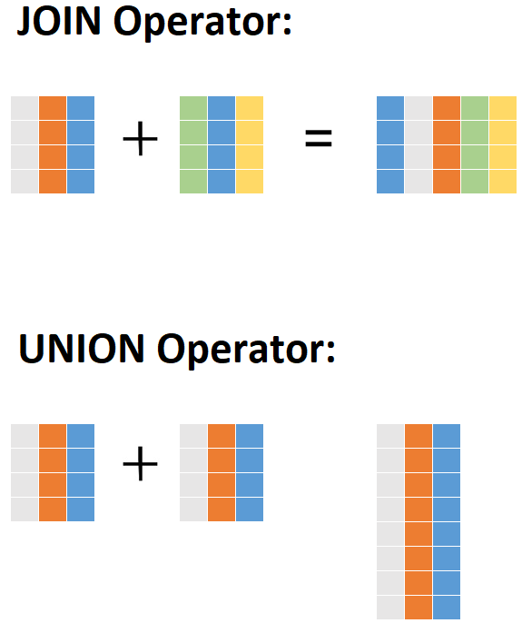

At this point, you know the four `JOIN` types in SQL, and you can use them together on more than two tables at a time. Well done! Now, it's time to further hone your skills with the `JOIN` clause. In this checkpoint, you'll learn how to use `JOIN` with `GROUP BY` and other SQL clauses. You'll also learn how to use the `UNION` operator to completely shift the way that results are crafted from two tables. 

## `JOIN` and `GROUP BY`

So far, your `JOIN` statements have used the `SELECT` and `FROM` clauses. Specifically, you've been placing the `JOIN` operators in the `FROM` clause. After that, the regular SQL clause ordering applies:

| Clause   | What to do with it                                            |
| :-------- | :------------------------------------------------------------- |
| `SELECT`   | Specify what fields you want information from                 |
| `FROM`     | Specify what tables those fields are coming from              |
| `WHERE`    | Specify any criteria that records in those fields should meet |
| `GROUP BY` | Specify how to aggregate the results                          |
| `HAVING`   | Specify any criteria that the aggregate results should meet   |
| `ORDER BY` | Specify how to sort the results                               |
| `LIMIT`    | Specify how many records to return in results                 |


When it comes down to it, `JOIN` is just part of a glorified `FROM` clause. And you can still filter the results with `WHERE`, as shown in the example below.

```sql
SELECT empno, ename, emp.deptno, dname
FROM emp LEFT OUTER JOIN dept
ON emp.deptno = dept.deptno
WHERE mgr = 7698;
```

You can even use it with aggregates! Here, you're taking the sum of salaries, grouped by the department number and name.

```sql
SELECT emp.deptno, dname, SUM(sal)
FROM emp LEFT OUTER JOIN dept
ON emp.deptno = dept.deptno
GROUP BY emp.deptno, dname;
```

In fact, why not go crazy! Can you use all of the clauses with `LEFT OUTER JOIN`?

```sql
SELECT emp.deptno, dname, SUM(sal) AS dept_salary
FROM emp LEFT OUTER JOIN dept
ON emp.deptno = dept.deptno
WHERE empno BETWEEN 7500 AND 8000
GROUP BY emp.deptno, dname
HAVING SUM(sal) > 3000
ORDER BY dname;
```

Ultimately, you're just trying to gather information that happens to be in two different tables. And a `JOIN` statement is structured just like every other kind of statement of this nature.

Check out the video below for a screencast demonstration of how to use `JOIN` commands in SQL. 

<iframe id="kaltura_player_1590583872" src="https://cdnapisec.kaltura.com/p/2315191/sp/231519100/embedIframeJs/uiconf_id/45331192/partner_id/2315191?iframeembed=true&playerId=kaltura_player_1590583872&entry_id=1_2i06fxlk" width="100%" height="500" allowfullscreen webkitallowfullscreen mozAllowFullScreen allow="autoplay *; fullscreen *; encrypted-media *" frameborder="0"></iframe>


## `UNION`

### `JOIN` versus `UNION`

So far, you've focused on the `JOIN` operator as you explored how SQL can combine information from multiple tables. But there are other ways to combine information from multiple tables in SQL. The most common method is the `UNION` operator. 

Okay, what's the difference? With `JOIN`, the resulting table depends on logical relationships between the fields of two or more tables. But with the `UNION` operator, the result is the combination of fields from two or more tables *themselves*.

Confused yet? Consider the visualization below.



This depiction may be an oversimplification, but it can help you understand the difference. Here's the gist: `JOIN` works on fields, and `UNION` works on records. Imagine that each color above is a "matching" field. In the top image, you can `JOIN` by the blue fields to return a table with the other color fields. And in the bottom image, you can use `UNION` to return all records from the matching gray, orange, and blue fields. 

You may have noticed a *dept2* table in the *employees* database. This table contains just a single row with a new department: Department #50, the data analytics department. In this case, the field types perfectly match those of the *dept* table. So you can use a `UNION` operator to return the results of querying each table.

What does "querying each table" mean? This means that you'll connect two separate `SELECT BY` clauses together with `UNION`. The resulting table will return the records from the connected table.

You'll often see the `SELECT` and `FROM` clauses on the same line when used with `UNION`. This is a stylistic decision. It can actually help with statement legibility, as it emphasizes that the operation is a `UNION` of fields from two tables.

For example, to connect the three fields from the *dept* and *dept2* tables, you could use the following statement:

```sql
SELECT deptno, dname, locno FROM dept
UNION
SELECT deptno, dname, locno FROM dept2;
```

You could use the `*` wildcard to get the same results.

```sql
SELECT * FROM dept
UNION
SELECT * FROM dept2;
```

But the query doesn't have to include all fields from the two tables, as shown below:

```sql
SELECT deptno, dname FROM dept
UNION
SELECT deptno, dname FROM dept2;
```

With `UNION`, the resulting table can include or exclude duplicate records. The difference comes from using `UNION ALL` or `UNION`, respectively.

### `UNION ALL`

You got lucky with the above statements—there are no perfectly alike rows in these tables. But there are duplicate records in the *locno* field: `50` and `60` are each repeated twice. So if you're returning just *locno*, you'll need `UNION ALL` to return all records. You can see this below.

```sql
SELECT locno FROM dept
UNION ALL
SELECT locno FROM dept2; 
```

### `UNION`

Somewhat like `SELECT DISTINCT`, this operation will remove any duplicates that exist in the resulting "united" dataset. 

```sql
SELECT locno FROM dept
UNION
SELECT locno FROM dept2; 
```

### `UNION` with `WHERE` and `ORDER BY`

`UNION` can be used in a statement with additional clauses. Although this could include `GROUP BY` aggregations, you're most likely to see `UNION` with `WHERE` and `ORDER BY`.

For example, imagine that you want to exclude any departments that have a *locno* of `50`. In this case, you'd use the following query:

```sql
SELECT * FROM dept
WHERE locno <> 50
UNION
SELECT * FROM dept2
WHERE locno<> 50; 
```

This can even be used in conjunction with `ORDER BY`. But, as usual, that clause comes last.

```sql
SELECT * FROM dept
WHERE locno <> 50
UNION
SELECT * FROM dept2
WHERE locno<> 50
ORDER BY deptno; 
```

## Recap

This checkpoint rounded out your `JOIN` knowledge! You touched on another way to combine records in SQL: the `UNION` operator. Congratulations! Now, even a database of millions of records can't escape your skills with the `SELECT` clause. 
