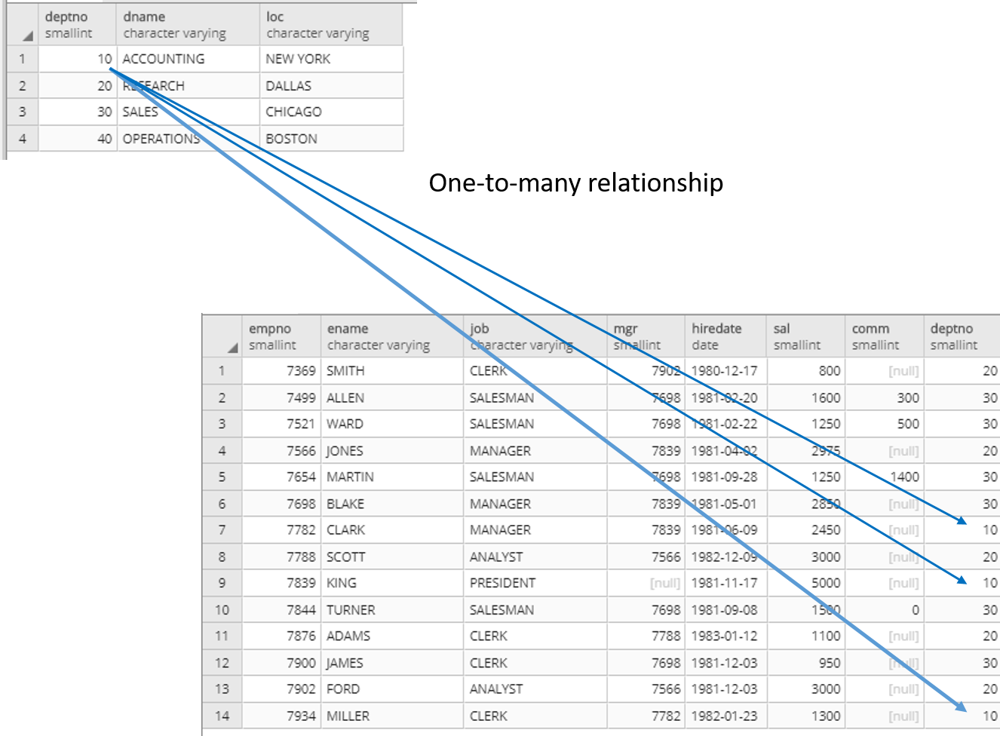
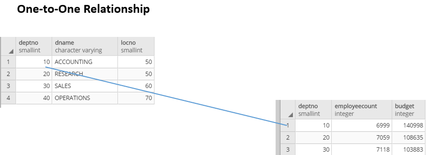
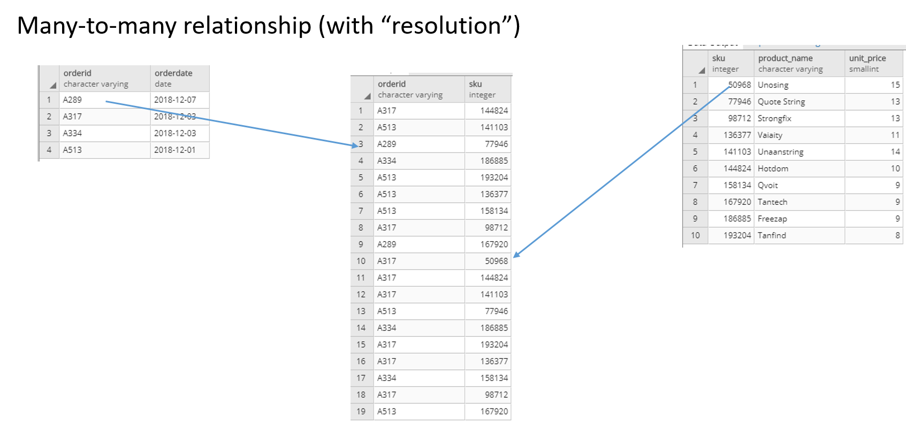
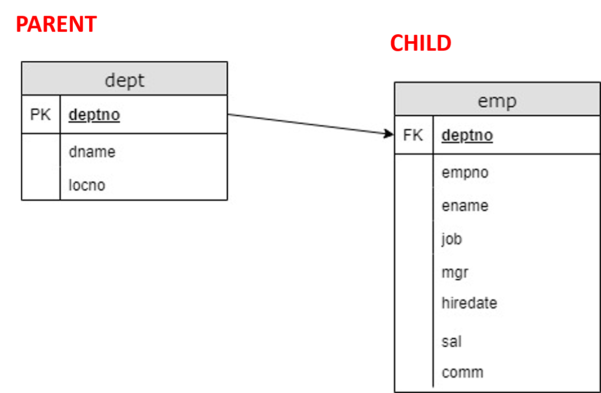
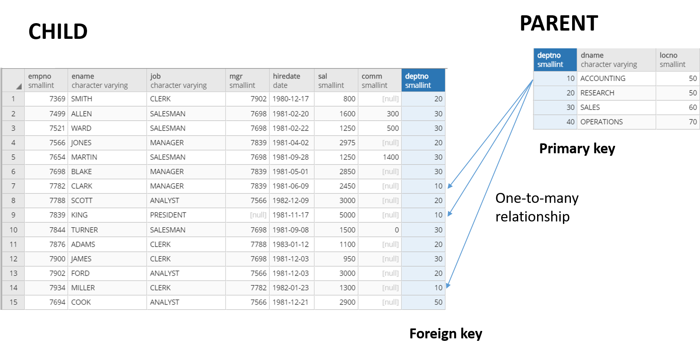
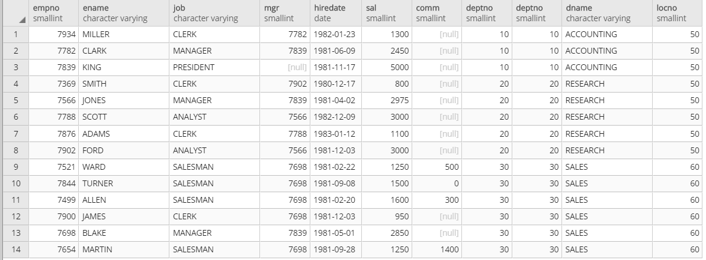
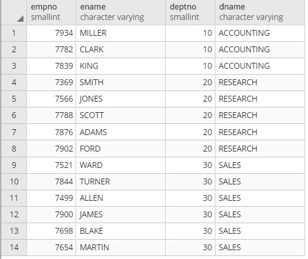
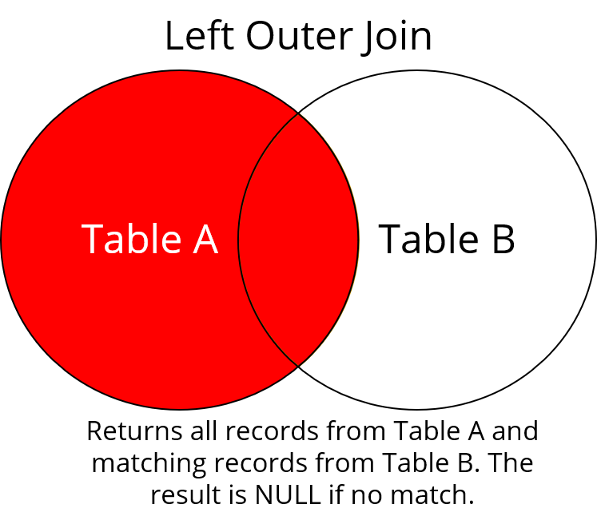
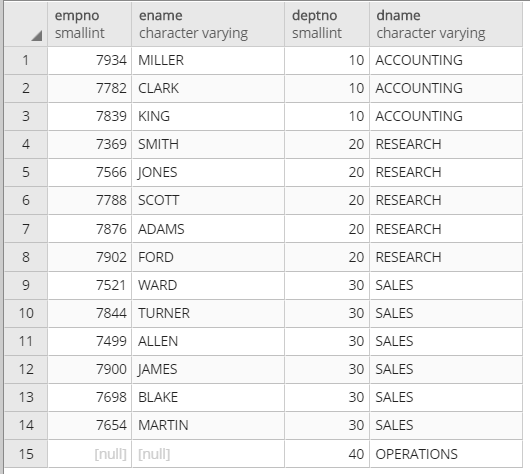

**Reminder:** Make sure that you're using pgAdmin 4 v5.0 or newer!

So far, you have focused your SQL operations on querying information from a single table at a time. But joining data from multiple sources is a common task in SQL. In this module, you'll get up to speed on how to join data in SQL, and you'll add fresh tools to your data science toolbox.

This module focuses entirely on joining two or more tables in SQL. The move from working with one table to multiple tables obviously adds complexity to your queries. But the basic anatomy of your SQL statements will stay the same. In fact, it's the first, simplest component—the `SELECT` clause—that bears the brunt of the work when you use the SQL `JOIN` clause. The `JOIN` clause can come in several varieties, so it's best to start with what you already know about joining data and go from there. 

For a visual introduction to SQL `JOIN` clauses, check out the video below.

<iframe id="kaltura_player_1590583935" src="https://cdnapisec.kaltura.com/p/2315191/sp/231519100/embedIframeJs/uiconf_id/45331192/partner_id/2315191?iframeembed=true&playerId=kaltura_player_1590583935&entry_id=1_uc7lob2b" width="100%" height="500" allowfullscreen webkitallowfullscreen mozAllowFullScreen allow="autoplay *; fullscreen *; encrypted-media *" frameborder="0"></iframe>

## Connecting to the database

In the following checkpoints, you'll use the *employees* database in the shared Thinkful server. For now, you'll work with the *dept* and *emp* tables. 

To connect, use the following credentials:

**Host**: 142.93.121.174  
**Port:** 5432  
**Username:** dsbc_student  
**Password**: 7\*.8G9QH21  
 
The *employees* database is an adaptation of a classic database used in old database textbooks. It has the advantage of featuring small tables and well-understood relationships between employees and departments. This makes it a good tool for learning joins. Keep in mind, though, that things won't always be this simple in the real world.


## Parent and child tables

Think about the relationship between the two *deptno* fields. That visualization might look like this: there are multiple matches in the *emp* table per each unique record in the *dept* table. In other words, there are no duplicates. This is known as a *one-to-many* relationship. The related fields in one-to-many relationships are often visualized with arrows pointing from the "unique" table to the "many" table, as seen below. 



So what does this mean for your `JOIN` clauses? Remember that the *dept* table has information that is needed to match with a record in *emp*. With this in mind, you can say that *emp* depends on information from *dept*. In other words, the *emp* table is a *child* of the *parent* table, *dept*.


## Cross-table relationships

The one-to-many relationship is probably the most common one that you'll encounter when working across tables. But there are several others. Before you proceed, take a look at the other cross-table relationships.

### One-to-one

This is a fairly intuitive relationship. In a *one-to-one* relationship, there are no duplicate records in either column. For example, in the below table, you see the relationship between the *dept* table and a table with department statistics summarized by *dept*. This is a one-to-one relationship because each record in the *deptno* field of each table is unique. However, this doesn't necessarily mean that the *same* records are in each table. For example, Department #40 is included in the first table but not in the second table. 

One-to-one relationships are often depicted with a straight line, without arrows, that connects the unique fields. 



### Many-to-many

Imagine that you're working with a database for an Amazon warehouse. The database contains a table for products and a table for orders. Each order can contain multiple products, and each product can appear in multiple orders. How can this be represented in the database?

This is known as a *many-to-many* relationship. This relationship would typically be represented by a third, intermediary table that links order IDs with product IDs. 

Now, take a look at the example below. Here, you have a table with order IDs and a table with a form of product IDs called stock-keeping units (SKUs). What is the hierarchical relationship here? One order ID can be associated with many SKUs, and one product can be associated with many order IDs. This relationship gets resolved by the intermediary table. Both of the original tables—*products* and *orders*—have a one-to-many relationship with the intermediary table.



This may seem confusing. But when broken down, the many-to-many is just a succession of one-to-manys.

You might see these exotic relationships in the real world. But ultimately, one-to-many is the most common relationship, and it's the best one to use as you learn about `JOIN` in SQL. Once you understand that, the rest will come. 


## Schemas

Often, you'll see the relationship between tables in a database visualized in a *schema*. A schema is a simple diagram that shows the names of tables, fields, and sometimes field types. The relationships between fields in these tables are depicted with arrows and assigned *keys*.

Look at how the parent and child tables form a relationship through the *deptno* field. An arrow connects them, pointing from the *dept* table to the *emp* table. This distinguishes the relationship between fields as one-to-many from *dept* to *emp*, respectively. 

You can also see that these fields are labeled `PK` and `FK`. These abbreviations stand for *primary key* and *foreign key*. You'll learn about what these keys are and explore how they differ in the next section. 




## Primary keys and foreign keys
 
The *primary key* is a field that uniquely identifies each record in a SQL table. In other words, this field holds the key to unlock additional information about fields in another table. For example, you can join *dname* and *locno* with information from the *emp* table based on the relationship between *deptno* in both tables. If the primary key holds the unique values, then the *foreign key* is how you're going to connect this information. The foreign key is kind of like the "lock" to the primary key.
 
In this checkpoint, you've learned a *lot* of new terms. Parent-child, one-to-many, and primary key-foreign key all describe different attributes of the same quality. That quality is that there's some relationship between tables based on their respective fields. You can see this below. 
 


## `INNER JOIN`

First, look at the most common `JOIN` type: `INNER JOIN`. For this and the following `JOIN` types, you'll use a Venn diagram to demonstrate exactly *what* will be returned. Imagine that each table is one of the circles in the Venn diagram shown below.


`INNER JOIN` will return all records that have a match in both Table A *and* Table B.


## `JOIN ON` the key

So far, you've added operators to several SQL clauses, including the `SELECT` clause.

```sql
SELECT SUM(sal) AS ttl_sal
```

You've also added operators to your `WHERE` clauses.

```sql
WHERE mgr = 7698;
```

You haven't added any operators to your `FROM` clauses. After all, you've only been selecting from one table at a time. There hasn't been much to specify yet.

But now, for the first time, you are retrieving data from multiple tables. Your statement changes to something like what you see below.

```sql
SELECT * 
FROM emp INNER JOIN dept
ON emp.deptno = dept.deptno;
```

Note that `INNER JOIN` is the default type of join in PostgreSQL. This statement would also be able to use the `JOIN` clause alone, without `INNER`, to accomplish an inner join, as seen here.

```sql
SELECT * 
FROM emp JOIN dept
ON emp.deptno = dept.deptno;
```

That said, the first, more explicit approach with `INNER JOIN` is preferred. It makes the logic crystal clear.

Okay, so how does the `INNER JOIN` work? Because you're returning data across two tables, you need to do the following:

   1. Specify *how* to join these two tables (`INNER JOIN`)
   2. Specify *what* connects these tables (`ON`)

This statement returns the image below: all fields, but with *deptno* repeated twice. This makes sense. After all, you did tell SQL to return all fields, and there are two *deptno* fields. But it's less than ideal, so go back to the drawing board with this statement. To do that, you need to consider a finer point of SQL: *explicit syntax*. 




## Explicit syntax and `JOIN`

Imagine that you wanted to return the *empno*, *ename*, and *deptno* fields from the *emp* table. At this point, you could probably do that without too much thought. You'd crank out the following query:

```sql
SELECT empno, ename, deptno
FROM emp;
```

But there's another way to write this. You can be more specific by explicitly prefixing which table to get this field from, as shown below.

```sql
SELECT emp.empno, emp.ename, emp.deptno
FROM emp;
```
Of course, it's pretty obvious when there's only one table to choose from. But what happens when two tables share a field with the same name? This is when you have to explicitly choose which table to get the field from. This results in a statement more like this one:

```sql
SELECT empno, ename, emp.deptno, dname
FROM emp INNER JOIN dept
ON emp.deptno = dept.deptno;
```

Here, the *empno* and *ename* fields show up only in one table, so it's not necessary to prefix them. This query results in the following:



Depending on your business need, this may be the result you want. Or maybe you *don't* want to drop these kinds of records, or you have another idea in mind about what records you want to keep. Well, you're in luck! There are still three more `JOIN` clauses to learn about. Next, the `LEFT OUTER JOIN`.

## `LEFT OUTER JOIN`

In a `LEFT OUTER JOIN`, all records from Table A are returned, regardless of whether or not a match is found in Table B. This is shown below.



This raises a question: how do you know which is Table A and which is Table B in your statement? For the first time in your SQL career, you'll see here that the ordering of fields in a statement matters for the resulting output.

In the previous example, the `INNER JOIN` result left out a record because it wasn't in both tables. A `LEFT OUTER JOIN` could change this.

```sql
SELECT empno, ename, emp.deptno, dname
FROM emp LEFT OUTER JOIN dept
ON emp.deptno = dept.deptno;
```

Here, you see Employee #7694, Cook, included in the output with a blank value for *dname*. SQL returns a `NULL` here, which gets displayed as an empty string in the output. It will return *all* fields from the base table, regardless of whether or not it has a match in the lookup table.

But what if you (literally) turn the tables? What if you do a `LEFT OUTER JOIN` on *dept* first? 

```sql
SELECT empno, ename, dept.deptno, dname
FROM dept LEFT OUTER JOIN emp
ON emp.deptno = dept.deptno;
```

Here, you don't get a record for Employee #7694. But you *do* get a mystery record for Department #40. Again, this is because `LEFT OUTER JOIN` returns all fields from *dept* regardless of whether or not there are matches in *emp*. And, because there are no matching employees for Department #40, you get `NULL` values. 



Now, consider another important point about `LEFT OUTER JOIN`: it is most logical to `SELECT` the matching field in the table that you are going to `LEFT OUTER JOIN` on. To see how this works, consider the example below.

```sql
SELECT empno, ename, dept.deptno, dname
FROM emp LEFT OUTER JOIN dept
ON emp.deptno = dept.deptno;
```

The statement above works. But the statement below makes more sense, as it more fully retains the completeness of the left table.

```sql
SELECT empno, ename, emp.deptno, dname
FROM emp LEFT OUTER JOIN dept
ON emp.deptno = dept.deptno;
```

However, the ordering of fields in the `ON` statement does not matter. After all, these fields are set to be equal.

```sql
SELECT empno, ename, emp.deptno, dname
FROM emp LEFT OUTER JOIN dept
ON emp.deptno = dept.deptno;

--OR

SELECT empno, ename, emp.deptno, dname
FROM emp LEFT OUTER JOIN dept
ON dept.deptno = emp.deptno;
```


## Recap: `JOIN`

This checkpoint introduced you to the mighty SQL `JOIN` clause. You explored the related concepts of one-to-many relationships, parent-and-child tables, and primary and foreign keys.

Although there are more elements of `JOIN` to learn, they all rest on this same infrastructure. They return data based on the relationships between related fields in two—or more—tables.
