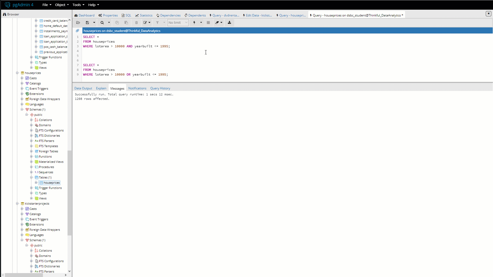

In the previous checkpoint, you used SQL's `SELECT` and `FROM` clauses to retrieve fields from a table. In this checkpoint, you'll continue to work your way through the SQL clauses. You'll focus on the `WHERE` clause, which allows you to return only records that meet certain criteria.

Now, revisit the table of clauses, which you saw in the last checkpoint.

| Clause   | What to do with it                                            |
| :-------- | :------------------------------------------------------------- |
| `SELECT`   | Specify what fields you want information from                 |
| `FROM`     | Specify what tables those fields are coming from              |
| **`WHERE`**    | **Specify any criteria that records in those fields should meet** |
| <span style="color:lightgray">`GROUP BY`</span> | <span style="color:lightgray">Specify how to aggregate the results</span>                          |
| <span style="color:lightgray">`HAVING`</span>   | <span style="color:lightgray">Specify any criteria that the aggregate results should meet</span>   |
| <span style="color:lightgray">`ORDER BY`</span>| <span style="color:lightgray">Specify how to sort the results</span>                               |
| <span style="color:lightgray">`LIMIT`</span>    | <span style="color:lightgray">Specify how many records to return in results</span>                 |

In the previous checkpoint, you learned that an information-retrieving SQL command begins with `SELECT` to specify the fields that you want to return. It then continues with `FROM` to specify the table or tables that those fields will come from.

Now, you're ready to move on to the `WHERE` clause. Every statement that you write will still have `SELECT` and `FROM` clauses—so `WHERE` will be the third clause in your statements. 

There are several ways to use a `WHERE` clause to filter a table based on its records. In the remainder of this checkpoint, you'll explore the most common methods and then learn about some more exotic operators. 


## `WHERE` with comparison operators

You can use comparison operators like `=` and `<` to filter by record. PostgreSQL uses the following operator notations:

| Operator  | What it does                                                   | 
| :------------- | :-----------------------------------------------------------------  |
| `=`           | Checks if two values are equal                                     |
| `!=` and `<>` | Checks if two values are not equal                                 |
| `>`           | Checks if the value on the left is greater than the one on the right               |
| `<`           | Checks if the value on the left is less than the one on the right                  |
| `>=`          | Checks if the value on the left is greater than or equal to the value on the right |
| `<=`          | Checks if the value on the left is less than or equal to the value on the right    |

Now, practice using the `WHERE` clause. For this, you'll retrieve all records from the *houseprices* table of the *houseprices* database where *yearbuilt* is `2003`. First, connect to the *houseprices* database in pgAdmin. Then, use the query tool to run the following query:

```SQL
SELECT *
FROM houseprices
WHERE yearbuilt = 2003;
```

Notice that the above query doesn't use quotation marks `'` around `2003`. This is because `2003` is a number. (You could choose to write `'2003'` with quotation marks, but that is bad practice; it forces SQL to convert a string to a number, which is a waste of processing time.)

In contrast, if you want to filter your results to only those homes that are on paved streets, you would construct your query as shown below:

```SQL
SELECT * 
FROM houseprices
WHERE street = 'Pave';
```
Here, you must identify your criterion (`Pave`) by enclosing it in single quotation marks. Otherwise, it won't be read as a criterion; it will be read instead as an object identifier, such as a table or field name. And this type of query will produce a different result. For example, suppose that you wanted a list of all houses where the year they were remodeled is also the same as the year they were built. Your query would look like the following:

```SQL
SELECT *
FROM houseprices
WHERE yearremodadd = yearbuilt
```

Here, *yearbuilt* has no quotes because it is an object identifier (field name), not a criterion.

Identifiers (such as *street*) and operators (such as `WHERE`) are not case sensitive. However, string criteria are case sensitive. So even though the following statement—which uses a lowercase `p`—will run, it will not return any records.

```SQL
SELECT *
FROM houseprices
WHERE street = 'pave';
```

Keep in mind that you can even filter by fields that aren't included in your `SELECT` statement, as shown below.

```SQL
SELECT yearbuilt, saleprice
FROM houseprices
WHERE lotarea < 8000;
```

## `WHERE` with logical operators

When you use `WHERE` on a table in SQL, SQL applies the conditional logic of the `WHERE` clause for each record in the selected table. If the record returns a `TRUE`, the value is kept. And if it yields a `FALSE`, the record is discarded. SQL has several logical operators:

| Operator | What it does                                              |
| :------------ | :------------------------------------------------------------- |
| `AND`          | Returns records where all expressions evaluate to `TRUE`        |
| `OR`           | Returns records where any of the expressions evaluate to `TRUE` |
| `BETWEEN`      | Returns records that fall inclusively inside a range          |
| `IN`           | Returns records that fall in a list of values                 |
| `NOT`          | Returns the flipped results of an expression                  |


### `WHERE ... AND`

You can use `WHERE ... AND` to combine multiple comparison operators. For example, try writing a `WHERE ... AND` statement to return all records from the *houseprices* table where *lotarea* is greater than `10,000` and *yearbuilt* is less than or equal to `1995`. Your statement should look like this:

```SQL
SELECT *
FROM houseprices
WHERE lotarea > 10000 AND yearbuilt <= 1995;
```

### `WHERE ... OR`

The `OR` operator is used to return records in which any one expression in a set of expressions evaluates to `TRUE`.

Practice by shifting the focus of your previous query a bit. This time, you want to retrieve any records in which either *lotarea* is greater than `10,000` or *yearbuilt* is less than or equal to `1995`. Using `WHERE ... OR`, your statement should look like this: 

```SQL
SELECT *
FROM houseprices
WHERE lotarea > 10000 OR yearbuilt <= 1995;
```

Logically, `WHERE … OR` should retrieve more records. Now, check if that's the case. After executing a query, head to the **Messages** tab in the lower window. The second line will read "X rows affected"; this is essentially the number of rows returned in your query. You'll learn later on how to count the number of rows in a query result using SQL. But for now, pgAdmin's interface will suffice.



As expected, the `OR` statement query returned more records (1,208) than the `AND` statement (403).

You can also use multiple `OR` operators on the same field. With the following statement, you'll look for records where *yearbuilt* is equal to `1995` or `1996`.

```SQL
SELECT *
FROM houseprices
WHERE yearbuilt = 1995 OR yearbuilt = 1996;
```

Note, however, that each `OR` condition needs to respecify the field. In other words, the following query isn't valid.

```SQL
SELECT *
FROM houseprices
WHERE yearbuilt = 1995 OR 1996;
```

### `WHERE ... AND ... OR`

This is a hybrid approach. This statement identifies records based on groups of criteria, rather than evaluating them all together or each individually. For example, practice returning all fields from records where *yearbuilt* is either `1995` or `1996` and *roofstyle* is either `Gable` or `Hip`. For this statement, place each set of criteria to be evaluated together in parentheses. Put an `OR` between individual criteria, as shown below.

```SQL
SELECT *
FROM houseprices
WHERE (yearbuilt = 1995 OR yearbuilt = 1996)
AND (roofstyle = 'Gable' OR roofstyle = 'Hip');
```

### `WHERE ... BETWEEN`

Using `WHERE … BETWEEN`, you can return all records that fall within a given range, inclusive. This can be a real syntax time-saver. For example, imagine that you want to return all records where *yearbuilt* is between `1995` and `2000`. You can do this in a few different ways. Because `OR` operators are fresh on your mind, start there:

```SQL
SELECT *
FROM houseprices
WHERE yearbuilt = 1995 OR yearbuilt = 1996 OR yearbuilt = 1997 OR yearbuilt = 1998 OR yearbuilt = 1999 OR yearbuilt = 2000;
```

That works, but it's wordy and a pain to type up. The good news is that you can easily clean this up by using a combination of logical and comparison operators, as shown below.

```SQL
SELECT *
FROM houseprices
WHERE yearbuilt >= 1995 AND yearbuilt <= 2000;
```

Much better! But you can clean it up even more. Filtering rows between a certain range is a very common task in data analysis. As a result, SQL includes an operator for it: `BETWEEN`. Just like in plain English, `BETWEEN` operates with `AND`.

```SQL
SELECT *
FROM houseprices
WHERE yearbuilt BETWEEN 1995 AND 2000;
```

### `WHERE ... IN`

`WHERE ... IN` allows you to filter by multiple criteria at once. But instead of evaluating a range, `WHERE … IN` evaluates a group of individual items enclosed in parentheses.

For example, write a query to return all records where *yearbuilt* is either `2001`, `2007`, `2008`, or `2009`, as shown below.

```SQL
SELECT * 
FROM houseprices
WHERE yearbuilt IN(2001, 2007, 2008, 2009);
```

`WHERE ... IN` can also be used on character fields, as shown here:

```SQL
SELECT * 
FROM houseprices
WHERE roofstyle IN('Gable','Hip','Mansard');
```


### `WHERE ... NOT`

Ready to flip the script?  A `WHERE ... NOT` operator returns all records that do *not* evaluate to `TRUE`. This is particularly useful with `IN` and `BETWEEN` operators.

For example, the statement below returns all records outside of the range `1995` and `2000`. Remember that `BETWEEN` is inclusive of the range, so `1995` and `2000` will be excluded from the returned records:

```SQL
SELECT *
FROM houseprices
WHERE yearbuilt NOT BETWEEN 1995 AND 2000;
```

Now, look at another. This statement returns all records in which *roofstyle* is not `Gable`, `Hip`, or `Mansard`.

```SQL
SELECT *
FROM houseprices
WHERE roofstyle NOT IN('Gable', 'Hip', 'Mansard');
```

### `WHERE ... IS NULL`

In databases, not all blanks are created equal. `NULL` is a keyword used in SQL to signify values that are either missing or unknown.  This is *not* the same as a blank string (`" "`) or a record value of `0`. In fact, either of those could be legitimate record values of their own. But `NULL` is intentionally recorded as *not* carrying a value.

This makes it easy to identify records in which some field is missing values. For this, use `WHERE ... IS NULL`. For example, try returning all records in the *houseprices* table in which the value of *alley* is recorded as `NULL`.

```SQL
SELECT *
FROM houseprices
WHERE alley IS NULL;
```

On the other hand, a `WHERE ... IS NOT NULL` statement returns all records that don't return a `NULL`.

```SQL
SELECT *
FROM houseprices
WHERE alley IS NOT NULL;
```

### `WHERE ... LIKE`

SQL includes several search *wildcards*. These are characters that are used as substitutes for other characters in a string. If this sounds foreign to you, think back to the asterisk `*` character that you've been using to `SELECT` all fields from a table. When SQL sees an asterisk, it knows to replace the asterisk with all of the fields in the table.

`WHERE ... LIKE` is helpful when you have a character field with some meaningful, consistent pattern of how character records are constructed. With a `WHERE ... LIKE` statement, you can extract certain records based on this consistent pattern.

Similarly, you can use wildcard characters with `WHERE ... LIKE` to filter by patterns in a string field. Take a look at these wildcard characters and what they do.

| `LIKE` operator + wildcard | What it does                                                     |
| :---------------------------- | :-------------------------------------------------------------------- |
| `a%`, `abc%`                 | Returns records that start with `a`, `abc`                           |
| `_a`, `__abc`            | Returns records with `a` in second position, `abc` in third position     |


Now, try an example. The *heating* field of the *houseprices* table contains two types of gas records: `GasA` and `GasW`. Using the percentage wildcard `%` with `WHERE ... LIKE`, you can search for all records that start with `Gas`, as shown below:

```SQL
SELECT *
FROM houseprices
WHERE heating LIKE 'Gas%';
```

The *heating* field also contains records with the value `OthW`. This time, you want to search for all records with a `W` in the fourth character of the *heating* field. This means that you want to use wildcards to stand in for the first three characters. To make this work, you'll use the underscore wildcard `_` three times, as shown below:

```SQL
SELECT *
FROM houseprices
WHERE heating LIKE '___W';
```

## `ILIKE` in PostgreSQL

Take a look at the *mszoning* field using wildcard strings. How would you write a query that returns all records that start with the letter `R` for `Residential`?

```SQL
-- Return all records where mszoning starts with 'R':
SELECT *
FROM houseprices
WHERE mszoning LIKE 'r%';
```

This returns an empty data output. But the *mszoning* field is full of records beginning with `R`! How can the above query return zero records?

Writing SQL code often requires eagle-eyed attention. Take a look at the query. Can you spot the issue? It comes down to case sensitivity.

In addition to being meticulous, you must also be consistent. Writing SQL code often requires adherence to a lot of very specific, almost quirky, rules. The case sensitivity of search strings is one of those rules. PostgreSQL isn't case sensitive to *unquoted* names, such as the name of a field or table in a `SELECT` statement. However, it is case sensitive to *quoted* names.

For example, take a look at the following query.

```SQL
SELECT MSZONING
FROM houseprices;
```

Even though the capitalization is different, the query above will return the same results as the query below.

```SQL
SELECT mszoning
FROM houseprices; 
```

But there is a quoted lowercase `r` in this query:

```SQL
SELECT *
FROM houseprices
WHERE mszoning LIKE 'r%';
```

That means that it won't return the same results as this query, which uses a quoted *uppercase* `R`:

```SQL
SELECT *
FROM houseprices
WHERE mszoning LIKE 'R%';
```

Fortunately, PostgreSQL includes an easy operator to adjust for this confusing distinction: `ILIKE`. 

`ILIKE` can be used instead of `LIKE` to make a keyword case insensitive (hence the letter `I` in `ILIKE`). With `ILIKE`, you'll get the same results regardless of how you capitalize the search string.

```SQL
SELECT *
FROM houseprices
WHERE mszoning ILIKE 'r%';
```

The above query will return the same results as the one below.

```SQL
SELECT *
FROM houseprices
WHERE mszoning ILIKE 'R%';
```

You can also use `ILIKE` separately from wildcards. Each individual search string must be preceded by an `ILIKE`.

```SQL
SELECT *
FROM houseprices
WHERE mszoning ILIKE 'Rl';
```

```SQL
SELECT *
FROM houseprices
WHERE mszoning ILIKE 'rl' OR mszoning ILIKE 'Rm';
```

`ILIKE` is one feature of SQL that is unique to PostgreSQL. 


## Combining multiple operators

As you've seen, SQL provides several operations for filtering a table based on its records. Although you have covered them individually, things get really interesting when you start combining multiple logical operators. Beyond the comparison and logical operators that were discussed above, there are many ways to filter a dataset with SQL.

To get a sense of what combining multiple operators can look like, consider a statement like the one below. When you have a statement with many `WHERE` clauses like this, it's helpful to move each operator to its own indented line.

```SQL
SELECT saleprice, salecondition
FROM houseprices
WHERE yearbuilt BETWEEN 1980 AND 1985
    AND roofstyle = 'Gable'
    AND alley IS NOT NULL
AND neighborhood NOT IN ('NAmes', 'CollgCr');
```

This statement may look unwieldy at first. But if you break it down, it's not too different from how you would ask this kind of question in plain English. Here's what that question might look like: 

> What are the sales prices and conditions from all the records in the *houseprices* dataset for houses built between 1980 and 1985 that have a gable roof, have some information about the alley, and are not in the North Ames or College Center neighborhoods?

Admittedly, this is a pretty specific set of conditions. As a matter of fact, you get only one resulting record from this query. But a change in just one word can dramatically change your results. Take, for example, the slight change below.

```SQL
SELECT saleprice, salecondition
FROM houseprices
WHERE yearbuilt BETWEEN 1980 AND 1985
    AND roofstyle = 'Gable'
    AND alley IS NOT NULL
OR neighborhood NOT IN ('NAmes', 'CollgCr');
```

Now, you have more than 1,000 records—a big difference! And why? The last condition switched from an `AND` to an `OR`. This means that it returns any records that meet all three of the first criteria listed *or* any records not in the North Ames or College Center neighborhoods. What a difference a word makes!

Sometimes writing an exacting query like this takes some trial and error. But eventually, you'll get to the desired filtering conditions. It's (literally) logical. 

Check out the video below for a screencast demonstration of record exploration in SQL.

<iframe id="kaltura_player_1590584288" src="https://cdnapisec.kaltura.com/p/2315191/sp/231519100/embedIframeJs/uiconf_id/45331192/partner_id/2315191?iframeembed=true&playerId=kaltura_player_1590584288&entry_id=1_p5w3o5d4" width="100%" height="500" allowfullscreen webkitallowfullscreen mozAllowFullScreen allow="autoplay *; fullscreen *; encrypted-media *" frameborder="0"></iframe>

## Recap

In this checkpoint, you moved from using `SELECT` on fields from a table to filtering records using the `WHERE` operator. With these queries, you've primarily focused on getting the fields and records that you want. What you haven't done is make much order out of this data. You haven't yet sorted the data or performed simple calculations, like counting the number of rows returned by a statement. This will be the focus of the next checkpoint.
