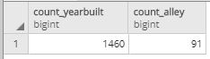

In the previous checkpoint, you moved from selecting fields from a table to getting only those records in which a particular condition or set of conditions is met. In this checkpoint, you'll continue down the list of SQL clauses to `ORDER BY`. You'll also learn about limiting and counting results.

| Clause   | What to do with it                                            |
| :-------- | :------------------------------------------------------------- |
| `SELECT`   | Specify what fields you want information from                 |
| `FROM`     | Specify what tables those fields are coming from              |
| `WHERE`    | Specify any criteria that records in those fields should meet |
| <span style="color:lightgray">`GROUP BY`</span> | <span style="color:lightgray">Specify how to aggregate the results</span>                          |
| <span style="color:lightgray">`HAVING`</span>   | <span style="color:lightgray">Specify any criteria that the aggregate results should meet</span>   |
| **`ORDER BY`**| **Specify how to sort the results**                               |
| <span style="color:lightgray">`LIMIT`</span>    | <span style="color:lightgray">Specify how many records to return in results</span>                 |


## `ORDER BY`

The `ORDER BY` statement sorts all selected fields based on the value of one or more fields. `ORDER BY` always follows `WHERE` in a command. (Or, if `WHERE` is not part of the query, it follows `SELECT … FROM`.)

The statement below, for example, sorts the *houseprices* table based on the *lotarea* field. 

```SQL
SELECT *
FROM houseprices
ORDER BY lotarea;
```

This query returns all records from the *houseprices* table, sorted by *lotarea* in ascending order. Note that `ORDER BY` sorts in ascending order—from low to high—by default.

### `ORDER BY` descending

`ORDER BY` can also sort in descending order, or from high to low. This takes an additional operator: `DESC`.

Now, take the same query as above but adjust it to sort by *lotarea* in descending order.

```SQL
SELECT *
FROM houseprices
ORDER BY lotarea DESC;
```

There is a similar operator for sorting in ascending order: `ASC`. But as you just learned, ascending order is the default, so using this operator is not strictly necessary.

```SQL
SELECT *
FROM houseprices
ORDER BY lotarea ASC;
```

You can also specify where you want the `NULL` values to be: `NULLS FIRST` or `NULLS LAST`.

### `ORDER BY` A to Z

`ORDER BY` also works on character fields and can sort alphabetically. For example, try sorting all records in the *houseprices* table by the *mszoning* field. 

```SQL
SELECT *
FROM houseprices
ORDER BY mszoning;
```

This sorted your table from A to Z. Now, instead, use `ORDER BY DESC`.

```SQL
SELECT *
FROM houseprices
ORDER BY mszoning DESC;
```

The above statement sorted the resulting table by *mszoning* from Z to A. 

### `ORDER BY` multiple fields

SQL can sort by multiple fields at once.

```SQL
SELECT yearbuilt, saleprice
FROM houseprices
ORDER BY yearbuilt, saleprice DESC;
```

Each field is ordered individually. If you want both *yearbuilt* and *saleprice* sorted in descending order, you need to add the `DESC` operator after each field. 

```SQL
SELECT yearbuilt, saleprice
FROM houseprices
ORDER BY yearbuilt DESC, saleprice DESC;
```

The order that fields appear in the `ORDER BY` clause will affect the result. So try changing it up. Rather than sorting by *yearbuilt* and then *saleprice*, sort by *saleprice* and then *yearbuilt*. Continue to sort both in descending order.

```SQL
SELECT yearbuilt, saleprice
FROM houseprices
ORDER BY saleprice DESC, yearbuilt DESC;
```

SQL returns information based on the data. In other words, the *houseprices* table itself remains untouched. This means that although the ordering of fields in `ORDER BY` makes a difference in the output, the ordering of fields in `SELECT` makes no difference. You can order by *saleprice* and then *yearbuilt*, but select by *yearbuilt* and then *saleprice*.


## Combining `ORDER BY` with other clauses

In the following section, you'll combine `ORDER BY` with other clauses to refine how your results are presented. Specifically, you'll see how you can use `ORDER BY` with `WHERE` to combine sorting with filtering of records. And you'll see how you can use `ORDER BY` with `LIMIT` to limit how many results a statement returns. For example, you could use these clauses to create a top 10 list.


### `ORDER BY` used with `WHERE`

You can combine `WHERE` with `ORDER BY` to sort and filter results. However, it would be more precise to say that you'll first filter and *then* sort in SQL. This is because of the way that these clauses must be positioned.

`ORDER BY` must follow `WHERE` in a SQL statement. Why? Well, logically, you first need to specify exactly which rows will be returned before you can go about sorting them. The `WHERE` clause goes after `FROM` and before `ORDER BY`.
 
For example, imagine that you want to return the *yearbuilt* and *saleprice* fields, sorted by *yearbuilt* and *saleprice*, both descending. But this time, you want to see only those records in which *yearbuilt* is between `1990` and `2000`. Your statement would look like this:

```SQL
SELECT yearbuilt, saleprice
FROM houseprices
WHERE yearbuilt BETWEEN 1990 AND 2000
ORDER BY yearbuilt DESC, saleprice DESC;
```

### `LIMIT`

As mentioned earlier, database tables can include millions of rows. So, querying to return all records may not be useful. But getting a sense of what the data looks like can still be very helpful. This is where the `LIMIT` clause comes in. 

`LIMIT` is used as the last clause in any statement. You can use it to limit the data output to a specified number of records. Technically, `LIMIT` is another clause just like `SELECT` or `ORDER BY`. But because of its limited features, it's not always included in a SQL clause list. But it's included in the table of clauses above because you'll be learning how it works.

In the first SQL checkpoint, you used pgAdmin's interface to select the first 100 rows of the *houseprices* data. You can achieve this in SQL syntax using `LIMIT`, as shown below.

```SQL
SELECT *
FROM houseprices
LIMIT 100;
```

PostgreSQL does not have a separate function to return the *last* X rows. However, you can build a query that achieves this, too. The *houseprices* table contains an *id* field that indicates each record's placement in the table. Why not `ORDER BY` this field, descending, and capture the last 100 rows that way?

```SQL
SELECT *
FROM houseprices
ORDER BY id DESC
LIMIT 100;
```


### `ORDER BY` used with `LIMIT`

By combining `WHERE`, `ORDER BY`, and `LIMIT`, you can do things like find the top X results given some condition. For example, the statement below will return the top 10 sale prices of homes built before 1950.

```SQL
SELECT saleprice
FROM houseprices
WHERE yearbuilt < 1950
ORDER BY saleprice DESC
LIMIT 10;
```


## Counting records with `COUNT`

You've explored the nuts and bolts of SQL clauses, from `SELECT` to `LIMIT`. Now, it's finally time to start aggregating the results of your statements. You'll start with the most basic aggregation: `COUNT`. In the next module, you'll discuss more complicated aggregations.

First, revisit the SQL grammar that you learned:

| Term       | What to do with it                                               | Example     |
| :---------- | :---------------------------------------------------------------- | :----------- |
| Identifier | Identify a database object, often a table or the name of a field | `film`        |
| Operator   | Take some action, such as adding fields or renaming or aliasing a field  | `AS`, `+`       |
| Expression | Find specific sets of data                                       | `rating > .9` |


`COUNT` is an operator that you can use with identifiers to modify your output. And in the previous checkpoint, you were able to perform basic mathematical and string operations to create new fields in your output. You could, for example, multiply the *overallcond* field in the *houseprices* table by 10, as shown below.


```SQL
SELECT 10 * overallcond
FROM houseprices;
```

Similarly, you can use `COUNT` to return new information in your output. But instead of calculating a new field, `COUNT` will aggregate one or more fields.  

### `SELECT COUNT(*)`

When you first started writing SQL statements, you used the `SELECT *` clause. By now, it should be very familiar! For example, you know that the query below means that you're selecting all fields from the *houseprices* table.

```SQL
SELECT *
FROM houseprices;
```

Now, it's time to roll up this statement into an aggregate using a `SELECT COUNT(*)` clause. Try this out using the formula below.

```SQL
SELECT COUNT(*)
FROM houseprices;
```

Here, you're using the "all fields" asterisk operator along with the `COUNT` operator to count the total number of records in the table. The resulting output reduces from 81 fields and 1,460 records down to one number. This number is the number of records in the table: 1,460.


### Aliasing aggregates

You may recall the concept of *aliasing* from the previous checkpoint. Aliasing is when you temporarily rename a field in a query. Earlier, you used aliasing to give calculated fields a meaningful name. You can do the same for aggregated fields, as shown below.

```SQL
SELECT COUNT(*) AS count_records
FROM houseprices;
```

### `COUNT(*)` versus `COUNT`: It's all about the `NULL` values

It's common to use `COUNT` in conjunction with the `*` operator to select all fields. But it's also possible to use `COUNT` on individual fields. In fact, this is probably more intuitive than `SELECT COUNT(*)`. Here, simply replace the asterisk with a field name:

```SQL
SELECT COUNT(yearbuilt)
FROM houseprices;
```

It's also possible to use `SELECT` on more than one aggregated field, as shown below.

```SQL
SELECT COUNT(yearbuilt) AS count_yearbuilt, COUNT(alley) AS count_alley
FROM houseprices;
```



What's the deal with this output? You get the expected `1,460` for *count_yearbuilt*. But you're only getting a count of `91` for *count_alley*. Why are the results so different?

This all comes down to the way SQL handles `NULL` values. Remember, for SQL, if a field is marked as `NULL`, then no value exists. So if you're counting records by a specific field, records with a `NULL` value for the field won't be included in the count.

So, what if you *do* want to count the number of `NULL` values in a field? If SQL doesn't count `NULL` values to begin with, then it sounds like you're caught in a catch-22. But don't worry—there's a way to get around this! Go back to `SELECT COUNT(*)` to count records in all fields. Then use `WHERE [field] IS NULL` to count the number of `NULL` values in that field, as shown below.

```SQL
SELECT COUNT(*)
FROM houseprices
WHERE alley IS NULL;
```

### Conditional counting with `SELECT COUNT(*)`

Like with most things in SQL, it's possible to combine `SELECT COUNT(*)` with more clauses. This can help you do useful things with data. Consider the `WHERE` clause, for example. By combining `SELECT COUNT(*)` with `WHERE`, you can conditionally count. The statement below returns a count of records where the sale price is greater than $100,000.

```SQL
SELECT COUNT(*)
FROM houseprices
WHERE saleprice > 100000;
```

You can also combine multiple operators.

```SQL
SELECT COUNT(*)
FROM houseprices
WHERE saleprice > 100000 AND yearbuilt < 1950;
```
## Listing and counting unique records 

It's great to be able to count the total number of records that meet specific criteria. But how do you find out the range of unique values that occur in a field?

You can do this with `SELECT DISTINCT`. This clause returns a list of unique records for each field, with no duplicates. It works on both numeric and character fields.

```SQL
SELECT DISTINCT neighborhood
FROM houseprices;


SELECT DISTINCT yearbuilt
FROM houseprices;
```

What do you think will happen when you combine them?

```SQL
SELECT DISTINCT neighborhood, yearbuilt
FROM houseprices;
```

The result is interesting, right? You get all the unique combinations of *yearbuilt* and *neighborhood*. And of course, you could then sort these results with `ORDER BY`.

```SQL
SELECT DISTINCT yearbuilt, neighborhood
FROM houseprices
ORDER BY neighborhood, yearbuilt DESC;
```

`SELECT COUNT` and `SELECT DISTINCT` are both SQL *aggregations*. And there's even more to come! Aggregation will be the entire focus of *SQL Foundations II*.

Check out the video below for a screencast demonstration of the topics covered in this checkpoint.

<iframe id="kaltura_player_1590584314" src="https://cdnapisec.kaltura.com/p/2315191/sp/231519100/embedIframeJs/uiconf_id/45331192/partner_id/2315191?iframeembed=true&playerId=kaltura_player_1590584314&entry_id=1_vs8990g6" width="100%" height="500" allowfullscreen webkitallowfullscreen mozAllowFullScreen allow="autoplay *; fullscreen *; encrypted-media *" frameborder="0"></iframe>


## Recap

In this checkpoint, you made a few jumps! You moved beyond simply retrieving fields and records given some conditions, and you started actually ordering the resulting data. You also began to touch on aggregations with the `COUNT` operator, and you learned a bit about how to count conditionally and how to count `NULL` values.

If the move from `WHERE` to `ORDER BY` was a jump, then the move from `ORDER BY` to aggregations will be a quantum leap! But you'll take it step by step. The next module will focus almost completely on aggregating data in SQL.
