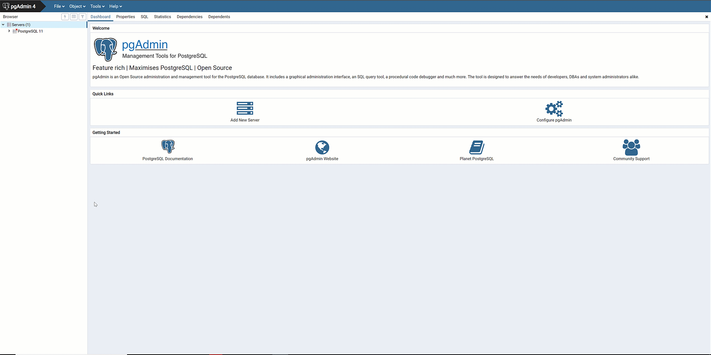
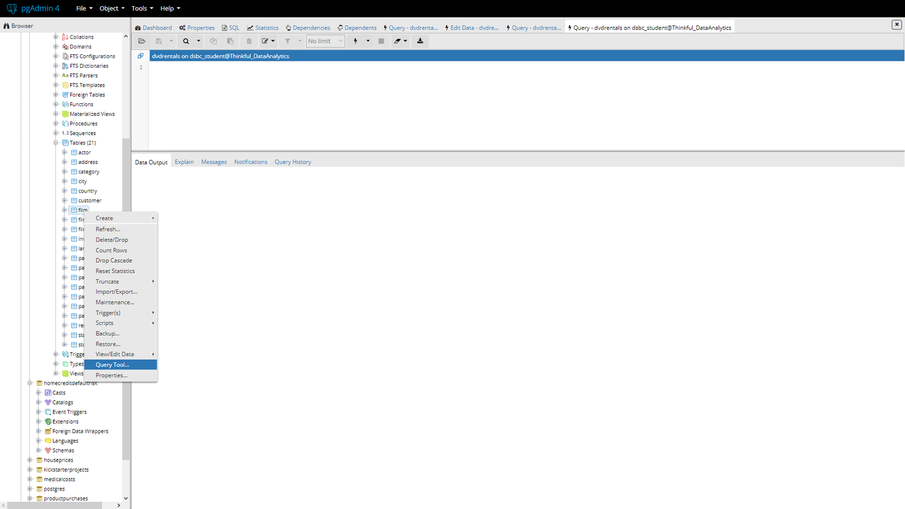
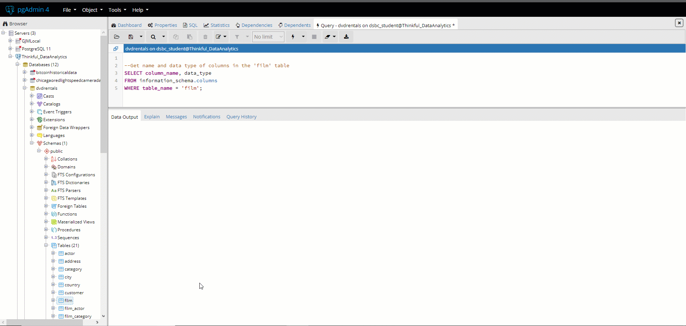

In this checkpoint, you'll complete the SQL self-sufficiency exam. The purpose of this exam is for you to demonstrate your mastery of basic SQL skills. This exam is designed with real-world data science in mind. To that end, you'll generate realistic SQL queries and work through questions that you might face in your career as a data scientist.

**Note:** To complete the assessment, make sure to use *only* the query syntax and commands that you've learned in this program. If you use advanced commands or other methods that aren't taught in this program, the Qualified platform may mark your assessment as incorrect.

If you aren't connected to Thinkful's server, follow the instructions below.  

## Connecting to the server

###### Some versions of the pgAdmin interface may look different from the below screenshots. To use the same version that's used in this curriculum, [install version 4.10 here](https://www.postgresql.org/ftp/pgadmin/pgadmin4/v4.10/). You do not need to uninstall PostgreSQL first. 

To connect to a server, right-click **Server** and select **Create**. Select **New Server**, and then give the server a descriptive name. For example, you could call it *Thinkful_DataScience*.

After naming your server, head to the **Connection** tab. Here, you'll set a connection to the server using the following credentials.

- **Host**: 142.93.121.174
- **Port:** 5432
- **Username:** dsbc_student
- **Password**: 7\*.8G9QH21

## Navigating the browser

You will now see your new server in the **Browser** pane. If you click the drop-down menu for your new server, you'll see all the databases that you have access to on the server.

As you learned earlier, you can access the **Query Tool** from here. For example, you can right-click the *film* table in the *dvdrentals* database, and select **Query Tool** from the menu. This will reveal a window at the top of your screen where you can write and execute SQL queries.

Use the **Query Editor** to conduct your analysis for the exam. Press the **Execute** button (or `F5` on your keyboard) to execute your queries. You'll see the output of the queries that you execute in the **Data Output** tab, as shown below.

