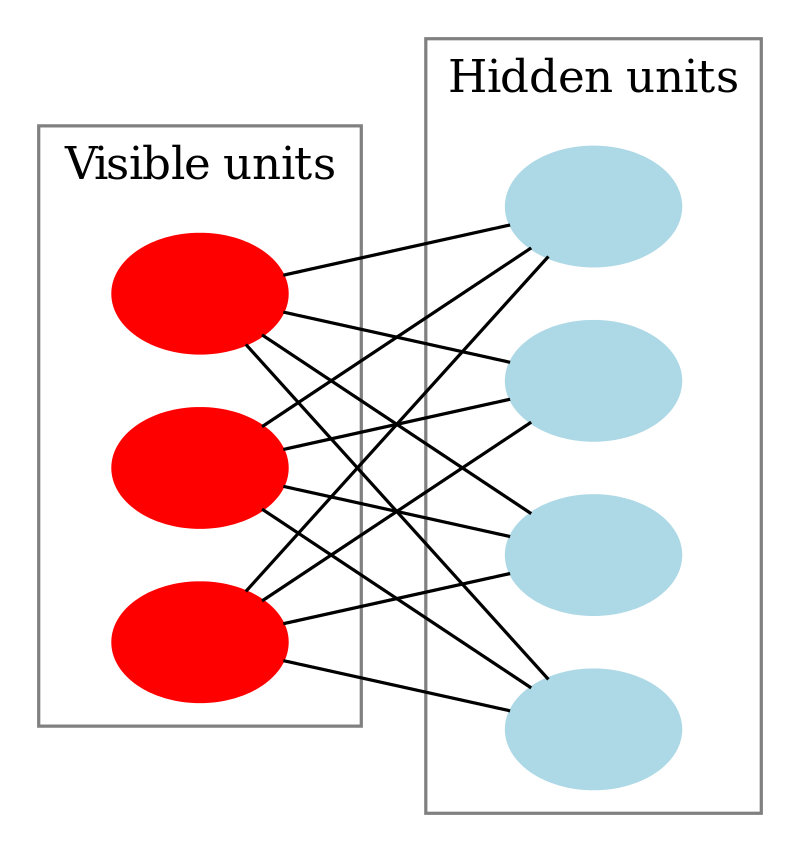
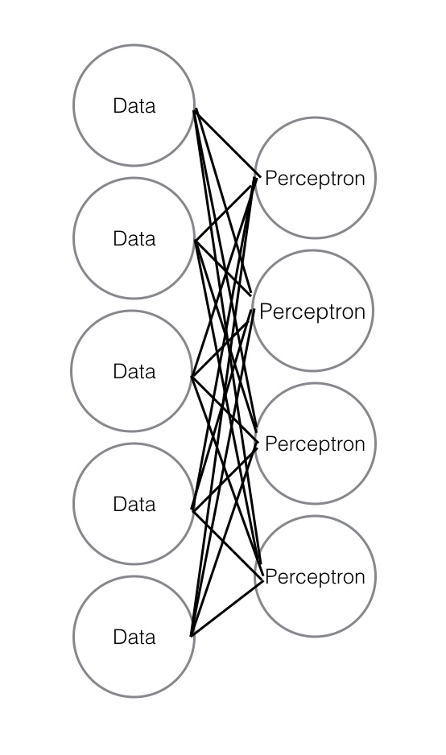

Now that you've seen supervised neural networks, it's time to learn about the unsupervised version. Unsupervised neural networks were largely responsible for the burst in neural network research that happened around the mid-2000s. Instead of predicting a labeled value, these algorithms use a neural network structure (like you learned about in the previous checkpoint) to perform a variety of different tasks. You'll learn about some of them below.

## Feature extraction

_Feature extraction_ involves taking a dataset with information in a format that's unfriendly to predictive modeling and translating it into a more friendly format. You can think of it as similar to dimensionality reduction with PCA, where you have so much data or so many features that you need to reduce the number of dimensions in order to have a performant model. Feature extraction involves translating data from one set of features to a new set of different features. Compared to the original data, this new set of features is often smaller and more suitable for further processing.

For example, in image recognition, this can mean something like taking a series of pixels and translating them into things like lines, edges, or certain kinds of curves. These features are present in the original data, but they can be difficult to manually discover because of high dimensionality or because of the structure of the data. Also, *feature selection* is similar to feature extraction in that they both reduce dimensionality. But unlike feature extraction, feature selection doesn't transform the original features.

Feature extraction can also be contrasted with *feature engineering*. Feature engineering, such as imputation or binning, is the manually driven process that you're familiar with where you add new features to the existing dataset.

The features extracted via this kind of algorithm are then often fed into another model that uses them for some kind of predictive task. This process is commonly referred to as a _modeling pipeline_.

## Restricted Boltzmann machines

[Restricted Boltzmann machines](https://en.wikipedia.org/wiki/Restricted_Boltzmann_machine), or RBM, are a common form of neural network. These networks look a lot like the single-layer perceptrons that you looked at previously, but without the specified output to train on. That means that they work in two layers. The inputs, or visible nodes, are on the first layer. The second layer is the hidden layer, which is the new set of derived features. The wiki page linked above goes into some of the math, but the key idea to understand is that these networks aim to extract patterns by finding reasonably common aggregations within the data.

## Autoencoders

*Autoencoders* are another variety of neural network used for unsupervised learning. Compared to RBMs, these models have an additional layer of output compared to RBM. They are often defined by the number of features that they output. An autoencoder can have the same number of output features as input features, in which case it is being used to better learn those features. It can also have fewer output features, whereby it is compressing the original data. Finally, it can have more output features, as a method of expanding the data.

Very frequently, autoencoders will have the same number of output features as input features, while translating through a hidden layer with fewer features. How can this be valuable? Well, it's because of the unique purpose of an autoencoder. Rather than trying to extract features from the dataset or reduce dimensionality, an autoencoder is designed to regenerate features. And in the process, it improves their robustness and groups redundancies together. That's why a dataset with five features can go into an autoencoder and come out with five features but be in a better state for modeling.

Here's a diagram of an autoencoder like that; it starts with five input features, encodes into four features, and then decodes _back_ into five features.

Autoencoders are often used early in the modeling pipeline for *pretraining* neural networks. This is the process of taking the hidden middle layer generated by the autoencoder and using it as input for another neural network layer.

## Examples of unsupervised neural networks

Running these kinds of neural networks generally happens in specific contexts, the most common of which is image recognition. RBM in particular is a valuable way to work with image data. But you haven't learned about image recognition yet, and there is often significant processing that goes into that. (You'll explore *scikit-image*, a companion package to scikit-learn, later in the specializations.) As such, you're not going to run these models here.

You can look over scikit-learn's [RBM example](http://scikit-learn.org/stable/auto_examples/neural_networks/plot_rbm_logistic_classification.html#sphx-glr-auto-examples-neural-networks-plot-rbm-logistic-classification-py) if you want to see how it can work with digit recognition. RBM is the only unsupervised neural network in scikit-learn.

