In this assignment, you'll get up and running with [Google Colaboratory](https://research.google.com/colaboratory/faq.htmll) (*Colab* for short). Colab is a platform for machine-learning research, powered by Google. Using this platform, you'll install and run Spark to do big data work in the remainder of this module. You'll walk through the Colab setup and learn how to install and run Apache Spark on the platform.

Apache Spark can be challenging to install and configure. It is inherently a cloud-based server designed for multitenancy. In other words, an instance of Apache Spark can be installed on multiple computers that act as a single cluster. When it's set up as a cluster, it leverages the combined power of all systems in the cluster by distributing data and computations across the various systems.

Fortunately, you can avoid all of these configuration headaches by installing it on Colab, and you can quickly get up and running with the important business of learning Spark. Note that you'll install Spark on Colab using a single machine because Colab offers you only a single virtual machine. However, all the analysis that you'll do in this module is also valid for multiserver settings.

## What is Colab?

Colab is a free platform for running Jupyter Notebooks in the cloud.

* Yes, it's free! You will not pay anything to access and use this platform.
* Colab also provides free GPU up to some limited time for a single execution of a thread.
* The platform is based on Jupyter Notebooks. Although the interface of the Notebooks looks slightly different from what you're used to, they're still the same Jupyter Notebooks. They just have some adjustments and additions to run on Colab.
* Python and all of its major data science libraries are already installed. So, most of the time, you'll just run your Notebooks without installing anything. You can just upload your Jupyter Notebooks and run them on Colab, without any modifications to your codes.
* That being said, Apache Spark is not preinstalled on Colab. To use Spark, you need to install it. 

In the rest of this assignment, you'll learn how to set up your Colab platform and run your Jupyter Notebooks on it. If you're already familiar with Google Drive, then the instructions here are pretty straightforward. If you're new to Google Drive, then the instructions below are prepared for you.

If you want to read more about Colab before jumping into the setup, check out [this introduction](https://colab.research.google.com/Notebooks/welcome.ipynb#scrollTo=-Rh3-Vt9Nev9). If you want to see it in action, go to the [Welcome to Colaboratory](https://colab.research.google.com/) page.

## Step 1: Create a Google account

If you're using Gmail or any of Google's other services, then you have a Google account. But if you don't already have a Google account, then you'll need to create one.

You can [sign up for an account here](https://accounts.google.com/signup/v2/webcreateaccount?flowName=GlifWebSignIn&flowEntry=SignUp). Once you create your account, you can move on to the next step.

## Step 2: Set up your Colab on Google Drive

In this step, you'll connect Colab to your Google Drive. This step involves multiple substeps, as follows:

### Enter Google Drive

Log in to your Google account and click the **Google apps** icon at the top-right corner of the screen. Then enter Google Drive by clicking the **Drive** icon.

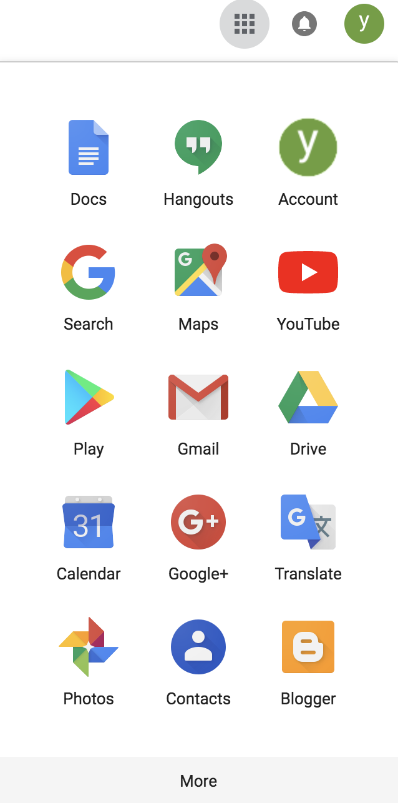

This will open Google Drive in a new tab on your browser. This is your drive, and you can upload any files to it.

### Connect Colab to your drive

Once you enter your drive, click **New ➕**.

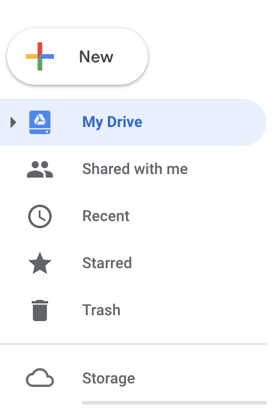

Then, hold your pointer over the **More** menu and select **Connect more apps**.

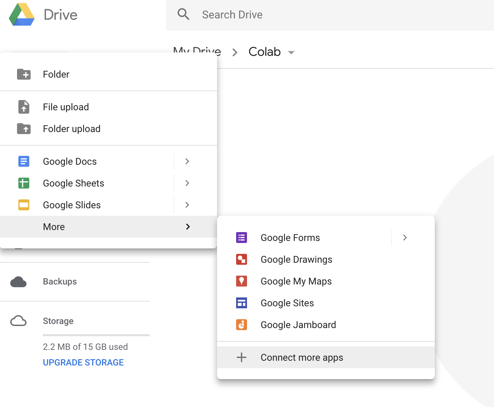

Search for `colab`.

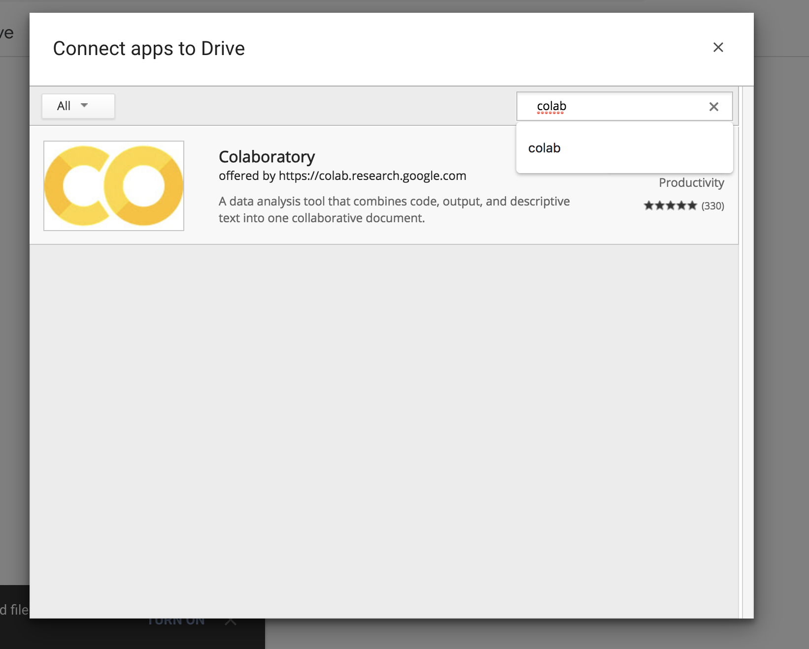

Select **Colaboratory**, then click the **Connect** button.

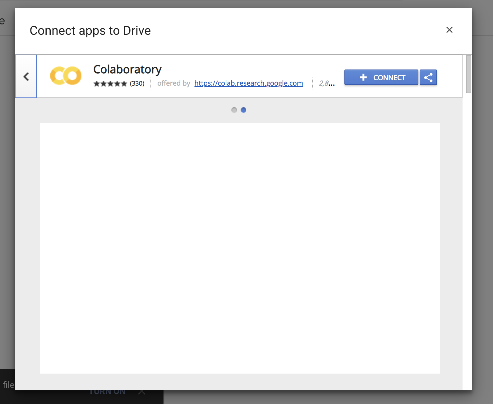

You'll see a message that reads, "Colaboratory was connected to Google Drive." This indicates that you successfully connected Colab to your drive.

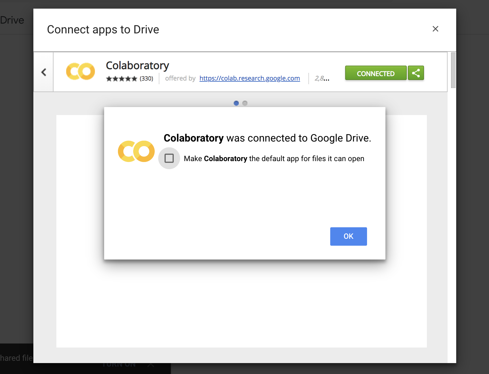

To confirm that Colab has been added to your connected apps, you can click **New > More** and look for **Colaboratory** in the drop-down list.

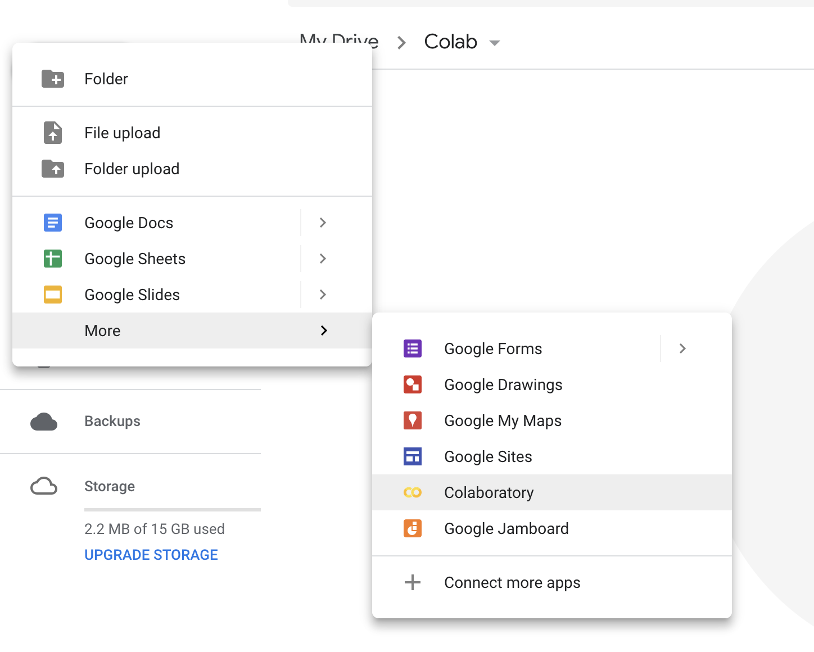

That's all for setting up Colab in your drive.

### Step 3: Create two folders

Next, create two folders in your drive. You'll use these two folders throughout this module. It's recommended to name them *Colab Datasets* and *Colab Notebooks*, because this module will provide sample code that assumes that the relevant files will reside in these folders. But you're free to name them at your convenience as long as you edit the codes accordingly.

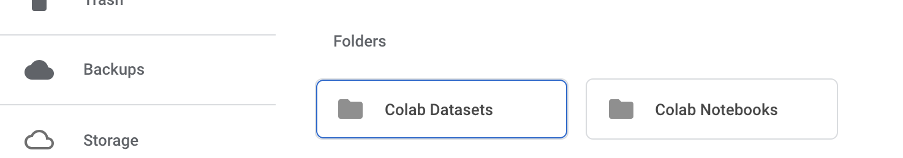

And now, you're done with the setup. Now, continue on to see how you can use Colab.

## Step 4: Create a new Colab Notebook

The next step is to create a Jupyter Notebook and upload it to the *Colab Notebooks* folder on your Google Drive. Once you upload the Notebook, you can run it two different ways:

1. Right-click **Notebook > Open with > Colaboratory**:
    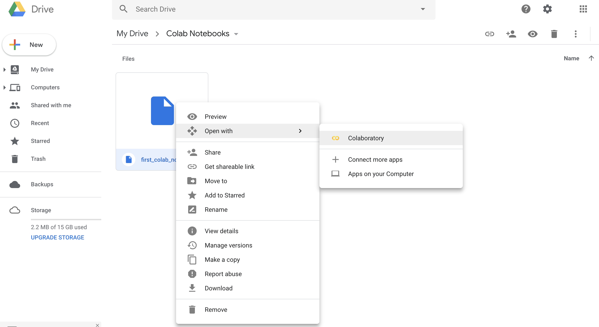
2. Double-click the Notebook and press **Open with Colaboratory** at the top of the screen:
    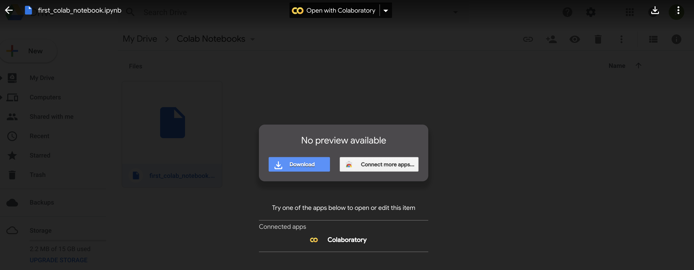

And that's it. You're now ready to run your Notebooks.


## Step 5: Run your first Jupyter Notebook

Colab comes ready with most of the Python libraries that are relevant to data science, including NumPy, pandas, and Matplotlib. Just write the following short code snippet into a cell, and run it as you run a regular Jupyter Notebook cell:

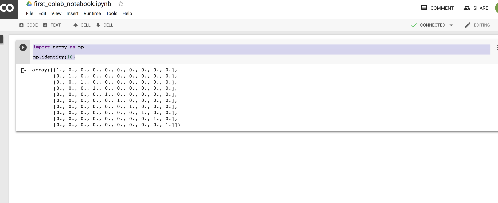

You should see the same output as in the figure above. 


## Step 6: Install the packages

Colab is a great research and education platform, but it has some limitations. For your purposes, its major limitation is that it allocates a server to you just temporarily. Once you shut down your Notebook and your server becomes idle for some time, then it may deallocate the previously assigned resources. What this means is that you may need to install Java, Spark, and the other packages every time that you want to run your Notebook.

So it's a good idea to put the following codes in the beginning of all of your Notebooks. Note that, at the beginning of every line in the following codes, there's an exclamation point `!`. This is something special to Colab. By putting `!` at the beginning of a line of code, you can access the terminal of the Ubuntu server that Colab has allocated to you. Thus, you can install whatever you want to the current machine that you're using.

### Install Java and Apache Spark

First, install Java and Apache Spark to the server that is allocated to you. The following code installs Apache Spark 2.4.5 and Java 8:

```
!apt-get install openjdk-8-jdk-headless -qq > /dev/null
!wget -q https://www-eu.apache.org/dist/spark/spark-2.4.5/spark-2.4.5-bin-hadoop2.7.tgz
!tar xf spark-2.4.5-bin-hadoop2.7.tgz
```

Second, set the locations where Spark and Java are installed:

```
import os
os.environ["JAVA_HOME"] = "/usr/lib/jvm/java-8-openjdk-amd64"
os.environ["SPARK_HOME"] = "/content/spark-2.4.5-bin-hadoop2.7"
```

### Install findspark and PySpark

Third, use pip to install [findspark](https://github.com/minrk/findspark), which is a library that makes it easy for Python to find Spark. Install PySpark as well.

```
!pip install -q findspark
!pip install pyspark
```


### Mount your Google Drive to Colaboratory

Lastly, mount your Google Drive to Colaboratory so that you can access the files on your drive. This will enable you to read the data files that you uploaded to your drive.

```
from google.colab import drive
drive.mount('/content/gdrive')
```

After you run the code above, Google will prompt you to enter an authorization code.

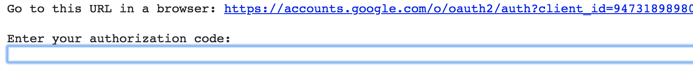

Follow that link and authorize Google to access your drive.


After you authorize Google, a code will appear on the screen.


Copy that code and paste it to the input box that appears in your Notebook on Colab.

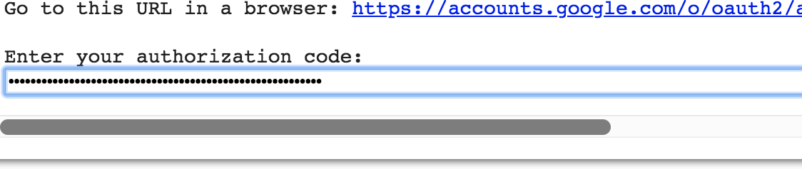

Once you press `Enter`, you'll see a message saying that your drive is mounted.


And that's all! You can start to run your own code.

As mentioned before, you should put all of the code that's shown above in the beginning of every Notebook that you run on Google Colaboratory. When you run these codes in Colab, one of two things will happen: If they're installed already on the server that you are given, then you'll get a warning that the packages are already installed. If the server is freshly allocated to you, then these codes will install all the relevant packages to the machine.
